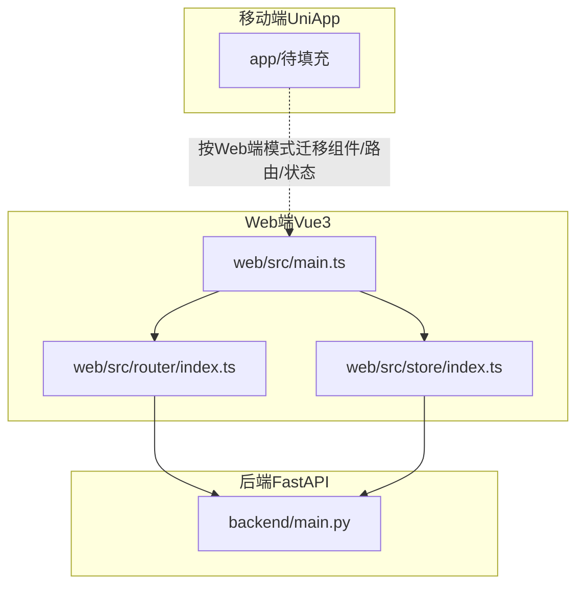
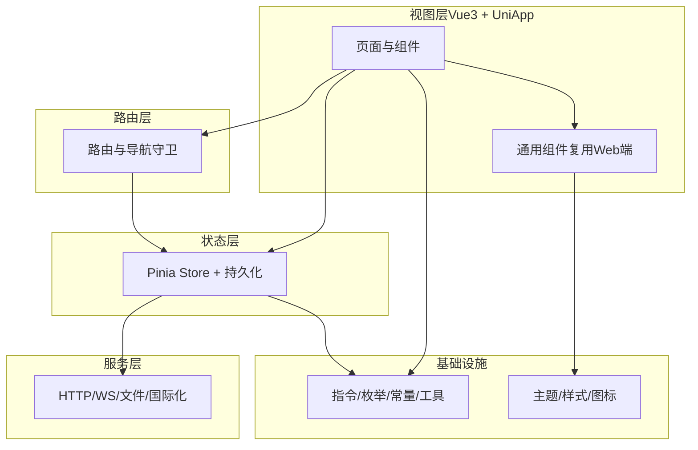
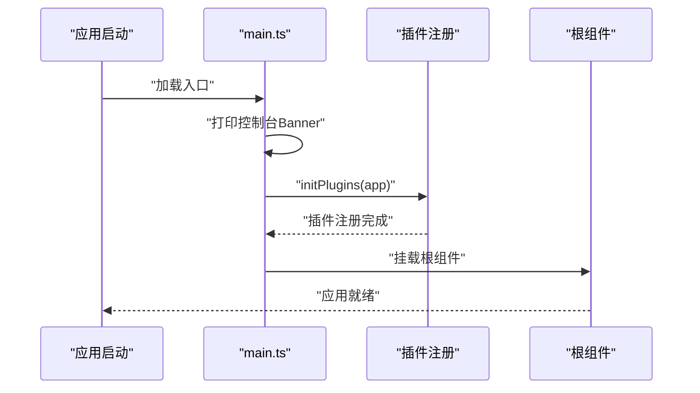
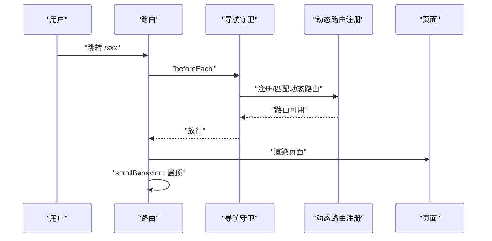
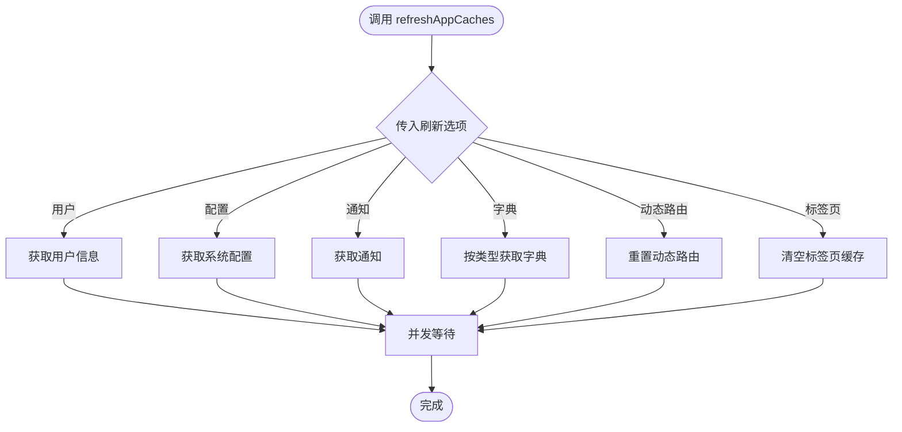
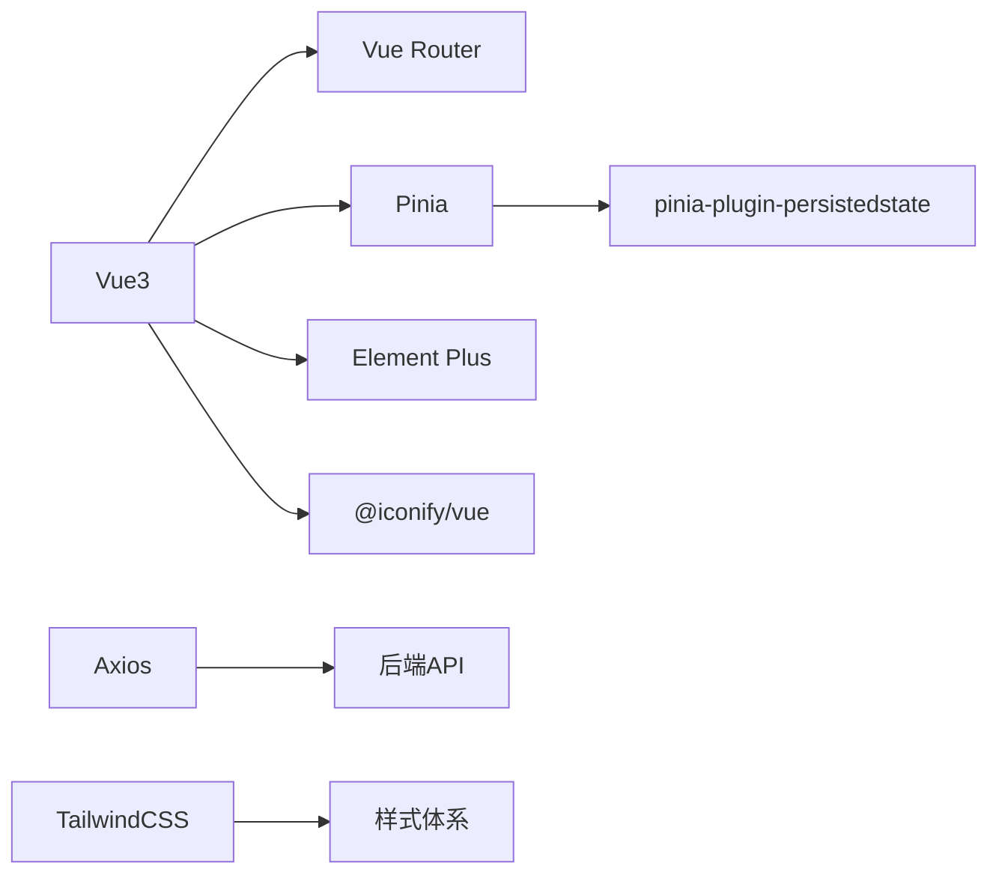

# 移动端开发指南

<cite>
**本文引用的文件**
- [README.md](file://README.md)
- [frontend/web/package.json](file://frontend/web/package.json)
- [frontend/web/src/main.ts](file://frontend/web/src/main.ts)
- [frontend/web/src/router/index.ts](file://frontend/web/src/router/index.ts)
- [frontend/web/src/store/index.ts](file://frontend/web/src/store/index.ts)
</cite>

## 目录
1. [简介](#简介)
2. [项目结构](#项目结构)
3. [核心组件](#核心组件)
4. [架构总览](#架构总览)
5. [详细组件分析](#详细组件分析)
6. [依赖关系分析](#依赖关系分析)
7. [性能考虑](#性能考虑)
8. [故障排查指南](#故障排查指南)
9. [结论](#结论)
10. [附录](#附录)

## 简介
本指南面向基于 UniApp 的 FastapiAdmin 移动端开发，目标是在 H5、小程序与原生应用之间实现统一开发与交付。结合现有仓库中的前端工程与技术栈，我们将系统阐述移动端的架构设计、组件与交互模式、跨端适配策略、设备兼容性、性能优化、路由与状态管理、数据同步、移动端特有能力（手势、地理、离线）、以及调试、测试与发布的完整流程。

## 项目结构
当前仓库包含三类前端工程：
- web：Vue3 + Vite + TypeScript + Element Plus 的 Web 管理端
- app：移动端（UniApp）工程占位目录（当前为空，需补充）
- docs：文档网站（VitePress）

移动端开发的核心工作将围绕 app 目录展开，结合 web 端的组件体系、路由与状态管理经验，形成统一的跨端开发范式。

图表来源
- [frontend/web/src/main.ts:1-35](file://frontend/web/src/main.ts#L1-L35)
- [frontend/web/src/router/index.ts:1-39](file://frontend/web/src/router/index.ts#L1-L39)
- [frontend/web/src/store/index.ts:1-89](file://frontend/web/src/store/index.ts#L1-L89)

章节来源
- [README.md:96-115](file://README.md#L96-L115)
- [README.md:167-172](file://README.md#L167-L172)

## 核心组件
移动端开发可复用 Web 端的关键基础设施，包括：
- 应用初始化与插件体系：统一的启动流程、插件注册顺序与依赖注入
- 路由系统：静态路由与动态路由注册、导航守卫与滚动行为
- 状态管理：Pinia Store、持久化插件与缓存刷新机制
- 样式与主题：Tailwind 基础样式、暗色主题变量与动画库

这些组件为移动端提供一致的开发体验与最佳实践。

章节来源
- [frontend/web/src/main.ts:17-35](file://frontend/web/src/main.ts#L17-L35)
- [frontend/web/src/router/index.ts:7-27](file://frontend/web/src/router/index.ts#L7-L27)
- [frontend/web/src/store/index.ts:15-27](file://frontend/web/src/store/index.ts#L15-L27)

## 架构总览
移动端（UniApp）将采用与 Web 端相同的分层与模块化思想：
- 视图层：基于 Vue3 + UniApp 组件体系，复用 Web 端组件库与样式
- 路由层：静态路由 + 动态路由（菜单驱动），导航守卫保障权限与页面切换
- 状态层：Pinia Store + 持久化插件，统一用户、字典、通知、配置等缓存
- 服务层：HTTP 请求封装、WebSocket（可选）、文件上传下载、国际化
- 基础设施：指令、枚举、常量、工具函数、图标与主题

## 详细组件分析

### 应用初始化与插件体系
- 初始化顺序：控制台 Banner → 插件注册（Pinia → Router → 指令 → 国际化 → UI 组件库）→ 挂载根组件
- 交互优化：在 iOS Safari 上注册非被动的 touchstart 监听以确保 :active 效果生效
- 插件生态：Element Plus、国际化、TailwindCSS、动画库等

图表来源
- [frontend/web/src/main.ts:29-35](file://frontend/web/src/main.ts#L29-L35)

章节来源
- [frontend/web/src/main.ts:17-35](file://frontend/web/src/main.ts#L17-L35)

### 路由系统与导航守卫
- 路由模式：Hash 模式，便于纯静态部署与兼容非 HTTP 环境
- 首屏注册：静态路由；业务路由通过 beforeEach 动态挂载
- 导航守卫：前置守卫负责权限校验与动态路由注册；后置守卫处理页面统计与滚动复位
- 滚动行为：统一滚动至顶部，提升移动端阅读体验

图表来源
- [frontend/web/src/router/index.ts:16-27](file://frontend/web/src/router/index.ts#L16-L27)

章节来源
- [frontend/web/src/router/index.ts:7-27](file://frontend/web/src/router/index.ts#L7-L27)

### 状态管理与缓存刷新
- Store 初始化：创建 Pinia 实例并启用持久化插件
- 缓存刷新：统一的 refreshAppCaches 接口，支持用户信息、配置、通知、字典与动态路由刷新
- 并发任务：使用 Promise.allSettled 并行拉取多类缓存，提升首屏性能
- 标签页清理：可选清空标签页缓存，避免历史页面残留

图表来源
- [frontend/web/src/store/index.ts:41-88](file://frontend/web/src/store/index.ts#L41-L88)

章节来源
- [frontend/web/src/store/index.ts:15-27](file://frontend/web/src/store/index.ts#L15-L27)
- [frontend/web/src/store/index.ts:41-88](file://frontend/web/src/store/index.ts#L41-L88)

### 组件与样式体系
- 组件复用：移动端优先复用 Web 端通用组件（布局、表单、表格、图表、弹窗等）
- 主题与样式：Tailwind 基础样式、暗色主题变量、动画库，确保跨端一致性
- 图标与资源：SVG 图标、图片资源统一管理，按需引入

章节来源
- [frontend/web/package.json:68-120](file://frontend/web/package.json#L68-L120)

## 依赖关系分析
移动端与 Web 端共享依赖生态，核心依赖包括：
- Vue3、Vue Router、Pinia、Element Plus、Axios、TailwindCSS、国际化、动画库等
- 通过 package.json 管理依赖版本与脚本，确保开发与构建一致性

图表来源
- [frontend/web/package.json:68-120](file://frontend/web/package.json#L68-L120)

章节来源
- [frontend/web/package.json:68-120](file://frontend/web/package.json#L68-L120)

## 性能考虑
- 路由与状态：使用 Hash 路由减少服务端回退配置；Pinia 持久化减少重复请求
- 并发加载：缓存刷新使用并发任务，缩短首屏等待
- 样式与资源：按需引入图标与组件，避免全量打包
- 交互优化：iOS Safari 上的 touchstart 监听确保 :active 生效，提升反馈感

章节来源
- [frontend/web/src/router/index.ts:11-15](file://frontend/web/src/router/index.ts#L11-L15)
- [frontend/web/src/store/index.ts:57-73](file://frontend/web/src/store/index.ts#L57-L73)
- [frontend/web/src/main.ts:17-21](file://frontend/web/src/main.ts#L17-L21)

## 故障排查指南
- 路由白屏或跳转异常：检查 beforeEach 动态路由注册是否成功，确认菜单与路由映射正确
- 登录后页面不刷新：确认 refreshAppCaches 是否被调用，检查用户信息与动态路由重置逻辑
- 样式不生效：核对 Tailwind 与 Element Plus 暗色主题变量引入顺序
- iOS 交互无反馈：确认已注册非被动 touchstart 监听

章节来源
- [frontend/web/src/router/index.ts:22-27](file://frontend/web/src/router/index.ts#L22-L27)
- [frontend/web/src/store/index.ts:75-83](file://frontend/web/src/store/index.ts#L75-L83)
- [frontend/web/src/main.ts:17-21](file://frontend/web/src/main.ts#L17-L21)

## 结论
通过复用 Web 端的初始化、路由与状态管理机制，并结合 UniApp 的跨端能力，FastapiAdmin 可在 H5、小程序与原生应用中实现统一开发与一致体验。建议以“组件复用 + 路由/状态同构 + 主题样式统一”为核心策略，逐步完善移动端的导航、交互与性能优化，最终达成高可用、易维护的移动端产品。

## 附录
- 移动端工程目录：app/（当前为空，按本指南填充）
- 技术栈参考：Vue3 + UniApp + Element Plus + Pinia + Axios + TailwindCSS
- 后端接口：统一通过 /api/v1 前缀访问，遵循 Web 端的认证与权限体系

章节来源
- [README.md:167-172](file://README.md#L167-L172)
- [README.md:304-316](file://README.md#L304-L316)