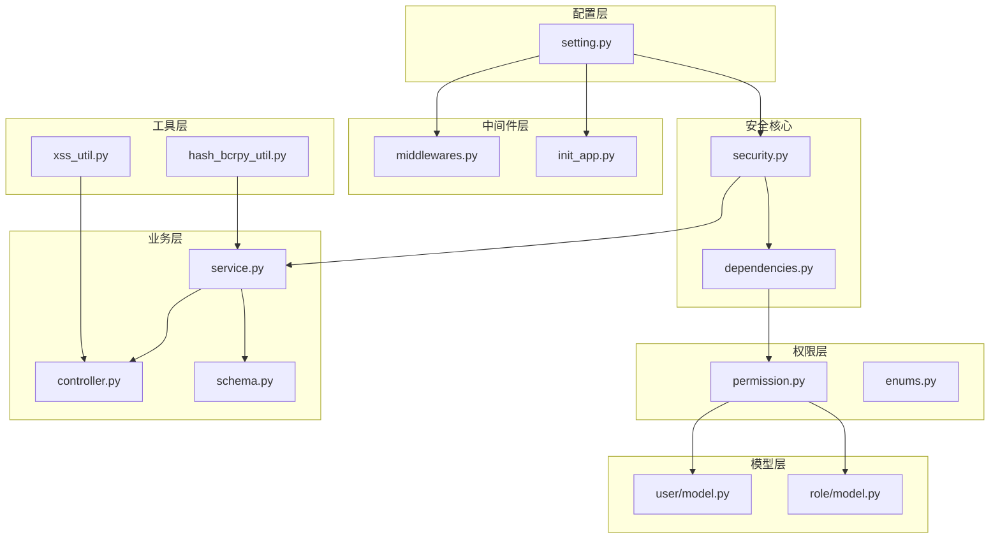
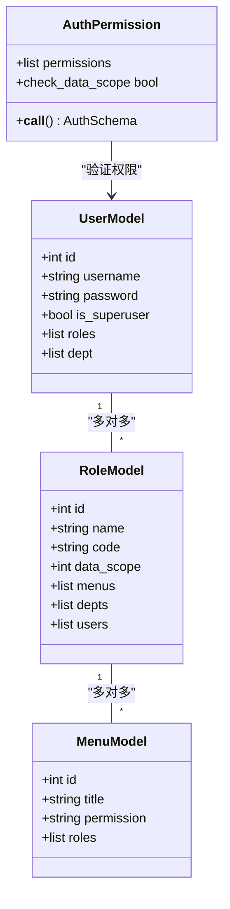
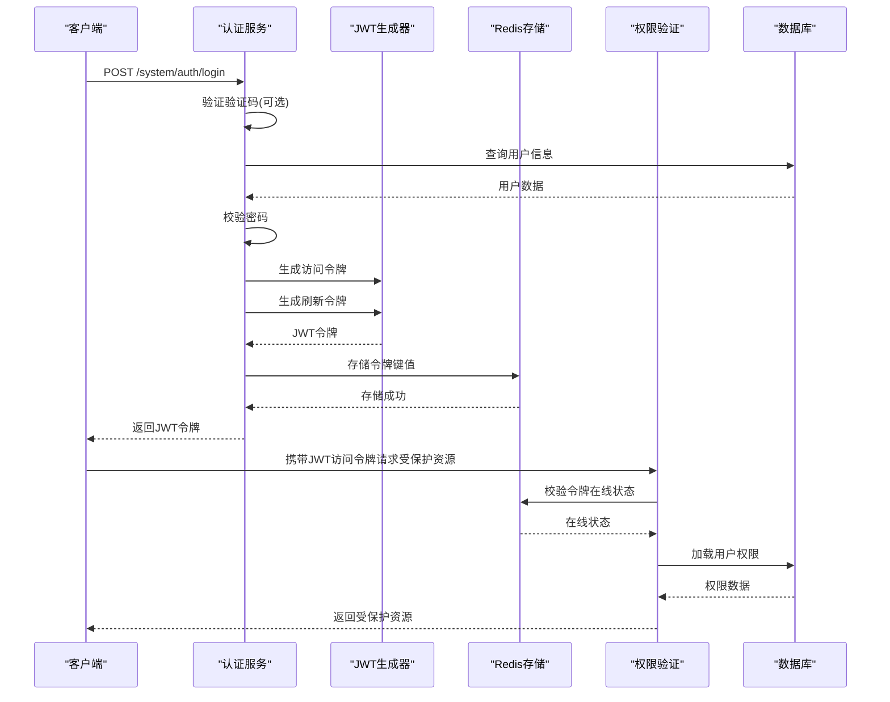
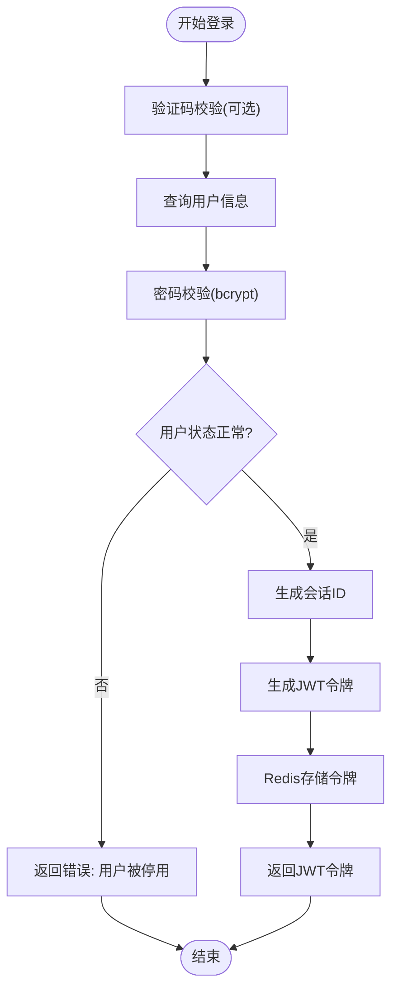
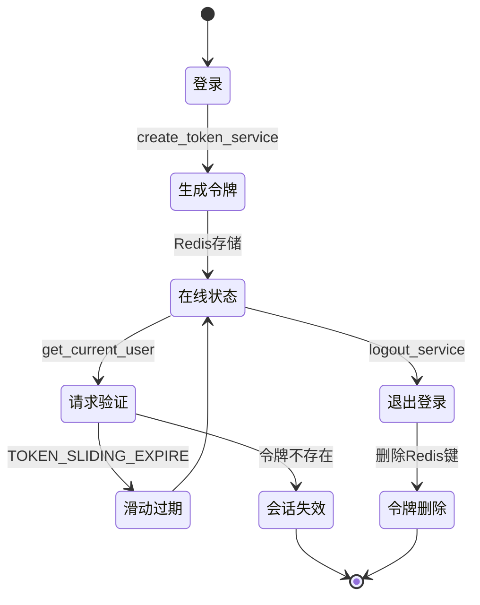
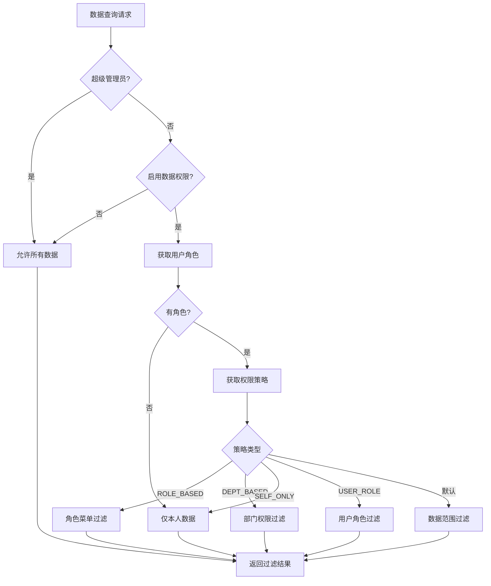
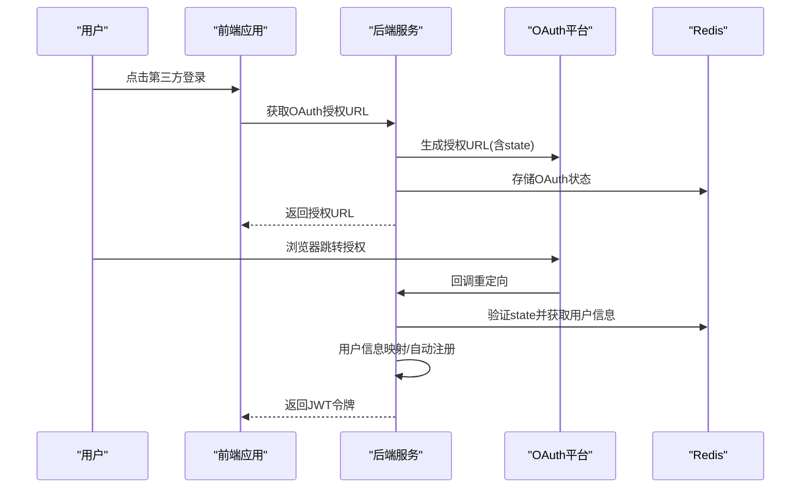
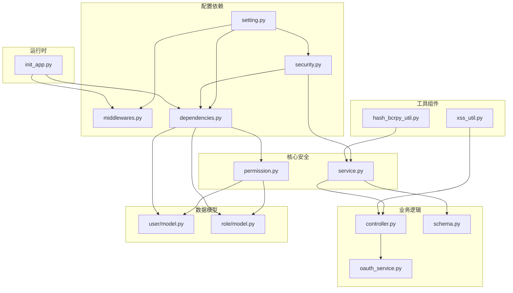

# 安全架构设计

<cite>
**本文档引用的文件**
- [main.py](file://backend/main.py)
- [setting.py](file://backend/app/config/setting.py)
- [security.py](file://backend/app/core/security.py)
- [middlewares.py](file://backend/app/core/middlewares.py)
- [dependencies.py](file://backend/app/core/dependencies.py)
- [permission.py](file://backend/app/core/permission.py)
- [service.py](file://backend/app/api/v1/module_system/auth/service.py)
- [controller.py](file://backend/app/api/v1/module_system/auth/controller.py)
- [schema.py](file://backend/app/api/v1/module_system/auth/schema.py)
- [enums.py](file://backend/app/common/enums.py)
- [hash_bcrpy_util.py](file://backend/app/utils/hash_bcrpy_util.py)
- [xss_util.py](file://backend/app/utils/xss_util.py)
- [model.py](file://backend/app/api/v1/module_system/user/model.py)
- [model.py](file://backend/app/api/v1/module_system/role/model.py)
- [init_app.py](file://backend/app/scripts/init_app.py)
</cite>

## 目录
1. [引言](#引言)
2. [项目结构](#项目结构)
3. [核心组件](#核心组件)
4. [架构概览](#架构概览)
5. [详细组件分析](#详细组件分析)
6. [依赖分析](#依赖分析)
7. [性能考虑](#性能考虑)
8. [故障排除指南](#故障排除指南)
9. [结论](#结论)
10. [附录](#附录)

## 引言

FastapiAdmin 是一个基于 FastAPI 和 SQLAlchemy 的企业级后台管理系统，其安全架构设计围绕认证授权、权限控制、数据保护和运行时防护展开。本文档旨在全面阐述系统的安全设计，包括 JWT 令牌管理、OAuth2 集成、会话控制策略、RBAC 权限模型、中间件安全组件、数据加密策略以及安全威胁防护机制。

## 项目结构

后端采用模块化分层架构，安全相关的核心组件分布如下：

- 配置层：集中管理安全配置（JWT 密钥、算法、过期时间、白名单等）
- 安全核心：JWT 令牌生成与解析、OAuth2 表单扩展、自定义认证类
- 中间件层：CORS、请求日志、GZip 压缩、安全拦截
- 权限层：RBAC 权限验证、数据权限过滤策略
- 业务层：登录认证服务、验证码服务、免登录服务
- 工具层：密码加密、XSS 过滤、哈希工具

**图表来源**
- [setting.py:64-78](file://backend/app/config/setting.py#L64-L78)
- [security.py:11-95](file://backend/app/core/security.py#L11-L95)
- [middlewares.py:22-34](file://backend/app/core/middlewares.py#L22-L34)
- [dependencies.py:44-129](file://backend/app/core/dependencies.py#L44-L129)
- [permission.py:13-86](file://backend/app/core/permission.py#L13-L86)
- [service.py:45-125](file://backend/app/api/v1/module_system/auth/service.py#L45-L125)
- [controller.py:1-38](file://backend/app/api/v1/module_system/auth/controller.py#L1-L38)
- [hash_bcrpy_util.py:14-51](file://backend/app/utils/hash_bcrpy_util.py#L14-L51)
- [xss_util.py:98-142](file://backend/app/utils/xss_util.py#L98-L142)
- [user/model.py:64-151](file://backend/app/api/v1/module_system/user/model.py#L64-L151)
- [role/model.py:64-100](file://backend/app/api/v1/module_system/role/model.py#L64-L100)
- [init_app.py:95-110](file://backend/app/scripts/init_app.py#L95-L110)

**章节来源**
- [main.py:16-51](file://backend/main.py#L16-L51)
- [setting.py:64-78](file://backend/app/config/setting.py#L64-L78)

## 核心组件

### JWT 令牌管理

系统采用 HS256 算法的对称密钥 JWT 实现，支持访问令牌和刷新令牌分离，并通过 Redis 实现令牌持久化与在线状态校验。

- 令牌生成：基于用户会话信息构建 JWT 载荷，包含会话 ID、用户信息、登录类型等
- 令牌存储：访问令牌和刷新令牌分别以独立键值存储在 Redis 中
- 令牌校验：中间件和依赖注入层统一校验令牌有效性与在线状态
- 滑动过期：启用滑动过期时，每次请求自动延长令牌有效期

**章节来源**
- [security.py:98-149](file://backend/app/core/security.py#L98-L149)
- [service.py:127-221](file://backend/app/api/v1/module_system/auth/service.py#L127-L221)
- [dependencies.py:44-129](file://backend/app/core/dependencies.py#L44-L129)
- [setting.py:67-73](file://backend/app/config/setting.py#L67-L73)

### OAuth2 集成

系统支持多种第三方 OAuth2 平台集成，包括微信开放平台、QQ、GitHub、Gitee 等。

- 授权流程：生成授权 URL → 用户授权 → 回调处理 → 用户信息映射
- 状态管理：使用 Redis 存储 OAuth 状态，防止 CSRF 攻击
- 自动注册：首次登录用户自动注册并分配默认角色
- 回调配置：统一回调地址格式，支持多环境部署

**章节来源**
- [oauth_service.py:1-43](file://backend/app/api/v1/module_system/auth/oauth_service.py#L1-L43)
- [service.py:419-576](file://backend/app/api/v1/module_system/auth/service.py#L419-L576)
- [setting.py:124-138](file://backend/app/config/setting.py#L124-L138)

### 会话控制策略

系统实现了完善的会话控制机制，确保用户会话的安全性与可控性。

- 会话标识：每个登录用户生成唯一会话 ID，贯穿整个会话生命周期
- 在线状态：通过 Redis 键存在性验证用户在线状态
- 操作续期：启用滑动过期时，用户活跃操作自动延长令牌有效期
- 强制登出：退出登录时删除 Redis 中的令牌键，立即失效会话

**章节来源**
- [service.py:309-338](file://backend/app/api/v1/module_system/auth/service.py#L309-L338)
- [middlewares.py:36-200](file://backend/app/core/middlewares.py#L36-L200)
- [dependencies.py:87-96](file://backend/app/core/dependencies.py#L87-L96)

### RBAC 权限模型

系统采用基于角色的访问控制（RBAC）模型，结合数据权限过滤实现细粒度的权限控制。

- 角色定义：角色包含名称、编码、显示顺序、数据权限范围等属性
- 权限分配：角色与菜单建立多对多关系，实现功能权限控制
- 数据权限：支持仅本人、本部门、本部门及以下、全部、自定义五种数据权限范围
- 权限验证：通过 AuthPermission 类实现权限标识校验

**图表来源**
- [user/model.py:64-151](file://backend/app/api/v1/module_system/user/model.py#L64-L151)
- [role/model.py:64-100](file://backend/app/api/v1/module_system/role/model.py#L64-L100)
- [dependencies.py:236-296](file://backend/app/core/dependencies.py#L236-L296)

**章节来源**
- [permission.py:13-311](file://backend/app/core/permission.py#L13-L311)
- [dependencies.py:236-296](file://backend/app/core/dependencies.py#L236-L296)
- [enums.py:111-122](file://backend/app/common/enums.py#L111-L122)

### 中间件安全组件

系统通过多层中间件实现运行时安全防护。

- CORS 中间件：统一配置跨域策略，支持白名单控制
- 请求日志中间件：记录请求来源、方法、路径、处理时间等关键信息
- GZip 中间件：配置压缩策略，平衡带宽与 CPU 开销
- 安全拦截：演示模式下的请求拦截与 IP 黑名单/白名单控制

**章节来源**
- [middlewares.py:22-215](file://backend/app/core/middlewares.py#L22-L215)
- [init_app.py:95-110](file://backend/app/scripts/init_app.py#L95-L110)

### 数据加密策略

系统采用多层次的数据保护策略：

- 密码加密：使用 bcrypt 算法进行密码哈希，配置 12 轮加密强度
- 敏感信息：JWT 载荷中的用户信息采用 JSON 序列化存储
- XSS 防护：通过 bleach 库实现 HTML 内容清理，支持白名单标签与属性
- 传输安全：通过 HTTPS 部署实现数据传输加密

**章节来源**
- [hash_bcrpy_util.py:14-51](file://backend/app/utils/hash_bcrpy_util.py#L14-L51)
- [xss_util.py:98-159](file://backend/app/utils/xss_util.py#L98-L159)
- [security.py:98-149](file://backend/app/core/security.py#L98-L149)

## 架构概览

**图表来源**
- [service.py:49-125](file://backend/app/api/v1/module_system/auth/service.py#L49-L125)
- [dependencies.py:44-129](file://backend/app/core/dependencies.py#L44-L129)
- [security.py:98-149](file://backend/app/core/security.py#L98-L149)

## 详细组件分析

### 认证授权流程

系统认证流程包含登录验证、令牌生成、权限校验三个核心阶段：

**图表来源**
- [service.py:49-125](file://backend/app/api/v1/module_system/auth/service.py#L49-L125)

**章节来源**
- [service.py:49-125](file://backend/app/api/v1/module_system/auth/service.py#L49-L125)
- [hash_bcrpy_util.py:26-51](file://backend/app/utils/hash_bcrpy_util.py#L26-L51)

### 会话管理机制

系统通过 Redis 实现会话状态管理，确保令牌的有效性与可追溯性：

**图表来源**
- [service.py:127-221](file://backend/app/api/v1/module_system/auth/service.py#L127-L221)
- [dependencies.py:87-129](file://backend/app/core/dependencies.py#L87-L129)

**章节来源**
- [service.py:309-338](file://backend/app/api/v1/module_system/auth/service.py#L309-L338)
- [dependencies.py:87-129](file://backend/app/core/dependencies.py#L87-L129)

### 数据权限过滤策略

系统提供多种数据权限过滤策略，确保用户只能访问授权范围内的数据：

**图表来源**
- [permission.py:54-86](file://backend/app/core/permission.py#L54-L86)
- [enums.py:111-122](file://backend/app/common/enums.py#L111-L122)

**章节来源**
- [permission.py:54-311](file://backend/app/core/permission.py#L54-L311)
- [enums.py:111-122](file://backend/app/common/enums.py#L111-L122)

### OAuth2 第三方登录

系统支持多种第三方 OAuth2 平台的无缝集成：

**图表来源**
- [oauth_service.py:41-43](file://backend/app/api/v1/module_system/auth/oauth_service.py#L41-L43)
- [service.py:419-576](file://backend/app/api/v1/module_system/auth/service.py#L419-L576)

**章节来源**
- [oauth_service.py:1-43](file://backend/app/api/v1/module_system/auth/oauth_service.py#L1-L43)
- [service.py:419-576](file://backend/app/api/v1/module_system/auth/service.py#L419-L576)

## 依赖分析

系统安全组件之间的依赖关系如下：

**图表来源**
- [setting.py:64-78](file://backend/app/config/setting.py#L64-L78)
- [security.py:11-95](file://backend/app/core/security.py#L11-L95)
- [dependencies.py:44-129](file://backend/app/core/dependencies.py#L44-L129)
- [permission.py:13-86](file://backend/app/core/permission.py#L13-L86)
- [service.py:45-125](file://backend/app/api/v1/module_system/auth/service.py#L45-L125)
- [controller.py:1-38](file://backend/app/api/v1/module_system/auth/controller.py#L1-L38)
- [user/model.py:64-151](file://backend/app/api/v1/module_system/user/model.py#L64-L151)
- [role/model.py:64-100](file://backend/app/api/v1/module_system/role/model.py#L64-L100)
- [init_app.py:95-110](file://backend/app/scripts/init_app.py#L95-L110)

**章节来源**
- [setting.py:64-78](file://backend/app/config/setting.py#L64-L78)
- [dependencies.py:44-129](file://backend/app/core/dependencies.py#L44-L129)
- [permission.py:13-86](file://backend/app/core/permission.py#L13-L86)

## 性能考虑

系统在保证安全性的同时，注重性能优化：

- 令牌存储：Redis 异步存储减少数据库压力
- 滑动过期：智能续期避免频繁重新认证
- 压缩策略：GZip 压缩降低网络传输开销
- 缓存配置：LRU 缓存配置提升配置加载效率

## 故障排除指南

### 常见安全问题诊断

1. **认证失败**
   - 检查 JWT 密钥配置是否正确
   - 验证 Redis 连接状态
   - 确认令牌未过期或被强制登出

2. **权限拒绝**
   - 验证用户角色配置
   - 检查菜单权限标识
   - 确认数据权限范围设置

3. **跨域问题**
   - 检查 CORS 配置
   - 验证允许的源列表
   - 确认凭据设置

**章节来源**
- [dependencies.py:61-129](file://backend/app/core/dependencies.py#L61-L129)
- [middlewares.py:150-186](file://backend/app/core/middlewares.py#L150-L186)

## 结论

FastapiAdmin 的安全架构通过多层次的设计实现了全面的防护能力。JWT 令牌管理提供了可靠的认证基础，RBAC 权限模型确保了细粒度的访问控制，中间件安全组件实现了运行时的实时防护。配合密码加密、XSS 防护等数据保护策略，系统在功能完整性与安全性之间取得了良好平衡。

## 附录

### 安全配置指南

1. **JWT 配置**
   - 更改默认密钥为强随机字符串
   - 设置合理的过期时间
   - 启用滑动过期策略

2. **Redis 安全**
   - 配置密码认证
   - 限制网络访问
   - 启用持久化备份

3. **HTTPS 部署**
   - 配置 SSL 证书
   - 启用 HSTS 头
   - 禁用弱加密套件

### 漏洞扫描建议

1. **定期扫描**
   - 依赖包安全扫描
   - 代码安全审计
   - 配置文件安全检查

2. **渗透测试**
   - OWASP Top 10 漏洞测试
   - API 接口安全测试
   - 业务逻辑安全评估

### 合规性要求

1. **数据保护**
   - 符合个人信息保护法规
   - 实施数据最小化原则
   - 建立数据销毁机制

2. **访问控制**
   - 实施职责分离
   - 定期权限审查
   - 建立权限变更审批流程