# 技术架构详解

<cite>
**本文引用的文件**
- [backend/main.py](file://backend/main.py)
- [backend/pyproject.toml](file://backend/pyproject.toml)
- [backend/requirements.txt](file://backend/requirements.txt)
- [backend/app/config/setting.py](file://backend/app/config/setting.py)
- [backend/app/core/database.py](file://backend/app/core/database.py)
- [backend/app/core/middlewares.py](file://backend/app/core/middlewares.py)
- [backend/app/core/router_class.py](file://backend/app/core/router_class.py)
- [backend/app/core/dependencies.py](file://backend/app/core/dependencies.py)
- [backend/app/core/base_model.py](file://backend/app/core/base_model.py)
- [backend/app/core/security.py](file://backend/app/core/security.py)
- [frontend/web/package.json](file://frontend/web/package.json)
- [frontend/web/src/main.ts](file://frontend/web/src/main.ts)
- [frontend/web/src/store/index.ts](file://frontend/web/src/store/index.ts)
- [frontend/web/src/router/index.ts](file://frontend/web/src/router/index.ts)
- [frontend/web/vite.config.ts](file://frontend/web/vite.config.ts)
</cite>

## 目录
1. [引言](#引言)
2. [项目结构](#项目结构)
3. [核心组件](#核心组件)
4. [架构总览](#架构总览)
5. [详细组件分析](#详细组件分析)
6. [依赖关系分析](#依赖关系分析)
7. [性能考量](#性能考量)
8. [故障排查指南](#故障排查指南)
9. [结论](#结论)
10. [附录](#附录)

## 引言
本文件面向 FastapiAdmin 的技术架构，系统性梳理后端与前端技术栈、数据库连接池与中间件体系、异常与路由处理机制、状态管理与组件通信模式，并提供性能优化与最佳实践建议。文档既适合开发者深入理解实现细节，也适合产品与运维人员把握整体架构。

## 项目结构
- 后端采用 FastAPI + SQLAlchemy 2.x 异步 ORM，结合 Alembic 迁移与 Pydantic Settings 配置管理，模块化组织业务域（系统、监控、应用、任务、AI 等）。
- 前端采用 Vue 3 + TypeScript + Vite，使用 Element Plus 组件库、Pinia 状态管理、路由守卫与动态路由注册，构建现代化后台管理界面。

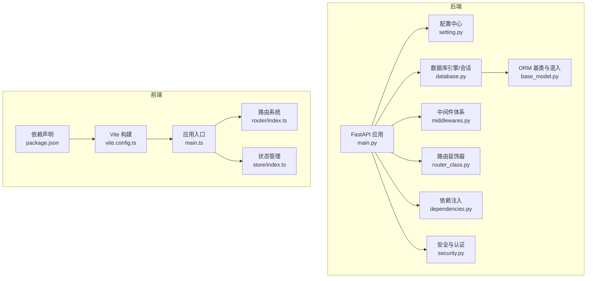

图表来源
- [backend/main.py:16-51](file://backend/main.py#L16-L51)
- [backend/app/config/setting.py:315-340](file://backend/app/config/setting.py#L315-L340)
- [backend/app/core/database.py:19-106](file://backend/app/core/database.py#L19-L106)
- [backend/app/core/middlewares.py:22-215](file://backend/app/core/middlewares.py#L22-L215)
- [backend/app/core/router_class.py:24-165](file://backend/app/core/router_class.py#L24-L165)
- [backend/app/core/dependencies.py:21-296](file://backend/app/core/dependencies.py#L21-L296)
- [backend/app/core/base_model.py:21-228](file://backend/app/core/base_model.py#L21-L228)
- [frontend/web/src/main.ts:29-34](file://frontend/web/src/main.ts#L29-L34)
- [frontend/web/src/router/index.ts:16-27](file://frontend/web/src/router/index.ts#L16-L27)
- [frontend/web/src/store/index.ts:11-29](file://frontend/web/src/store/index.ts#L11-L29)
- [frontend/web/vite.config.ts:49-287](file://frontend/web/vite.config.ts#L49-L287)
- [frontend/web/package.json:1-205](file://frontend/web/package.json#L1-L205)

章节来源
- [backend/main.py:16-51](file://backend/main.py#L16-L51)
- [frontend/web/src/main.ts:29-34](file://frontend/web/src/main.ts#L29-L34)

## 核心组件
- FastAPI 应用工厂与生命周期：集中于应用创建、日志初始化、中间件注册、路由注册、静态文件与文档重置。
- 配置中心：统一管理服务器、API 文档、跨域、认证、数据库、Redis、Gzip、静态文件、Swagger 等配置，并提供异步/同步数据库连接串与中间件事件列表。
- 数据库引擎与会话：支持 MySQL、PostgreSQL、SQLite，异步连接池参数可调，提供表级创建/删除能力与 Redis 连接生命周期。
- 中间件体系：CORS、请求日志与拦截（演示模式）、GZip 压缩，支持从 Token 解析会话 ID 并与系统参数联动。
- 路由装饰器：操作日志记录，自动采集请求/响应、IP/浏览器/操作系统、处理时长等信息。
- 依赖注入：数据库会话、Redis、当前用户解析、权限校验，支持 WebSocket 场景。
- 安全与认证：自定义 OAuth2 密码流、JWT 加解密、滑动过期与在线状态校验。
- ORM 基类与混入：统一字段、租户隔离、用户审计、权限策略。
- 前端应用：Vite + Vue 3 + TS，Element Plus + Pinia，路由守卫与动态路由，构建优化与按需加载。

章节来源
- [backend/main.py:16-51](file://backend/main.py#L16-L51)
- [backend/app/config/setting.py:13-355](file://backend/app/config/setting.py#L13-L355)
- [backend/app/core/database.py:19-177](file://backend/app/core/database.py#L19-L177)
- [backend/app/core/middlewares.py:22-215](file://backend/app/core/middlewares.py#L22-L215)
- [backend/app/core/router_class.py:24-165](file://backend/app/core/router_class.py#L24-L165)
- [backend/app/core/dependencies.py:21-296](file://backend/app/core/dependencies.py#L21-L296)
- [backend/app/core/base_model.py:21-228](file://backend/app/core/base_model.py#L21-L228)
- [backend/app/core/security.py:11-149](file://backend/app/core/security.py#L11-L149)
- [frontend/web/src/main.ts:29-34](file://frontend/web/src/main.ts#L29-L34)
- [frontend/web/src/router/index.ts:16-27](file://frontend/web/src/router/index.ts#L16-L27)
- [frontend/web/src/store/index.ts:11-29](file://frontend/web/src/store/index.ts#L11-L29)
- [frontend/web/vite.config.ts:49-287](file://frontend/web/vite.config.ts#L49-L287)
- [frontend/web/package.json:1-205](file://frontend/web/package.json#L1-L205)

## 架构总览
后端以 FastAPI 为核心，围绕配置中心、数据库引擎、中间件、路由装饰器与依赖注入形成稳定的服务层；前端以 Vite 为构建工具，Vue 3 Composition API 与 Element Plus 组件库提供交互体验，Pinia 管理全局状态，路由守卫保障导航安全与动态注册。

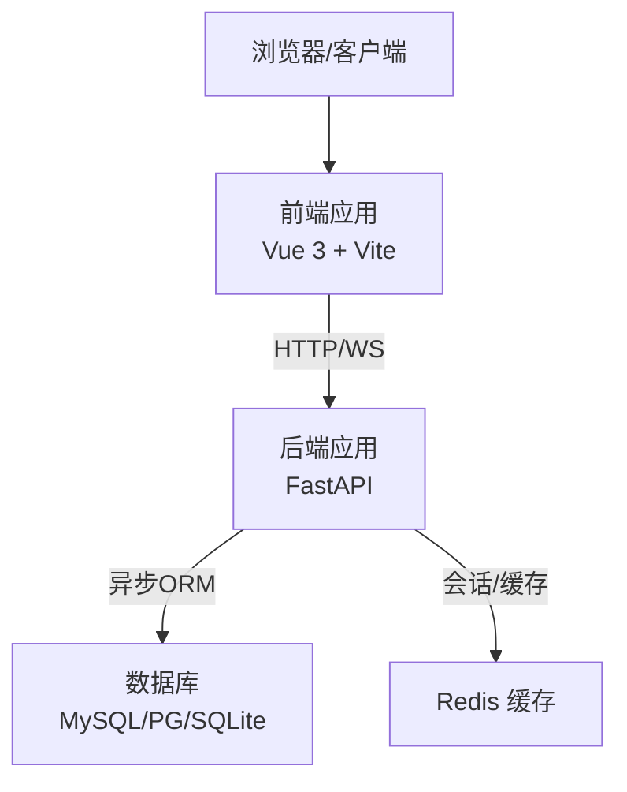

图表来源
- [backend/app/core/database.py:19-106](file://backend/app/core/database.py#L19-L106)
- [backend/app/config/setting.py:257-313](file://backend/app/config/setting.py#L257-L313)
- [frontend/web/src/main.ts:29-34](file://frontend/web/src/main.ts#L29-L34)

## 详细组件分析

### 后端应用工厂与生命周期
- 应用创建：通过工厂函数创建 FastAPI 实例，注入 lifespan 生命周期钩子，集中注册异常、中间件、路由、静态文件与 API 文档。
- CLI 子命令：提供 run、revision、upgrade 等命令，支持不同环境启动与数据库迁移。

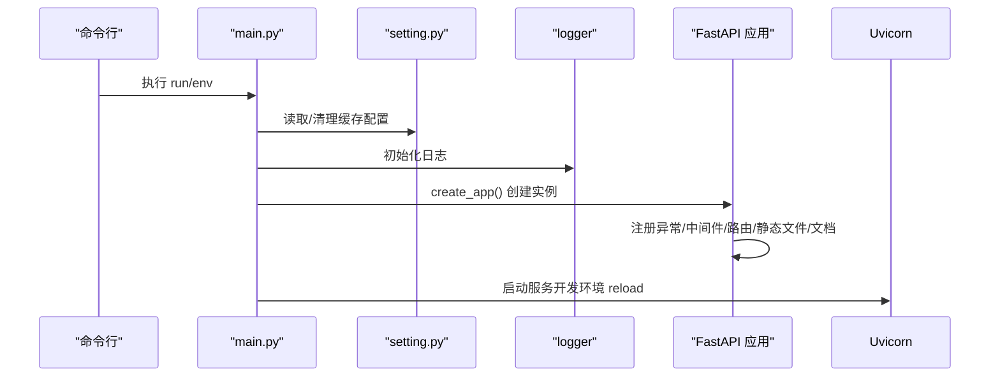

图表来源
- [backend/main.py:55-106](file://backend/main.py#L55-L106)
- [backend/app/config/setting.py:343-351](file://backend/app/config/setting.py#L343-L351)

章节来源
- [backend/main.py:16-51](file://backend/main.py#L16-L51)
- [backend/main.py:55-106](file://backend/main.py#L55-L106)

### 配置中心与连接串
- 配置项覆盖：服务器、API 文档、跨域、认证、数据库、Redis、Gzip、静态文件、Swagger、AI/ChromaDB、请求限制等。
- 连接串生成：异步/同步数据库连接串与 Redis 连接串，支持多数据库类型与池化参数。
- 中间件与事件列表：根据开关动态组装中间件与启动事件。

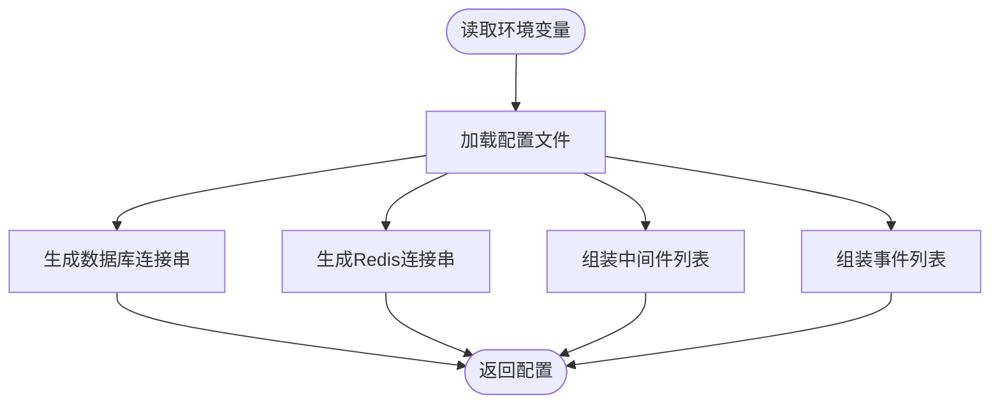

图表来源
- [backend/app/config/setting.py:13-355](file://backend/app/config/setting.py#L13-L355)

章节来源
- [backend/app/config/setting.py:13-355](file://backend/app/config/setting.py#L13-L355)

### 数据库连接池与引擎
- 同步/异步引擎：分别创建同步与异步数据库引擎，支持 SQLite 与非 SQLite 的差异化池化参数。
- 连接池参数：池大小、溢出、超时、回收、预检、LIFO 等，满足高并发场景。
- 表级操作：提供创建/删除所有表的能力，便于迁移与测试。
- Redis 连接：通过 lifespan 在应用启动时建立连接，在关闭时释放。

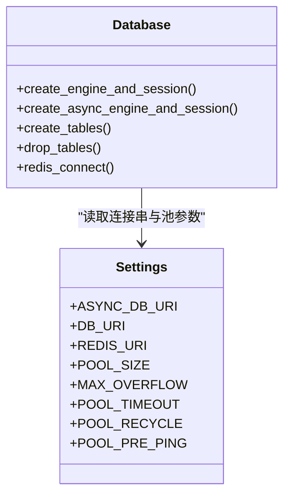

图表来源
- [backend/app/core/database.py:19-177](file://backend/app/core/database.py#L19-L177)
- [backend/app/config/setting.py:257-313](file://backend/app/config/setting.py#L257-L313)

章节来源
- [backend/app/core/database.py:19-177](file://backend/app/core/database.py#L19-L177)
- [backend/app/config/setting.py:86-96](file://backend/app/config/setting.py#L86-L96)

### 中间件体系
- CORS：允许跨域请求，支持暴露头与凭据。
- 请求日志与拦截：记录请求/响应信息，支持从 Authorization 解析会话 ID；结合系统参数实现演示模式下的 IP 白名单/黑名单与 API 白名单拦截。
- GZip：按最小压缩阈值与压缩等级进行响应压缩。

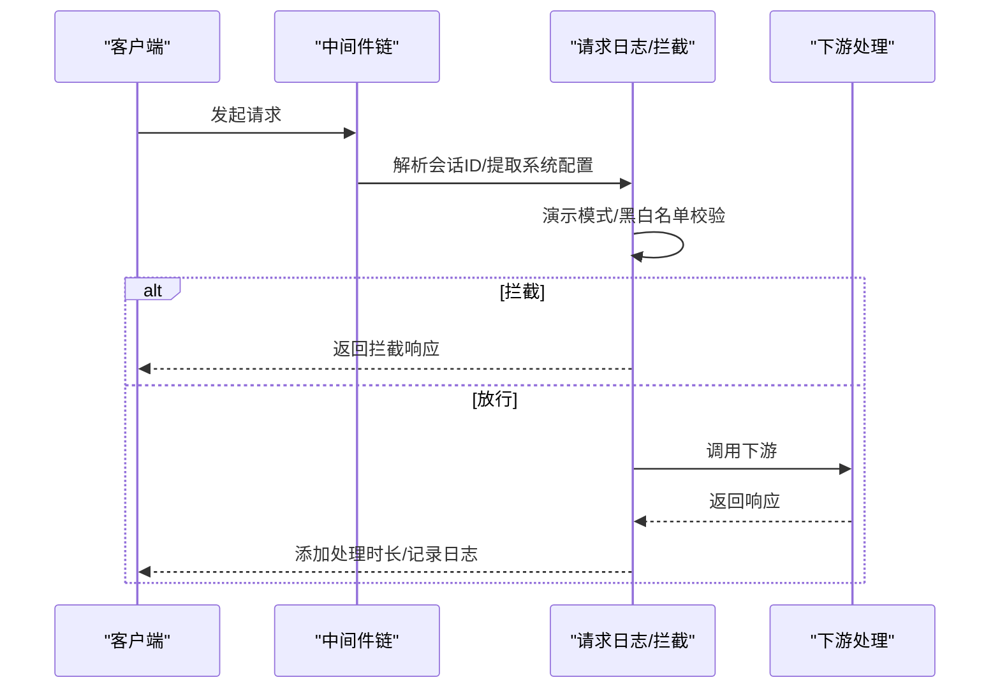

图表来源
- [backend/app/core/middlewares.py:36-200](file://backend/app/core/middlewares.py#L36-L200)

章节来源
- [backend/app/core/middlewares.py:22-215](file://backend/app/core/middlewares.py#L22-L215)

### 路由装饰器与操作日志
- 自定义路由类：在原始处理器前后插入日志采集逻辑，自动记录请求参数、响应状态、处理时长、IP/浏览器/操作系统、来源文档等。
- 参数截断：防止过长参数写入日志表。

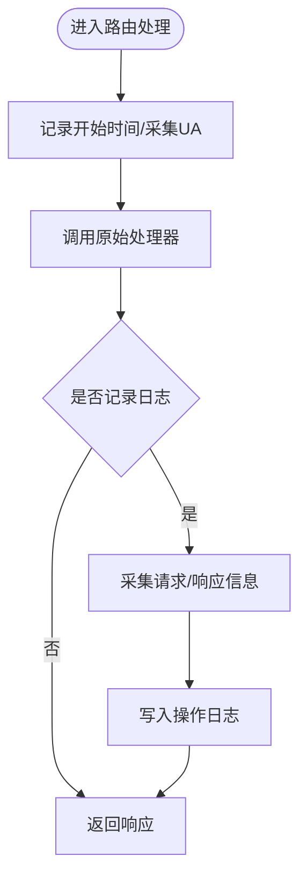

图表来源
- [backend/app/core/router_class.py:24-165](file://backend/app/core/router_class.py#L24-L165)

章节来源
- [backend/app/core/router_class.py:24-165](file://backend/app/core/router_class.py#L24-L165)

### 依赖注入与权限校验
- 会话与 Redis：db_getter 提供异步会话，redis_getter 提供 Redis 连接。
- 当前用户：从 Authorization 或 WebSocket 查询参数解析 Token，校验在线状态与用户有效性，设置请求上下文并加载用户角色/职位。
- 权限校验：支持超级管理员放行、任意权限满足策略、数据范围过滤开关。

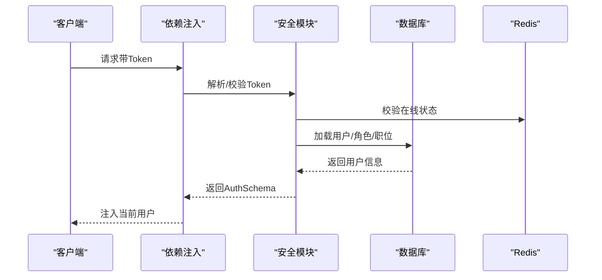

图表来源
- [backend/app/core/dependencies.py:21-296](file://backend/app/core/dependencies.py#L21-L296)
- [backend/app/core/security.py:98-149](file://backend/app/core/security.py#L98-L149)

章节来源
- [backend/app/core/dependencies.py:21-296](file://backend/app/core/dependencies.py#L21-L296)
- [backend/app/core/security.py:11-149](file://backend/app/core/security.py#L11-L149)

### ORM 基类与混入
- 基类：统一 UUID、状态、时间戳、软删除等字段，支持权限策略与加载策略。
- 混入：租户隔离字段、用户审计字段（创建/更新/删除人），关系懒加载策略。

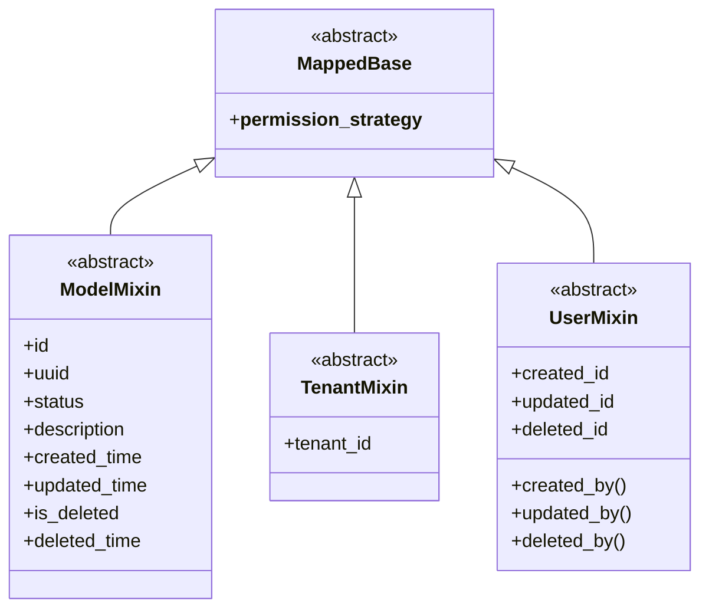

图表来源
- [backend/app/core/base_model.py:21-228](file://backend/app/core/base_model.py#L21-L228)

章节来源
- [backend/app/core/base_model.py:21-228](file://backend/app/core/base_model.py#L21-L228)

### 前端应用架构
- 应用入口：控制台横幅、插件初始化（Pinia/Router/指令/国际化/Element Plus），挂载根组件。
- 路由系统：Hash 模式路由，静态路由首屏注册，动态路由在守卫内按需挂载。
- 状态管理：Pinia + 持久化插件，提供用户、字典、通知、配置、工作标签等 Store。
- 构建工具：Vite 配置按需自动导入、组件解析、Element Plus 源码引入、Gzip 压缩、依赖预优化、分包策略与别名。

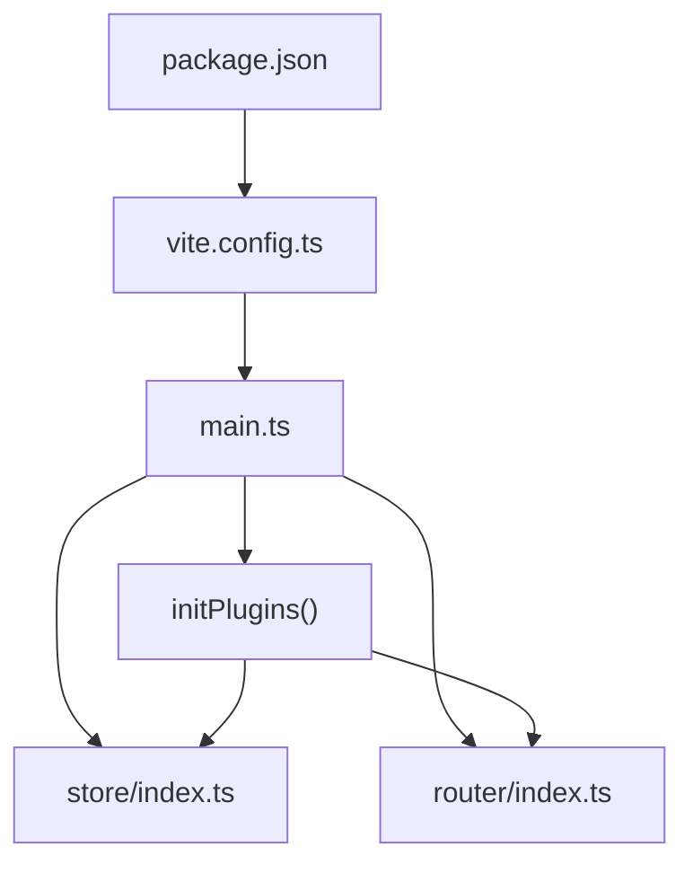

图表来源
- [frontend/web/src/main.ts:29-34](file://frontend/web/src/main.ts#L29-L34)
- [frontend/web/src/router/index.ts:16-27](file://frontend/web/src/router/index.ts#L16-L27)
- [frontend/web/src/store/index.ts:11-29](file://frontend/web/src/store/index.ts#L11-L29)
- [frontend/web/vite.config.ts:49-287](file://frontend/web/vite.config.ts#L49-L287)
- [frontend/web/package.json:1-205](file://frontend/web/package.json#L1-205)

章节来源
- [frontend/web/src/main.ts:29-34](file://frontend/web/src/main.ts#L29-L34)
- [frontend/web/src/router/index.ts:16-27](file://frontend/web/src/router/index.ts#L16-L27)
- [frontend/web/src/store/index.ts:11-29](file://frontend/web/src/store/index.ts#L11-L29)
- [frontend/web/vite.config.ts:49-287](file://frontend/web/vite.config.ts#L49-L287)
- [frontend/web/package.json:1-205](file://frontend/web/package.json#L1-205)

## 依赖关系分析
- 后端依赖：FastAPI、SQLAlchemy 2.x、Alembic、Pydantic Settings、uvicorn、gunicorn、loguru、httpx、redis、asyncmy/asyncpg、passlib/bcrypt、apscheduler、prefect、openai 等。
- 前端依赖：Vue 3、Element Plus、Pinia、vue-router、axios、echarts、highlight.js、codemirror、xlsx、dayjs、@wangeditor-next 等。
- 构建与质量：Ruff/Lint/Styelint/Prettier、husky/lint-staged、vite-plugin-compression、unplugin-auto-import、unplugin-vue-components、rollup 分包。

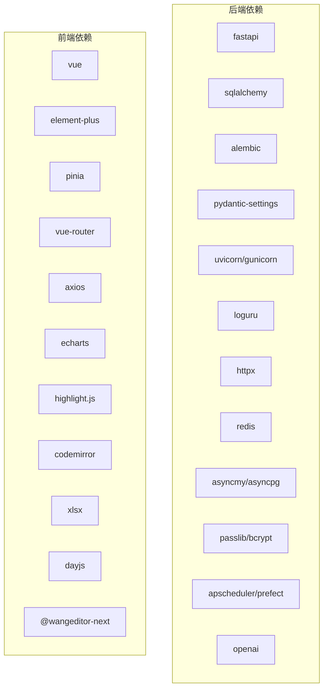

图表来源
- [backend/pyproject.toml:7-49](file://backend/pyproject.toml#L7-L49)
- [backend/requirements.txt:1-45](file://backend/requirements.txt#L1-L45)
- [frontend/web/package.json:68-119](file://frontend/web/package.json#L68-L119)

章节来源
- [backend/pyproject.toml:1-138](file://backend/pyproject.toml#L1-L138)
- [backend/requirements.txt:1-45](file://backend/requirements.txt#L1-L45)
- [frontend/web/package.json:1-205](file://frontend/web/package.json#L1-L205)

## 性能考量
- 数据库连接池
  - 异步池参数：池大小、最大溢出、超时、回收、预检、LIFO，针对高并发与大数据量场景优化。
  - 池化策略：SQLite 与非 SQLite 差异化配置，避免不必要的开销。
- 中间件与日志
  - 按开关启用 CORS/GZip，避免不必要的处理。
  - 操作日志按方法与忽略函数过滤，避免冗余写入。
- 前端构建
  - 按需自动导入与组件解析减少打包体积。
  - Element Plus 源码引入与样式按需加载，避免全量引入。
  - Gzip 压缩与 Rollup 分包策略，提升首屏与二次加载性能。
  - 依赖预优化与别名映射，缩短解析路径。
- 异步与并发
  - 异步 ORM 与 Redis 异步客户端，降低阻塞风险。
  - 滑动过期与在线状态校验，减少无效会话占用。

章节来源
- [backend/app/config/setting.py:86-96](file://backend/app/config/setting.py#L86-L96)
- [backend/app/core/middlewares.py:206-215](file://backend/app/core/middlewares.py#L206-L215)
- [backend/app/core/router_class.py:57-63](file://backend/app/core/router_class.py#L57-L63)
- [frontend/web/vite.config.ts:174-287](file://frontend/web/vite.config.ts#L174-L287)

## 故障排查指南
- 启动与配置
  - 环境变量与配置缓存：启动前清理配置缓存，确保加载最新配置。
  - 文档与静态资源：确认 API 文档路径与静态目录配置。
- 数据库连接
  - 连接失败：检查数据库类型与连接串、池化参数、预检与回收设置。
  - 表创建/删除：确认异步引擎与元数据一致性。
- 中间件与日志
  - CORS/拦截：核对允许来源、方法、头与凭据，演示模式黑白名单配置。
  - 请求耗时：响应头 X-Process-Time 可辅助定位慢点。
- 依赖注入与认证
  - Token 解析：确认算法、密钥与过期策略；检查在线状态键命名与过期时间。
  - 权限校验：确认用户角色与菜单权限集合，超级管理员放行逻辑。
- 前端构建与运行
  - 代理配置：确认 VITE_APP_BASE_API 与 VITE_API_BASE_URL。
  - 分包与按需：若出现样式缺失，检查 Element Plus 组件样式扫描与解析器配置。
  - 依赖冲突：使用 packageManager 与 overrides 规避版本冲突。

章节来源
- [backend/main.py:74-106](file://backend/main.py#L74-L106)
- [backend/app/core/database.py:31-50](file://backend/app/core/database.py#L31-L50)
- [backend/app/core/middlewares.py:134-185](file://backend/app/core/middlewares.py#L134-L185)
- [backend/app/core/dependencies.py:61-96](file://backend/app/core/dependencies.py#L61-L96)
- [frontend/web/vite.config.ts:64-72](file://frontend/web/vite.config.ts#L64-L72)

## 结论
FastapiAdmin 采用现代技术栈与模块化架构，后端以 FastAPI 为核心，结合 SQLAlchemy 异步 ORM、完善的中间件与依赖注入体系，支撑高并发与可扩展的企业级后台管理；前端以 Vite 为构建基石，配合 Vue 3 Composition API、Element Plus 与 Pinia，提供良好的开发体验与运行性能。通过合理的连接池参数、中间件开关与前端分包策略，可在保证功能完整性的同时获得优异的性能表现。

## 附录
- 技术选型对比与建议
  - 数据库：MySQL/PostgreSQL/SQLite 三选一，高并发优先 asyncpg/asyncmy；SQLite 适合开发与轻量场景。
  - ORM：SQLAlchemy 2.x 异步生态成熟，结合连接池参数可满足高吞吐需求。
  - 中间件：按需启用 CORS/GZip，演示模式下建议开启请求拦截与日志记录。
  - 前端：Vue 3 + TS + Vite + Element Plus + Pinia，搭配按需自动导入与分包策略，兼顾开发效率与运行性能。
- 最佳实践
  - 后端：统一配置中心、明确中间件顺序、严格权限校验、合理设置池化参数、启用必要的日志与监控。
  - 前端：保持依赖版本稳定、利用自动导入减少样板代码、按需加载与分包优化、构建产物压缩与缓存策略。