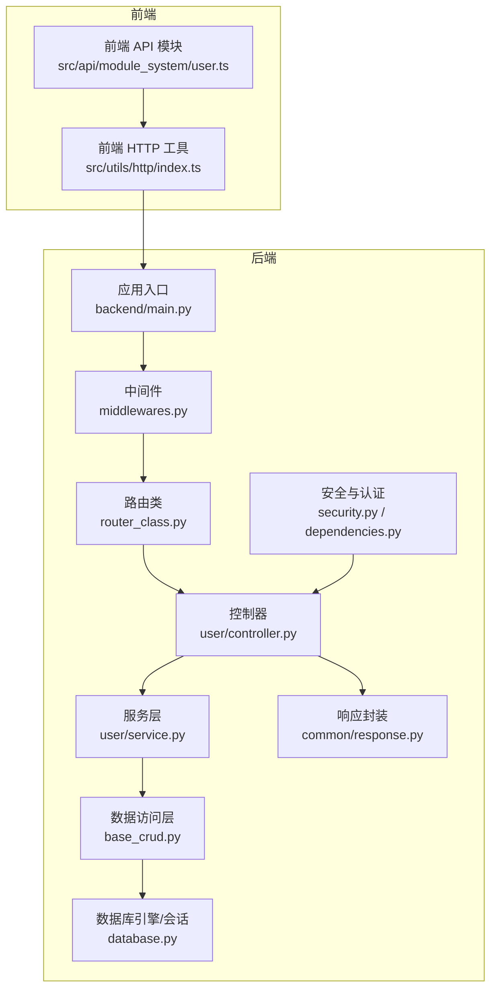
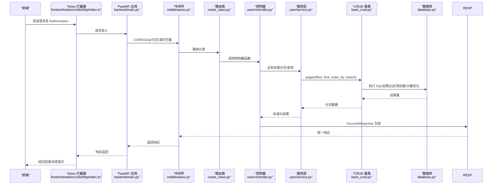
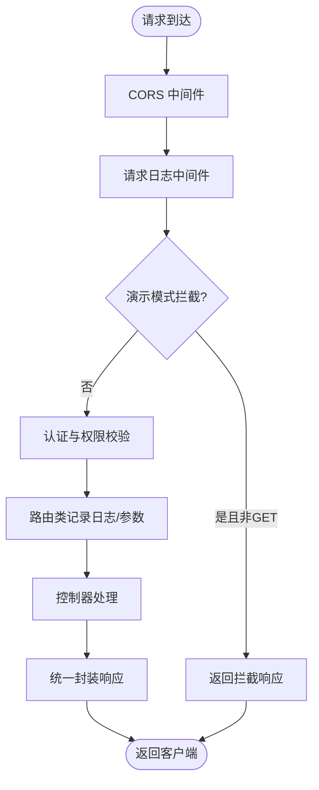
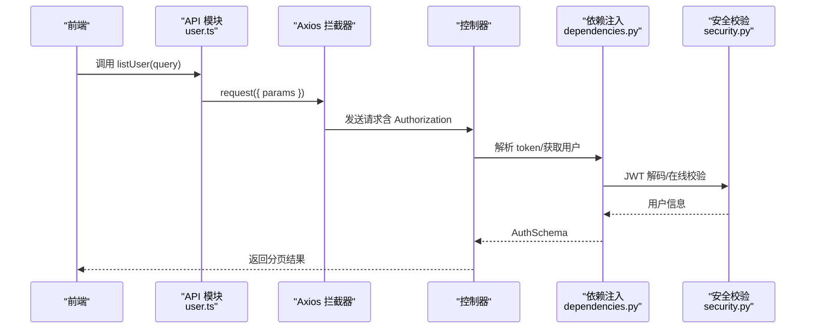
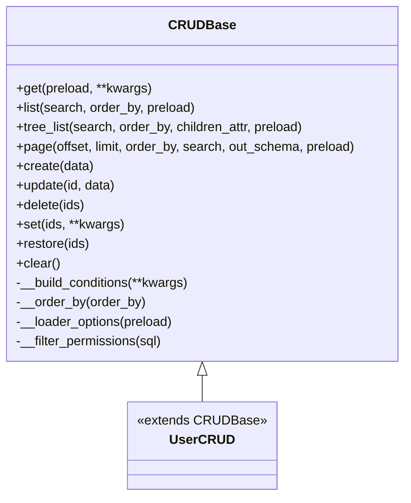
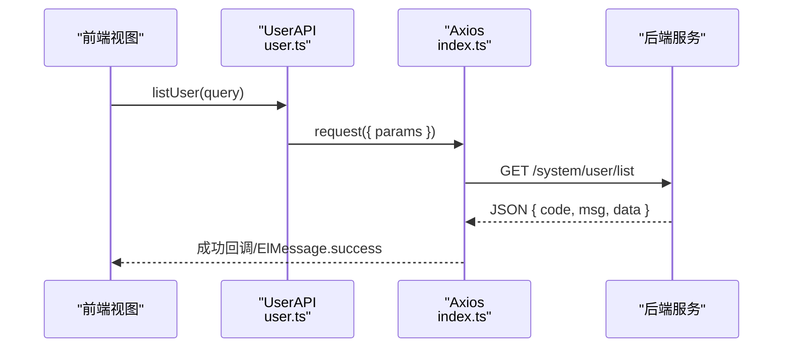
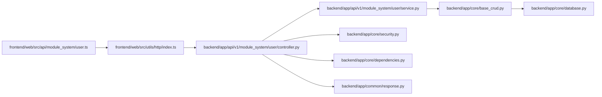

# 数据流分析

<cite>
**本文引用的文件**
- [backend/main.py](file://backend/main.py)
- [backend/app/core/base_crud.py](file://backend/app/core/base_crud.py)
- [backend/app/core/database.py](file://backend/app/core/database.py)
- [backend/app/common/request.py](file://backend/app/common/request.py)
- [backend/app/common/response.py](file://backend/app/common/response.py)
- [backend/app/api/v1/module_system/user/controller.py](file://backend/app/api/v1/module_system/user/controller.py)
- [backend/app/core/middlewares.py](file://backend/app/core/middlewares.py)
- [backend/app/core/dependencies.py](file://backend/app/core/dependencies.py)
- [backend/app/core/security.py](file://backend/app/core/security.py)
- [backend/app/core/redis_crud.py](file://backend/app/core/redis_crud.py)
- [backend/app/api/v1/module_system/user/service.py](file://backend/app/api/v1/module_system/user/service.py)
- [backend/app/core/router_class.py](file://backend/app/core/router_class.py)
- [frontend/web/src/api/module_system/user.ts](file://frontend/web/src/api/module_system/user.ts)
- [frontend/web/src/utils/http/index.ts](file://frontend/web/src/utils/http/index.ts)
</cite>

## 目录
1. [简介](#简介)
2. [项目结构](#项目结构)
3. [核心组件](#核心组件)
4. [架构总览](#架构总览)
5. [详细组件分析](#详细组件分析)
6. [依赖分析](#依赖分析)
7. [性能考虑](#性能考虑)
8. [故障排查指南](#故障排查指南)
9. [结论](#结论)
10. [附录](#附录)

## 简介
本文件面向 FastapiAdmin 的数据流分析，覆盖从客户端请求到数据库存储的完整链路，重点剖析：
- 请求处理流程：路由匹配、参数验证、业务逻辑执行、响应返回
- 数据访问层设计：CRUD 封装、权限过滤、事务管理、软删除与恢复
- 前端数据获取机制：API 调用、状态更新、视图渲染
- 数据流图、关键节点分析、性能瓶颈识别
- 数据一致性保障与错误处理策略

## 项目结构
后端采用 FastAPI + SQLAlchemy 异步 ORM + Redis 缓存，前端采用 Vue3 + Element Plus + Axios。整体以模块化 API 路由为核心，围绕用户管理模块展开数据流示例。

图表来源
- [backend/main.py:16-51](file://backend/main.py#L16-L51)
- [backend/app/core/middlewares.py:22-215](file://backend/app/core/middlewares.py#L22-L215)
- [backend/app/core/router_class.py:24-165](file://backend/app/core/router_class.py#L24-L165)
- [backend/app/api/v1/module_system/user/controller.py:30-456](file://backend/app/api/v1/module_system/user/controller.py#L30-L456)
- [backend/app/api/v1/module_system/user/service.py:35-737](file://backend/app/api/v1/module_system/user/service.py#L35-L737)
- [backend/app/core/base_crud.py:26-571](file://backend/app/core/base_crud.py#L26-L571)
- [backend/app/core/database.py:19-177](file://backend/app/core/database.py#L19-L177)
- [backend/app/core/security.py:11-149](file://backend/app/core/security.py#L11-L149)
- [backend/app/core/dependencies.py:21-296](file://backend/app/core/dependencies.py#L21-L296)
- [backend/app/common/response.py:26-176](file://backend/app/common/response.py#L26-L176)
- [frontend/web/src/api/module_system/user.ts:1-269](file://frontend/web/src/api/module_system/user.ts#L1-L269)
- [frontend/web/src/utils/http/index.ts:186-371](file://frontend/web/src/utils/http/index.ts#L186-L371)

章节来源
- [backend/main.py:16-51](file://backend/main.py#L16-L51)
- [frontend/web/src/api/module_system/user.ts:1-269](file://frontend/web/src/api/module_system/user.ts#L1-L269)

## 核心组件
- 应用入口与生命周期：创建 FastAPI 实例、注册中间件、路由、静态资源与异常处理
- 中间件：CORS、请求日志、GZip 压缩、演示模式拦截
- 路由类：操作日志记录，自动采集请求/响应参数与耗时
- 控制器：用户模块路由，参数依赖注入与权限校验
- 服务层：业务编排、参数校验、调用 CRUD 层
- 数据访问层：CRUDBase 抽象，权限过滤、条件构建、预加载、分页、软删除
- 安全与认证：OAuth2 Bearer 校验、JWT 解析、在线状态校验、滑动过期
- 响应封装：统一封装业务状态码、消息与数据结构
- 前端 HTTP 工具：Axios 实例、拦截器、鉴权头注入、401 刷新、错误提示

章节来源
- [backend/app/core/middlewares.py:22-215](file://backend/app/core/middlewares.py#L22-L215)
- [backend/app/core/router_class.py:24-165](file://backend/app/core/router_class.py#L24-L165)
- [backend/app/api/v1/module_system/user/controller.py:30-456](file://backend/app/api/v1/module_system/user/controller.py#L30-L456)
- [backend/app/api/v1/module_system/user/service.py:35-737](file://backend/app/api/v1/module_system/user/service.py#L35-L737)
- [backend/app/core/base_crud.py:26-571](file://backend/app/core/base_crud.py#L26-L571)
- [backend/app/core/security.py:11-149](file://backend/app/core/security.py#L11-L149)
- [backend/app/core/dependencies.py:21-296](file://backend/app/core/dependencies.py#L21-L296)
- [backend/app/common/response.py:26-176](file://backend/app/common/response.py#L26-L176)
- [frontend/web/src/utils/http/index.ts:186-371](file://frontend/web/src/utils/http/index.ts#L186-L371)

## 架构总览
以下序列图展示“获取用户分页列表”的完整数据流，涵盖从前端到数据库再到响应返回的关键节点。

图表来源
- [frontend/web/src/utils/http/index.ts:186-371](file://frontend/web/src/utils/http/index.ts#L186-L371)
- [backend/main.py:16-51](file://backend/main.py#L16-L51)
- [backend/app/core/middlewares.py:22-215](file://backend/app/core/middlewares.py#L22-L215)
- [backend/app/core/router_class.py:24-165](file://backend/app/core/router_class.py#L24-L165)
- [backend/app/api/v1/module_system/user/controller.py:205-236](file://backend/app/api/v1/module_system/user/controller.py#L205-L236)
- [backend/app/api/v1/module_system/user/service.py:89-118](file://backend/app/api/v1/module_system/user/service.py#L89-L118)
- [backend/app/core/base_crud.py:151-214](file://backend/app/core/base_crud.py#L151-L214)
- [backend/app/common/response.py:26-102](file://backend/app/common/response.py#L26-L102)

## 详细组件分析

### 请求处理流程与路由匹配
- 路由类 OperationLogRoute 在请求前后自动采集参数、耗时与响应状态，并在满足条件时写入操作日志
- 控制器使用 APIRouter 路由前缀与标签组织接口，依赖注入参数与权限校验
- 中间件 RequestLogMiddleware 记录请求来源、方法、路径与处理时间，支持演示模式拦截与白名单控制

图表来源
- [backend/app/core/middlewares.py:22-215](file://backend/app/core/middlewares.py#L22-L215)
- [backend/app/core/router_class.py:24-165](file://backend/app/core/router_class.py#L24-L165)
- [backend/app/api/v1/module_system/user/controller.py:30-456](file://backend/app/api/v1/module_system/user/controller.py#L30-L456)

章节来源
- [backend/app/core/router_class.py:24-165](file://backend/app/core/router_class.py#L24-L165)
- [backend/app/core/middlewares.py:22-215](file://backend/app/core/middlewares.py#L22-L215)
- [backend/app/api/v1/module_system/user/controller.py:30-456](file://backend/app/api/v1/module_system/user/controller.py#L30-L456)

### 参数验证与依赖注入
- 控制器通过依赖注入获取分页参数、查询参数与认证信息，结合权限装饰器进行细粒度授权
- 服务层对业务参数进行二次校验（如用户名唯一、手机号/邮箱唯一、部门状态等）
- 前端通过 API 模块发送请求，Axios 拦截器自动注入 Authorization 头并处理 401 刷新

图表来源
- [frontend/web/src/api/module_system/user.ts:63-68](file://frontend/web/src/api/module_system/user.ts#L63-L68)
- [frontend/web/src/utils/http/index.ts:186-371](file://frontend/web/src/utils/http/index.ts#L186-L371)
- [backend/app/core/dependencies.py:44-129](file://backend/app/core/dependencies.py#L44-L129)
- [backend/app/core/security.py:30-50](file://backend/app/core/security.py#L30-L50)

章节来源
- [backend/app/core/dependencies.py:44-129](file://backend/app/core/dependencies.py#L44-L129)
- [backend/app/core/security.py:30-50](file://backend/app/core/security.py#L30-L50)
- [frontend/web/src/api/module_system/user.ts:63-68](file://frontend/web/src/api/module_system/user.ts#L63-L68)
- [frontend/web/src/utils/http/index.ts:186-371](file://frontend/web/src/utils/http/index.ts#L186-L371)

### 数据访问层设计与事务管理
- CRUDBase 提供 get/list/tree_list/page/create/update/delete/set/restore/clear 等通用能力
- 条件构建支持多种比较运算符与日期格式化，自动追加软删除过滤
- 分页查询优化：主键计数避免全表扫描；支持预加载与权限过滤
- 事务管理：数据库会话在依赖中以异步上下文管理，begin()/commit/rollback 由框架自动处理
- 软删除：支持 is_deleted/deleted_time/deleted_id 字段，删除/恢复均受权限过滤约束

图表来源
- [backend/app/core/base_crud.py:26-571](file://backend/app/core/base_crud.py#L26-L571)

章节来源
- [backend/app/core/base_crud.py:26-571](file://backend/app/core/base_crud.py#L26-L571)
- [backend/app/core/database.py:19-106](file://backend/app/core/database.py#L19-L106)

### 前端数据获取机制
- API 模块集中定义用户相关接口，统一返回类型与参数结构
- HTTP 工具基于 Axios，内置请求/响应拦截器：自动注入 Authorization、401 刷新、错误分类提示、成功消息提示
- 前端视图通过 API 调用获取数据，结合 Element Plus 组件渲染表格、表单与弹窗

图表来源
- [frontend/web/src/api/module_system/user.ts:63-68](file://frontend/web/src/api/module_system/user.ts#L63-L68)
- [frontend/web/src/utils/http/index.ts:232-371](file://frontend/web/src/utils/http/index.ts#L232-L371)

章节来源
- [frontend/web/src/api/module_system/user.ts:1-269](file://frontend/web/src/api/module_system/user.ts#L1-L269)
- [frontend/web/src/utils/http/index.ts:186-371](file://frontend/web/src/utils/http/index.ts#L186-L371)

### 关键节点分析与性能瓶颈
- 分页计数优化：CRUDBase.page 使用主键计数，避免 count(*) 全表扫描
- 预加载策略：selectinload 避免异步环境下的 MissingGreenlet 错误，减少 N+1 查询
- 权限过滤：在 SQL 层强制追加软删除与数据范围过滤，降低越权风险
- 响应压缩：GZip 中间件按阈值压缩，减少传输体积
- 演示模式拦截：防止非 GET 请求在演示环境执行，避免误操作

章节来源
- [backend/app/core/base_crud.py:186-201](file://backend/app/core/base_crud.py#L186-L201)
- [backend/app/core/base_crud.py:534-571](file://backend/app/core/base_crud.py#L534-L571)
- [backend/app/core/middlewares.py:206-215](file://backend/app/core/middlewares.py#L206-L215)

### 数据一致性保证与错误处理策略
- 事务边界：依赖注入中以异步上下文管理会话，begin()/commit/rollback 由框架自动处理
- 并发保护：更新流程在 flush 后二次验证对象存在性，防止并发修改导致的权限逃逸
- 统一错误：自定义异常与响应封装，前端按业务 code 分类提示，401 静默刷新
- 缓存一致性：Redis 滑动过期与在线校验，避免 token 失效导致的脏读

章节来源
- [backend/app/core/dependencies.py:21-29](file://backend/app/core/dependencies.py#L21-L29)
- [backend/app/core/base_crud.py:284-292](file://backend/app/core/base_crud.py#L284-L292)
- [backend/app/common/response.py:26-176](file://backend/app/common/response.py#L26-L176)
- [frontend/web/src/utils/http/index.ts:295-351](file://frontend/web/src/utils/http/index.ts#L295-L351)

## 依赖分析
- 控制器依赖服务层，服务层依赖 CRUD 基类，CRUD 基类依赖数据库会话与权限过滤
- 安全模块与依赖注入共同保障认证与权限
- 前端 API 模块依赖 HTTP 工具，HTTP 工具依赖 Axios 与鉴权工具

图表来源
- [frontend/web/src/api/module_system/user.ts:1-269](file://frontend/web/src/api/module_system/user.ts#L1-L269)
- [frontend/web/src/utils/http/index.ts:186-371](file://frontend/web/src/utils/http/index.ts#L186-L371)
- [backend/app/api/v1/module_system/user/controller.py:30-456](file://backend/app/api/v1/module_system/user/controller.py#L30-L456)
- [backend/app/api/v1/module_system/user/service.py:35-737](file://backend/app/api/v1/module_system/user/service.py#L35-L737)
- [backend/app/core/base_crud.py:26-571](file://backend/app/core/base_crud.py#L26-L571)
- [backend/app/core/database.py:19-177](file://backend/app/core/database.py#L19-L177)
- [backend/app/core/security.py:11-149](file://backend/app/core/security.py#L11-L149)
- [backend/app/core/dependencies.py:21-296](file://backend/app/core/dependencies.py#L21-L296)
- [backend/app/common/response.py:26-176](file://backend/app/common/response.py#L26-L176)

章节来源
- [backend/app/core/base_crud.py:26-571](file://backend/app/core/base_crud.py#L26-L571)
- [backend/app/core/database.py:19-177](file://backend/app/core/database.py#L19-L177)
- [backend/app/api/v1/module_system/user/controller.py:30-456](file://backend/app/api/v1/module_system/user/controller.py#L30-L456)
- [backend/app/api/v1/module_system/user/service.py:35-737](file://backend/app/api/v1/module_system/user/service.py#L35-L737)
- [frontend/web/src/api/module_system/user.ts:1-269](file://frontend/web/src/api/module_system/user.ts#L1-L269)
- [frontend/web/src/utils/http/index.ts:186-371](file://frontend/web/src/utils/http/index.ts#L186-L371)

## 性能考虑
- 分页计数优化：优先使用主键计数，避免 count(*)
- 预加载策略：合理使用 selectinload，避免 N+1 查询
- 压缩传输：GZip 中间件按阈值启用，减少带宽占用
- 缓存与滑动过期：Redis 缓存在线状态与令牌，按需续约
- 演示模式拦截：避免演示环境的非必要写操作，降低资源消耗

## 故障排查指南
- 401 未授权：检查 Authorization 头、JWT 解码、Redis 在线状态与滑动过期
- 403 无权限：核对用户角色与菜单权限集合，确认权限标识匹配
- 业务错误：查看响应 code 与 msg，前端按 ResultEnum 分类提示
- 网络错误：Axios 拦截器区分 ECONNREFUSED/timeout/Network Error，给出中文提示
- 演示模式拦截：确认请求方法与路径是否在白名单内

章节来源
- [backend/app/core/security.py:116-149](file://backend/app/core/security.py#L116-L149)
- [backend/app/core/dependencies.py:44-129](file://backend/app/core/dependencies.py#L44-L129)
- [frontend/web/src/utils/http/index.ts:113-151](file://frontend/web/src/utils/http/index.ts#L113-L151)
- [frontend/web/src/utils/http/index.ts:255-371](file://frontend/web/src/utils/http/index.ts#L255-L371)
- [backend/app/core/middlewares.py:147-186](file://backend/app/core/middlewares.py#L147-L186)

## 结论
FastapiAdmin 的数据流以模块化 API 路由为核心，结合中间件、路由类、服务层与 CRUD 基类形成清晰的职责边界。通过权限过滤、事务管理、分页计数优化与缓存策略，系统在保证数据一致性的同时提升了性能与安全性。前端通过 Axios 统一拦截器与 API 模块，实现了标准化的请求与响应处理。

## 附录
- 分页查询参数模型：PageResultSchema 与 PaginationService
- 统一响应模型：ResponseSchema、SuccessResponse、ErrorResponse、StreamResponse、UploadFileResponse
- 前端 HTTP 常量与错误类型：NO_AUTH_FLAG、ApiStatus、HttpError、ErrorLogData

章节来源
- [backend/app/common/request.py:10-75](file://backend/app/common/request.py#L10-L75)
- [backend/app/common/response.py:26-176](file://backend/app/common/response.py#L26-L176)
- [frontend/web/src/utils/http/index.ts:22-95](file://frontend/web/src/utils/http/index.ts#L22-L95)