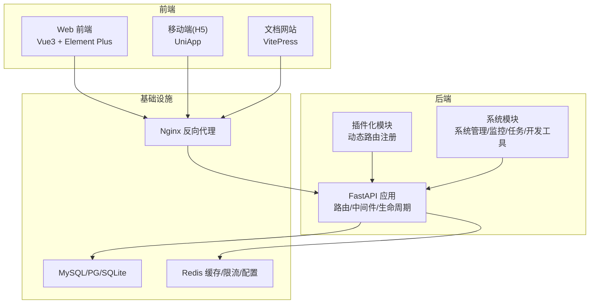
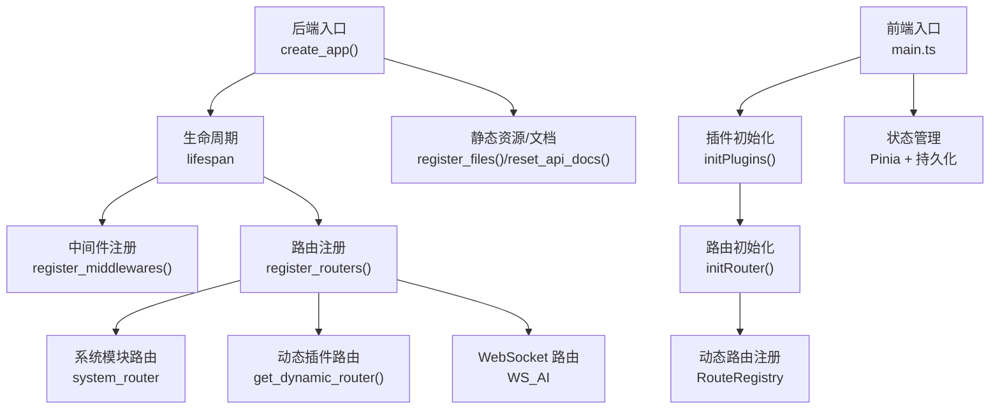
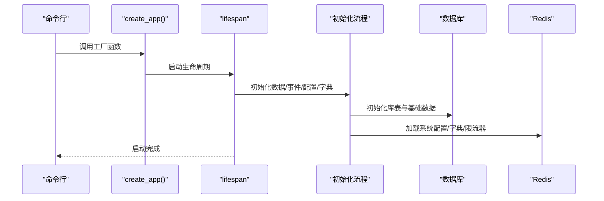
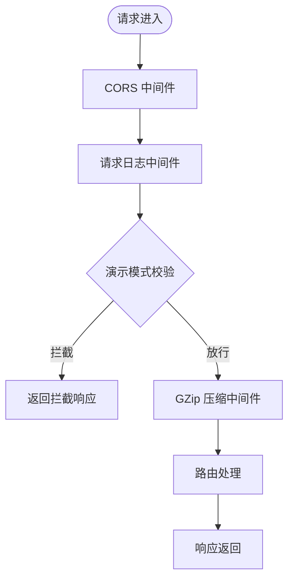
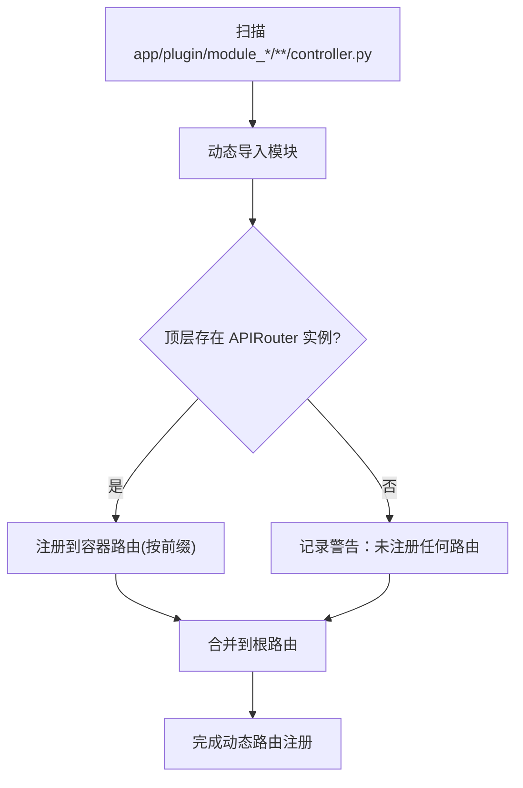
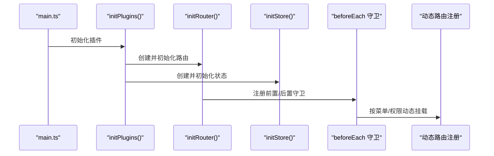
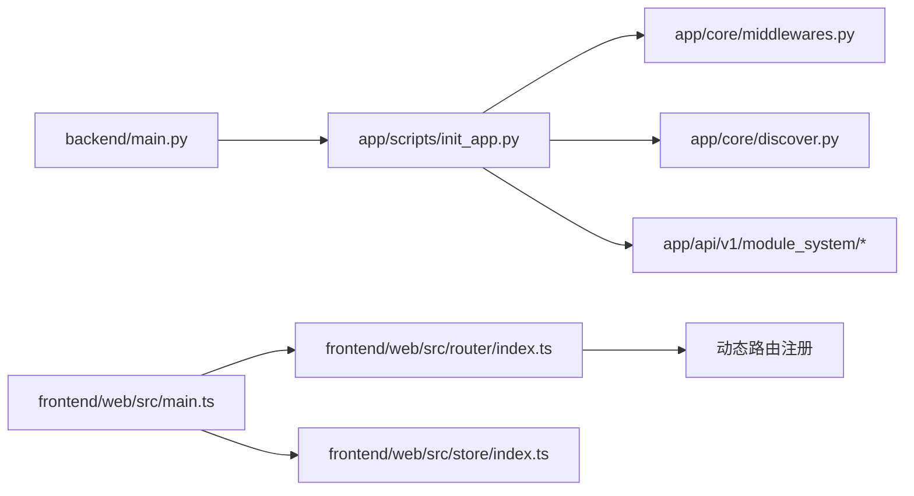

# 整体架构模式

<cite>
**本文引用的文件**   
- [backend/main.py](file://backend/main.py)
- [backend/app/config/setting.py](file://backend/app/config/setting.py)
- [backend/app/scripts/init_app.py](file://backend/app/scripts/init_app.py)
- [backend/app/core/middlewares.py](file://backend/app/core/middlewares.py)
- [backend/app/core/discover.py](file://backend/app/core/discover.py)
- [backend/app/api/v1/module_system/__init__.py](file://backend/app/api/v1/module_system/__init__.py)
- [backend/app/config/path_conf.py](file://backend/app/config/path_conf.py)
- [frontend/web/src/main.ts](file://frontend/web/src/main.ts)
- [frontend/web/src/router/index.ts](file://frontend/web/src/router/index.ts)
- [frontend/web/src/store/index.ts](file://frontend/web/src/store/index.ts)
- [docker/docker-compose.yaml](file://docker/docker-compose.yaml)
- [README.md](file://README.md)
</cite>

## 目录
1. [引言](#引言)
2. [项目结构](#项目结构)
3. [核心组件](#核心组件)
4. [架构总览](#架构总览)
5. [详细组件分析](#详细组件分析)
6. [依赖关系分析](#依赖关系分析)
7. [性能考虑](#性能考虑)
8. [故障排查指南](#故障排查指南)
9. [结论](#结论)
10. [附录](#附录)

## 引言
本文件系统化梳理 FastapiAdmin 的整体架构模式，围绕“前后端分离 + 多端统一”的设计理念，阐述后端基于 FastAPI 的模块化与插件化架构、前端基于 Vue3 的多端（Web/H5/文档）统一开发模式，并给出微服务化与模块化组织的演进建议。文档同时总结系统边界、组件职责与接口设计原则，提供架构图、技术栈选型理由与演进路线图，帮助读者快速理解并高效扩展。

## 项目结构
FastapiAdmin 采用“前后端分离 + 多端统一”的工程组织方式：
- 后端：FastAPI + Python，按“业务域”分包（按特性竖切），支持插件化模块与动态路由注册
- 前端：Vue3 + TypeScript，多端（Web/H5/文档）共享一套 UI 与状态管理
- 基础设施：Docker Compose 编排 MySQL、Redis、Nginx 与后端服务

图表来源
- [docker/docker-compose.yaml:1-201](file://docker/docker-compose.yaml#L1-L201)
- [backend/app/scripts/init_app.py:125-160](file://backend/app/scripts/init_app.py#L125-L160)
- [backend/app/core/discover.py:62-172](file://backend/app/core/discover.py#L62-L172)

章节来源
- [README.md:96-115](file://README.md#L96-L115)
- [README.md:117-156](file://README.md#L117-L156)
- [README.md:157-173](file://README.md#L157-L173)

## 核心组件
- 后端应用工厂与生命周期：通过工厂函数创建应用，集中注册中间件、路由、静态资源与文档 UI
- 配置中心：集中管理运行环境、数据库、Redis、JWT、CORS、GZip、静态资源、Swagger/ReDoc/LangJin UI 等
- 中间件体系：CORS、请求日志、GZip 压缩、演示模式拦截与限流
- 动态路由与插件化：自动发现 app/plugin 下的模块，按前缀注册路由，支持多级嵌套
- 前端应用初始化：按顺序初始化插件、挂载根组件；路由采用 Hash 模式，首屏静态路由 + 动态路由按需加载
- 状态管理：Pinia + 持久化插件，集中管理用户、字典、通知、配置、工作标签页等

章节来源
- [backend/main.py:16-51](file://backend/main.py#L16-L51)
- [backend/app/config/setting.py:13-355](file://backend/app/config/setting.py#L13-L355)
- [backend/app/scripts/init_app.py:27-94](file://backend/app/scripts/init_app.py#L27-L94)
- [backend/app/core/middlewares.py:22-215](file://backend/app/core/middlewares.py#L22-L215)
- [backend/app/core/discover.py:62-172](file://backend/app/core/discover.py#L62-L172)
- [frontend/web/src/main.ts:29-35](file://frontend/web/src/main.ts#L29-L35)
- [frontend/web/src/router/index.ts:16-39](file://frontend/web/src/router/index.ts#L16-L39)
- [frontend/web/src/store/index.ts:15-89](file://frontend/web/src/store/index.ts#L15-L89)

## 架构总览
整体架构强调“统一入口、按域分治、插件自治、多端复用”。后端通过统一的 FastAPI 应用入口，聚合系统模块与插件模块；前端通过路由守卫与动态路由注册，实现菜单驱动的页面挂载；基础设施通过 Docker Compose 提供数据库、缓存与反向代理。

图表来源
- [backend/main.py:16-51](file://backend/main.py#L16-L51)
- [backend/app/scripts/init_app.py:95-226](file://backend/app/scripts/init_app.py#L95-L226)
- [backend/app/api/v1/module_system/__init__.py:17-29](file://backend/app/api/v1/module_system/__init__.py#L17-L29)
- [backend/app/core/discover.py:62-172](file://backend/app/core/discover.py#L62-L172)
- [frontend/web/src/main.ts:29-35](file://frontend/web/src/main.ts#L29-L35)
- [frontend/web/src/router/index.ts:22-39](file://frontend/web/src/router/index.ts#L22-L39)
- [frontend/web/src/store/index.ts:15-29](file://frontend/web/src/store/index.ts#L15-L29)

## 详细组件分析

### 后端应用工厂与生命周期
- 工厂函数负责创建 FastAPI 实例、设置生命周期、注册异常、中间件、路由、静态资源与文档 UI
- 生命周期在启动时完成数据库初始化、全局事件加载、Redis 配置与字典、定时任务、请求限流器初始化；退出时优雅关闭

图表来源
- [backend/main.py:16-51](file://backend/main.py#L16-L51)
- [backend/app/scripts/init_app.py:27-94](file://backend/app/scripts/init_app.py#L27-L94)

章节来源
- [backend/main.py:16-51](file://backend/main.py#L16-L51)
- [backend/app/scripts/init_app.py:27-94](file://backend/app/scripts/init_app.py#L27-L94)

### 配置中心与环境管理
- 通过 Settings 类集中管理运行环境、服务器、API 文档、CORS、JWT、数据库、Redis、GZip、静态资源、Swagger/ReDoc/LangJin UI、OAuth、日志、压缩、上传、AI/ChromaDB、请求限制等
- 支持按环境切换（dev/prod），动态组装中间件与事件列表，生成异步/同步数据库连接串与 Redis 连接串

章节来源
- [backend/app/config/setting.py:13-355](file://backend/app/config/setting.py#L13-L355)
- [backend/app/config/path_conf.py:1-32](file://backend/app/config/path_conf.py#L1-L32)

### 中间件体系与安全策略
- CORS 中间件：统一跨域策略
- 请求日志中间件：提取会话 ID、记录请求/响应信息、支持演示模式下的 IP 白名单/黑名单与非 GET 拦截
- GZip 压缩中间件：按最小压缩阈值与压缩等级进行响应压缩
- 限流中间件：基于 Redis 的 HTTP/WS 限流回调

图表来源
- [backend/app/core/middlewares.py:22-215](file://backend/app/core/middlewares.py#L22-L215)

章节来源
- [backend/app/core/middlewares.py:22-215](file://backend/app/core/middlewares.py#L22-L215)

### 动态路由与插件化架构
- 约定式目录结构：app/plugin 下以 module_* 为顶级目录，controller.py 为路由入口，按目录层级映射前缀
- 动态发现：遍历 module_* 目录树，导入 controller.py，扫描顶层 APIRouter 实例并注册
- 容器路由：按前缀聚合子路由，避免重复注册，最终挂载到根路由

图表来源
- [backend/app/core/discover.py:62-172](file://backend/app/core/discover.py#L62-L172)

章节来源
- [backend/app/core/discover.py:1-172](file://backend/app/core/discover.py#L1-L172)
- [backend/app/scripts/init_app.py:125-159](file://backend/app/scripts/init_app.py#L125-L159)

### 系统模块路由聚合
- 系统模块（认证、部门、字典、日志、菜单、公告、参数、岗位、角色、租户、用户）通过统一的 system_router 聚合，形成清晰的业务边界

章节来源
- [backend/app/api/v1/module_system/__init__.py:17-29](file://backend/app/api/v1/module_system/__init__.py#L17-L29)

### 前端应用初始化与路由
- 应用初始化顺序：打印横幅 → 插件初始化（Pinia/Router/指令/国际化/组件库）→ 挂载根组件
- 路由采用 Hash 模式，首屏注册静态路由，动态路由在 beforeEach 中按菜单与权限动态挂载
- 状态管理：Pinia + 持久化插件，集中管理用户、字典、通知、配置、工作标签页等

图表来源
- [frontend/web/src/main.ts:29-35](file://frontend/web/src/main.ts#L29-L35)
- [frontend/web/src/router/index.ts:22-39](file://frontend/web/src/router/index.ts#L22-L39)
- [frontend/web/src/store/index.ts:15-29](file://frontend/web/src/store/index.ts#L15-L29)

章节来源
- [frontend/web/src/main.ts:1-35](file://frontend/web/src/main.ts#L1-L35)
- [frontend/web/src/router/index.ts:1-39](file://frontend/web/src/router/index.ts#L1-L39)
- [frontend/web/src/store/index.ts:1-89](file://frontend/web/src/store/index.ts#L1-L89)

### 基础设施与部署
- Docker Compose 编排：MySQL、Redis、后端、Nginx 四个服务，健康检查与资源限制
- Nginx 作为反向代理，静态托管前端产物，转发后端 API 请求

章节来源
- [docker/docker-compose.yaml:1-201](file://docker/docker-compose.yaml#L1-L201)

## 依赖关系分析
- 后端依赖链：入口工厂 → 生命周期 → 中间件/路由/静态资源/文档 → 插件与系统模块
- 前端依赖链：入口初始化 → 插件注册 → 路由守卫 → 动态路由 → 状态管理
- 基础设施：MySQL/PG/SQLite 与 Redis 为后端提供数据与缓存支撑

图表来源
- [backend/main.py:16-51](file://backend/main.py#L16-L51)
- [backend/app/scripts/init_app.py:95-226](file://backend/app/scripts/init_app.py#L95-L226)
- [backend/app/core/discover.py:62-172](file://backend/app/core/discover.py#L62-L172)
- [frontend/web/src/main.ts:29-35](file://frontend/web/src/main.ts#L29-L35)
- [frontend/web/src/router/index.ts:22-39](file://frontend/web/src/router/index.ts#L22-L39)
- [frontend/web/src/store/index.ts:15-29](file://frontend/web/src/store/index.ts#L15-L29)

章节来源
- [backend/app/scripts/init_app.py:95-226](file://backend/app/scripts/init_app.py#L95-L226)
- [backend/app/core/discover.py:62-172](file://backend/app/core/discover.py#L62-L172)
- [frontend/web/src/router/index.ts:16-39](file://frontend/web/src/router/index.ts#L16-L39)

## 性能考虑
- 异步与连接池：后端使用 SQLAlchemy 2.0 与异步驱动，合理配置连接池大小、超时与回收策略
- 缓存与限流：Redis 用于配置、字典、限流与会话，提升响应速度与抗压能力
- 压缩与静态资源：GZip 压缩与静态资源挂载，减少带宽占用
- 前端按需加载：路由与组件按需加载，降低首屏负担

## 故障排查指南
- 启动失败：检查环境变量、数据库连接、Redis 连接与端口映射
- 路由未注册：确认插件目录命名、controller.py 顶层 APIRouter 定义、包可导入
- 文档 UI 404：确认静态资源挂载与文档重定向路由
- 演示模式拦截：核对 IP 白名单/黑名单与非 GET 请求策略

章节来源
- [backend/app/scripts/init_app.py:27-94](file://backend/app/scripts/init_app.py#L27-L94)
- [backend/app/core/discover.py:33-59](file://backend/app/core/discover.py#L33-L59)
- [backend/app/scripts/init_app.py:182-226](file://backend/app/scripts/init_app.py#L182-L226)
- [backend/app/core/middlewares.py:150-185](file://backend/app/core/middlewares.py#L150-L185)

## 结论
FastapiAdmin 通过“按域分治 + 插件自治 + 多端复用”的架构，实现了高内聚、低耦合与强扩展性的统一平台。后端以 FastAPI 为核心，结合动态路由与插件化机制，使业务模块可插拔；前端以 Vue3 为基础，配合动态路由与状态持久化，实现多端一致体验。基础设施采用容器编排，简化部署与运维。未来可在现有基础上进一步推进微服务化与模块化演进，持续增强可扩展性与可维护性。

## 附录

### 技术栈选型理由
- 后端：FastAPI 异步高性能、Pydantic 强类型约束、Alembic 数据迁移、SQLAlchemy 2.0 ORM
- 前端：Vue3 Composition API、TypeScript、Pinia 状态管理、Element Plus UI 组件库
- 移动端：UniApp 跨端框架，适配 H5 与多端发布
- 数据库：MySQL/PostgreSQL/SQLite，满足不同规模与场景
- 缓存：Redis 提供高性能缓存、限流与配置中心
- 文档：Swagger/ReDoc/LangJin UI，自动生成 API 文档
- 部署：Docker + Nginx，标准化交付与运维

章节来源
- [README.md:157-173](file://README.md#L157-L173)

### 架构演进路线图
- 短期：完善插件生态、增强动态路由与权限控制、优化前端多端一致性
- 中期：模块化拆分与微服务化（按业务域拆分服务），引入 API 网关与服务治理
- 长期：可观测性与可观测数据闭环、AI/Agent 能力集成、多租户与多活架构

章节来源
- [README.md:35-57](file://README.md#L35-L57)