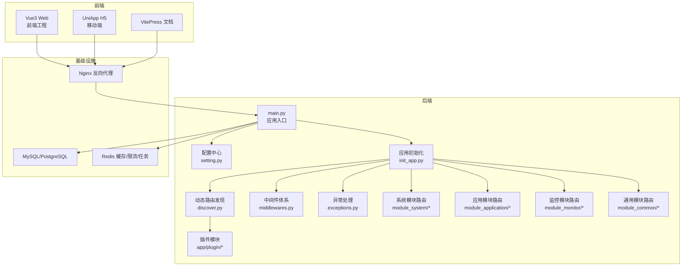
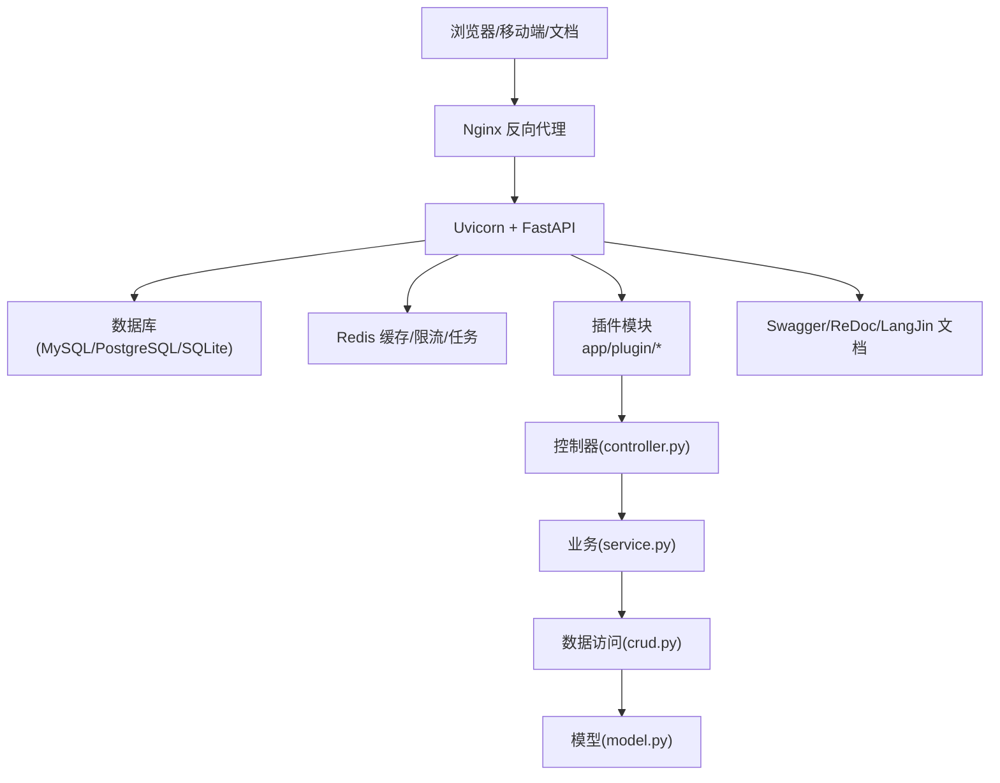
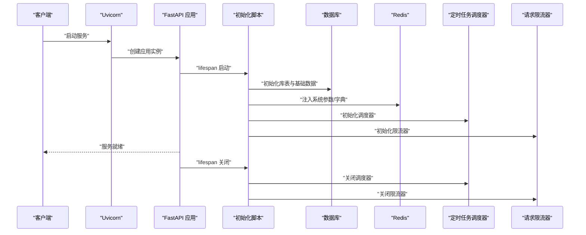
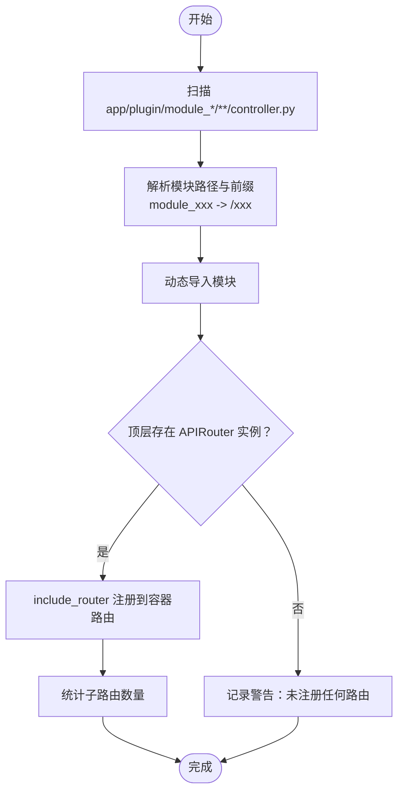
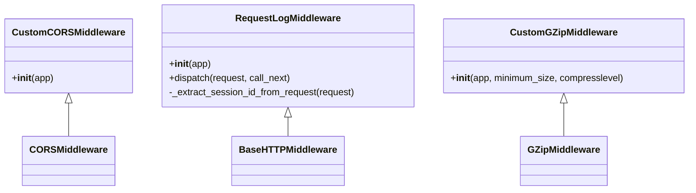
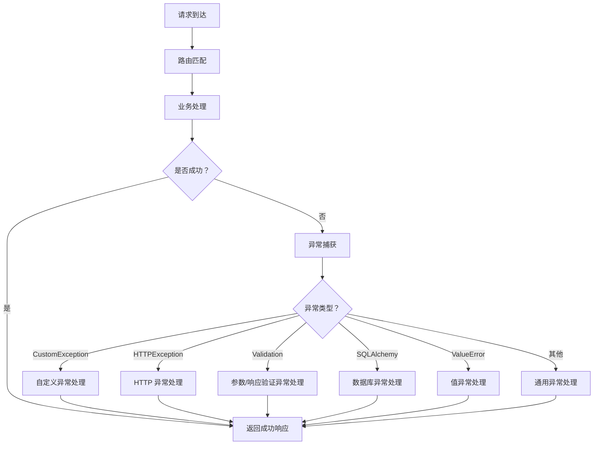
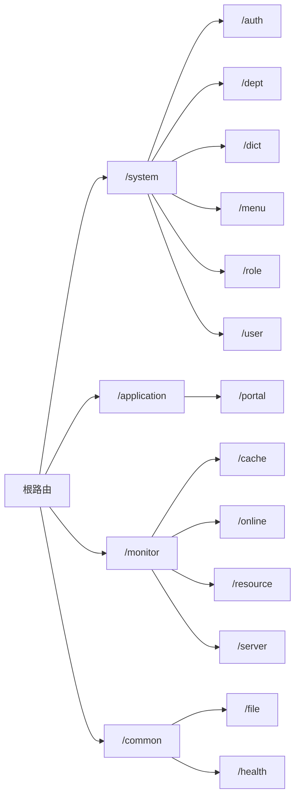
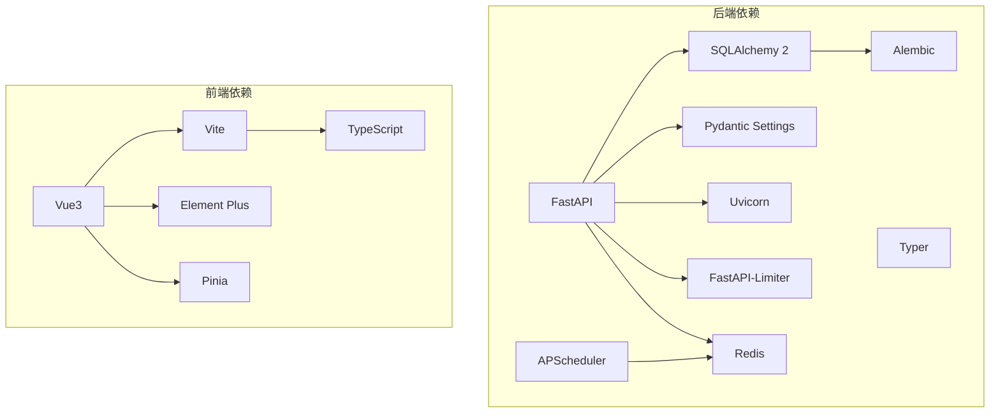

# 系统架构设计

<cite>
**本文引用的文件**
- [backend/main.py](file://backend/main.py)
- [backend/pyproject.toml](file://backend/pyproject.toml)
- [README.md](file://README.md)
- [backend/app/config/setting.py](file://backend/app/config/setting.py)
- [backend/app/scripts/init_app.py](file://backend/app/scripts/init_app.py)
- [backend/app/core/discover.py](file://backend/app/core/discover.py)
- [backend/app/core/middlewares.py](file://backend/app/core/middlewares.py)
- [backend/app/core/exceptions.py](file://backend/app/core/exceptions.py)
- [backend/app/api/v1/module_system/__init__.py](file://backend/app/api/v1/module_system/__init__.py)
- [backend/app/api/v1/module_application/__init__.py](file://backend/app/api/v1/module_application/__init__.py)
- [backend/app/api/v1/module_monitor/__init__.py](file://backend/app/api/v1/module_monitor/__init__.py)
- [backend/app/api/v1/module_common/__init__.py](file://backend/app/api/v1/module_common/__init__.py)
- [backend/app/plugin/module_example/plugin.toml](file://backend/app/plugin/module_example/plugin.toml)
- [docker/docker-compose.yaml](file://docker/docker-compose.yaml)
- [frontend/web/package.json](file://frontend/web/package.json)
</cite>

## 目录
1. [引言](#引言)
2. [项目结构](#项目结构)
3. [核心组件](#核心组件)
4. [架构总览](#架构总览)
5. [详细组件分析](#详细组件分析)
6. [依赖分析](#依赖分析)
7. [性能考虑](#性能考虑)
8. [故障排查指南](#故障排查指南)
9. [结论](#结论)
10. [附录](#附录)

## 引言
本文件为 FastapiAdmin 的系统架构设计文档，聚焦整体架构模式与设计原则，覆盖前后端分离、插件化扩展与模块化治理，并对技术栈选择、中间件与异常处理、动态路由发现、部署拓扑与安全策略进行系统化阐述。文档面向开发与运维人员，既提供高层视角，也包含代码级关系图与组件剖析。

## 项目结构
FastapiAdmin 采用前后端分离的工程布局，后端以 FastAPI 为核心，前端以 Vue3 + Vite 为主，辅以 Docker 与 Nginx 实现容器化与反向代理。后端采用“按业务特性分包”的竖切组织方式，结合插件化机制实现模块化与可扩展性。

**图表来源**
- [backend/main.py:16-51](file://backend/main.py#L16-L51)
- [backend/app/scripts/init_app.py:125-160](file://backend/app/scripts/init_app.py#L125-L160)
- [backend/app/core/discover.py:62-172](file://backend/app/core/discover.py#L62-L172)
- [backend/app/api/v1/module_system/__init__.py:17-29](file://backend/app/api/v1/module_system/__init__.py#L17-L29)
- [backend/app/api/v1/module_application/__init__.py:5-7](file://backend/app/api/v1/module_application/__init__.py#L5-L7)
- [backend/app/api/v1/module_monitor/__init__.py:8-13](file://backend/app/api/v1/module_monitor/__init__.py#L8-L13)
- [backend/app/api/v1/module_common/__init__.py:6-9](file://backend/app/api/v1/module_common/__init__.py#L6-L9)

**章节来源**
- [README.md:96-115](file://README.md#L96-L115)
- [README.md:39-57](file://README.md#L39-L57)

## 核心组件
- 应用入口与生命周期
  - 应用工厂函数负责创建 FastAPI 实例、注册日志、中间件、路由、静态资源与 API 文档。
  - 生命周期钩子在启动阶段完成数据库初始化、参数与字典注入 Redis、定时任务调度器、请求限流器初始化；在关闭阶段优雅停机。
- 配置中心
  - 基于 Pydantic Settings 的集中式配置，支持环境切换、中间件开关、数据库/Redis 连接、文档与静态资源、Gzip 压缩、上传与 AI/知识库等配置。
- 动态路由发现
  - 自动扫描 app/plugin 下 module_* 目录，按规则发现 controller.py 中的顶层 APIRouter 实例并注册，实现插件化模块的零配置接入。
- 中间件体系
  - 跨域、请求日志、Gzip 压缩等中间件按配置启用；请求日志中间件支持演示模式下的 IP 白名单/黑名单与路径白名单拦截。
- 异常处理
  - 全局异常处理器覆盖自定义异常、HTTP 异常、参数/响应验证异常、SQLAlchemy 异常、值异常与通用异常，统一输出标准化响应。
- 模块化路由
  - 系统模块、应用模块、监控模块、通用模块各自聚合子路由，形成清晰的业务域边界。

**章节来源**
- [backend/main.py:16-51](file://backend/main.py#L16-L51)
- [backend/app/config/setting.py:13-355](file://backend/app/config/setting.py#L13-L355)
- [backend/app/scripts/init_app.py:27-94](file://backend/app/scripts/init_app.py#L27-L94)
- [backend/app/core/discover.py:62-172](file://backend/app/core/discover.py#L62-L172)
- [backend/app/core/middlewares.py:22-215](file://backend/app/core/middlewares.py#L22-L215)
- [backend/app/core/exceptions.py:57-248](file://backend/app/core/exceptions.py#L57-L248)
- [backend/app/api/v1/module_system/__init__.py:17-29](file://backend/app/api/v1/module_system/__init__.py#L17-L29)
- [backend/app/api/v1/module_application/__init__.py:5-7](file://backend/app/api/v1/module_application/__init__.py#L5-L7)
- [backend/app/api/v1/module_monitor/__init__.py:8-13](file://backend/app/api/v1/module_monitor/__init__.py#L8-L13)
- [backend/app/api/v1/module_common/__init__.py:6-9](file://backend/app/api/v1/module_common/__init__.py#L6-L9)

## 架构总览
系统采用前后端分离与容器化部署，后端以 FastAPI 提供 REST/WebSocket 接口，前端通过 Axios 调用 API，Nginx 提供静态资源与反向代理。插件化机制通过动态路由发现实现模块自治与快速扩展。

**图表来源**
- [docker/docker-compose.yaml:88-141](file://docker/docker-compose.yaml#L88-L141)
- [backend/app/scripts/init_app.py:125-160](file://backend/app/scripts/init_app.py#L125-L160)
- [backend/app/core/discover.py:62-172](file://backend/app/core/discover.py#L62-L172)

**章节来源**
- [README.md:117-156](file://README.md#L117-L156)
- [docker/docker-compose.yaml:1-201](file://docker/docker-compose.yaml#L1-L201)

## 详细组件分析

### 应用生命周期与初始化流程
应用启动时，通过 lifespan 钩子完成数据库初始化、全局事件加载、系统参数与字典注入 Redis、定时任务调度器与请求限流器初始化，并在关闭时优雅清理。

**图表来源**
- [backend/app/scripts/init_app.py:27-94](file://backend/app/scripts/init_app.py#L27-L94)

**章节来源**
- [backend/app/scripts/init_app.py:27-94](file://backend/app/scripts/init_app.py#L27-L94)

### 动态路由发现与插件化机制
系统通过 discover 模块扫描 app/plugin 下的 module_* 目录，自动发现 controller.py 中的顶层 APIRouter 实例并注册到根路由，实现“零配置”插件接入。

**图表来源**
- [backend/app/core/discover.py:62-172](file://backend/app/core/discover.py#L62-L172)

**章节来源**
- [backend/app/core/discover.py:62-172](file://backend/app/core/discover.py#L62-L172)
- [backend/app/plugin/module_example/plugin.toml:1-10](file://backend/app/plugin/module_example/plugin.toml#L1-L10)

### 中间件与安全控制
中间件体系提供跨域、请求日志与 Gzip 压缩；请求日志中间件支持演示模式下的 IP 黑白名单与路径白名单拦截，增强安全审计。

**图表来源**
- [backend/app/core/middlewares.py:22-215](file://backend/app/core/middlewares.py#L22-L215)

**章节来源**
- [backend/app/core/middlewares.py:22-215](file://backend/app/core/middlewares.py#L22-L215)

### 异常处理与统一响应
全局异常处理器覆盖多种异常类型，统一输出标准化响应，便于前端消费与日志追踪。

**图表来源**
- [backend/app/core/exceptions.py:57-248](file://backend/app/core/exceptions.py#L57-L248)

**章节来源**
- [backend/app/core/exceptions.py:57-248](file://backend/app/core/exceptions.py#L57-L248)

### 模块化路由组织
系统模块、应用模块、监控模块与通用模块分别聚合子路由，形成清晰的业务域边界，便于维护与扩展。

**图表来源**
- [backend/app/api/v1/module_system/__init__.py:17-29](file://backend/app/api/v1/module_system/__init__.py#L17-L29)
- [backend/app/api/v1/module_application/__init__.py:5-7](file://backend/app/api/v1/module_application/__init__.py#L5-L7)
- [backend/app/api/v1/module_monitor/__init__.py:8-13](file://backend/app/api/v1/module_monitor/__init__.py#L8-L13)
- [backend/app/api/v1/module_common/__init__.py:6-9](file://backend/app/api/v1/module_common/__init__.py#L6-L9)

**章节来源**
- [backend/app/api/v1/module_system/__init__.py:17-29](file://backend/app/api/v1/module_system/__init__.py#L17-L29)
- [backend/app/api/v1/module_application/__init__.py:5-7](file://backend/app/api/v1/module_application/__init__.py#L5-L7)
- [backend/app/api/v1/module_monitor/__init__.py:8-13](file://backend/app/api/v1/module_monitor/__init__.py#L8-L13)
- [backend/app/api/v1/module_common/__init__.py:6-9](file://backend/app/api/v1/module_common/__init__.py#L6-L9)

## 依赖分析
- 技术栈与依赖
  - 后端：FastAPI、SQLAlchemy 2、Alembic、APScheduler、Redis、Pydantic Settings、Typer、Uvicorn、FastAPI-Limiter 等。
  - 前端：Vue3、Vite、Element Plus、Pinia、TypeScript 等。
- 依赖关系可视化

**图表来源**
- [backend/pyproject.toml:7-51](file://backend/pyproject.toml#L7-L51)
- [frontend/web/package.json:68-120](file://frontend/web/package.json#L68-L120)

**章节来源**
- [backend/pyproject.toml:7-51](file://backend/pyproject.toml#L7-L51)
- [frontend/web/package.json:68-120](file://frontend/web/package.json#L68-L120)

## 性能考虑
- 异步与连接池
  - 使用 SQLAlchemy 2 与异步驱动（asyncpg/asyncmy/aiosqlite）提升数据库吞吐；连接池参数可配置，支持预检与回收策略。
- 缓存与限流
  - Redis 用于缓存、限流与任务调度；请求限流器按路由维度配置，WebSocket 单独限流策略。
- 压缩与静态资源
  - Gzip 压缩按最小阈值与等级配置；静态资源挂载与文档静态资源本地化，减少外部依赖。
- 前端性能
  - Vite 构建优化、按需引入与 Tree Shaking；Element Plus 插件化按需加载。

**章节来源**
- [backend/app/config/setting.py:83-114](file://backend/app/config/setting.py#L83-L114)
- [backend/app/config/setting.py:165-170](file://backend/app/config/setting.py#L165-L170)
- [backend/app/scripts/init_app.py:161-180](file://backend/app/scripts/init_app.py#L161-L180)
- [frontend/web/package.json:121-178](file://frontend/web/package.json#L121-L178)

## 故障排查指南
- 启动失败
  - 检查数据库连接与 Redis 可达性；确认环境变量与配置文件正确；查看初始化日志定位异常。
- 路由未注册
  - 确认插件目录以 module_* 命名、controller.py 位于正确路径、顶层定义 APIRouter 实例；查看动态发现日志。
- 异常响应
  - 统一通过异常处理器输出，前端可根据 code/status_code 识别错误类型；查看后端日志定位具体异常。
- 中间件拦截
  - 演示模式下非 GET 请求受 IP 白名单/黑名单与路径白名单控制；检查系统参数配置。

**章节来源**
- [backend/app/scripts/init_app.py:27-94](file://backend/app/scripts/init_app.py#L27-L94)
- [backend/app/core/discover.py:62-172](file://backend/app/core/discover.py#L62-L172)
- [backend/app/core/exceptions.py:57-248](file://backend/app/core/exceptions.py#L57-L248)
- [backend/app/core/middlewares.py:127-186](file://backend/app/core/middlewares.py#L127-L186)

## 结论
FastapiAdmin 通过前后端分离、插件化扩展与模块化治理，实现了高内聚、低耦合的系统架构。技术栈选择兼顾性能与开发效率，中间件与异常处理保障运行稳定，动态路由发现简化了模块接入与维护成本。结合容器化与 Nginx 反向代理，系统具备良好的可扩展性与可运维性。

## 附录
- 部署拓扑
  - 开发/生产环境均通过 docker-compose 编排，包含 MySQL、Redis、后端与 Nginx；后端通过健康检查与资源限制保障稳定性。
- 端口与默认地址
  - 前端开发端口、后端服务端口、数据库与 Redis 端口、API 前缀与文档地址详见本地架构与默认端口说明。

**章节来源**
- [docker/docker-compose.yaml:1-201](file://docker/docker-compose.yaml#L1-L201)
- [README.md:117-156](file://README.md#L117-L156)