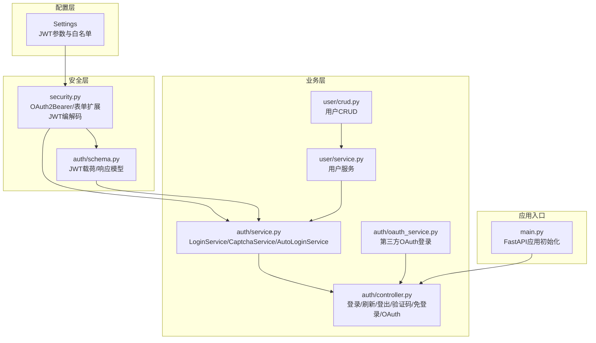
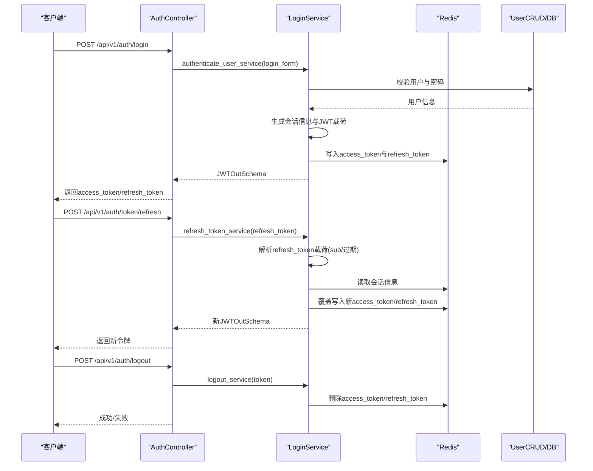
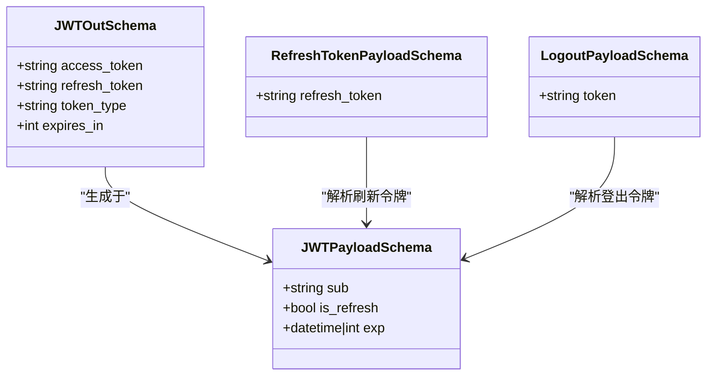
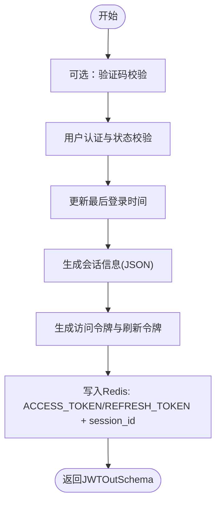
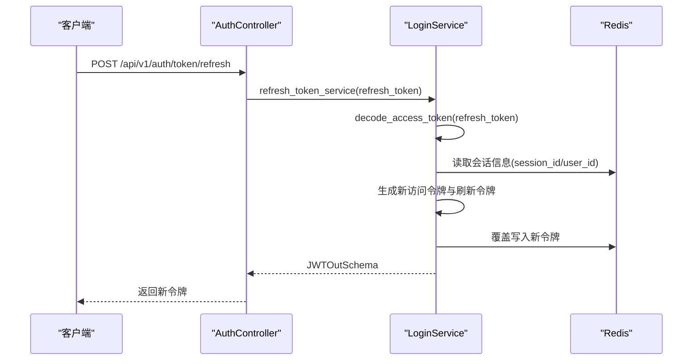
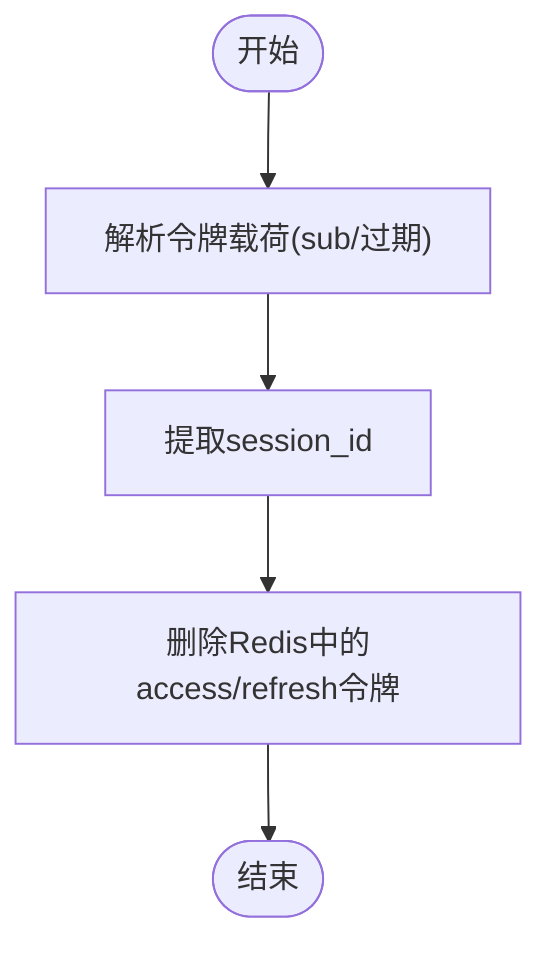
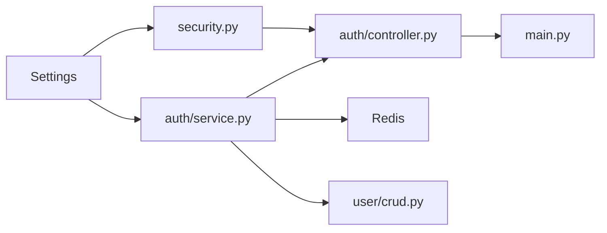

# JWT认证机制

<cite>
**本文引用的文件**
- [backend/app/config/setting.py](file://backend/app/config/setting.py)
- [backend/app/core/security.py](file://backend/app/core/security.py)
- [backend/app/api/v1/module_system/auth/schema.py](file://backend/app/api/v1/module_system/auth/schema.py)
- [backend/app/api/v1/module_system/auth/service.py](file://backend/app/api/v1/module_system/auth/service.py)
- [backend/app/api/v1/module_system/auth/controller.py](file://backend/app/api/v1/module_system/auth/controller.py)
- [backend/app/api/v1/module_system/auth/oauth_service.py](file://backend/app/api/v1/module_system/auth/oauth_service.py)
- [backend/app/api/v1/module_system/user/crud.py](file://backend/app/api/v1/module_system/user/crud.py)
- [backend/app/api/v1/module_system/user/service.py](file://backend/app/api/v1/module_system/user/service.py)
- [backend/main.py](file://backend/main.py)
</cite>

## 目录
1. [简介](#简介)
2. [项目结构](#项目结构)
3. [核心组件](#核心组件)
4. [架构总览](#架构总览)
5. [详细组件分析](#详细组件分析)
6. [依赖分析](#依赖分析)
7. [性能考虑](#性能考虑)
8. [故障排查指南](#故障排查指南)
9. [结论](#结论)
10. [附录](#附录)

## 简介
本文件系统性阐述FastapiAdmin项目中的JWT认证机制，覆盖令牌生成、验证、刷新与登出的完整生命周期，解释访问令牌与刷新令牌的设计原理、结构组成、签名算法与有效期管理，并给出令牌存储策略、安全传输与防篡改机制。同时提供配置参数说明、过期时间设置与性能优化建议，以及最佳实践与常见问题解决方案。

## 项目结构
JWT认证相关代码主要分布在以下模块：
- 配置层：集中定义JWT密钥、算法、过期时间、白名单等参数
- 安全层：封装OAuth2 bearer认证、JWT编解码与载荷模型
- 业务层：登录、刷新、登出、验证码、免登录与第三方OAuth登录
- 用户层：用户CRUD与密码处理
- 应用入口：FastAPI应用初始化与中间件注册

图表来源
- [backend/app/config/setting.py:67-73](file://backend/app/config/setting.py#L67-L73)
- [backend/app/core/security.py:95-149](file://backend/app/core/security.py#L95-L149)
- [backend/app/api/v1/module_system/auth/schema.py:19-63](file://backend/app/api/v1/module_system/auth/schema.py#L19-L63)
- [backend/app/api/v1/module_system/auth/service.py:45-338](file://backend/app/api/v1/module_system/auth/service.py#L45-L338)
- [backend/app/api/v1/module_system/auth/controller.py:38-349](file://backend/app/api/v1/module_system/auth/controller.py#L38-L349)
- [backend/app/api/v1/module_system/auth/oauth_service.py:35-438](file://backend/app/api/v1/module_system/auth/oauth_service.py#L35-L438)
- [backend/app/api/v1/module_system/user/service.py:35-737](file://backend/app/api/v1/module_system/user/service.py#L35-L737)
- [backend/app/api/v1/module_system/user/crud.py:18-221](file://backend/app/api/v1/module_system/user/crud.py#L18-L221)
- [backend/main.py:16-51](file://backend/main.py#L16-L51)

章节来源
- [backend/app/config/setting.py:67-73](file://backend/app/config/setting.py#L67-L73)
- [backend/app/core/security.py:95-149](file://backend/app/core/security.py#L95-L149)
- [backend/app/api/v1/module_system/auth/schema.py:19-63](file://backend/app/api/v1/module_system/auth/schema.py#L19-L63)
- [backend/app/api/v1/module_system/auth/service.py:45-338](file://backend/app/api/v1/module_system/auth/service.py#L45-L338)
- [backend/app/api/v1/module_system/auth/controller.py:38-349](file://backend/app/api/v1/module_system/auth/controller.py#L38-L349)
- [backend/app/api/v1/module_system/auth/oauth_service.py:35-438](file://backend/app/api/v1/module_system/auth/oauth_service.py#L35-L438)
- [backend/app/api/v1/module_system/user/service.py:35-737](file://backend/app/api/v1/module_system/user/service.py#L35-L737)
- [backend/app/api/v1/module_system/user/crud.py:18-221](file://backend/app/api/v1/module_system/user/crud.py#L18-L221)
- [backend/main.py:16-51](file://backend/main.py#L16-L51)

## 核心组件
- JWT配置参数
  - 密钥与算法：SECRET_KEY、ALGORITHM
  - 过期时间：ACCESS_TOKEN_EXPIRE_MINUTES、REFRESH_TOKEN_EXPIRE_MINUTES（单位秒）
  - 令牌类型：TOKEN_TYPE（如bearer）
  - 白名单：TOKEN_REQUEST_PATH_EXCLUDE（无需认证的路由）
  - 滑动过期：TOKEN_SLIDING_EXPIRE（用户操作时自动续期）
- 自定义OAuth2认证器
  - 继承OAuth2PasswordBearer，重写校验逻辑，支持自定义表单字段（验证码、登录类型等）
- JWT载荷与响应模型
  - JWTPayloadSchema：包含sub（会话信息）、is_refresh（是否刷新令牌）、exp（过期时间）
  - JWTOutSchema：包含access_token、refresh_token、token_type、expires_in
- 登录服务
  - authenticate_user_service：验证码校验、用户认证、更新最后登录时间、生成会话信息并创建JWT
  - create_token_service：生成访问令牌与刷新令牌，写入Redis并返回响应
  - refresh_token_service：使用刷新令牌解析会话信息，重新签发新令牌并更新Redis
  - logout_service：根据令牌解析会话ID，删除Redis中的访问与刷新令牌
- 验证码服务
  - get_captcha_service：生成图形验证码并写入Redis，设置过期时间
  - check_captcha_service：校验并删除已使用验证码
- 免登录服务
  - auto_login_service：使用一次性免登录Token换取JWT
- 第三方OAuth登录
  - oauth_service：构建授权URL、交换第三方Token、拉取用户资料、创建或绑定用户并发放JWT

章节来源
- [backend/app/config/setting.py:67-73](file://backend/app/config/setting.py#L67-L73)
- [backend/app/core/security.py:11-51](file://backend/app/core/security.py#L11-L51)
- [backend/app/api/v1/module_system/auth/schema.py:19-63](file://backend/app/api/v1/module_system/auth/schema.py#L19-L63)
- [backend/app/api/v1/module_system/auth/service.py:48-338](file://backend/app/api/v1/module_system/auth/service.py#L48-L338)
- [backend/app/api/v1/module_system/auth/oauth_service.py:35-438](file://backend/app/api/v1/module_system/auth/oauth_service.py#L35-L438)

## 架构总览
JWT认证在FastapiAdmin中的整体交互如下：

图表来源
- [backend/app/api/v1/module_system/auth/controller.py:47-170](file://backend/app/api/v1/module_system/auth/controller.py#L47-L170)
- [backend/app/api/v1/module_system/auth/service.py:48-338](file://backend/app/api/v1/module_system/auth/service.py#L48-L338)
- [backend/app/api/v1/module_system/user/crud.py:111-121](file://backend/app/api/v1/module_system/user/crud.py#L111-L121)

## 详细组件分析

### JWT载荷与模型
- JWTPayloadSchema
  - sub：JSON序列化的会话信息（包含session_id、user_id、name、user_name、ipaddr、login_location、os、browser、login_time、login_type）
  - is_refresh：布尔值，区分访问令牌与刷新令牌
  - exp：过期时间（datetime或int）
- JWTOutSchema
  - access_token：访问令牌
  - refresh_token：刷新令牌
  - token_type：令牌类型（如bearer）
  - expires_in：过期秒数

图表来源
- [backend/app/api/v1/module_system/auth/schema.py:19-63](file://backend/app/api/v1/module_system/auth/schema.py#L19-L63)

章节来源
- [backend/app/api/v1/module_system/auth/schema.py:19-63](file://backend/app/api/v1/module_system/auth/schema.py#L19-L63)

### 登录流程（生成访问令牌与刷新令牌）
- 输入：用户名、密码、验证码（可选）、登录类型
- 处理：
  - 验证码校验（若启用）
  - 用户认证与状态校验
  - 更新最后登录时间
  - 生成会话信息（UUID、IP、位置、UA、登录类型）
  - 生成访问令牌与刷新令牌（exp=当前时间+过期秒数）
  - 写入Redis：分别以ACCESS_TOKEN与REFRESH_TOKEN键前缀+session_id存储
  - 返回JWTOutSchema
- 输出：access_token、refresh_token、token_type、expires_in

图表来源
- [backend/app/api/v1/module_system/auth/service.py:48-221](file://backend/app/api/v1/module_system/auth/service.py#L48-L221)

章节来源
- [backend/app/api/v1/module_system/auth/service.py:48-221](file://backend/app/api/v1/module_system/auth/service.py#L48-L221)

### 刷新令牌流程
- 输入：refresh_token（必须为刷新令牌）
- 处理：
  - 解析refresh_token载荷，校验is_refresh=true
  - 从sub中提取session_id与user_id
  - 从Redis读取会话信息
  - 重新生成访问令牌与刷新令牌（exp=当前时间+过期秒数）
  - 覆盖写入Redis
  - 返回新的JWTOutSchema
- 输出：新的access_token、refresh_token、token_type、expires_in

图表来源
- [backend/app/api/v1/module_system/auth/controller.py:87-114](file://backend/app/api/v1/module_system/auth/controller.py#L87-L114)
- [backend/app/api/v1/module_system/auth/service.py:222-307](file://backend/app/api/v1/module_system/auth/service.py#L222-L307)

章节来源
- [backend/app/api/v1/module_system/auth/controller.py:87-114](file://backend/app/api/v1/module_system/auth/controller.py#L87-L114)
- [backend/app/api/v1/module_system/auth/service.py:222-307](file://backend/app/api/v1/module_system/auth/service.py#L222-L307)

### 登出流程
- 输入：任意令牌（用于解析会话ID）
- 处理：
  - 解析令牌载荷，提取session_id
  - 删除Redis中对应的ACCESS_TOKEN与REFRESH_TOKEN
- 输出：成功/失败

图表来源
- [backend/app/api/v1/module_system/auth/service.py:309-337](file://backend/app/api/v1/module_system/auth/service.py#L309-L337)

章节来源
- [backend/app/api/v1/module_system/auth/service.py:309-337](file://backend/app/api/v1/module_system/auth/service.py#L309-L337)

### 验证码与第三方OAuth登录
- 验证码
  - 生成：get_captcha_service写入Redis，设置过期时间
  - 校验：check_captcha_service读取并删除，区分大小写
- 第三方OAuth
  - 构建授权URL、交换第三方Token、拉取用户资料、自动注册/绑定用户
  - 完成后调用LoginService.create_token_service发放JWT并重定向前端

章节来源
- [backend/app/api/v1/module_system/auth/service.py:340-417](file://backend/app/api/v1/module_system/auth/service.py#L340-L417)
- [backend/app/api/v1/module_system/auth/oauth_service.py:35-438](file://backend/app/api/v1/module_system/auth/oauth_service.py#L35-L438)

## 依赖分析
- 配置依赖
  - Settings提供JWT密钥、算法、过期时间、白名单、滑动过期等参数
- 安全依赖
  - security.py依赖Settings进行JWT签名与校验
- 业务依赖
  - controller依赖service进行登录、刷新、登出、验证码、免登录与OAuth
  - service依赖Redis进行令牌持久化，依赖UserCRUD进行用户状态与登录时间更新
- 应用依赖
  - main.py负责应用初始化与中间件注册，间接影响认证中间件链路

图表来源
- [backend/app/config/setting.py:67-73](file://backend/app/config/setting.py#L67-L73)
- [backend/app/core/security.py:95-149](file://backend/app/core/security.py#L95-L149)
- [backend/app/api/v1/module_system/auth/service.py:45-338](file://backend/app/api/v1/module_system/auth/service.py#L45-L338)
- [backend/app/api/v1/module_system/auth/controller.py:38-349](file://backend/app/api/v1/module_system/auth/controller.py#L38-L349)
- [backend/app/api/v1/module_system/user/crud.py:18-221](file://backend/app/api/v1/module_system/user/crud.py#L18-L221)
- [backend/main.py:16-51](file://backend/main.py#L16-L51)

章节来源
- [backend/app/config/setting.py:67-73](file://backend/app/config/setting.py#L67-L73)
- [backend/app/core/security.py:95-149](file://backend/app/core/security.py#L95-L149)
- [backend/app/api/v1/module_system/auth/service.py:45-338](file://backend/app/api/v1/module_system/auth/service.py#L45-L338)
- [backend/app/api/v1/module_system/auth/controller.py:38-349](file://backend/app/api/v1/module_system/auth/controller.py#L38-L349)
- [backend/app/api/v1/module_system/user/crud.py:18-221](file://backend/app/api/v1/module_system/user/crud.py#L18-L221)
- [backend/main.py:16-51](file://backend/main.py#L16-L51)

## 性能考虑
- 令牌存储
  - Redis键前缀统一，便于批量清理与运维
  - 过期时间与令牌同步，减少内存占用
- 登录计时
  - 登录服务包含多阶段计时日志，便于定位性能瓶颈（验证码校验、数据库查询、密码校验、Redis写入、在线记录）
- 滑动过期
  - TOKEN_SLIDING_EXPIRE启用时，可在用户活跃期间延长令牌有效期，提升用户体验
- 并发与一致性
  - 刷新令牌时先读取Redis会话信息再覆盖写入，保证并发场景下的一致性
- 建议
  - 在高并发场景下，适当增大Redis连接池与超时配置
  - 对频繁刷新的接口增加限流策略，防止Redis压力过大

章节来源
- [backend/app/api/v1/module_system/auth/service.py:70-124](file://backend/app/api/v1/module_system/auth/service.py#L70-L124)
- [backend/app/config/setting.py:73-73](file://backend/app/config/setting.py#L73-L73)

## 故障排查指南
- 常见错误与定位
  - 无效认证/已过期/令牌失效：decode_access_token捕获InvalidSignatureError、DecodeError、ExpiredSignatureError、InvalidTokenError并抛出自定义异常
  - 未登录/认证失败：CustomOAuth2PasswordBearer在Authorization头不符合要求时抛出401
  - 验证码错误/过期：check_captcha_service返回相应异常
  - 用户不存在/被停用：登录与刷新流程中均进行状态校验
- 排查步骤
  - 检查Settings中的SECRET_KEY、ALGORITHM、ACCESS_TOKEN_EXPIRE_MINUTES、REFRESH_TOKEN_EXPIRE_MINUTES
  - 核对Redis中ACCESS_TOKEN与REFRESH_TOKEN键是否存在且未过期
  - 查看登录计时日志，定位耗时环节
  - 确认TOKEN_REQUEST_PATH_EXCLUDE是否包含需要认证的路由
- 建议
  - 在生产环境使用强随机密钥，定期轮换
  - 对敏感接口增加限流与IP白名单
  - 启用HTTPS，避免令牌在传输中被窃取

章节来源
- [backend/app/core/security.py:141-149](file://backend/app/core/security.py#L141-L149)
- [backend/app/api/v1/module_system/auth/service.py:381-416](file://backend/app/api/v1/module_system/auth/service.py#L381-L416)
- [backend/app/config/setting.py:67-73](file://backend/app/config/setting.py#L67-L73)

## 结论
本项目采用JWT作为认证载体，结合Redis实现令牌持久化与会话管理，提供登录、刷新、登出与验证码等完整能力。通过清晰的配置参数、严格的异常处理与可观测的日志计时，既保障了安全性，也兼顾了性能与可维护性。建议在生产环境中强化密钥管理、启用HTTPS与限流策略，并结合滑动过期提升用户体验。

## 附录

### JWT配置参数一览
- SECRET_KEY：JWT签名密钥
- ALGORITHM：签名算法（如HS256）
- ACCESS_TOKEN_EXPIRE_MINUTES：访问令牌过期时间（秒）
- REFRESH_TOKEN_EXPIRE_MINUTES：刷新令牌过期时间（秒）
- TOKEN_TYPE：令牌类型（如bearer）
- TOKEN_REQUEST_PATH_EXCLUDE：无需认证的路由白名单
- TOKEN_SLIDING_EXPIRE：是否启用滑动过期

章节来源
- [backend/app/config/setting.py:67-73](file://backend/app/config/setting.py#L67-L73)