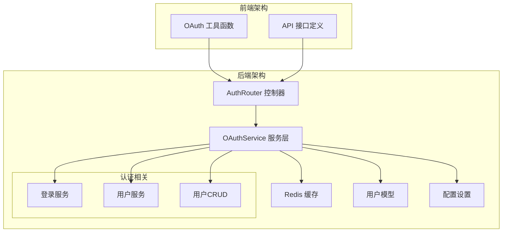
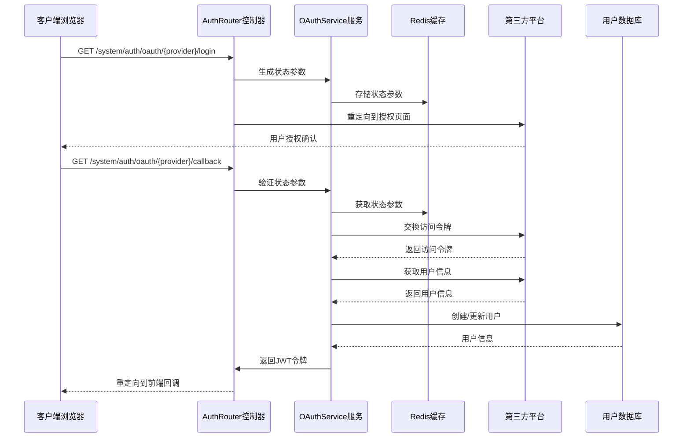
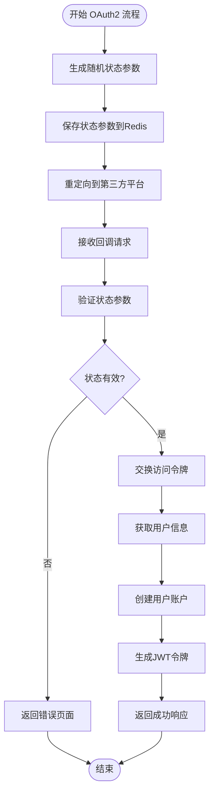
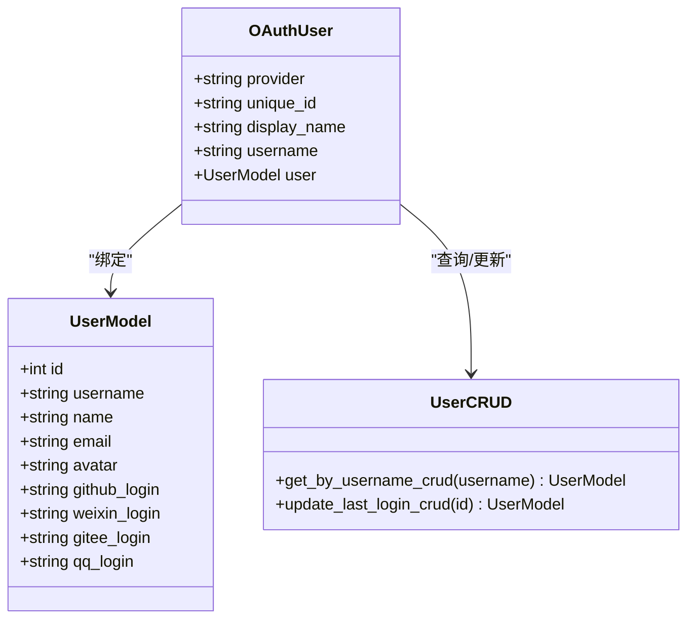
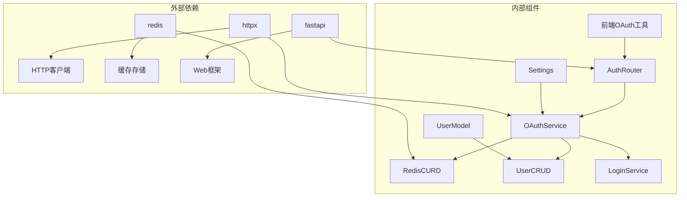

# OAuth2第三方集成

<cite>
**本文档引用的文件**
- [backend/app/api/v1/module_system/auth/oauth_service.py](file://backend/app/api/v1/module_system/auth/oauth_service.py)
- [backend/app/api/v1/module_system/auth/controller.py](file://backend/app/api/v1/module_system/auth/controller.py)
- [backend/app/config/setting.py](file://backend/app/config/setting.py)
- [backend/app/api/v1/module_system/user/model.py](file://backend/app/api/v1/module_system/user/model.py)
- [backend/app/core/redis_crud.py](file://backend/app/core/redis_crud.py)
- [backend/app/api/v1/module_system/auth/service.py](file://backend/app/api/v1/module_system/auth/service.py)
- [frontend/web/src/utils/oauth/index.ts](file://frontend/web/src/utils/oauth/index.ts)
- [frontend/web/src/api/module_system/auth.ts](file://frontend/web/src/api/module_system/auth.ts)
</cite>

## 目录
1. [简介](#简介)
2. [项目结构](#项目结构)
3. [核心组件](#核心组件)
4. [架构概览](#架构概览)
5. [详细组件分析](#详细组件分析)
6. [依赖关系分析](#依赖关系分析)
7. [性能考虑](#性能考虑)
8. [故障排除指南](#故障排除指南)
9. [结论](#结论)

## 简介

FastapiAdmin 提供了完整的 OAuth2 第三方认证集成解决方案，支持微信、GitHub、Gitee、QQ 四大主流平台。该系统采用标准的 OAuth2 授权码流程，通过 Redis 缓存状态参数，确保授权过程的安全性和可靠性。

系统的核心特性包括：
- 标准 OAuth2 授权码流程实现
- 状态参数保护机制
- 自动用户注册和绑定
- 完整的错误处理和回调机制
- 支持多种第三方平台的差异化处理

## 项目结构

OAuth2 集成功能主要分布在以下目录结构中：

**图表来源**
- [backend/app/api/v1/module_system/auth/controller.py:254-348](file://backend/app/api/v1/module_system/auth/controller.py#L254-L348)
- [backend/app/api/v1/module_system/auth/oauth_service.py:1-438](file://backend/app/api/v1/module_system/auth/oauth_service.py#L1-L438)

**章节来源**
- [backend/app/api/v1/module_system/auth/controller.py:1-349](file://backend/app/api/v1/module_system/auth/controller.py#L1-L349)
- [backend/app/api/v1/module_system/auth/oauth_service.py:1-438](file://backend/app/api/v1/module_system/auth/oauth_service.py#L1-L438)

## 核心组件

### OAuth2 服务层

OAuthService 是整个 OAuth2 集成的核心，负责处理所有第三方平台的认证逻辑。

**关键特性：**
- **状态管理**：使用 Redis 存储 OAuth 状态参数，防止 CSRF 攻击
- **平台适配**：针对不同平台提供差异化的认证流程
- **用户管理**：自动创建 OAuth 用户账户并进行绑定
- **令牌处理**：统一的 JWT 令牌生成和管理

**章节来源**
- [backend/app/api/v1/module_system/auth/oauth_service.py:35-437](file://backend/app/api/v1/module_system/auth/oauth_service.py#L35-L437)

### 控制器层

AuthRouter 提供了 RESTful API 接口，处理 OAuth2 流程中的各个阶段。

**核心接口：**
- `/oauth/{provider}/login` - 发起 OAuth2 授权
- `/oauth/{provider}/callback` - 处理第三方平台回调

**章节来源**
- [backend/app/api/v1/module_system/auth/controller.py:254-348](file://backend/app/api/v1/module_system/auth/controller.py#L254-L348)

### 配置管理

系统通过 Settings 类集中管理所有 OAuth2 相关的配置参数。

**配置项：**
- OAuth 默认角色 ID 列表
- 前端回调地址
- 各平台的客户端 ID 和密钥
- HTTP 请求超时设置

**章节来源**
- [backend/app/config/setting.py:124-138](file://backend/app/config/setting.py#L124-L138)

## 架构概览

OAuth2 集成采用分层架构设计，确保代码的可维护性和扩展性。

**图表来源**
- [backend/app/api/v1/module_system/auth/controller.py:259-348](file://backend/app/api/v1/module_system/auth/controller.py#L259-L348)
- [backend/app/api/v1/module_system/auth/oauth_service.py:335-393](file://backend/app/api/v1/module_system/auth/oauth_service.py#L335-L393)

## 详细组件分析

### 状态参数保护机制

系统实现了严格的状态参数保护机制，防止 CSRF 攻击和状态篡改。

**图表来源**
- [backend/app/api/v1/module_system/auth/oauth_service.py:396-411](file://backend/app/api/v1/module_system/auth/oauth_service.py#L396-L411)
- [backend/app/api/v1/module_system/auth/controller.py:313-325](file://backend/app/api/v1/module_system/auth/controller.py#L313-L325)

**章节来源**
- [backend/app/api/v1/module_system/auth/oauth_service.py:344-352](file://backend/app/api/v1/module_system/auth/oauth_service.py#L344-L352)
- [backend/app/api/v1/module_system/auth/oauth_service.py:404-410](file://backend/app/api/v1/module_system/auth/oauth_service.py#L404-L410)

### 平台特定实现

#### GitHub OAuth2 实现

GitHub 使用标准的 OAuth2 授权码流程，支持用户邮箱信息获取。

**关键流程：**
1. 构造授权 URL，包含 `user:email` 作用域
2. 交换访问令牌时使用 JSON 响应格式
3. 获取用户信息后自动解析邮箱地址

**章节来源**
- [backend/app/api/v1/module_system/auth/oauth_service.py:90-97](file://backend/app/api/v1/module_system/auth/oauth_service.py#L90-L97)
- [backend/app/api/v1/module_system/auth/oauth_service.py:152-169](file://backend/app/api/v1/module_system/auth/oauth_service.py#L152-L169)
- [backend/app/api/v1/module_system/auth/oauth_service.py:238-252](file://backend/app/api/v1/module_system/auth/oauth_service.py#L238-L252)

#### 微信 OAuth2 实现

微信采用二维码扫描登录方式，使用 `snsapi_login` 作用域。

**关键特性：**
- 使用 `qrconnect` 授权端点
- 返回 `access_token` 和 `openid`
- 通过 unionid 或 openid 作为唯一标识

**章节来源**
- [backend/app/api/v1/module_system/auth/oauth_service.py:108-116](file://backend/app/api/v1/module_system/auth/oauth_service.py#L108-L116)
- [backend/app/api/v1/module_system/auth/oauth_service.py:191-207](file://backend/app/api/v1/module_system/auth/oauth_service.py#L191-L207)
- [backend/app/api/v1/module_system/auth/oauth_service.py:269-277](file://backend/app/api/v1/module_system/auth/oauth_service.py#L269-L277)

#### Gitee OAuth2 实现

Gitee 支持标准的 OAuth2 授权码流程，提供用户基本信息。

**实现特点：**
- 使用 `authorization_code` 授权类型
- 直接获取用户基本信息
- 简化的令牌交换流程

**章节来源**
- [backend/app/api/v1/module_system/auth/oauth_service.py:99-106](file://backend/app/api/v1/module_system/auth/oauth_service.py#L99-L106)
- [backend/app/api/v1/module_system/auth/oauth_service.py:172-188](file://backend/app/api/v1/module_system/auth/oauth_service.py#L172-L188)
- [backend/app/api/v1/module_system/auth/oauth_service.py:255-266](file://backend/app/api/v1/module_system/auth/oauth_service.py#L255-L266)

#### QQ OAuth2 实现

QQ OAuth2 流程相对复杂，需要额外的 `me` 接口调用来获取 openid。

**关键步骤：**
1. 交换访问令牌
2. 调用 `/oauth2.0/me` 接口获取 openid
3. 使用 openid 和访问令牌获取用户信息

**章节来源**
- [backend/app/api/v1/module_system/auth/oauth_service.py:118-126](file://backend/app/api/v1/module_system/auth/oauth_service.py#L118-L126)
- [backend/app/api/v1/module_system/auth/oauth_service.py:210-235](file://backend/app/api/v1/module_system/auth/oauth_service.py#L210-L235)
- [backend/app/api/v1/module_system/auth/oauth_service.py:280-294](file://backend/app/api/v1/module_system/auth/oauth_service.py#L280-L294)

### 用户绑定策略

系统实现了智能的用户绑定策略，确保 OAuth 用户能够正确关联到系统用户。

**图表来源**
- [backend/app/api/v1/module_system/auth/oauth_service.py:308-332](file://backend/app/api/v1/module_system/auth/oauth_service.py#L308-L332)
- [backend/app/api/v1/module_system/user/model.py:64-151](file://backend/app/api/v1/module_system/user/model.py#L64-L151)

**章节来源**
- [backend/app/api/v1/module_system/auth/oauth_service.py:297-305](file://backend/app/api/v1/module_system/auth/oauth_service.py#L297-L305)
- [backend/app/api/v1/module_system/auth/oauth_service.py:314-332](file://backend/app/api/v1/module_system/auth/oauth_service.py#L314-L332)

### 前端集成

前端提供了简洁的 OAuth2 集成接口，支持一键触发第三方登录。

**前端实现要点：**
- 自动构建后端 OAuth2 接口 URL
- 处理回调参数和错误状态
- 支持多种 OAuth2 平台

**章节来源**
- [frontend/web/src/utils/oauth/index.ts:6-11](file://frontend/web/src/utils/oauth/index.ts#L6-L11)
- [frontend/web/src/api/module_system/auth.ts:5-6](file://frontend/web/src/api/module_system/auth.ts#L5-L6)

## 依赖关系分析

OAuth2 集成涉及多个组件之间的复杂依赖关系：

**图表来源**
- [backend/app/api/v1/module_system/auth/oauth_service.py:18-33](file://backend/app/api/v1/module_system/auth/oauth_service.py#L18-L33)
- [backend/app/api/v1/module_system/auth/controller.py:5-36](file://backend/app/api/v1/module_system/auth/controller.py#L5-L36)

**章节来源**
- [backend/app/api/v1/module_system/auth/oauth_service.py:18-33](file://backend/app/api/v1/module_system/auth/oauth_service.py#L18-L33)
- [backend/app/core/redis_crud.py:9-15](file://backend/app/core/redis_crud.py#L9-L15)

## 性能考虑

### 缓存优化

系统使用 Redis 作为 OAuth2 状态参数的缓存存储，具有以下优势：

- **低延迟**：Redis 内存存储提供毫秒级响应时间
- **TTL 机制**：自动清理过期状态参数，避免内存泄漏
- **高并发**：支持大量并发的 OAuth2 请求处理

### 异步处理

所有 HTTP 请求都采用异步处理模式：

- **非阻塞 I/O**：使用 httpx.AsyncClient 处理外部 API 调用
- **并发优化**：支持同时处理多个 OAuth2 平台的请求
- **资源管理**：自动管理 HTTP 连接池和资源释放

### 错误处理优化

系统实现了多层次的错误处理机制：

- **参数验证**：在请求进入业务逻辑前进行参数验证
- **异常捕获**：统一捕获和处理各种异常情况
- **降级策略**：在网络异常时提供合理的降级处理

## 故障排除指南

### 常见问题及解决方案

**问题1：OAuth2 状态参数失效**
- **症状**：回调时提示状态已失效
- **原因**：Redis 缓存过期或状态参数被篡改
- **解决方案**：检查 Redis 配置和 TTL 设置，确保网络连接稳定

**问题2：第三方平台认证失败**
- **症状**：无法从第三方平台获取访问令牌
- **原因**：客户端 ID/密钥配置错误或网络问题
- **解决方案**：验证配置参数，检查第三方平台状态

**问题3：用户注册失败**
- **症状**：OAuth 用户无法创建或绑定
- **原因**：数据库连接问题或用户名冲突
- **解决方案**：检查数据库配置，验证用户名唯一性

**章节来源**
- [backend/app/api/v1/module_system/auth/oauth_service.py:344-352](file://backend/app/api/v1/module_system/auth/oauth_service.py#L344-L352)
- [backend/app/api/v1/module_system/auth/oauth_service.py:404-410](file://backend/app/api/v1/module_system/auth/oauth_service.py#L404-L410)

### 调试建议

1. **启用详细日志**：检查系统日志中 OAuth2 相关的错误信息
2. **验证配置**：确认所有 OAuth2 相关的环境变量已正确设置
3. **测试网络**：验证应用服务器能够正常访问第三方平台 API
4. **检查缓存**：确保 Redis 服务正常运行且配置正确

## 结论

FastapiAdmin 的 OAuth2 第三方认证集成提供了完整、安全、易扩展的解决方案。通过标准化的授权码流程、严格的状态参数保护机制、智能的用户绑定策略，系统能够可靠地支持多个主流第三方平台。

**主要优势：**
- **安全性**：完整的 CSRF 保护和状态参数验证
- **可扩展性**：模块化的架构设计，易于添加新平台
- **可靠性**：完善的错误处理和降级机制
- **易用性**：简洁的前端集成接口

**未来改进方向：**
- 支持更多 OAuth2 平台
- 增强用户信息同步机制
- 优化性能监控和告警
- 提供更详细的使用文档和示例

该 OAuth2 集成方案为开发者提供了坚实的基础，可以在此基础上构建更加复杂的认证和授权功能。