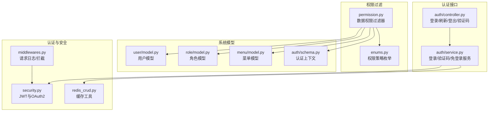
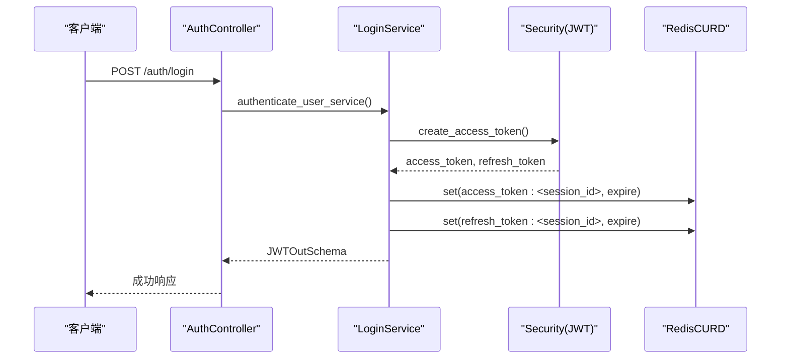
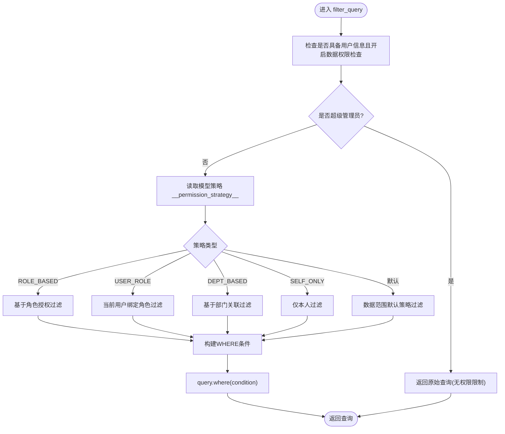
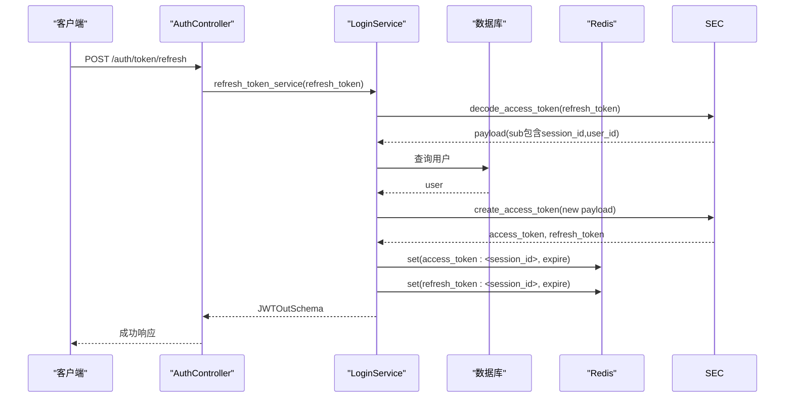
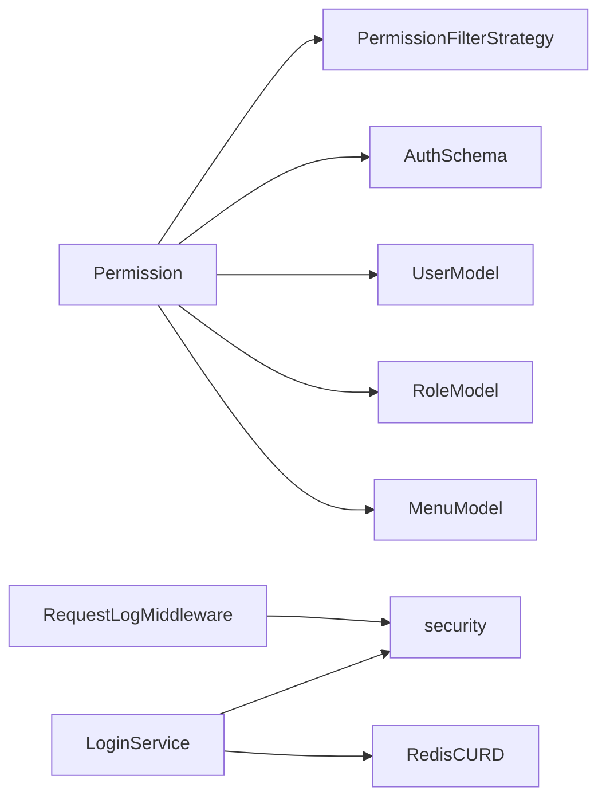

# RBAC权限控制

<cite>
**本文档引用的文件**
- [backend/app/core/permission.py](file://backend/app/core/permission.py)
- [backend/app/core/security.py](file://backend/app/core/security.py)
- [backend/app/common/enums.py](file://backend/app/common/enums.py)
- [backend/app/api/v1/module_system/auth/schema.py](file://backend/app/api/v1/module_system/auth/schema.py)
- [backend/app/api/v1/module_system/user/model.py](file://backend/app/api/v1/module_system/user/model.py)
- [backend/app/api/v1/module_system/role/model.py](file://backend/app/api/v1/module_system/role/model.py)
- [backend/app/api/v1/module_system/menu/model.py](file://backend/app/api/v1/module_system/menu/model.py)
- [backend/app/api/v1/module_system/auth/controller.py](file://backend/app/api/v1/module_system/auth/controller.py)
- [backend/app/api/v1/module_system/auth/service.py](file://backend/app/api/v1/module_system/auth/service.py)
- [backend/app/core/middlewares.py](file://backend/app/core/middlewares.py)
- [backend/app/core/redis_crud.py](file://backend/app/core/redis_crud.py)
</cite>

## 目录
1. [简介](#简介)
2. [项目结构](#项目结构)
3. [核心组件](#核心组件)
4. [架构总览](#架构总览)
5. [详细组件分析](#详细组件分析)
6. [依赖分析](#依赖分析)
7. [性能考虑](#性能考虑)
8. [故障排查指南](#故障排查指南)
9. [结论](#结论)
10. [附录](#附录)

## 简介
本文件面向RBAC（基于角色的访问控制）权限控制系统，系统性阐述用户、角色、权限与资源之间的映射关系，深入说明权限继承、权限组合与权限检查机制，并覆盖菜单权限、接口权限与数据权限的实现方式。同时提供权限配置、角色分配与权限验证的完整流程，以及权限缓存策略、性能优化与安全审计建议，最后给出扩展与自定义指南。

## 项目结构
RBAC相关能力主要分布在后端模块：
- 认证与安全：token签发、解析、中间件
- 权限过滤：数据权限策略与SQL过滤
- 模型层：用户、角色、菜单、部门等RBAC实体
- 控制器与服务：登录、刷新、登出、验证码、免登录等

**图表来源**
- [backend/app/core/security.py:1-149](file://backend/app/core/security.py#L1-L149)
- [backend/app/core/middlewares.py:1-215](file://backend/app/core/middlewares.py#L1-L215)
- [backend/app/core/redis_crud.py:1-343](file://backend/app/core/redis_crud.py#L1-L343)
- [backend/app/core/permission.py:1-311](file://backend/app/core/permission.py#L1-L311)
- [backend/app/common/enums.py:111-122](file://backend/app/common/enums.py#L111-L122)
- [backend/app/api/v1/module_system/auth/schema.py:9-17](file://backend/app/api/v1/module_system/auth/schema.py#L9-L17)
- [backend/app/api/v1/module_system/user/model.py:64-151](file://backend/app/api/v1/module_system/user/model.py#L64-L151)
- [backend/app/api/v1/module_system/role/model.py:64-100](file://backend/app/api/v1/module_system/role/model.py#L64-L100)
- [backend/app/api/v1/module_system/menu/model.py:13-103](file://backend/app/api/v1/module_system/menu/model.py#L13-L103)
- [backend/app/api/v1/module_system/auth/controller.py:1-349](file://backend/app/api/v1/module_system/auth/controller.py#L1-L349)
- [backend/app/api/v1/module_system/auth/service.py:1-576](file://backend/app/api/v1/module_system/auth/service.py#L1-L576)

**章节来源**
- [backend/app/core/security.py:1-149](file://backend/app/core/security.py#L1-L149)
- [backend/app/core/middlewares.py:1-215](file://backend/app/core/middlewares.py#L1-L215)
- [backend/app/core/redis_crud.py:1-343](file://backend/app/core/redis_crud.py#L1-L343)
- [backend/app/core/permission.py:1-311](file://backend/app/core/permission.py#L1-L311)
- [backend/app/common/enums.py:111-122](file://backend/app/common/enums.py#L111-L122)
- [backend/app/api/v1/module_system/auth/schema.py:9-17](file://backend/app/api/v1/module_system/auth/schema.py#L9-L17)
- [backend/app/api/v1/module_system/user/model.py:64-151](file://backend/app/api/v1/module_system/user/model.py#L64-L151)
- [backend/app/api/v1/module_system/role/model.py:64-100](file://backend/app/api/v1/module_system/role/model.py#L64-L100)
- [backend/app/api/v1/module_system/menu/model.py:13-103](file://backend/app/api/v1/module_system/menu/model.py#L13-L103)
- [backend/app/api/v1/module_system/auth/controller.py:1-349](file://backend/app/api/v1/module_system/auth/controller.py#L1-L349)
- [backend/app/api/v1/module_system/auth/service.py:1-576](file://backend/app/api/v1/module_system/auth/service.py#L1-L576)

## 核心组件
- 权限过滤器（Permission）：按策略对SQL查询追加WHERE条件，实现数据权限隔离
- 权限策略枚举（PermissionFilterStrategy）：定义不同过滤策略（默认/基于角色/基于部门/仅本人/当前用户绑定角色）
- 认证上下文（AuthSchema）：封装当前用户、数据权限检查开关与数据库会话
- 安全工具（security.py）：JWT签发/解析、自定义OAuth2认证
- 中间件（middlewares.py）：请求日志、演示模式拦截、安全审计
- 缓存工具（redis_crud.py）：统一的Redis读写、分布式锁、过期管理
- 模型层（user/role/menu）：用户-角色-菜单-部门的多对多关系与权限字段

**章节来源**
- [backend/app/core/permission.py:13-86](file://backend/app/core/permission.py#L13-L86)
- [backend/app/common/enums.py:111-122](file://backend/app/common/enums.py#L111-L122)
- [backend/app/api/v1/module_system/auth/schema.py:9-17](file://backend/app/api/v1/module_system/auth/schema.py#L9-L17)
- [backend/app/core/security.py:98-149](file://backend/app/core/security.py#L98-L149)
- [backend/app/core/middlewares.py:36-200](file://backend/app/core/middlewares.py#L36-L200)
- [backend/app/core/redis_crud.py:9-343](file://backend/app/core/redis_crud.py#L9-L343)
- [backend/app/api/v1/module_system/user/model.py:64-151](file://backend/app/api/v1/module_system/user/model.py#L64-L151)
- [backend/app/api/v1/module_system/role/model.py:64-100](file://backend/app/api/v1/module_system/role/model.py#L64-L100)
- [backend/app/api/v1/module_system/menu/model.py:13-103](file://backend/app/api/v1/module_system/menu/model.py#L13-L103)

## 架构总览
RBAC权限控制由“认证-授权-数据过滤-审计”四层构成：
- 认证层：登录/刷新/登出，JWT与Redis会话管理
- 授权层：菜单权限（角色-菜单）、接口权限（权限标识）、数据权限（策略过滤）
- 数据层：基于策略的SQL过滤，限制可见数据范围
- 审计层：请求日志、拦截与安全审计

**图表来源**
- [backend/app/api/v1/module_system/auth/controller.py:41-78](file://backend/app/api/v1/module_system/auth/controller.py#L41-L78)
- [backend/app/api/v1/module_system/auth/service.py:45-125](file://backend/app/api/v1/module_system/auth/service.py#L45-L125)
- [backend/app/core/security.py:98-149](file://backend/app/core/security.py#L98-L149)
- [backend/app/core/redis_crud.py:69-96](file://backend/app/core/redis_crud.py#L69-L96)

## 详细组件分析

### 权限过滤器（Permission）
- 功能：根据模型的权限策略与用户角色，动态为查询追加WHERE条件，实现数据权限隔离
- 策略选择：依据模型的__permission_strategy__属性，选择对应过滤方法
- 策略类型：
  - 角色授权（菜单）：仅显示用户角色授权的菜单
  - 当前用户绑定角色：仅显示当前用户绑定的角色
  - 基于部门关联：按角色数据范围与部门树计算可访问ID集合
  - 仅本人数据：按创建人字段过滤
  - 默认策略（数据范围）：综合角色数据范围与部门范围，回退至仅本人
- 超级管理员：不受数据权限限制
- SQL构建：使用SQLAlchemy的where与关系has/IN子句，保证过滤条件精确

**图表来源**
- [backend/app/core/permission.py:41-86](file://backend/app/core/permission.py#L41-L86)
- [backend/app/core/permission.py:87-311](file://backend/app/core/permission.py#L87-L311)

**章节来源**
- [backend/app/core/permission.py:13-311](file://backend/app/core/permission.py#L13-L311)
- [backend/app/common/enums.py:111-122](file://backend/app/common/enums.py#L111-L122)
- [backend/app/api/v1/module_system/menu/model.py:27-27](file://backend/app/api/v1/module_system/menu/model.py#L27-L27)
- [backend/app/api/v1/module_system/role/model.py:74-74](file://backend/app/api/v1/module_system/role/model.py#L74-L74)

### 权限策略枚举（PermissionFilterStrategy）
- 定义了五种策略：
  - DATA_SCOPE：默认数据范围策略
  - ROLE_BASED：基于角色授权（菜单）
  - DEPT_BASED：基于部门关联（部门、角色）
  - SELF_ONLY：仅本人数据
  - USER_ROLE：当前用户绑定的角色

**章节来源**
- [backend/app/common/enums.py:111-122](file://backend/app/common/enums.py#L111-L122)

### 认证上下文（AuthSchema）
- 字段：user（当前用户）、check_data_scope（是否检查数据权限）、db（数据库会话）
- 用途：作为Permission构造参数，贯穿数据权限过滤链路

**章节来源**
- [backend/app/api/v1/module_system/auth/schema.py:9-17](file://backend/app/api/v1/module_system/auth/schema.py#L9-L17)

### 安全工具（security.py）
- 自定义OAuth2PasswordBearer：校验Authorization头与TOKEN_TYPE
- JWT工具：create_access_token、decode_access_token，异常统一为401
- 与中间件配合：从Authorization解析session_id，支撑审计日志

**章节来源**
- [backend/app/core/security.py:11-149](file://backend/app/core/security.py#L11-L149)
- [backend/app/core/middlewares.py:44-85](file://backend/app/core/middlewares.py#L44-L85)

### 中间件（middlewares.py）
- RequestLogMiddleware：提取session_id、记录请求/响应、演示模式拦截、白名单/黑名单控制
- 安全审计：拦截非GET请求（演示模式），记录详细日志

**章节来源**
- [backend/app/core/middlewares.py:36-200](file://backend/app/core/middlewares.py#L36-L200)

### 缓存工具（redis_crud.py）
- 提供get/set/mget/delete/keys/exists/ttl/info/db_size/hash_set/hash_get等
- 分布式锁：lock/unlock/unlock_simple/renew_lock，采用Lua脚本保证原子性
- 令牌与会话：LoginService使用Redis存储access_token/refresh_token与在线会话

**章节来源**
- [backend/app/core/redis_crud.py:9-343](file://backend/app/core/redis_crud.py#L9-L343)
- [backend/app/api/v1/module_system/auth/service.py:203-220](file://backend/app/api/v1/module_system/auth/service.py#L203-L220)

### 模型层（user/role/menu）
- 用户模型：roles/dept/created_by等关系，is_superuser标识
- 角色模型：data_scope（数据范围）、menus/depts/users多对多
- 菜单模型：type/permission等字段，roles多对多

**章节来源**
- [backend/app/api/v1/module_system/user/model.py:64-151](file://backend/app/api/v1/module_system/user/model.py#L64-L151)
- [backend/app/api/v1/module_system/role/model.py:64-100](file://backend/app/api/v1/module_system/role/model.py#L64-L100)
- [backend/app/api/v1/module_system/menu/model.py:13-103](file://backend/app/api/v1/module_system/menu/model.py#L13-L103)

### 认证接口（controller/service）
- 登录：验证码校验、用户校验、JWT签发、Redis写入
- 刷新：解析refresh_token，重建会话并更新Redis
- 登出：解析token，删除Redis中的access/refresh
- 验证码：生成并写入Redis，过期控制
- 免登录：生成一次性Token，使用后立即失效

**图表来源**
- [backend/app/api/v1/module_system/auth/controller.py:80-115](file://backend/app/api/v1/module_system/auth/controller.py#L80-L115)
- [backend/app/api/v1/module_system/auth/service.py:223-307](file://backend/app/api/v1/module_system/auth/service.py#L223-L307)
- [backend/app/core/security.py:116-149](file://backend/app/core/security.py#L116-L149)

**章节来源**
- [backend/app/api/v1/module_system/auth/controller.py:1-349](file://backend/app/api/v1/module_system/auth/controller.py#L1-L349)
- [backend/app/api/v1/module_system/auth/service.py:1-576](file://backend/app/api/v1/module_system/auth/service.py#L1-L576)

## 依赖分析
- 权限过滤器依赖：
  - 模型策略枚举（策略选择）
  - 认证上下文（用户、数据权限开关、数据库会话）
  - 用户/角色/菜单/部门模型（关系与字段）
- 安全与中间件：
  - security与middlewares相互配合，前者负责JWT，后者负责日志与拦截
- 缓存：
  - LoginService大量使用RedisCURD进行令牌与在线会话管理

**图表来源**
- [backend/app/core/permission.py:1-311](file://backend/app/core/permission.py#L1-L311)
- [backend/app/common/enums.py:111-122](file://backend/app/common/enums.py#L111-L122)
- [backend/app/api/v1/module_system/auth/schema.py:9-17](file://backend/app/api/v1/module_system/auth/schema.py#L9-L17)
- [backend/app/api/v1/module_system/user/model.py:64-151](file://backend/app/api/v1/module_system/user/model.py#L64-L151)
- [backend/app/api/v1/module_system/role/model.py:64-100](file://backend/app/api/v1/module_system/role/model.py#L64-L100)
- [backend/app/api/v1/module_system/menu/model.py:13-103](file://backend/app/api/v1/module_system/menu/model.py#L13-L103)
- [backend/app/api/v1/module_system/auth/service.py:1-576](file://backend/app/api/v1/module_system/auth/service.py#L1-L576)
- [backend/app/core/security.py:1-149](file://backend/app/core/security.py#L1-L149)
- [backend/app/core/middlewares.py:1-215](file://backend/app/core/middlewares.py#L1-L215)
- [backend/app/core/redis_crud.py:1-343](file://backend/app/core/redis_crud.py#L1-L343)

**章节来源**
- [backend/app/core/permission.py:1-311](file://backend/app/core/permission.py#L1-L311)
- [backend/app/api/v1/module_system/auth/service.py:1-576](file://backend/app/api/v1/module_system/auth/service.py#L1-L576)
- [backend/app/core/security.py:1-149](file://backend/app/core/security.py#L1-L149)
- [backend/app/core/middlewares.py:1-215](file://backend/app/core/middlewares.py#L1-L215)
- [backend/app/core/redis_crud.py:1-343](file://backend/app/core/redis_crud.py#L1-L343)

## 性能考虑
- 查询过滤：
  - 使用SQLAlchemy关系has/in子句，避免在Python侧做全量数据筛选
  - 对部门树计算采用一次查询+内存映射，减少多次DB往返
- 缓存策略：
  - access_token/refresh_token以session_id为键，过期时间与JWT一致
  - 验证码、系统配置等使用合理TTL，降低Redis压力
- 中间件：
  - 日志与拦截仅在必要路径执行，避免对高频GET请求造成额外开销
- 建议：
  - 对热点菜单/角色/部门数据可引入本地缓存或Redis预热
  - 批量查询时结合mget与hash_set提升效率
  - 对复杂权限组合场景，考虑将常用权限集合持久化到Redis并设置短TTL

[本节为通用性能指导，无需特定文件引用]

## 故障排查指南
- 认证失败（401）：
  - 检查Authorization头与TOKEN_TYPE是否匹配
  - 核对JWT签名、算法与过期时间
  - 参考：[backend/app/core/security.py:43-49](file://backend/app/core/security.py#L43-L49)、[backend/app/core/security.py:132-149](file://backend/app/core/security.py#L132-L149)
- 登录/刷新/登出异常：
  - 确认Redis可用且键空间正确
  - 检查会话ID解析与payload.sub结构
  - 参考：[backend/app/api/v1/module_system/auth/service.py:203-220](file://backend/app/api/v1/module_system/auth/service.py#L203-L220)、[backend/app/api/v1/module_system/auth/service.py:310-337](file://backend/app/api/v1/module_system/auth/service.py#L310-L337)
- 数据权限未生效：
  - 确认模型__permission_strategy__设置正确
  - 检查用户角色与数据范围（data_scope）配置
  - 参考：[backend/app/core/permission.py:76-85](file://backend/app/core/permission.py#L76-L85)、[backend/app/api/v1/module_system/role/model.py:81-86](file://backend/app/api/v1/module_system/role/model.py#L81-L86)
- 拦截与审计：
  - 演示模式下非GET请求被拦截，检查白名单/黑名单与IP
  - 参考：[backend/app/core/middlewares.py:150-185](file://backend/app/core/middlewares.py#L150-L185)

**章节来源**
- [backend/app/core/security.py:43-49](file://backend/app/core/security.py#L43-L49)
- [backend/app/core/security.py:132-149](file://backend/app/core/security.py#L132-L149)
- [backend/app/api/v1/module_system/auth/service.py:203-220](file://backend/app/api/v1/module_system/auth/service.py#L203-L220)
- [backend/app/api/v1/module_system/auth/service.py:310-337](file://backend/app/api/v1/module_system/auth/service.py#L310-L337)
- [backend/app/core/permission.py:76-85](file://backend/app/core/permission.py#L76-L85)
- [backend/app/api/v1/module_system/role/model.py:81-86](file://backend/app/api/v1/module_system/role/model.py#L81-L86)
- [backend/app/core/middlewares.py:150-185](file://backend/app/core/middlewares.py#L150-L185)

## 结论
该RBAC系统通过“策略驱动的权限过滤器+JWT+Redis”的组合，实现了菜单权限、接口权限与数据权限的统一治理。认证与中间件保障了安全性与可观测性，缓存工具提供了高并发下的低延迟体验。通过合理的策略配置与扩展点，可在不破坏整体架构的前提下灵活定制权限规则。

[本节为总结，无需特定文件引用]

## 附录

### 权限配置与角色分配流程
- 角色配置：设置data_scope（1-5），必要时配置自定义部门集合
- 菜单配置：设置type与permission标识，绑定角色
- 用户配置：分配角色，设置部门与是否超管
- 策略选择：在模型上设置__permission_strategy__，决定过滤方式

**章节来源**
- [backend/app/api/v1/module_system/role/model.py:81-86](file://backend/app/api/v1/module_system/role/model.py#L81-L86)
- [backend/app/api/v1/module_system/menu/model.py:30-40](file://backend/app/api/v1/module_system/menu/model.py#L30-L40)
- [backend/app/api/v1/module_system/user/model.py:126-131](file://backend/app/api/v1/module_system/user/model.py#L126-L131)
- [backend/app/core/permission.py:76-85](file://backend/app/core/permission.py#L76-L85)

### 权限检查机制（菜单/接口/数据）
- 菜单权限：基于角色-菜单多对多，按status过滤启用项
- 接口权限：结合菜单permission标识与用户角色进行校验（控制器层）
- 数据权限：按策略计算可访问ID集合，注入SQL WHERE条件

**章节来源**
- [backend/app/core/permission.py:87-113](file://backend/app/core/permission.py#L87-L113)
- [backend/app/api/v1/module_system/menu/model.py:90-102](file://backend/app/api/v1/module_system/menu/model.py#L90-L102)

### 权限缓存策略与安全审计
- 缓存：access_token/refresh_token以session_id为键，与JWT过期时间一致
- 审计：RequestLogMiddleware记录请求/响应、拦截演示模式非GET请求
- 建议：对热点权限集合做Redis预热，使用分布式锁保护关键写操作

**章节来源**
- [backend/app/api/v1/module_system/auth/service.py:203-220](file://backend/app/api/v1/module_system/auth/service.py#L203-L220)
- [backend/app/core/middlewares.py:150-185](file://backend/app/core/middlewares.py#L150-L185)
- [backend/app/core/redis_crud.py:98-149](file://backend/app/core/redis_crud.py#L98-L149)

### 扩展与自定义指南
- 新增策略：在枚举中新增策略值，在Permission中新增过滤方法
- 新增模型权限：在模型上设置__permission_strategy__，并在需要时提供字段约束
- 自定义过滤：在模型中增加字段（如tenant_id）并扩展Permission的策略分支
- 安全增强：在中间件中加入更多黑白名单与风控策略

**章节来源**
- [backend/app/common/enums.py:111-122](file://backend/app/common/enums.py#L111-L122)
- [backend/app/core/permission.py:54-86](file://backend/app/core/permission.py#L54-L86)