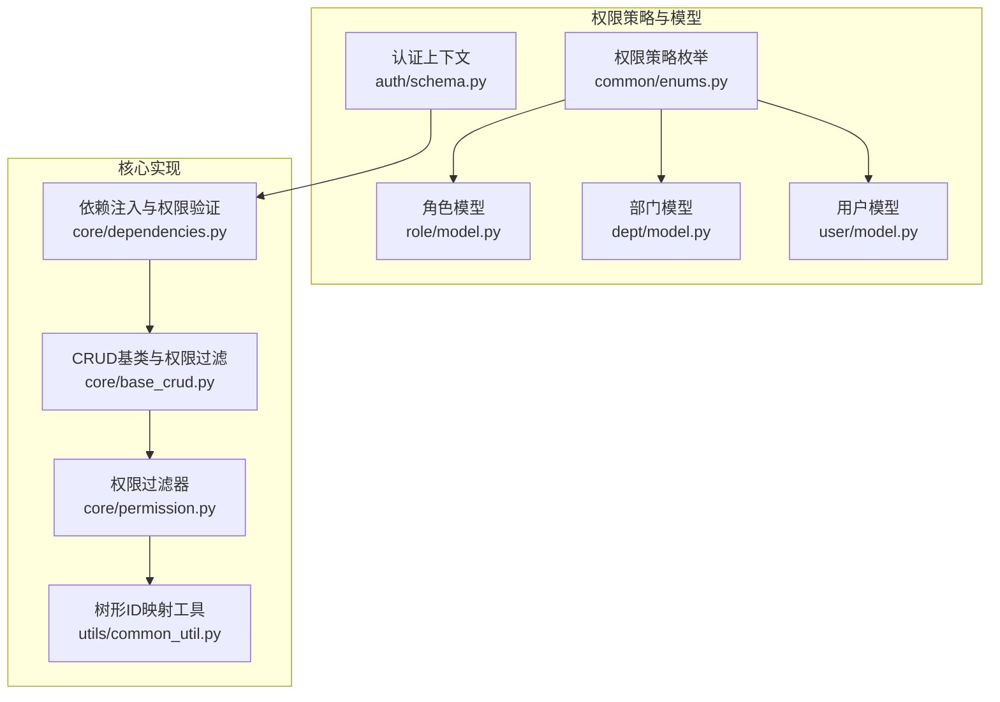
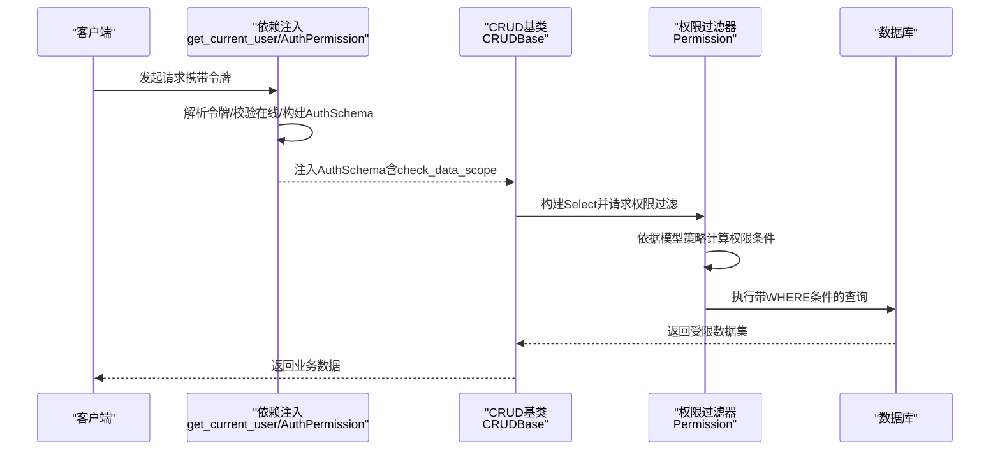
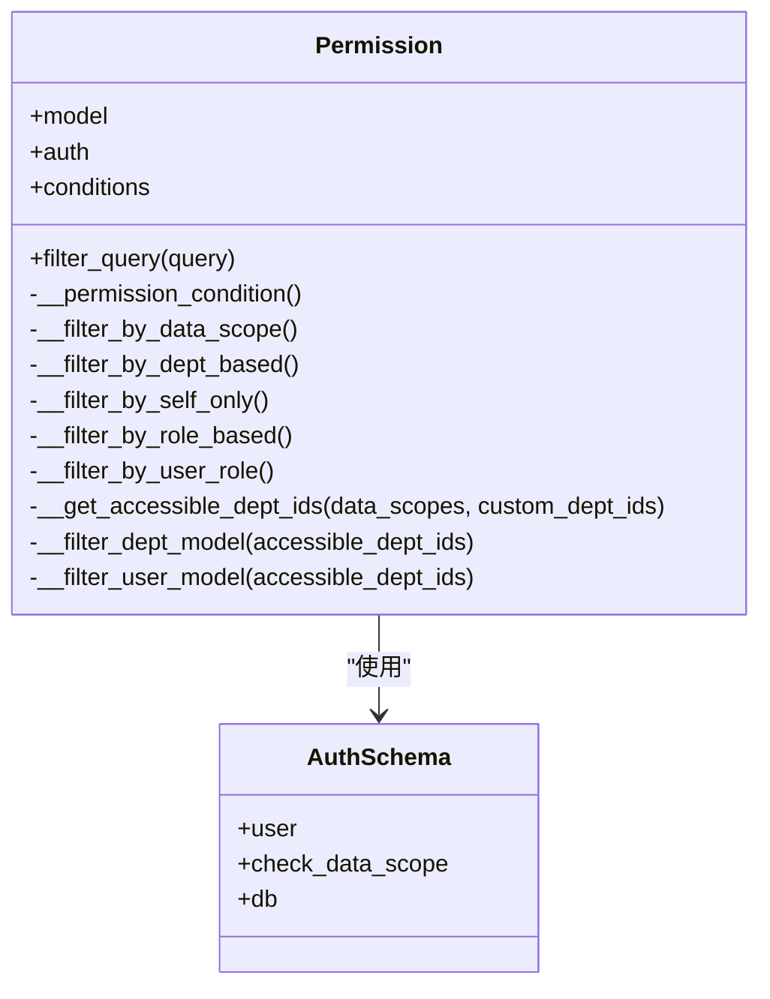
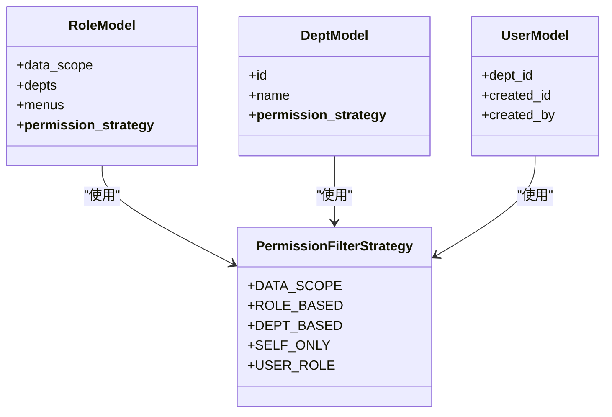
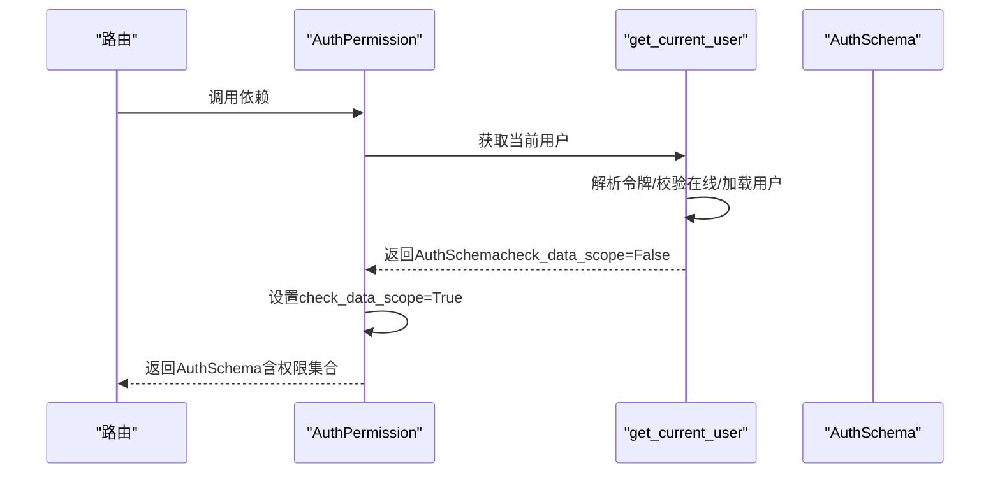
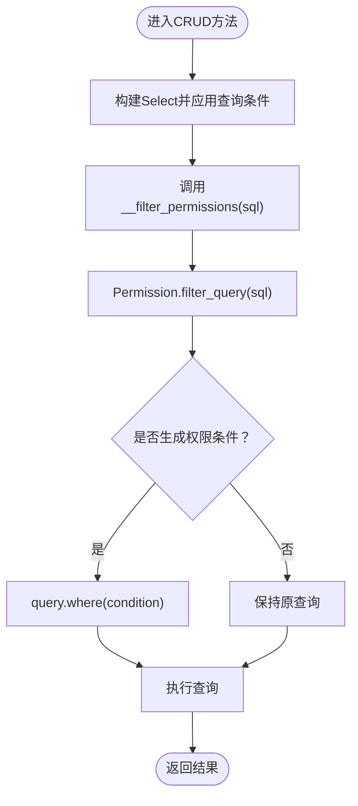
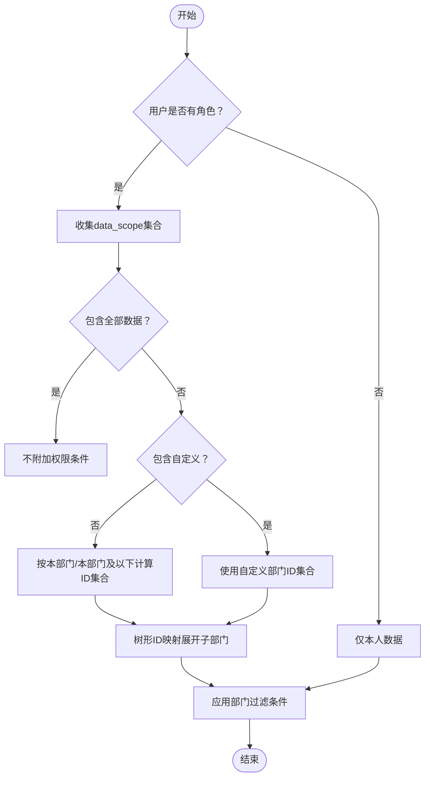
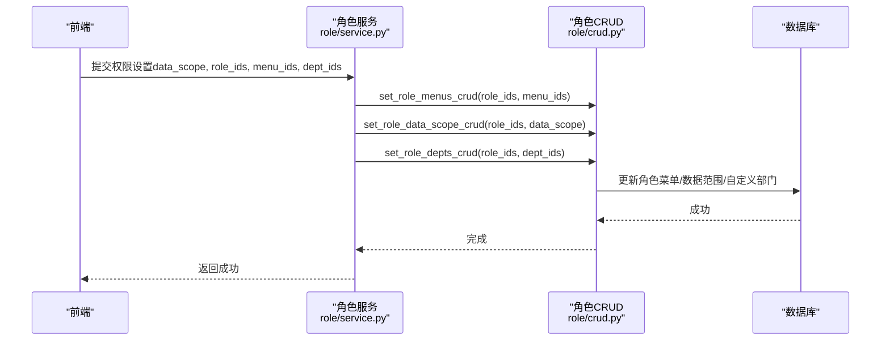
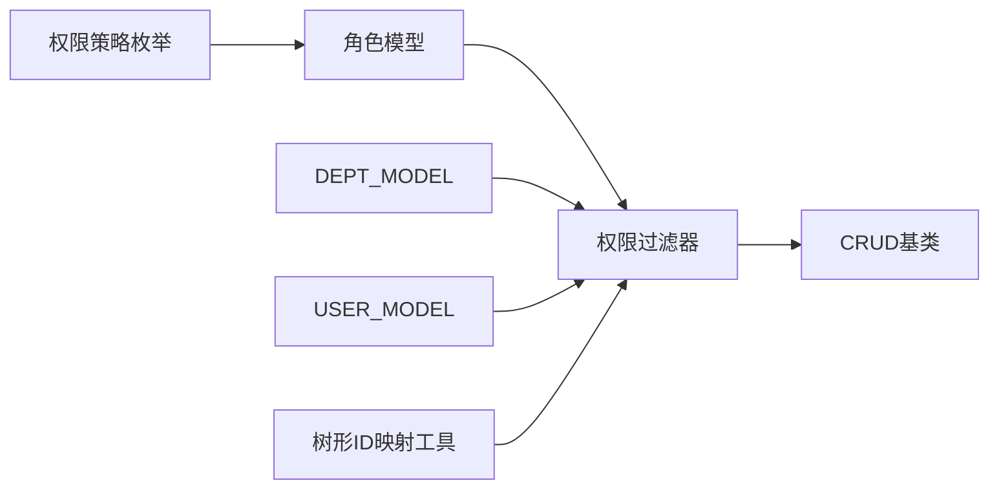

# 数据权限

<cite>
**本文档引用的文件**
- [backend/app/core/permission.py](file://backend/app/core/permission.py)
- [backend/app/core/base_crud.py](file://backend/app/core/base_crud.py)
- [backend/app/core/dependencies.py](file://backend/app/core/dependencies.py)
- [backend/app/api/v1/module_system/auth/schema.py](file://backend/app/api/v1/module_system/auth/schema.py)
- [backend/app/api/v1/module_system/role/model.py](file://backend/app/api/v1/module_system/role/model.py)
- [backend/app/api/v1/module_system/role/crud.py](file://backend/app/api/v1/module_system/role/crud.py)
- [backend/app/api/v1/module_system/role/service.py](file://backend/app/api/v1/module_system/role/service.py)
- [backend/app/api/v1/module_system/dept/model.py](file://backend/app/api/v1/module_system/dept/model.py)
- [backend/app/api/v1/module_system/user/model.py](file://backend/app/api/v1/module_system/user/model.py)
- [backend/app/common/enums.py](file://backend/app/common/enums.py)
- [backend/app/utils/common_util.py](file://backend/app/utils/common_util.py)
</cite>

## 目录
1. [简介](#简介)
2. [项目结构](#项目结构)
3. [核心组件](#核心组件)
4. [架构总览](#架构总览)
5. [详细组件分析](#详细组件分析)
6. [依赖分析](#依赖分析)
7. [性能考量](#性能考量)
8. [故障排查指南](#故障排查指南)
9. [结论](#结论)
10. [附录](#附录)

## 简介
本文件面向“数据权限系统”，系统性阐述数据权限的定义、作用范围与实现机制，覆盖部门数据权限、个人数据权限与自定义数据权限规则；解释SQL条件拼接、数据过滤器与查询重写技术；阐明数据权限与业务数据的关联关系、权限边界设计原则与实现策略；给出完整的配置流程（权限规则设置、权限验证与权限缓存）以及性能优化与安全考虑。

## 项目结构
数据权限能力由后端核心模块协同实现：
- 权限策略与过滤器：位于 core/permission.py
- 权限注入与依赖：位于 core/dependencies.py 与 core/base_crud.py
- 权限模型与策略枚举：位于 api/v1/module_system/* 与 common/enums.py
- 工具函数：位于 utils/common_util.py

**图表来源**
- [backend/app/common/enums.py:111-122](file://backend/app/common/enums.py#L111-L122)
- [backend/app/api/v1/module_system/role/model.py:64-86](file://backend/app/api/v1/module_system/role/model.py#L64-L86)
- [backend/app/api/v1/module_system/dept/model.py:14-31](file://backend/app/api/v1/module_system/dept/model.py#L14-L31)
- [backend/app/api/v1/module_system/user/model.py:64-151](file://backend/app/api/v1/module_system/user/model.py#L64-L151)
- [backend/app/api/v1/module_system/auth/schema.py:9-17](file://backend/app/api/v1/module_system/auth/schema.py#L9-L17)
- [backend/app/core/dependencies.py:236-296](file://backend/app/core/dependencies.py#L236-L296)
- [backend/app/core/base_crud.py:446-451](file://backend/app/core/base_crud.py#L446-L451)
- [backend/app/core/permission.py:13-86](file://backend/app/core/permission.py#L13-L86)
- [backend/app/utils/common_util.py:127-165](file://backend/app/utils/common_util.py#L127-L165)

**章节来源**
- [backend/app/core/permission.py:13-86](file://backend/app/core/permission.py#L13-L86)
- [backend/app/core/base_crud.py:446-451](file://backend/app/core/base_crud.py#L446-L451)
- [backend/app/core/dependencies.py:236-296](file://backend/app/core/dependencies.py#L236-L296)
- [backend/app/api/v1/module_system/auth/schema.py:9-17](file://backend/app/api/v1/module_system/auth/schema.py#L9-L17)
- [backend/app/api/v1/module_system/role/model.py:64-86](file://backend/app/api/v1/module_system/role/model.py#L64-L86)
- [backend/app/api/v1/module_system/dept/model.py:14-31](file://backend/app/api/v1/module_system/dept/model.py#L14-L31)
- [backend/app/api/v1/module_system/user/model.py:64-151](file://backend/app/api/v1/module_system/user/model.py#L64-L151)
- [backend/app/common/enums.py:111-122](file://backend/app/common/enums.py#L111-L122)
- [backend/app/utils/common_util.py:127-165](file://backend/app/utils/common_util.py#L127-L165)

## 核心组件
- 权限过滤器（Permission）：基于模型的权限策略，动态拼接SQL WHERE条件，实现数据范围隔离与自定义权限控制。
- 权限策略枚举（PermissionFilterStrategy）：统一定义“数据范围”“基于角色授权”“基于部门关联”“仅本人数据”“当前用户绑定角色”等策略。
- 依赖注入与权限验证（AuthPermission/get_current_user）：在请求生命周期内解析令牌、校验在线状态、构建AuthSchema并注入check_data_scope。
- CRUD基类（CRUDBase）：在查询构建阶段自动应用权限过滤，保证所有Select均受控。
- 角色与部门模型：通过data_scope与depts等字段承载权限规则，支撑“本部门/本部门及以下/自定义”等策略。

**章节来源**
- [backend/app/core/permission.py:13-86](file://backend/app/core/permission.py#L13-L86)
- [backend/app/common/enums.py:111-122](file://backend/app/common/enums.py#L111-L122)
- [backend/app/core/dependencies.py:236-296](file://backend/app/core/dependencies.py#L236-L296)
- [backend/app/core/base_crud.py:446-451](file://backend/app/core/base_crud.py#L446-L451)
- [backend/app/api/v1/module_system/role/model.py:64-86](file://backend/app/api/v1/module_system/role/model.py#L64-L86)
- [backend/app/api/v1/module_system/dept/model.py:14-31](file://backend/app/api/v1/module_system/dept/model.py#L14-L31)

## 架构总览
数据权限贯穿“认证上下文 → 权限注入 → 查询构建 → 权限过滤 → SQL重写”的链路，形成“查询即受控”的安全边界。

**图表来源**
- [backend/app/core/dependencies.py:44-129](file://backend/app/core/dependencies.py#L44-L129)
- [backend/app/core/dependencies.py:254-296](file://backend/app/core/dependencies.py#L254-L296)
- [backend/app/core/base_crud.py:92-99](file://backend/app/core/base_crud.py#L92-L99)
- [backend/app/core/permission.py:41-52](file://backend/app/core/permission.py#L41-L52)

## 详细组件分析

### 权限过滤器（Permission）
- 策略入口：根据模型的__permission_strategy__选择过滤策略。
- 支持策略：
  - 数据范围（默认）：按created_id与用户角色/部门关系过滤。
  - 基于部门关联：针对DeptModel/UserModel等特殊模型，按dept_id或created_by.dept_id过滤。
  - 仅本人数据：created_id等于当前用户ID。
  - 基于角色授权：限制菜单/角色可见范围。
  - 当前用户绑定角色：仅显示当前用户绑定的角色。
- 条件拼接：通过SQLAlchemy ColumnElement组合，最终以query.where(condition)形式注入。
- 自定义权限：当角色data_scope=5时，结合sys_role_depts表的dept_ids集合，形成精确的可访问部门集合。

**图表来源**
- [backend/app/core/permission.py:13-86](file://backend/app/core/permission.py#L13-L86)
- [backend/app/api/v1/module_system/auth/schema.py:9-17](file://backend/app/api/v1/module_system/auth/schema.py#L9-L17)

**章节来源**
- [backend/app/core/permission.py:41-86](file://backend/app/core/permission.py#L41-L86)
- [backend/app/core/permission.py:183-247](file://backend/app/core/permission.py#L183-L247)
- [backend/app/core/permission.py:249-285](file://backend/app/core/permission.py#L249-L285)
- [backend/app/core/permission.py:287-310](file://backend/app/core/permission.py#L287-L310)

### 权限策略与模型
- 策略枚举：DATA_SCOPE/ROLE_BASED/DEPT_BASED/SELF_ONLY/USER_ROLE。
- 角色模型：包含data_scope字段与depts多对多关联，支撑“自定义部门”策略。
- 部门模型：__permission_strategy__设为DEPT_BASED，便于按部门维度过滤。
- 用户模型：具备dept_id与created_by等关系，支撑“本部门/本部门及以下/仅本人”等策略。

**图表来源**
- [backend/app/api/v1/module_system/role/model.py:64-86](file://backend/app/api/v1/module_system/role/model.py#L64-L86)
- [backend/app/api/v1/module_system/dept/model.py:14-31](file://backend/app/api/v1/module_system/dept/model.py#L14-L31)
- [backend/app/api/v1/module_system/user/model.py:64-151](file://backend/app/api/v1/module_system/user/model.py#L64-L151)
- [backend/app/common/enums.py:111-122](file://backend/app/common/enums.py#L111-L122)

**章节来源**
- [backend/app/api/v1/module_system/role/model.py:64-86](file://backend/app/api/v1/module_system/role/model.py#L64-L86)
- [backend/app/api/v1/module_system/dept/model.py:14-31](file://backend/app/api/v1/module_system/dept/model.py#L14-L31)
- [backend/app/api/v1/module_system/user/model.py:64-151](file://backend/app/api/v1/module_system/user/model.py#L64-L151)
- [backend/app/common/enums.py:111-122](file://backend/app/common/enums.py#L111-L122)

### 依赖注入与权限验证
- get_current_user：解析令牌、校验在线、构建AuthSchema，关闭check_data_scope以避免查询自身时被拦截。
- AuthPermission：在路由层注入，开启check_data_scope，校验用户权限集合与所需权限交集。
- 两者配合确保“查询自身”与“业务查询”在不同阶段分别受控。

**图表来源**
- [backend/app/core/dependencies.py:44-129](file://backend/app/core/dependencies.py#L44-L129)
- [backend/app/core/dependencies.py:254-296](file://backend/app/core/dependencies.py#L254-L296)

**章节来源**
- [backend/app/core/dependencies.py:44-129](file://backend/app/core/dependencies.py#L44-L129)
- [backend/app/core/dependencies.py:254-296](file://backend/app/core/dependencies.py#L254-L296)

### CRUD基类与查询重写
- 在CRUDBase的get/list/tree_list/page等方法中，构建Select后统一调用__filter_permissions(sql)，内部实例化Permission并执行filter_query(sql)。
- 对count查询也应用相同权限过滤，保证分页统计准确。
- 通过selectinload与预加载策略，兼顾性能与关系完整性。

**图表来源**
- [backend/app/core/base_crud.py:92-99](file://backend/app/core/base_crud.py#L92-L99)
- [backend/app/core/base_crud.py:184-198](file://backend/app/core/base_crud.py#L184-L198)
- [backend/app/core/permission.py:41-52](file://backend/app/core/permission.py#L41-L52)

**章节来源**
- [backend/app/core/base_crud.py:92-99](file://backend/app/core/base_crud.py#L92-L99)
- [backend/app/core/base_crud.py:184-198](file://backend/app/core/base_crud.py#L184-L198)
- [backend/app/core/base_crud.py:446-451](file://backend/app/core/base_crud.py#L446-L451)

### 数据权限规则与实现策略
- 仅本人数据：created_id == 当前用户ID。
- 本部门数据：用户dept_id加入可访问集合。
- 本部门及以下数据：通过树形ID映射（get_child_id_map + get_child_recursion）展开子部门ID集合。
- 全部数据：超级管理员或data_scope=4时，不附加权限条件。
- 自定义数据权限：data_scope=5时，使用sys_role_depts关联的dept_ids集合作为可访问集合。

**图表来源**
- [backend/app/core/permission.py:249-285](file://backend/app/core/permission.py#L249-L285)
- [backend/app/utils/common_util.py:127-165](file://backend/app/utils/common_util.py#L127-L165)

**章节来源**
- [backend/app/core/permission.py:249-285](file://backend/app/core/permission.py#L249-L285)
- [backend/app/utils/common_util.py:127-165](file://backend/app/utils/common_util.py#L127-L165)

### 权限配置流程（角色与部门）
- 设置角色数据权限范围：通过service层调用CRUD设置data_scope。
- 设置自定义部门：当data_scope=5时，通过CRUD设置sys_role_depts关联的dept_ids。
- 前端交互：前端提交permissionDataType（包含data_scope、role_ids、menu_ids、dept_ids），后端据此落库。

**图表来源**
- [backend/app/api/v1/module_system/role/service.py:155-180](file://backend/app/api/v1/module_system/role/service.py#L155-L180)
- [backend/app/api/v1/module_system/role/crud.py:98-121](file://backend/app/api/v1/module_system/role/crud.py#L98-L121)

**章节来源**
- [backend/app/api/v1/module_system/role/service.py:155-180](file://backend/app/api/v1/module_system/role/service.py#L155-L180)
- [backend/app/api/v1/module_system/role/crud.py:98-121](file://backend/app/api/v1/module_system/role/crud.py#L98-L121)

## 依赖分析
- 权限策略枚举驱动模型策略选择。
- 角色模型承载data_scope与depts，决定自定义权限范围。
- 权限过滤器依赖用户dept_id、created_id、created_by关系与部门树形映射。
- CRUD基类在查询构建阶段统一注入权限过滤，形成“查询即受控”。

**图表来源**
- [backend/app/common/enums.py:111-122](file://backend/app/common/enums.py#L111-L122)
- [backend/app/api/v1/module_system/role/model.py:64-86](file://backend/app/api/v1/module_system/role/model.py#L64-L86)
- [backend/app/api/v1/module_system/dept/model.py:14-31](file://backend/app/api/v1/module_system/dept/model.py#L14-L31)
- [backend/app/api/v1/module_system/user/model.py:64-151](file://backend/app/api/v1/module_system/user/model.py#L64-L151)
- [backend/app/core/permission.py:13-86](file://backend/app/core/permission.py#L13-L86)
- [backend/app/core/base_crud.py:446-451](file://backend/app/core/base_crud.py#L446-L451)
- [backend/app/utils/common_util.py:127-165](file://backend/app/utils/common_util.py#L127-L165)

**章节来源**
- [backend/app/common/enums.py:111-122](file://backend/app/common/enums.py#L111-L122)
- [backend/app/api/v1/module_system/role/model.py:64-86](file://backend/app/api/v1/module_system/role/model.py#L64-L86)
- [backend/app/api/v1/module_system/dept/model.py:14-31](file://backend/app/api/v1/module_system/dept/model.py#L14-L31)
- [backend/app/api/v1/module_system/user/model.py:64-151](file://backend/app/api/v1/module_system/user/model.py#L64-L151)
- [backend/app/core/permission.py:13-86](file://backend/app/core/permission.py#L13-L86)
- [backend/app/core/base_crud.py:446-451](file://backend/app/core/base_crud.py#L446-L451)
- [backend/app/utils/common_util.py:127-165](file://backend/app/utils/common_util.py#L127-L165)

## 性能考量
- 权限过滤在SQL层面完成，避免在应用层二次过滤带来的内存压力。
- 分页count查询同样应用权限过滤，使用主键计数优化统计性能。
- 预加载策略采用selectinload，兼顾异步场景与关系加载效率。
- 自定义权限通过一次性dept_ids集合参与IN查询，减少多次JOIN成本。

**章节来源**
- [backend/app/core/base_crud.py:186-198](file://backend/app/core/base_crud.py#L186-L198)
- [backend/app/core/base_crud.py:534-571](file://backend/app/core/base_crud.py#L534-L571)
- [backend/app/core/permission.py:265-285](file://backend/app/core/permission.py#L265-L285)

## 故障排查指南
- 无权限操作：检查AuthPermission是否正确注入，以及用户角色的menus权限集合是否包含所需permission。
- 查询结果为空：确认check_data_scope是否开启；检查角色data_scope与depts配置；核对部门树形映射是否正确。
- 自定义权限无效：确认data_scope=5且sys_role_depts已正确写入dept_ids；确认用户角色列表已加载。
- 并发更新导致权限逃逸：CRUD在更新后二次验证对象仍在权限范围内，若失败需提示“对象不存在或无权限访问”。

**章节来源**
- [backend/app/core/dependencies.py:254-296](file://backend/app/core/dependencies.py#L254-L296)
- [backend/app/core/base_crud.py:284-291](file://backend/app/core/base_crud.py#L284-L291)

## 结论
本数据权限体系以“策略模式+SQL层面过滤+依赖注入”为核心，将权限控制下沉至CRUD层，确保所有查询均受控。通过角色模型的data_scope与depts关联，灵活支持部门、个人与自定义权限；借助树形ID映射与预加载策略，兼顾安全性与性能。建议在生产中结合缓存与审计日志进一步强化安全与可观测性。

## 附录
- 权限边界设计原则
  - 最小权限：默认仅本人或限定部门范围。
  - 超级管理员特权：绕过权限过滤。
  - 自定义权限优先：data_scope=5时优先使用depts集合。
  - 并发安全：更新后二次验证，防止权限逃逸。
- 配置要点
  - 角色数据权限范围：1/2/3/4/5。
  - 自定义部门：data_scope=5时配置dept_ids。
  - 菜单授权：通过sys_role_menus关联控制可见范围。
- 安全建议
  - 令牌滑动过期与在线校验。
  - 严格区分“查询自身”与“业务查询”的check_data_scope开关。
  - 审计日志记录关键权限事件。