# 权限检查机制

<cite>
**本文档引用的文件**
- [permission.py](file://backend/app/core/permission.py)
- [dependencies.py](file://backend/app/core/dependencies.py)
- [security.py](file://backend/app/core/security.py)
- [middlewares.py](file://backend/app/core/middlewares.py)
- [enums.py](file://backend/app/common/enums.py)
- [schema.py](file://backend/app/api/v1/module_system/auth/schema.py)
- [service.py](file://backend/app/api/v1/module_system/auth/service.py)
- [common_util.py](file://backend/app/utils/common_util.py)
- [logger.py](file://backend/app/core/logger.py)
- [router_class.py](file://backend/app/core/router_class.py)
- [index.ts](file://frontend/web/src/directives/permission/index.ts)
- [auth.ts](file://frontend/web/src/directives/core/auth.ts)
- [useAuth.ts](file://frontend/web/src/hooks/core/useAuth.ts)
</cite>

## 目录
1. [引言](#引言)
2. [项目结构](#项目结构)
3. [核心组件](#核心组件)
4. [架构概览](#架构概览)
5. [详细组件分析](#详细组件分析)
6. [依赖分析](#依赖分析)
7. [性能考虑](#性能考虑)
8. [故障排除指南](#故障排除指南)
9. [结论](#结论)
10. [附录](#附录)

## 引言

FastapiAdmin 项目采用多层次的权限检查机制，结合后端数据权限过滤、前端界面权限控制和中间件安全防护，构建了完整的权限管理体系。本文档深入解析权限验证的核心算法、实现原理和最佳实践。

## 项目结构

权限检查机制主要分布在以下目录和文件中：

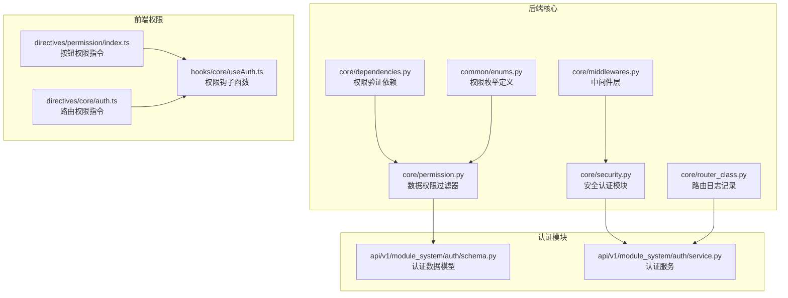

**图表来源**
- [permission.py:1-311](file://backend/app/core/permission.py#L1-L311)
- [dependencies.py:1-296](file://backend/app/core/dependencies.py#L1-L296)
- [security.py:1-149](file://backend/app/core/security.py#L1-L149)

**章节来源**
- [permission.py:1-311](file://backend/app/core/permission.py#L1-L311)
- [dependencies.py:1-296](file://backend/app/core/dependencies.py#L1-L296)
- [enums.py:111-122](file://backend/app/common/enums.py#L111-L122)

## 核心组件

### 权限过滤器类 (Permission)

Permission 类是数据权限过滤的核心实现，采用策略模式设计：

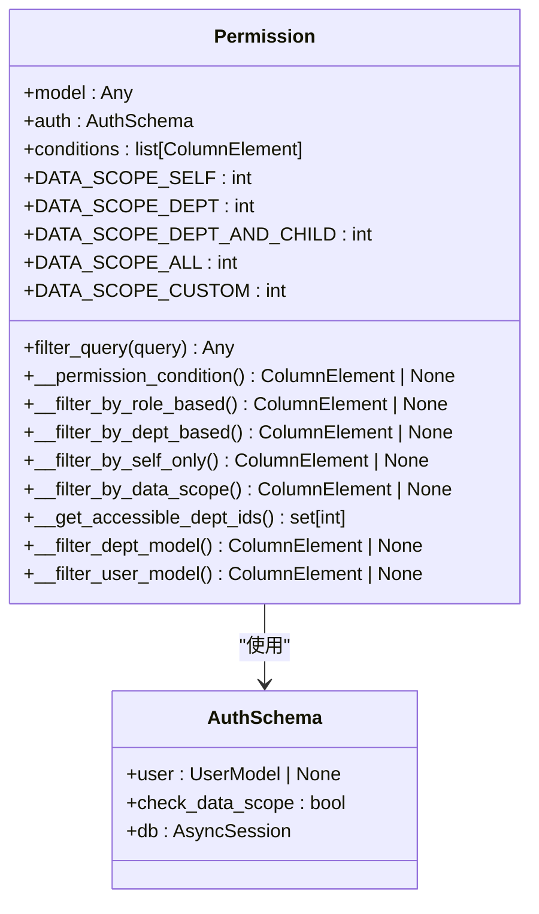

**图表来源**
- [permission.py:13-311](file://backend/app/core/permission.py#L13-L311)
- [schema.py:9-17](file://backend/app/api/v1/module_system/auth/schema.py#L9-L17)

### 权限验证依赖 (AuthPermission)

AuthPermission 类实现了基于角色的权限验证：

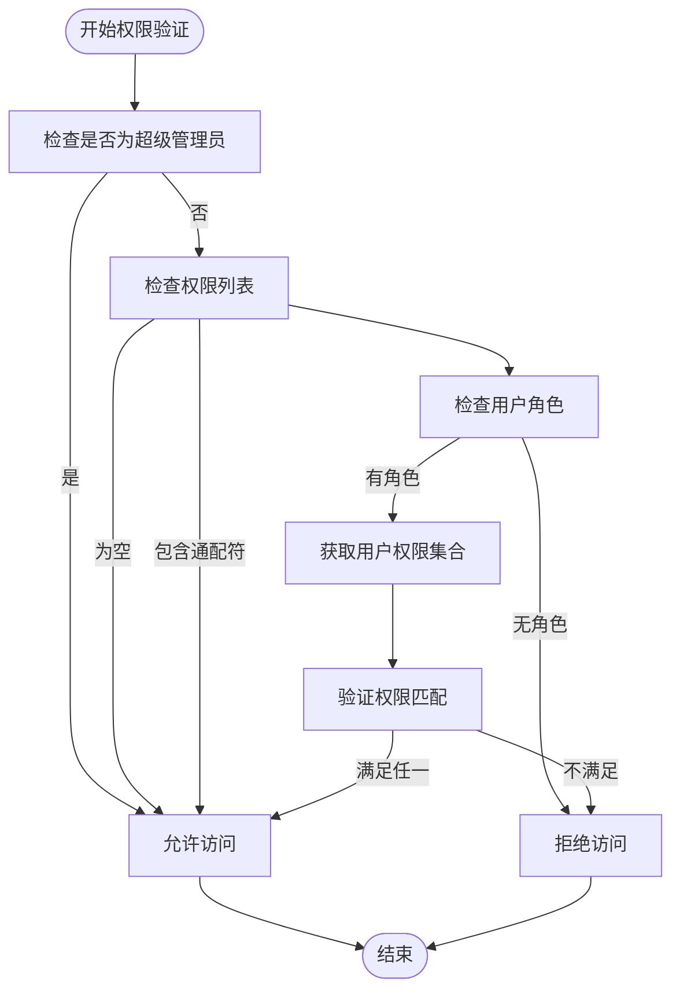

**图表来源**
- [dependencies.py:236-295](file://backend/app/core/dependencies.py#L236-L295)

**章节来源**
- [permission.py:13-311](file://backend/app/core/permission.py#L13-L311)
- [dependencies.py:236-295](file://backend/app/core/dependencies.py#L236-L295)

## 架构概览

权限检查机制采用分层架构设计，确保安全性和可扩展性：

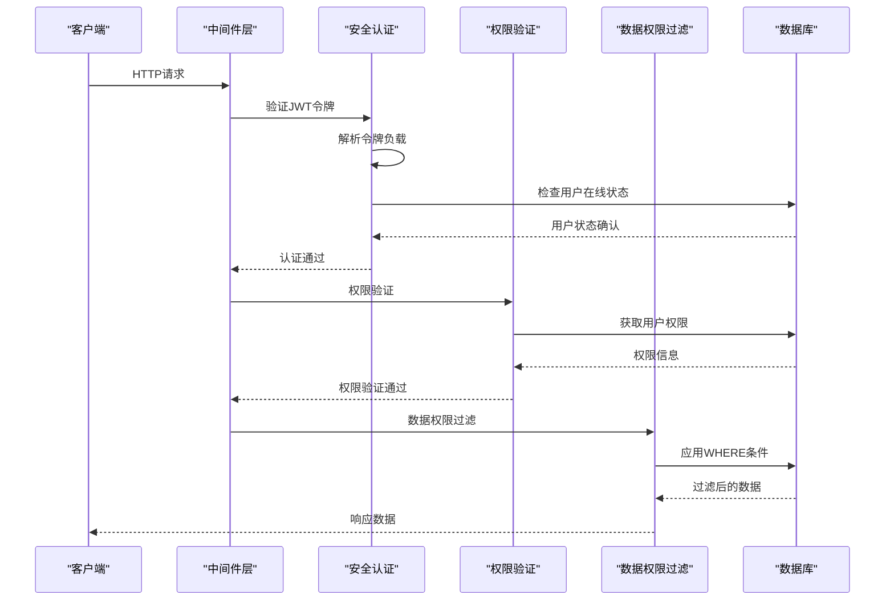

**图表来源**
- [middlewares.py:87-199](file://backend/app/core/middlewares.py#L87-L199)
- [dependencies.py:44-129](file://backend/app/core/dependencies.py#L44-L129)
- [permission.py:41-52](file://backend/app/core/permission.py#L41-L52)

## 详细组件分析

### 权限字符串解析机制

系统支持灵活的权限字符串解析，采用冒号分隔的层级结构：

| 权限层级 | 示例 | 描述 |
|---------|------|------|
| 模块级 | `system` | 系统模块权限 |
| 功能级 | `system:user` | 用户管理功能 |
| 操作级 | `system:user:create` | 用户创建操作 |
| 完整权限 | `system:user:create` | 完整权限标识 |

权限字符串解析流程：

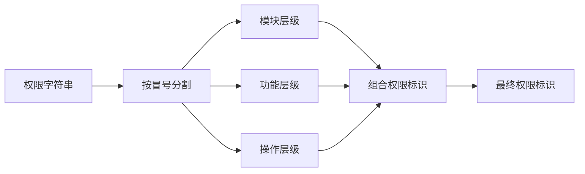

**章节来源**
- [dependencies.py:282-288](file://backend/app/core/dependencies.py#L282-L288)

### 权限匹配规则

系统采用"满足任一权限即可"的匹配策略：

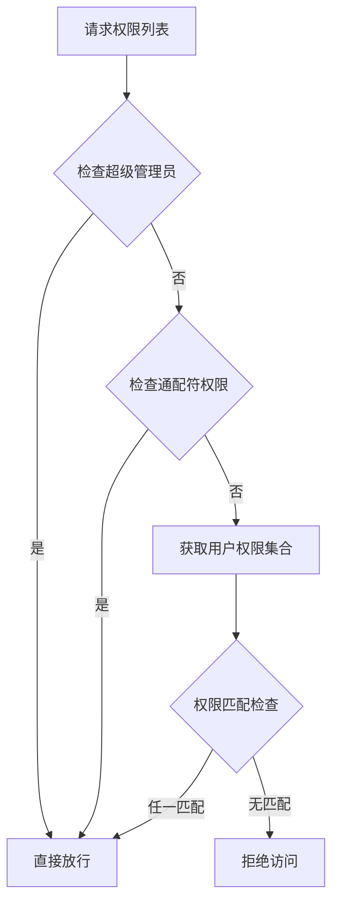

**图表来源**
- [dependencies.py:270-293](file://backend/app/core/dependencies.py#L270-L293)

### 权限组合策略

系统支持多种权限组合策略：

1. **角色权限组合**：用户所有角色的权限并集
2. **菜单权限组合**：基于角色授权的菜单权限
3. **数据权限组合**：基于部门范围的数据访问权限

**章节来源**
- [dependencies.py:282-288](file://backend/app/core/dependencies.py#L282-L288)
- [permission.py:93-113](file://backend/app/core/permission.py#L93-L113)

### 权限中间件工作流程

中间件层提供多层安全防护：

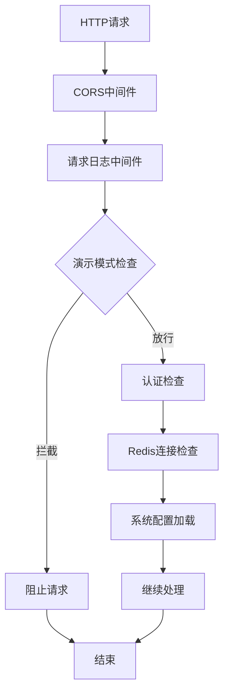

**图表来源**
- [middlewares.py:36-200](file://backend/app/core/middlewares.py#L36-L200)

**章节来源**
- [middlewares.py:36-200](file://backend/app/core/middlewares.py#L36-L200)

### 权限缓存机制

系统采用Redis进行权限相关数据缓存：

| 缓存键类型 | 键格式 | 过期时间 | 存储内容 |
|-----------|--------|----------|----------|
| 访问令牌 | `access_token:{session_id}` | ACCESS_TOKEN_EXPIRE_MINUTES | JWT访问令牌 |
| 刷新令牌 | `refresh_token:{session_id}` | REFRESH_TOKEN_EXPIRE_MINUTES | JWT刷新令牌 |
| 验证码 | `captcha_codes:{key}` | CAPTCHA_EXPIRE_SECONDS | 图片验证码值 |
| 系统配置 | `system_config` | 配置项过期时间 | 系统运行配置 |

**章节来源**
- [service.py:203-220](file://backend/app/api/v1/module_system/auth/service.py#L203-L220)
- [service.py:365-379](file://backend/app/api/v1/module_system/auth/service.py#L365-L379)

### 权限异常处理机制

系统采用统一的异常处理策略：

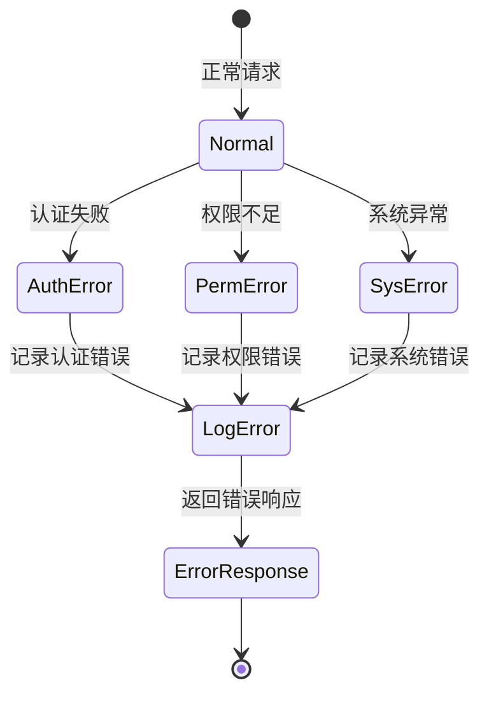

**图表来源**
- [middlewares.py:201-204](file://backend/app/core/middlewares.py#L201-L204)
- [dependencies.py:279-293](file://backend/app/core/dependencies.py#L279-L293)

**章节来源**
- [middlewares.py:201-204](file://backend/app/core/middlewares.py#L201-L204)
- [dependencies.py:279-293](file://backend/app/core/dependencies.py#L279-L293)

### 前端权限控制

前端采用指令驱动的权限控制：

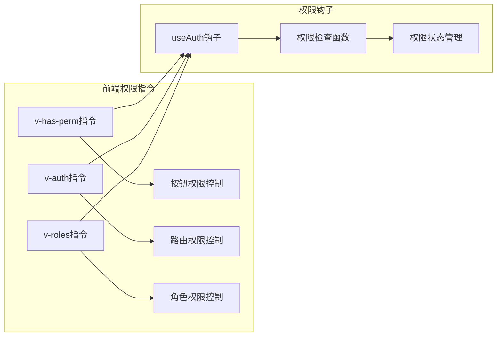

**图表来源**
- [index.ts:9-45](file://frontend/web/src/directives/permission/index.ts#L9-L45)
- [auth.ts:40-51](file://frontend/web/src/directives/core/auth.ts#L40-L51)
- [useAuth.ts:61-81](file://frontend/web/src/hooks/core/useAuth.ts#L61-L81)

**章节来源**
- [index.ts:1-78](file://frontend/web/src/directives/permission/index.ts#L1-L78)
- [auth.ts:1-66](file://frontend/web/src/directives/core/auth.ts#L1-L66)
- [useAuth.ts:1-86](file://frontend/web/src/hooks/core/useAuth.ts#L1-L86)

## 依赖分析

权限检查机制的依赖关系如下：

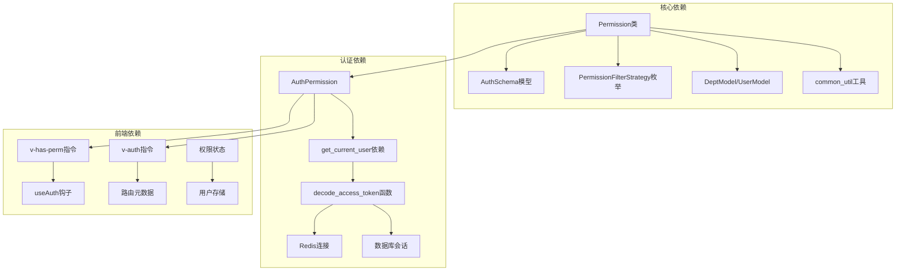

**图表来源**
- [permission.py:6-10](file://backend/app/core/permission.py#L6-L10)
- [dependencies.py:9-18](file://backend/app/core/dependencies.py#L9-L18)
- [enums.py:111-122](file://backend/app/common/enums.py#L111-L122)

**章节来源**
- [permission.py:1-311](file://backend/app/core/permission.py#L1-L311)
- [dependencies.py:1-296](file://backend/app/core/dependencies.py#L1-L296)
- [enums.py:111-122](file://backend/app/common/enums.py#L111-L122)

## 性能考虑

### 查询优化策略

1. **索引优化**：为权限相关字段建立适当索引
2. **批量查询**：减少数据库往返次数
3. **缓存策略**：合理利用Redis缓存热点数据

### 并发处理

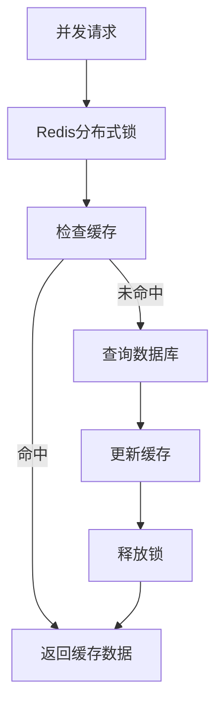

### 性能监控

系统提供详细的性能指标：

- 请求处理时间统计
- Redis命中率监控
- 数据库查询性能分析
- 缓存失效策略优化

## 故障排除指南

### 常见问题诊断

1. **权限验证失败**
   - 检查用户角色配置
   - 验证菜单权限设置
   - 确认数据权限范围

2. **令牌认证错误**
   - 验证JWT签名密钥
   - 检查Redis连接状态
   - 确认令牌过期时间

3. **前端权限显示异常**
   - 检查用户权限状态
   - 验证权限指令使用
   - 确认路由元数据配置

### 日志分析

系统提供多层级日志记录：

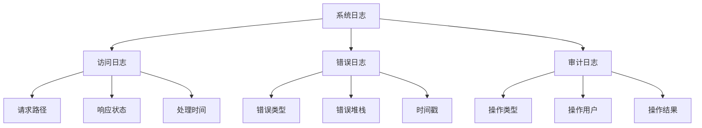

**章节来源**
- [logger.py:1-146](file://backend/app/core/logger.py#L1-L146)
- [router_class.py:133-164](file://backend/app/core/router_class.py#L133-L164)

## 结论

FastapiAdmin 的权限检查机制通过多层次、多维度的设计，实现了安全、灵活、高性能的权限管理。系统采用策略模式和依赖注入，确保了代码的可维护性和可扩展性。前后端协同的权限控制机制，既保证了安全性，又提供了良好的用户体验。

## 附录

### 扩展接口开发指南

开发者可以通过以下方式扩展权限检查机制：

1. **自定义权限处理器**
   - 继承基础权限类
   - 实现特定的权限验证逻辑
   - 集成到现有权限体系

2. **权限策略扩展**
   - 定义新的权限过滤策略
   - 实现相应的过滤算法
   - 配置到目标模型

3. **前端权限指令扩展**
   - 开发新的权限指令
   - 集成权限状态管理
   - 实现DOM操作逻辑

### 最佳实践建议

1. **权限设计原则**
   - 最小权限原则
   - 权限分离原则
   - 审计可追溯原则

2. **性能优化建议**
   - 合理使用缓存
   - 优化数据库查询
   - 监控系统性能指标

3. **安全加固措施**
   - 定期审查权限配置
   - 实施权限变更审批
   - 建立权限审计机制