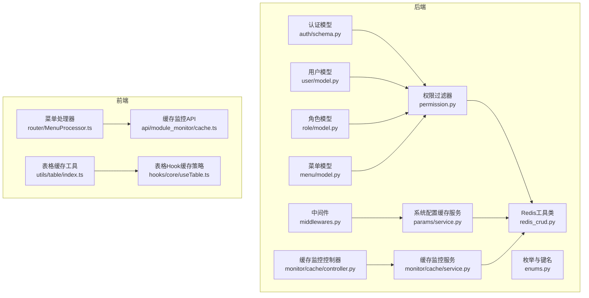
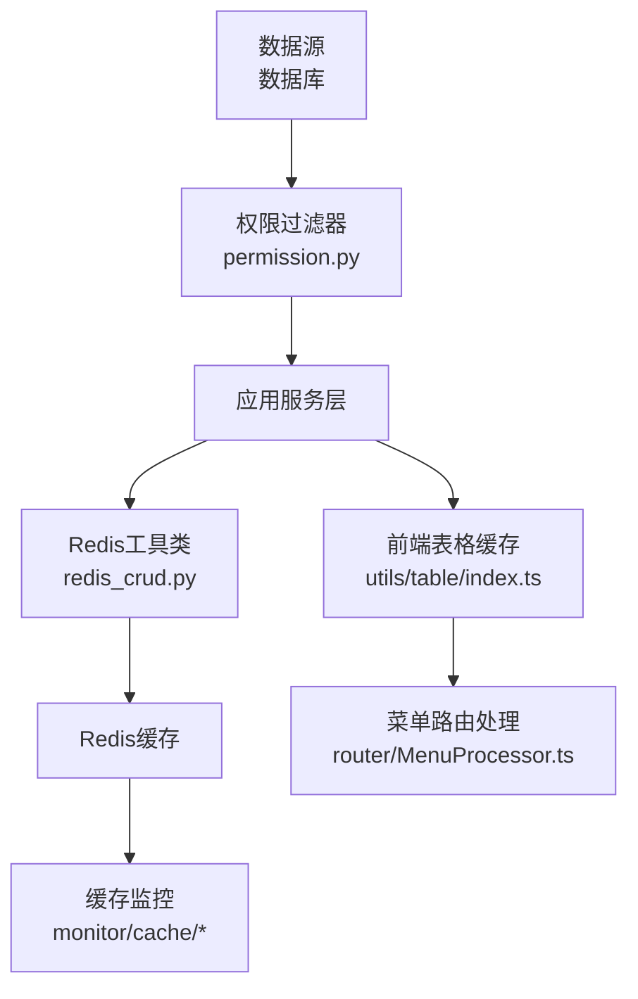
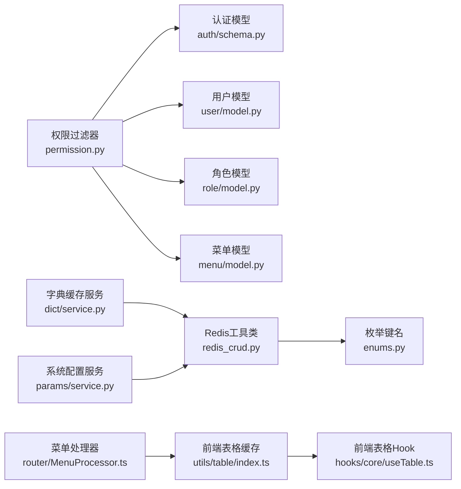

# 权限缓存

<cite>
**本文档引用的文件**
- [permission.py](file://backend/app/core/permission.py)
- [redis_crud.py](file://backend/app/core/redis_crud.py)
- [enums.py](file://backend/app/common/enums.py)
- [service.py](file://backend/app/api/v1/module_system/params/service.py)
- [service.py](file://backend/app/api/v1/module_monitor/cache/service.py)
- [controller.py](file://backend/app/api/v1/module_monitor/cache/controller.py)
- [cache.ts](file://frontend/web/src/api/module_monitor/cache.ts)
- [MenuProcessor.ts](file://frontend/web/src/router/MenuProcessor.ts)
- [index.ts](file://frontend/web/src/utils/table/index.ts)
- [useTable.ts](file://frontend/web/src/hooks/core/useTable.ts)
- [schema.py](file://backend/app/api/v1/module_system/auth/schema.py)
- [model.py](file://backend/app/api/v1/module_system/user/model.py)
- [model.py](file://backend/app/api/v1/module_system/role/model.py)
- [model.py](file://backend/app/api/v1/module_system/menu/model.py)
- [middlewares.py](file://backend/app/core/middlewares.py)
</cite>

## 目录
1. [简介](#简介)
2. [项目结构](#项目结构)
3. [核心组件](#核心组件)
4. [架构总览](#架构总览)
5. [详细组件分析](#详细组件分析)
6. [依赖关系分析](#依赖关系分析)
7. [性能考虑](#性能考虑)
8. [故障排查指南](#故障排查指南)
9. [结论](#结论)

## 简介
本文件面向权限缓存系统，围绕用户权限缓存、角色权限缓存与菜单权限缓存展开，系统性阐述缓存设计原理、缓存策略、失效与更新机制、穿透防护与雪崩预防、数据结构与键命名规范、过期时间设置、性能监控与调优、一致性保障与分布式处理，以及故障恢复与降级策略。文档同时结合后端Redis工具类与前端表格缓存实现，给出可操作的最佳实践。

## 项目结构
权限缓存涉及后端Redis工具层、权限过滤策略、系统配置与字典缓存、监控接口，以及前端表格缓存与菜单路由处理。整体结构如下：

**图表来源**
- [permission.py:13-311](file://backend/app/core/permission.py#L13-L311)
- [redis_crud.py:9-343](file://backend/app/core/redis_crud.py#L9-L343)
- [enums.py:42-74](file://backend/app/common/enums.py#L42-L74)
- [service.py:360-426](file://backend/app/api/v1/module_system/params/service.py#L360-L426)
- [service.py:1-86](file://backend/app/api/v1/module_monitor/cache/service.py#L1-L86)
- [controller.py:1-40](file://backend/app/api/v1/module_monitor/cache/controller.py#L1-L40)
- [schema.py:9-17](file://backend/app/api/v1/module_system/auth/schema.py#L9-L17)
- [model.py:64-151](file://backend/app/api/v1/module_system/user/model.py#L64-L151)
- [model.py:64-100](file://backend/app/api/v1/module_system/role/model.py#L64-L100)
- [model.py:13-103](file://backend/app/api/v1/module_system/menu/model.py#L13-L103)
- [middlewares.py:169-199](file://backend/app/core/middlewares.py#L169-L199)
- [MenuProcessor.ts:173-239](file://frontend/web/src/router/MenuProcessor.ts#L173-L239)
- [index.ts:132-288](file://frontend/web/src/utils/table/index.ts#L132-L288)
- [useTable.ts:309-717](file://frontend/web/src/hooks/core/useTable.ts#L309-L717)
- [cache.ts:1-95](file://frontend/web/src/api/module_monitor/cache.ts#L1-L95)

**章节来源**
- [permission.py:13-311](file://backend/app/core/permission.py#L13-L311)
- [redis_crud.py:9-343](file://backend/app/core/redis_crud.py#L9-L343)
- [enums.py:42-74](file://backend/app/common/enums.py#L42-L74)
- [service.py:360-426](file://backend/app/api/v1/module_system/params/service.py#L360-L426)
- [service.py:1-86](file://backend/app/api/v1/module_monitor/cache/service.py#L1-L86)
- [controller.py:1-40](file://backend/app/api/v1/module_monitor/cache/controller.py#L1-L40)
- [schema.py:9-17](file://backend/app/api/v1/module_system/auth/schema.py#L9-L17)
- [model.py:64-151](file://backend/app/api/v1/module_system/user/model.py#L64-L151)
- [model.py:64-100](file://backend/app/api/v1/module_system/role/model.py#L64-L100)
- [model.py:13-103](file://backend/app/api/v1/module_system/menu/model.py#L13-L103)
- [middlewares.py:169-199](file://backend/app/core/middlewares.py#L169-L199)
- [MenuProcessor.ts:173-239](file://frontend/web/src/router/MenuProcessor.ts#L173-L239)
- [index.ts:132-288](file://frontend/web/src/utils/table/index.ts#L132-L288)
- [useTable.ts:309-717](file://frontend/web/src/hooks/core/useTable.ts#L309-L717)
- [cache.ts:1-95](file://frontend/web/src/api/module_monitor/cache.ts#L1-L95)

## 核心组件
- 权限过滤器：基于策略模式，按角色、部门、自定义等策略动态生成SQL过滤条件，减少越权访问风险。
- Redis工具类：封装get/set/mget/keys/info/db_size/commandstats/lock/unlock等常用操作，支持分布式锁与过期时间管理。
- 枚举与键名：统一系统内置Redis键名前缀，便于缓存分类与清理。
- 系统配置与字典缓存：系统配置与数据字典以键前缀+类型的方式缓存，支持批量获取与中间件快速读取。
- 缓存监控：提供Redis统计信息、键名列表与键值读取，辅助运维与问题定位。
- 前端表格缓存：基于LRU的本地缓存，支持按标签清理与过期清理，提升表格数据加载体验。
- 菜单路由处理：前端根据用户角色与后端下发的菜单树进行权限过滤与渲染。

**章节来源**
- [permission.py:13-311](file://backend/app/core/permission.py#L13-L311)
- [redis_crud.py:9-343](file://backend/app/core/redis_crud.py#L9-L343)
- [enums.py:42-74](file://backend/app/common/enums.py#L42-L74)
- [service.py:360-426](file://backend/app/api/v1/module_system/params/service.py#L360-L426)
- [service.py:1-86](file://backend/app/api/v1/module_monitor/cache/service.py#L1-L86)
- [controller.py:1-40](file://backend/app/api/v1/module_monitor/cache/controller.py#L1-L40)
- [index.ts:132-288](file://frontend/web/src/utils/table/index.ts#L132-L288)
- [MenuProcessor.ts:173-239](file://frontend/web/src/router/MenuProcessor.ts#L173-L239)

## 架构总览
权限缓存系统由“后端缓存层 + 前端缓存层 + 权限过滤层 + 监控层”构成，形成“数据源 → 缓存 → 应用 → 前端”的闭环。

**图表来源**
- [permission.py:13-311](file://backend/app/core/permission.py#L13-L311)
- [redis_crud.py:9-343](file://backend/app/core/redis_crud.py#L9-L343)
- [service.py:1-86](file://backend/app/api/v1/module_monitor/cache/service.py#L1-L86)
- [index.ts:132-288](file://frontend/web/src/utils/table/index.ts#L132-L288)
- [MenuProcessor.ts:173-239](file://frontend/web/src/router/MenuProcessor.ts#L173-L239)

## 详细组件分析

### 用户权限缓存
- 设计要点
  - 用户维度：用户信息包含角色、部门、岗位等，权限过滤器依据用户角色与数据权限范围生成SQL条件，避免越权查询。
  - 缓存策略：用户信息可在登录后写入Redis，键名采用统一前缀，配合过期时间与分布式锁，保证并发安全。
  - 失效与更新：用户角色变更、部门调整、权限回收时，按用户ID清理对应缓存键，确保一致性。
- 数据结构
  - 用户模型包含角色、部门、岗位等关系，权限过滤器通过这些关系计算可访问范围。
- 键命名规范
  - 建议使用前缀：例如“user:{userId}:profile”，“user:{userId}:roles”，“user:{userId}:menus”。
- 过期时间
  - 建议短期缓存（如10-30分钟），结合主动失效策略，平衡性能与一致性。
- 穿透与雪崩
  - 穿透：对不存在的用户ID返回空结果并设置短过期，避免持续穿透。
  - 雪崩：对不同用户ID设置随机抖动过期时间，避免集中过期。
- 性能监控
  - 通过缓存监控接口统计命中率、命令调用次数与数据库大小，评估缓存效果。

**章节来源**
- [permission.py:13-311](file://backend/app/core/permission.py#L13-L311)
- [model.py:64-151](file://backend/app/api/v1/module_system/user/model.py#L64-L151)
- [redis_crud.py:9-343](file://backend/app/core/redis_crud.py#L9-L343)
- [service.py:1-86](file://backend/app/api/v1/module_monitor/cache/service.py#L1-L86)

### 角色权限缓存
- 设计要点
  - 角色维度：角色包含数据权限范围、关联菜单与部门，权限过滤器针对角色列表进行“仅当前用户绑定的角色”过滤。
  - 缓存策略：角色列表与菜单树可缓存，键名采用“role:list”、“role:{roleId}:menus”等前缀。
  - 失效与更新：角色菜单变更、数据权限调整时，清理对应键；角色删除时清理其关联键。
- 数据结构
  - 角色模型包含menus、depts、users等关系，权限过滤器据此生成过滤条件。
- 键命名规范
  - 建议使用前缀：例如“role:list”，“role:{roleId}:menus”，“role:{roleId}:depts”。
- 过期时间
  - 建议中等过期时间（如1-2小时），结合事件驱动清理。
- 穿透与雪崩
  - 穿透：对不存在的角色ID设置空值与短过期。
  - 雪崩：对不同角色设置随机抖动过期。
- 性能监控
  - 监控角色相关键的数量与访问频率，识别热点角色。

**章节来源**
- [model.py:64-100](file://backend/app/api/v1/module_system/role/model.py#L64-L100)
- [permission.py:115-132](file://backend/app/core/permission.py#L115-L132)
- [redis_crud.py:9-343](file://backend/app/core/redis_crud.py#L9-L343)
- [service.py:1-86](file://backend/app/api/v1/module_monitor/cache/service.py#L1-L86)

### 菜单权限缓存
- 设计要点
  - 菜单维度：菜单模型带有权限标识与树形结构，权限过滤器基于用户角色筛选可访问菜单。
  - 缓存策略：菜单树可缓存，键名采用“menu:tree”、“menu:{menuId}:perms”等前缀。
  - 失效与更新：菜单新增、修改、删除、权限变更时，清理对应键。
- 数据结构
  - 菜单模型包含父子关系与角色关联，权限过滤器据此生成过滤条件。
- 键命名规范
  - 建议使用前缀：例如“menu:tree”，“menu:{menuId}:roles”。
- 过期时间
  - 建议较长过期时间（如数小时至一天），结合事件驱动清理。
- 穿透与雪崩
  - 穿透：对不存在的菜单ID设置空值与短过期。
  - 雪崩：对不同菜单设置随机抖动过期。
- 前端联动
  - 前端优先使用后端下发的菜单树，再按用户角色进行二次过滤，减少重复请求。

**章节来源**
- [model.py:13-103](file://backend/app/api/v1/module_system/menu/model.py#L13-L103)
- [permission.py:87-114](file://backend/app/core/permission.py#L87-L114)
- [MenuProcessor.ts:173-239](file://frontend/web/src/router/MenuProcessor.ts#L173-L239)
- [redis_crud.py:9-343](file://backend/app/core/redis_crud.py#L9-L343)
- [service.py:1-86](file://backend/app/api/v1/module_monitor/cache/service.py#L1-L86)

### 系统配置与字典缓存
- 设计要点
  - 配置维度：系统配置以键前缀“system_config:*”存储，中间件可快速读取演示模式、IP黑白名单等。
  - 字典维度：数据字典以“system_dict:{type}”存储，支持按类型批量获取。
  - 批量读取：使用mget一次性获取多个配置项，降低RTT。
- 键命名规范
  - 配置：system_config:type
  - 字典：system_dict:type
- 过期时间
  - 建议较短过期时间（如5-15分钟），结合后台配置变更事件清理。
- 穿透与雪崩
  - 穿透：对不存在的配置/字典类型返回默认值并设置短过期。
  - 雪崩：对不同类型设置随机抖动过期。
- 中间件集成
  - 中间件在请求前读取必要配置，减少业务层负担。

**章节来源**
- [service.py:360-426](file://backend/app/api/v1/module_system/params/service.py#L360-L426)
- [service.py:423-453](file://backend/app/api/v1/module_system/dict/service.py#L423-L453)
- [enums.py:42-74](file://backend/app/common/enums.py#L42-L74)
- [middlewares.py:169-199](file://backend/app/core/middlewares.py#L169-L199)

### 缓存监控与运维
- 后端监控
  - 提供Redis统计信息、数据库大小、命令统计等，便于评估缓存健康度。
  - 支持按前缀获取键名列表与键值读取，辅助定位问题。
- 前端监控
  - 提供缓存信息、键名与键值读取接口，便于前端调试与问题排查。

**章节来源**
- [service.py:1-86](file://backend/app/api/v1/module_monitor/cache/service.py#L1-L86)
- [controller.py:1-40](file://backend/app/api/v1/module_monitor/cache/controller.py#L1-L40)
- [cache.ts:1-95](file://frontend/web/src/api/module_monitor/cache.ts#L1-L95)

### 前端表格缓存与去重
- 设计要点
  - 基于LRU的本地缓存，支持按搜索条件与分页标签清理，避免内存膨胀。
  - 支持全局请求去重，同一请求在飞行中不会重复发起。
  - 提供缓存命中回调与过期清理，优化用户体验。
- 键与标签
  - 键：基于请求参数的哈希值。
  - 标签：search:xxx、pagination:xxx等，便于按场景清理。
- 过期与清理
  - 统一过期时间与LRU淘汰，结合业务策略（新增/编辑/删除/刷新）进行精准清理。

**章节来源**
- [index.ts:132-288](file://frontend/web/src/utils/table/index.ts#L132-L288)
- [useTable.ts:309-717](file://frontend/web/src/hooks/core/useTable.ts#L309-L717)

## 依赖关系分析
- 权限过滤器依赖认证模型与用户/角色/菜单模型，通过策略模式实现灵活的权限判定。
- Redis工具类为各服务提供统一的缓存能力，包括分布式锁、过期时间管理与批量操作。
- 枚举定义统一的Redis键前缀，便于缓存分类与清理。
- 前端表格缓存与菜单处理器与后端缓存形成前后端协同，提升交互性能。

**图表来源**
- [permission.py:13-311](file://backend/app/core/permission.py#L13-L311)
- [schema.py:9-17](file://backend/app/api/v1/module_system/auth/schema.py#L9-L17)
- [model.py:64-151](file://backend/app/api/v1/module_system/user/model.py#L64-L151)
- [model.py:64-100](file://backend/app/api/v1/module_system/role/model.py#L64-L100)
- [model.py:13-103](file://backend/app/api/v1/module_system/menu/model.py#L13-L103)
- [redis_crud.py:9-343](file://backend/app/core/redis_crud.py#L9-L343)
- [enums.py:42-74](file://backend/app/common/enums.py#L42-L74)
- [service.py:423-453](file://backend/app/api/v1/module_system/dict/service.py#L423-L453)
- [service.py:360-426](file://backend/app/api/v1/module_system/params/service.py#L360-L426)
- [index.ts:132-288](file://frontend/web/src/utils/table/index.ts#L132-L288)
- [useTable.ts:309-717](file://frontend/web/src/hooks/core/useTable.ts#L309-L717)
- [MenuProcessor.ts:173-239](file://frontend/web/src/router/MenuProcessor.ts#L173-L239)

**章节来源**
- [permission.py:13-311](file://backend/app/core/permission.py#L13-L311)
- [redis_crud.py:9-343](file://backend/app/core/redis_crud.py#L9-L343)
- [enums.py:42-74](file://backend/app/common/enums.py#L42-L74)
- [service.py:360-426](file://backend/app/api/v1/module_system/params/service.py#L360-L426)
- [service.py:423-453](file://backend/app/api/v1/module_system/dict/service.py#L423-L453)
- [index.ts:132-288](file://frontend/web/src/utils/table/index.ts#L132-L288)
- [useTable.ts:309-717](file://frontend/web/src/hooks/core/useTable.ts#L309-L717)
- [MenuProcessor.ts:173-239](file://frontend/web/src/router/MenuProcessor.ts#L173-L239)

## 性能考虑
- 缓存键设计
  - 使用统一前缀与清晰命名，便于批量清理与统计。
- 过期时间策略
  - 不同类型缓存采用差异化过期时间，热点数据短过期+随机抖动，非热点长过期。
- 批量操作
  - 使用mget与keys批量读取与清理，降低网络开销。
- 分布式锁
  - 使用Lua脚本保证锁获取、释放与续约的原子性，避免死锁与误删。
- 前端缓存
  - LRU与标签清理相结合，避免内存无限增长；请求去重减少重复网络请求。

**章节来源**
- [redis_crud.py:9-343](file://backend/app/core/redis_crud.py#L9-L343)
- [index.ts:132-288](file://frontend/web/src/utils/table/index.ts#L132-L288)
- [useTable.ts:309-717](file://frontend/web/src/hooks/core/useTable.ts#L309-L717)

## 故障排查指南
- 缓存监控
  - 通过缓存监控接口查看Redis统计信息、数据库大小与命令调用次数，定位异常。
- 键名与键值
  - 使用“获取缓存键名”与“获取缓存值”接口，确认键是否存在、值是否正确。
- 分布式锁
  - 若出现锁竞争或误删，检查锁值与续约逻辑，确保使用安全释放。
- 前端缓存
  - 若出现数据不一致，检查LRU清理与标签清理策略，必要时强制清理当前搜索或分页缓存。

**章节来源**
- [service.py:1-86](file://backend/app/api/v1/module_monitor/cache/service.py#L1-L86)
- [controller.py:1-40](file://backend/app/api/v1/module_monitor/cache/controller.py#L1-L40)
- [cache.ts:1-95](file://frontend/web/src/api/module_monitor/cache.ts#L1-L95)
- [redis_crud.py:9-343](file://backend/app/core/redis_crud.py#L9-L343)

## 结论
权限缓存系统通过“策略化权限过滤 + 统一Redis工具 + 前后端缓存协同”，实现了高效、安全与可维护的权限控制。建议在实际部署中结合业务特点，细化键命名与过期策略，完善事件驱动的缓存失效机制，并持续通过监控指标优化缓存命中率与响应延迟，确保系统在高并发下的稳定性与一致性。