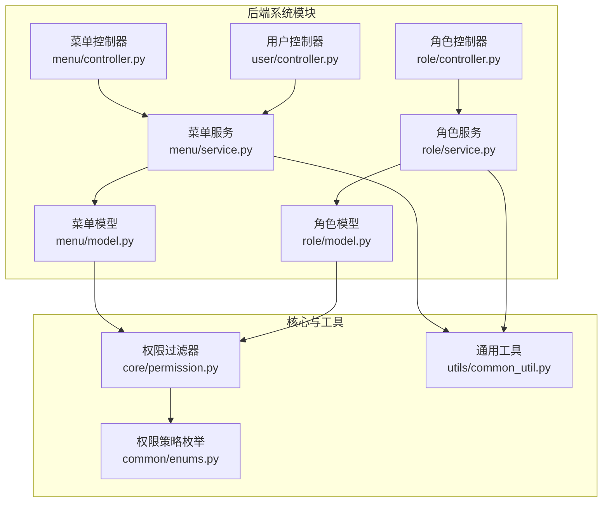
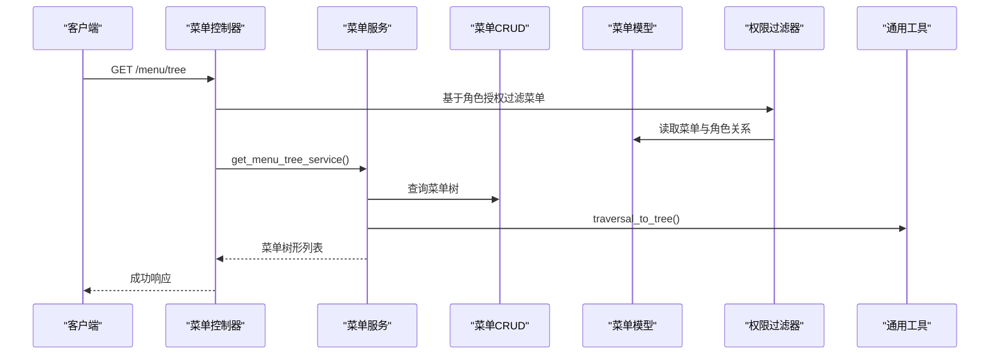
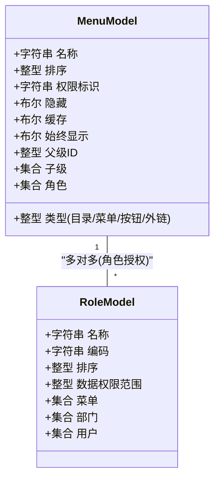
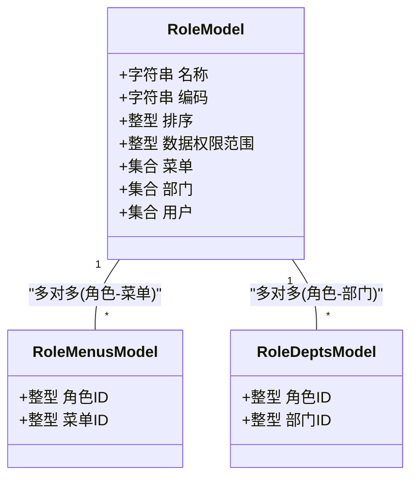
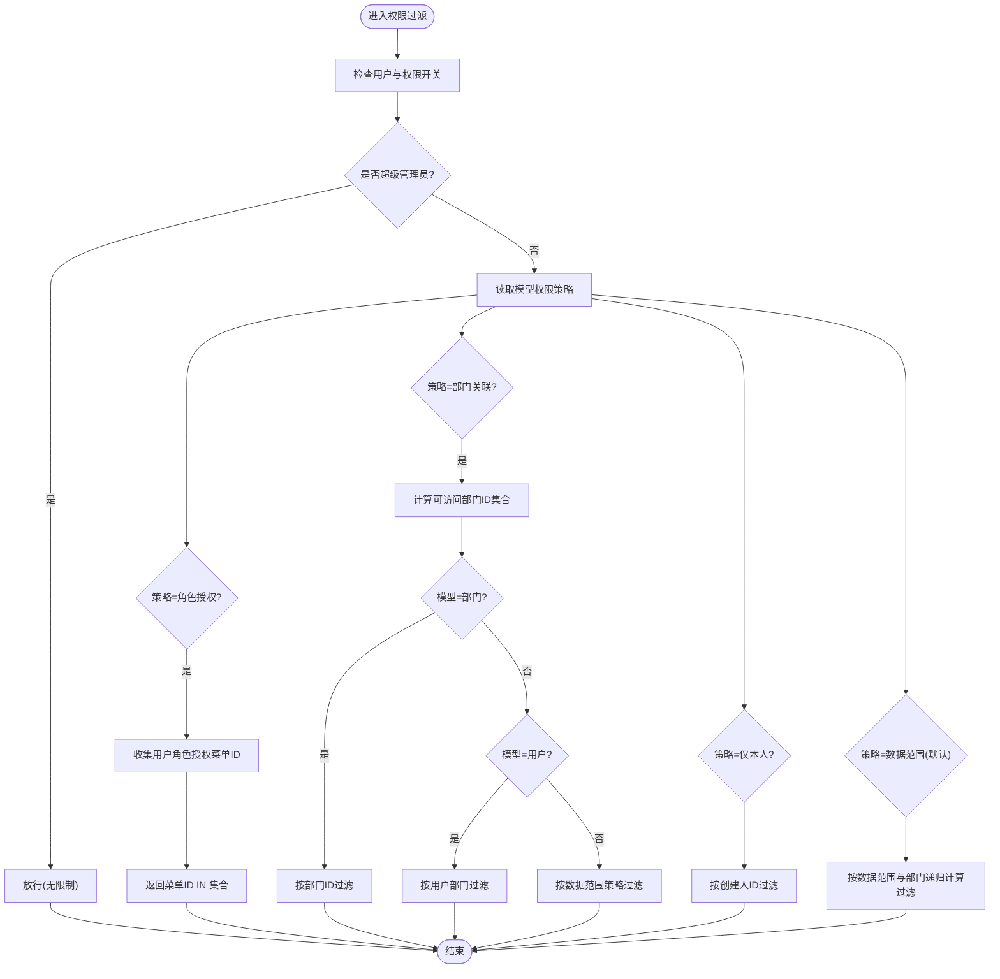
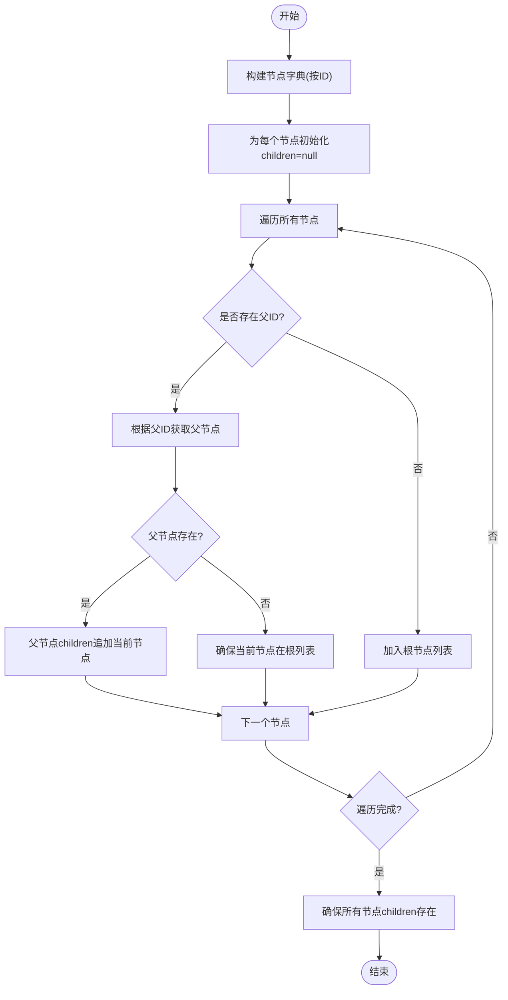
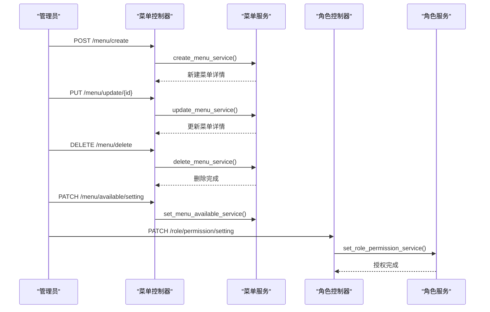
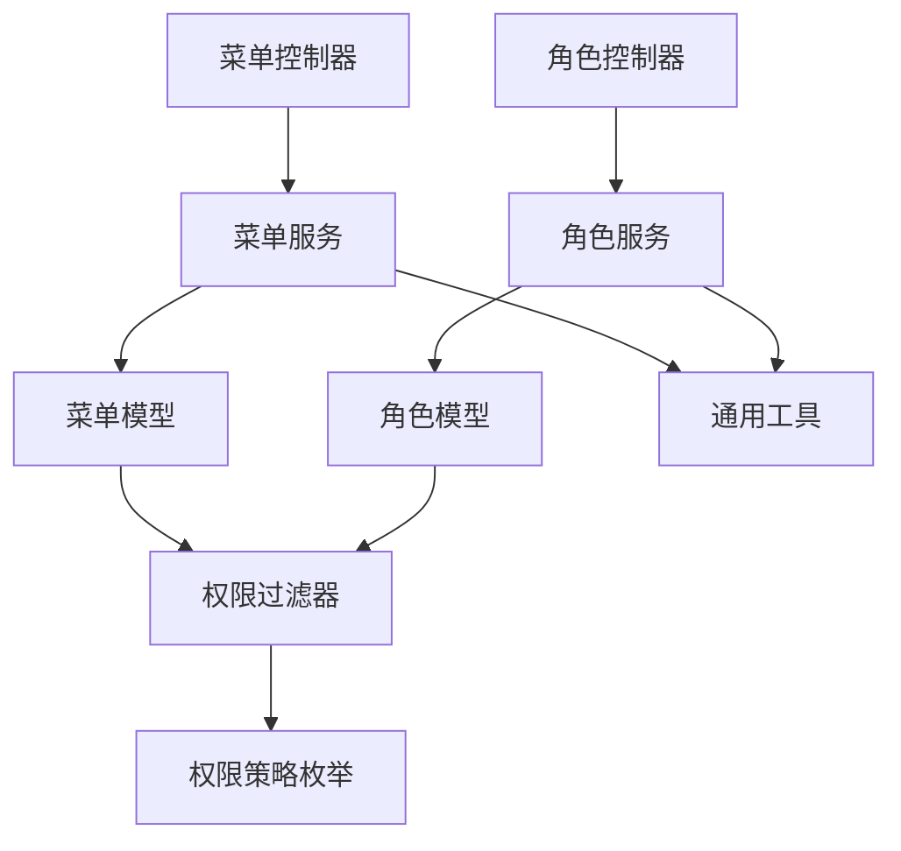

# 菜单权限

<cite>
**本文档引用的文件**
- [backend/app/core/permission.py](file://backend/app/core/permission.py)
- [backend/app/common/enums.py](file://backend/app/common/enums.py)
- [backend/app/utils/common_util.py](file://backend/app/utils/common_util.py)
- [backend/app/api/v1/module_system/menu/controller.py](file://backend/app/api/v1/module_system/menu/controller.py)
- [backend/app/api/v1/module_system/menu/service.py](file://backend/app/api/v1/module_system/menu/service.py)
- [backend/app/api/v1/module_system/menu/model.py](file://backend/app/api/v1/module_system/menu/model.py)
- [backend/app/api/v1/module_system/role/controller.py](file://backend/app/api/v1/module_system/role/controller.py)
- [backend/app/api/v1/module_system/role/service.py](file://backend/app/api/v1/module_system/role/service.py)
- [backend/app/api/v1/module_system/role/model.py](file://backend/app/api/v1/module_system/role/model.py)
- [backend/app/api/v1/module_system/user/controller.py](file://backend/app/api/v1/module_system/user/controller.py)
</cite>

## 目录
1. [简介](#简介)
2. [项目结构](#项目结构)
3. [核心组件](#核心组件)
4. [架构总览](#架构总览)
5. [详细组件分析](#详细组件分析)
6. [依赖分析](#依赖分析)
7. [性能考量](#性能考量)
8. [故障排查指南](#故障排查指南)
9. [结论](#结论)
10. [附录](#附录)

## 简介
本文件系统性阐述菜单权限体系的设计与实现，覆盖以下关键主题：
- 菜单层级结构与继承关系：目录/菜单/按钮/外链的父子约束与终端一致性校验
- 菜单显示控制与操作权限验证：基于角色授权的菜单过滤与权限标识
- 菜单与角色的关联机制：多对多关系、角色授权与数据权限范围
- 动态加载与缓存策略：菜单树构建算法、递归状态传播与权限合并规则
- 菜单权限配置流程：新增、编辑、删除、状态变更与授权分配
- 前端渲染与界面展示：菜单树形结构、权限标识与路由集成

## 项目结构
菜单权限相关代码主要分布在后端系统模块的“菜单”“角色”“用户”以及核心权限与工具模块中。整体采用按功能域划分的层次化组织，控制器负责接口暴露与鉴权，服务层编排业务逻辑，模型层定义数据结构与关系，工具与权限模块提供通用能力。

**图表来源**
- [backend/app/api/v1/module_system/menu/controller.py:1-166](file://backend/app/api/v1/module_system/menu/controller.py#L1-L166)
- [backend/app/api/v1/module_system/menu/service.py:1-245](file://backend/app/api/v1/module_system/menu/service.py#L1-L245)
- [backend/app/api/v1/module_system/menu/model.py:1-103](file://backend/app/api/v1/module_system/menu/model.py#L1-L103)
- [backend/app/api/v1/module_system/role/controller.py:1-244](file://backend/app/api/v1/module_system/role/controller.py#L1-L244)
- [backend/app/api/v1/module_system/role/service.py:1-242](file://backend/app/api/v1/module_system/role/service.py#L1-L242)
- [backend/app/api/v1/module_system/role/model.py:1-100](file://backend/app/api/v1/module_system/role/model.py#L1-L100)
- [backend/app/api/v1/module_system/user/controller.py:1-456](file://backend/app/api/v1/module_system/user/controller.py#L1-L456)
- [backend/app/core/permission.py:1-311](file://backend/app/core/permission.py#L1-L311)
- [backend/app/common/enums.py:111-122](file://backend/app/common/enums.py#L111-L122)
- [backend/app/utils/common_util.py:168-228](file://backend/app/utils/common_util.py#L168-L228)

**章节来源**
- [backend/app/api/v1/module_system/menu/controller.py:1-166](file://backend/app/api/v1/module_system/menu/controller.py#L1-L166)
- [backend/app/api/v1/module_system/role/controller.py:1-244](file://backend/app/api/v1/module_system/role/controller.py#L1-L244)
- [backend/app/api/v1/module_system/user/controller.py:1-456](file://backend/app/api/v1/module_system/user/controller.py#L1-L456)
- [backend/app/core/permission.py:1-311](file://backend/app/core/permission.py#L1-L311)
- [backend/app/common/enums.py:111-122](file://backend/app/common/enums.py#L111-L122)
- [backend/app/utils/common_util.py:168-228](file://backend/app/utils/common_util.py#L168-L228)

## 核心组件
- 权限过滤器（Permission）：基于策略模式，依据模型的权限策略选择过滤方法，支持角色授权、部门关联、仅本人、用户绑定角色等策略，用于菜单与数据权限的统一过滤。
- 菜单模型（MenuModel）：定义菜单字段、树形关系与权限策略，声明菜单为“基于角色授权”的过滤策略，同时维护与角色的多对多关系。
- 角色模型（RoleModel）：定义角色字段、数据权限范围与多对多关系，声明角色列表为“当前用户绑定角色”的过滤策略，同时维护与菜单、部门的多对多关系。
- 菜单服务（MenuService）：提供菜单树构建、父子类型与客户端一致性校验、可用状态递归传播、批量删除等能力。
- 角色服务（RoleService）：提供角色授权设置（菜单+数据权限+自定义部门），并进行数据权限范围与部门的联动处理。
- 通用工具（common_util）：提供树形结构构建（遍历法）、父子ID映射与递归、序列化等通用能力。

**章节来源**
- [backend/app/core/permission.py:13-311](file://backend/app/core/permission.py#L13-L311)
- [backend/app/api/v1/module_system/menu/model.py:13-103](file://backend/app/api/v1/module_system/menu/model.py#L13-L103)
- [backend/app/api/v1/module_system/role/model.py:64-100](file://backend/app/api/v1/module_system/role/model.py#L64-L100)
- [backend/app/api/v1/module_system/menu/service.py:23-245](file://backend/app/api/v1/module_system/menu/service.py#L23-L245)
- [backend/app/api/v1/module_system/role/service.py:18-242](file://backend/app/api/v1/module_system/role/service.py#L18-L242)
- [backend/app/utils/common_util.py:168-228](file://backend/app/utils/common_util.py#L168-L228)

## 架构总览
菜单权限系统遵循“控制器-服务-模型-权限/工具”的分层设计。控制器负责鉴权与参数解析，服务层编排业务规则，模型层承载数据与关系，权限模块提供统一的过滤策略，工具模块提供树形构建与序列化等通用能力。

**图表来源**
- [backend/app/api/v1/module_system/menu/controller.py:19-44](file://backend/app/api/v1/module_system/menu/controller.py#L19-L44)
- [backend/app/api/v1/module_system/menu/service.py:90-114](file://backend/app/api/v1/module_system/menu/service.py#L90-L114)
- [backend/app/core/permission.py:87-113](file://backend/app/core/permission.py#L87-L113)
- [backend/app/utils/common_util.py:168-205](file://backend/app/utils/common_util.py#L168-L205)

## 详细组件分析

### 菜单模型与权限策略
- 权限策略：菜单模型声明为“基于角色授权”，即通过用户所拥有的角色授权来决定可见菜单集合。
- 树形关系：支持父子关系与排序，便于前端渲染与权限继承。
- 多对多关系：与角色建立多对多关系，用于角色授权与权限过滤。

**图表来源**
- [backend/app/api/v1/module_system/menu/model.py:13-103](file://backend/app/api/v1/module_system/menu/model.py#L13-L103)
- [backend/app/api/v1/module_system/role/model.py:64-100](file://backend/app/api/v1/module_system/role/model.py#L64-L100)

**章节来源**
- [backend/app/api/v1/module_system/menu/model.py:13-103](file://backend/app/api/v1/module_system/menu/model.py#L13-L103)
- [backend/app/common/enums.py:111-122](file://backend/app/common/enums.py#L111-L122)

### 角色模型与数据权限
- 角色列表权限策略：角色列表仅显示当前用户绑定的角色，避免越权。
- 数据权限范围：支持仅本人、本部门、本部门及以下、全部、自定义五种范围。
- 多对多关系：与菜单、部门、用户建立多对多关系，支撑菜单授权与数据权限范围。

**图表来源**
- [backend/app/api/v1/module_system/role/model.py:64-100](file://backend/app/api/v1/module_system/role/model.py#L64-L100)

**章节来源**
- [backend/app/api/v1/module_system/role/model.py:64-100](file://backend/app/api/v1/module_system/role/model.py#L64-L100)

### 权限过滤器（菜单与数据权限）
- 菜单过滤（角色授权）：基于用户角色的菜单授权集合，仅显示状态有效的菜单。
- 数据权限过滤：支持角色绑定、部门关联、仅本人、用户绑定角色等策略，结合部门树递归计算可访问范围。
- 权限合并：当用户具备多个角色时，菜单ID集合取并集，数据权限范围按优先级与规则合并。

**图表来源**
- [backend/app/core/permission.py:54-311](file://backend/app/core/permission.py#L54-L311)

**章节来源**
- [backend/app/core/permission.py:13-311](file://backend/app/core/permission.py#L13-L311)

### 菜单树形结构构建算法
- 遍历法构建：先将节点列表转为字典索引，再遍历节点，按父ID挂载到父节点 children 中，确保每个节点都有 children 字段。
- 递归法构建：以 parent_id 为根逐层递归，适合小规模数据但性能开销较高。
- 适用场景：菜单树查询接口使用遍历法，性能更优；递归法作为备选或教学用途。

**图表来源**
- [backend/app/utils/common_util.py:168-205](file://backend/app/utils/common_util.py#L168-L205)

**章节来源**
- [backend/app/utils/common_util.py:168-228](file://backend/app/utils/common_util.py#L168-L228)

### 菜单权限配置流程
- 新增菜单：校验标题唯一性、父子类型约束与客户端一致性，创建后返回详情。
- 编辑菜单：校验父级存在性与标题唯一性，更新后可触发可用状态递归传播。
- 删除菜单：递归收集待删除菜单及其所有子孙节点，执行批量删除。
- 状态变更：激活菜单时递归启用其所有父级；禁用菜单时递归禁用其所有子级。
- 授权分配：设置角色菜单权限、数据权限范围与自定义部门（当范围为自定义时）。

**图表来源**
- [backend/app/api/v1/module_system/menu/controller.py:70-166](file://backend/app/api/v1/module_system/menu/controller.py#L70-L166)
- [backend/app/api/v1/module_system/menu/service.py:117-245](file://backend/app/api/v1/module_system/menu/service.py#L117-L245)
- [backend/app/api/v1/module_system/role/controller.py:190-213](file://backend/app/api/v1/module_system/role/controller.py#L190-L213)
- [backend/app/api/v1/module_system/role/service.py:155-181](file://backend/app/api/v1/module_system/role/service.py#L155-L181)

**章节来源**
- [backend/app/api/v1/module_system/menu/controller.py:1-166](file://backend/app/api/v1/module_system/menu/controller.py#L1-L166)
- [backend/app/api/v1/module_system/menu/service.py:23-245](file://backend/app/api/v1/module_system/menu/service.py#L23-L245)
- [backend/app/api/v1/module_system/role/controller.py:1-244](file://backend/app/api/v1/module_system/role/controller.py#L1-L244)
- [backend/app/api/v1/module_system/role/service.py:18-242](file://backend/app/api/v1/module_system/role/service.py#L18-L242)

### 前端渲染与界面展示机制
- 菜单树形结构：后端提供树形列表，前端按 children 字段渲染层级；隐藏字段控制是否显示；始终显示字段控制强制显示。
- 权限标识：菜单的权限标识用于前端指令与按钮级权限控制，结合后端角色授权共同生效。
- 终端区分：菜单支持 pc/app 终端，父子终端需一致，避免跨端异常。
- 路由与组件：菜单包含路由名称、路径、组件路径与重定向，配合前端路由系统进行页面跳转与缓存控制。

**章节来源**
- [backend/app/api/v1/module_system/menu/model.py:37-77](file://backend/app/api/v1/module_system/menu/model.py#L37-L77)
- [backend/app/api/v1/module_system/menu/service.py:90-114](file://backend/app/api/v1/module_system/menu/service.py#L90-L114)

## 依赖分析
- 控制器依赖服务：控制器通过依赖注入获取认证信息与权限校验，调用对应服务方法。
- 服务依赖模型与CRUD：服务层编排业务逻辑，依赖模型定义与CRUD操作。
- 权限模块依赖枚举与工具：权限过滤器依赖权限策略枚举与通用工具函数（树形构建、递归计算）。
- 模型间关系：菜单与角色通过中间表建立多对多关系，角色与部门、用户亦通过中间表建立多对多关系。

**图表来源**
- [backend/app/api/v1/module_system/menu/controller.py:1-166](file://backend/app/api/v1/module_system/menu/controller.py#L1-L166)
- [backend/app/api/v1/module_system/role/controller.py:1-244](file://backend/app/api/v1/module_system/role/controller.py#L1-L244)
- [backend/app/api/v1/module_system/menu/service.py:1-245](file://backend/app/api/v1/module_system/menu/service.py#L1-L245)
- [backend/app/api/v1/module_system/role/service.py:1-242](file://backend/app/api/v1/module_system/role/service.py#L1-L242)
- [backend/app/core/permission.py:1-311](file://backend/app/core/permission.py#L1-L311)
- [backend/app/common/enums.py:111-122](file://backend/app/common/enums.py#L111-L122)
- [backend/app/utils/common_util.py:1-447](file://backend/app/utils/common_util.py#L1-L447)

**章节来源**
- [backend/app/api/v1/module_system/menu/controller.py:1-166](file://backend/app/api/v1/module_system/menu/controller.py#L1-L166)
- [backend/app/api/v1/module_system/role/controller.py:1-244](file://backend/app/api/v1/module_system/role/controller.py#L1-L244)
- [backend/app/api/v1/module_system/menu/service.py:1-245](file://backend/app/api/v1/module_system/menu/service.py#L1-L245)
- [backend/app/api/v1/module_system/role/service.py:1-242](file://backend/app/api/v1/module_system/role/service.py#L1-L242)
- [backend/app/core/permission.py:1-311](file://backend/app/core/permission.py#L1-L311)
- [backend/app/common/enums.py:111-122](file://backend/app/common/enums.py#L111-L122)
- [backend/app/utils/common_util.py:1-447](file://backend/app/utils/common_util.py#L1-L447)

## 性能考量
- 树形构建：优先使用遍历法（O(n)）而非递归法（O(n^2)），减少大规模菜单树的构建开销。
- 权限过滤：角色授权过滤通过集合合并与IN查询实现，避免复杂JOIN；数据权限范围计算依赖部门树递归，建议缓存部门映射与递归结果。
- 查询优化：菜单树查询预加载子关系，序列化时避免N+1查询；角色列表仅显示当前用户绑定角色，降低数据量。
- 批量操作：删除与状态变更采用一次性递归收集ID并批量执行，减少多次往返。

[本节为通用指导，无需特定文件引用]

## 故障排查指南
- 菜单父子类型错误：目录下仅允许目录/菜单/外链；菜单下仅允许按钮；按钮与外链不可挂子级。违反规则将抛出异常。
- 子菜单终端不一致：父子菜单终端必须一致（均为 pc 或 app），否则抛出异常。
- 菜单标题重复：更新菜单时若标题与父级组合重复，抛出异常。
- 父级不存在：更新菜单时若指定父级不存在，抛出异常。
- 删除对象为空：批量删除时若ID列表为空，抛出异常。
- 超级管理员无限制：超级管理员不受权限过滤限制。
- 数据权限异常：部门递归计算失败时回退至用户所在部门，保证基本可用。

**章节来源**
- [backend/app/api/v1/module_system/menu/service.py:28-66](file://backend/app/api/v1/module_system/menu/service.py#L28-L66)
- [backend/app/api/v1/module_system/menu/service.py:142-179](file://backend/app/api/v1/module_system/menu/service.py#L142-L179)
- [backend/app/api/v1/module_system/menu/service.py:182-214](file://backend/app/api/v1/module_system/menu/service.py#L182-L214)
- [backend/app/core/permission.py:274-283](file://backend/app/core/permission.py#L274-L283)

## 结论
本菜单权限系统通过明确的模型关系、策略化的权限过滤与高效的树形构建算法，实现了菜单层级、显示控制与操作权限的统一治理。角色授权与数据权限范围的解耦设计，既满足了菜单可见性的需求，又兼顾了数据访问的安全边界。建议在生产环境中结合缓存与批量操作策略，持续优化大规模菜单树与高并发下的性能表现。

[本节为总结性内容，无需特定文件引用]

## 附录
- 菜单类型：目录（1）、菜单（2）、按钮/权限（3）、外部链接（4）
- 数据权限范围：仅本人（1）、本部门（2）、本部门及以下（3）、全部（4）、自定义（5）
- 终端类型：pc（管理端桌面）、app（移动端）

**章节来源**
- [backend/app/api/v1/module_system/menu/model.py:17-22](file://backend/app/api/v1/module_system/menu/model.py#L17-L22)
- [backend/app/api/v1/module_system/role/model.py:81-86](file://backend/app/api/v1/module_system/role/model.py#L81-L86)
- [backend/app/api/v1/module_system/menu/model.py:71-77](file://backend/app/api/v1/module_system/menu/model.py#L71-L77)