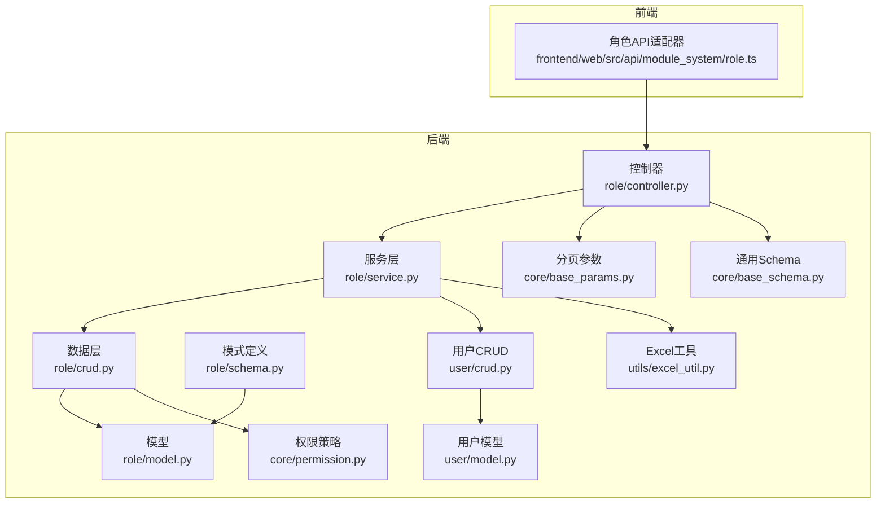
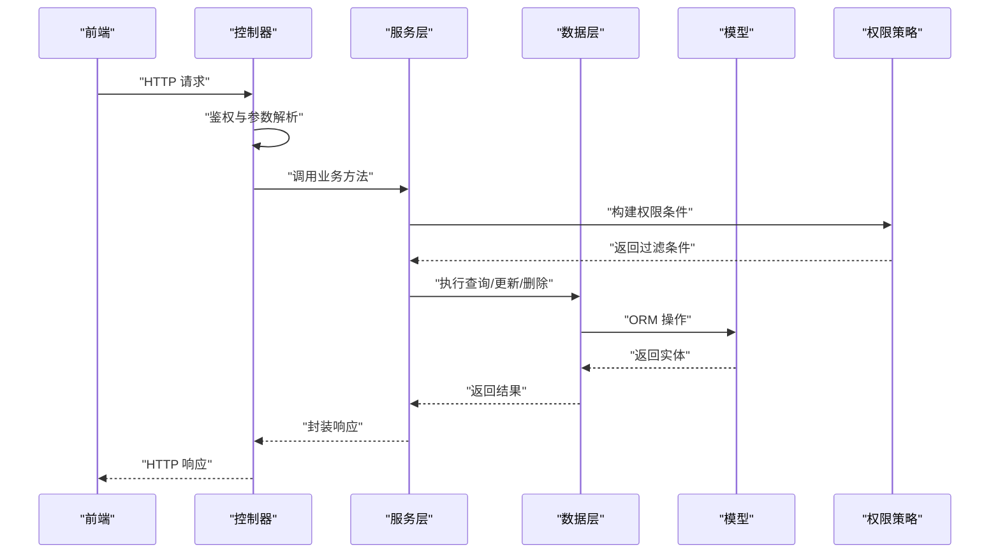
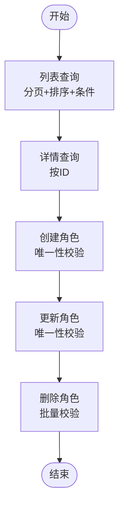
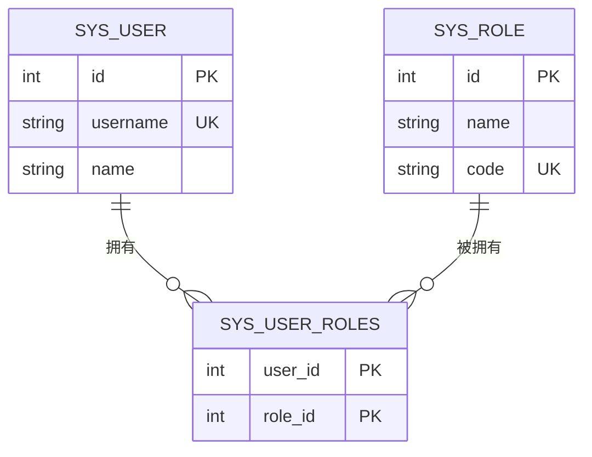
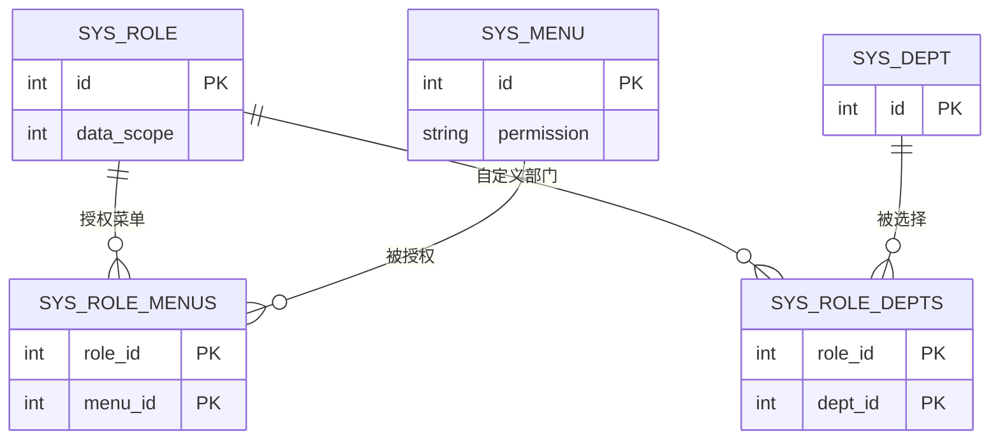
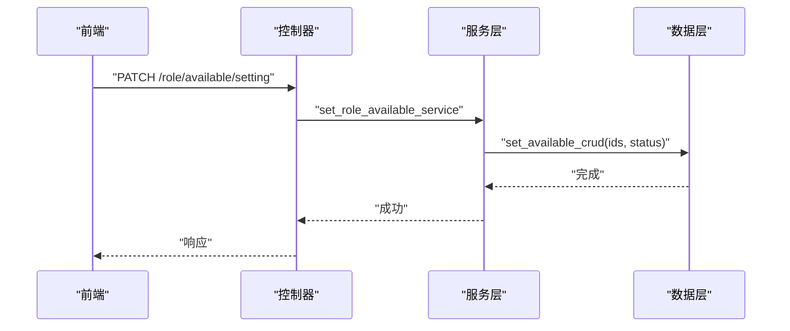
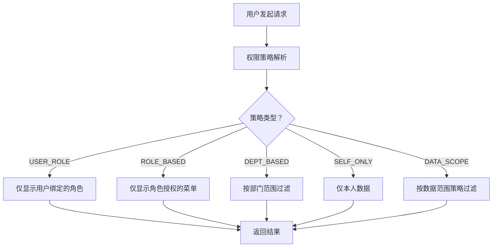
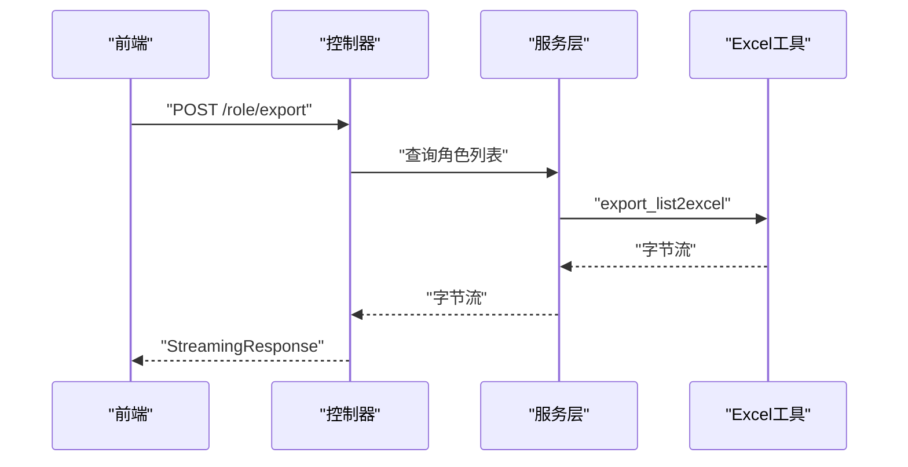
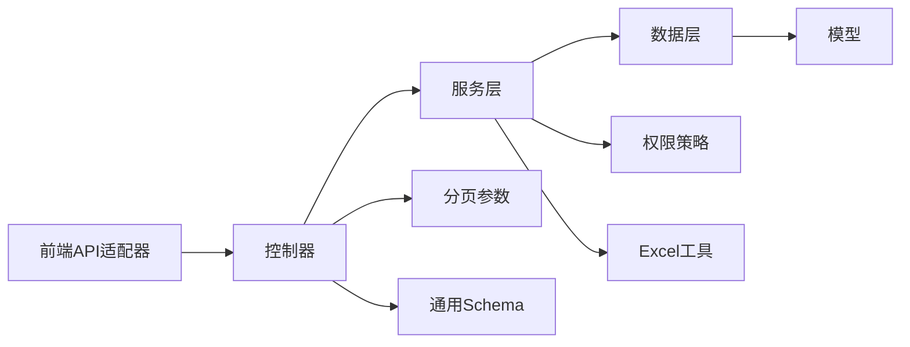

# 角色管理

<cite>
**本文档引用的文件**
- [controller.py](file://backend/app/api/v1/module_system/role/controller.py)
- [service.py](file://backend/app/api/v1/module_system/role/service.py)
- [crud.py](file://backend/app/api/v1/module_system/role/crud.py)
- [model.py](file://backend/app/api/v1/module_system/role/model.py)
- [schema.py](file://backend/app/api/v1/module_system/role/schema.py)
- [user_model.py](file://backend/app/api/v1/module_system/user/model.py)
- [user_crud.py](file://backend/app/api/v1/module_system/user/crud.py)
- [enums.py](file://backend/app/common/enums.py)
- [permission.py](file://backend/app/core/permission.py)
- [excel_util.py](file://backend/app/utils/excel_util.py)
- [role_api.ts](file://frontend/web/src/api/module_system/role.ts)
- [base_params.py](file://backend/app/core/base_params.py)
- [base_schema.py](file://backend/app/core/base_schema.py)
</cite>

## 目录
1. [简介](#简介)
2. [项目结构](#项目结构)
3. [核心组件](#核心组件)
4. [架构总览](#架构总览)
5. [详细组件分析](#详细组件分析)
6. [依赖分析](#依赖分析)
7. [性能考虑](#性能考虑)
8. [故障排查指南](#故障排查指南)
9. [结论](#结论)
10. [附录](#附录)

## 简介
本文件面向角色管理系统，系统性阐述角色的CRUD操作、批量状态管理、角色与用户的关联关系、角色权限配置、数据权限范围策略、角色导出与批量操作最佳实践，并提供完整的API接口文档与错误处理说明。读者无需深入技术背景即可理解角色管理的业务流程与实现要点。

## 项目结构
角色管理模块位于后端的系统模块目录下，采用典型的三层架构：控制器(Controller)负责HTTP接口与鉴权校验，服务(Service)封装业务逻辑，数据访问(CRUD)对接ORM模型。前端通过统一的API适配器调用后端接口。

**图表来源**
- [controller.py:1-244](file://backend/app/api/v1/module_system/role/controller.py#L1-L244)
- [service.py:1-242](file://backend/app/api/v1/module_system/role/service.py#L1-L242)
- [crud.py:1-135](file://backend/app/api/v1/module_system/role/crud.py#L1-L135)
- [model.py:1-100](file://backend/app/api/v1/module_system/role/model.py#L1-L100)
- [schema.py:1-126](file://backend/app/api/v1/module_system/role/schema.py#L1-L126)
- [user_model.py:1-151](file://backend/app/api/v1/module_system/user/model.py#L1-L151)
- [user_crud.py:1-221](file://backend/app/api/v1/module_system/user/crud.py#L1-L221)
- [permission.py:1-311](file://backend/app/core/permission.py#L1-L311)
- [excel_util.py:1-111](file://backend/app/utils/excel_util.py#L1-L111)
- [role_api.ts:1-120](file://frontend/web/src/api/module_system/role.ts#L1-L120)
- [base_params.py:1-94](file://backend/app/core/base_params.py#L1-L94)
- [base_schema.py:1-75](file://backend/app/core/base_schema.py#L1-L75)

**章节来源**
- [controller.py:1-244](file://backend/app/api/v1/module_system/role/controller.py#L1-L244)
- [service.py:1-242](file://backend/app/api/v1/module_system/role/service.py#L1-L242)
- [crud.py:1-135](file://backend/app/api/v1/module_system/role/crud.py#L1-L135)
- [model.py:1-100](file://backend/app/api/v1/module_system/role/model.py#L1-L100)
- [schema.py:1-126](file://backend/app/api/v1/module_system/role/schema.py#L1-L126)
- [user_model.py:1-151](file://backend/app/api/v1/module_system/user/model.py#L1-L151)
- [user_crud.py:1-221](file://backend/app/api/v1/module_system/user/crud.py#L1-L221)
- [permission.py:1-311](file://backend/app/core/permission.py#L1-L311)
- [excel_util.py:1-111](file://backend/app/utils/excel_util.py#L1-L111)
- [role_api.ts:1-120](file://frontend/web/src/api/module_system/role.ts#L1-L120)
- [base_params.py:1-94](file://backend/app/core/base_params.py#L1-L94)
- [base_schema.py:1-75](file://backend/app/core/base_schema.py#L1-L75)

## 核心组件
- 控制器层：定义角色管理的HTTP接口，负责参数解析、鉴权与日志记录，并将请求委派给服务层。
- 服务层：封装业务规则，如角色唯一性校验、权限配置、状态批量更新、导出等。
- 数据层：基于通用CRUDBase实现角色的增删改查、关联关系维护与分页查询。
- 模型层：定义角色、菜单与部门的多对多关联表，以及角色与用户的多对多关联。
- 权限策略：基于用户绑定角色的数据权限过滤，支持多种策略（数据范围、角色授权、部门关联、仅本人、用户角色）。
- Excel导出：提供角色列表导出能力，支持字段映射与国际化展示。

**章节来源**
- [controller.py:24-244](file://backend/app/api/v1/module_system/role/controller.py#L24-L244)
- [service.py:18-242](file://backend/app/api/v1/module_system/role/service.py#L18-L242)
- [crud.py:12-135](file://backend/app/api/v1/module_system/role/crud.py#L12-L135)
- [model.py:64-100](file://backend/app/api/v1/module_system/role/model.py#L64-L100)
- [permission.py:13-311](file://backend/app/core/permission.py#L13-L311)
- [excel_util.py:93-111](file://backend/app/utils/excel_util.py#L93-L111)

## 架构总览
角色管理遵循“控制器-服务-数据-模型”的分层设计，配合权限策略在查询阶段自动注入数据范围限制，确保用户只能看到其权限范围内的角色与数据。

**图表来源**
- [controller.py:27-244](file://backend/app/api/v1/module_system/role/controller.py#L27-L244)
- [service.py:58-86](file://backend/app/api/v1/module_system/role/service.py#L58-L86)
- [permission.py:41-85](file://backend/app/core/permission.py#L41-L85)

## 详细组件分析

### 角色CRUD与查询
- 列表查询：支持分页、排序、模糊/精确查询与时间范围查询；默认按更新时间倒序。
- 详情查询：按角色ID查询，返回角色及其菜单、部门关联。
- 创建：校验角色名称与编码唯一性，创建成功后返回角色详情。
- 更新：校验名称与编码唯一性（排除自身），更新后返回最新详情。
- 删除：校验ID有效性，批量删除。

**图表来源**
- [controller.py:27-162](file://backend/app/api/v1/module_system/role/controller.py#L27-L162)
- [service.py:58-153](file://backend/app/api/v1/module_system/role/service.py#L58-L153)
- [schema.py:93-126](file://backend/app/api/v1/module_system/role/schema.py#L93-L126)

**章节来源**
- [controller.py:27-162](file://backend/app/api/v1/module_system/role/controller.py#L27-L162)
- [service.py:58-153](file://backend/app/api/v1/module_system/role/service.py#L58-L153)
- [schema.py:93-126](file://backend/app/api/v1/module_system/role/schema.py#L93-L126)

### 角色与用户的关联关系
- 用户与角色为多对多关系，通过中间表维护。
- 用户模型预加载roles关系，便于权限计算与展示。
- 服务层提供批量设置用户角色的能力，清空后重新赋值。

**图表来源**
- [user_model.py:16-38](file://backend/app/api/v1/module_system/user/model.py#L16-L38)
- [user_model.py:126-131](file://backend/app/api/v1/module_system/user/model.py#L126-L131)
- [user_crud.py:136-157](file://backend/app/api/v1/module_system/user/crud.py#L136-L157)

**章节来源**
- [user_model.py:16-38](file://backend/app/api/v1/module_system/user/model.py#L16-L38)
- [user_model.py:126-131](file://backend/app/api/v1/module_system/user/model.py#L126-L131)
- [user_crud.py:136-157](file://backend/app/api/v1/module_system/user/crud.py#L136-L157)

### 角色继承机制与权限传递
- 角色与菜单为多对多关系，菜单权限通过角色继承。
- 角色与部门为多对多关系，用于自定义数据权限范围。
- 用户通过绑定角色获得菜单权限与数据范围策略，权限策略在查询阶段自动生效。

**图表来源**
- [model.py:15-62](file://backend/app/api/v1/module_system/role/model.py#L15-L62)
- [model.py:88-99](file://backend/app/api/v1/module_system/role/model.py#L88-L99)

**章节来源**
- [model.py:15-62](file://backend/app/api/v1/module_system/role/model.py#L15-L62)
- [model.py:88-99](file://backend/app/api/v1/module_system/role/model.py#L88-L99)

### 角色状态管理与批量操作
- 单个状态切换：通过PATCH接口设置可用状态。
- 批量状态管理：接收ID列表与目标状态，统一更新。
- 前端通过API适配器调用批量设置接口。

**图表来源**
- [controller.py:165-187](file://backend/app/api/v1/module_system/role/controller.py#L165-L187)
- [service.py:183-194](file://backend/app/api/v1/module_system/role/service.py#L183-L194)
- [crud.py:123-135](file://backend/app/api/v1/module_system/role/crud.py#L123-L135)
- [base_schema.py:52-57](file://backend/app/core/base_schema.py#L52-L57)

**章节来源**
- [controller.py:165-187](file://backend/app/api/v1/module_system/role/controller.py#L165-L187)
- [service.py:183-194](file://backend/app/api/v1/module_system/role/service.py#L183-L194)
- [crud.py:123-135](file://backend/app/api/v1/module_system/role/crud.py#L123-L135)
- [base_schema.py:52-57](file://backend/app/core/base_schema.py#L52-L57)

### 角色权限配置与数据范围策略
- 角色授权：支持设置菜单权限、数据范围与自定义部门。
- 数据范围策略：支持“仅本人”、“本部门”、“本部门及以下”、“全部”、“自定义”五种策略。
- 权限过滤：基于用户绑定角色与部门层级，动态生成WHERE条件，确保数据可见性。

**图表来源**
- [permission.py:54-85](file://backend/app/core/permission.py#L54-L85)
- [permission.py:115-132](file://backend/app/core/permission.py#L115-L132)
- [permission.py:134-172](file://backend/app/core/permission.py#L134-L172)
- [permission.py:174-247](file://backend/app/core/permission.py#L174-L247)
- [enums.py:111-122](file://backend/app/common/enums.py#L111-L122)

**章节来源**
- [permission.py:54-85](file://backend/app/core/permission.py#L54-L85)
- [permission.py:115-132](file://backend/app/core/permission.py#L115-L132)
- [permission.py:134-172](file://backend/app/core/permission.py#L134-L172)
- [permission.py:174-247](file://backend/app/core/permission.py#L174-L247)
- [enums.py:111-122](file://backend/app/common/enums.py#L111-L122)

### 角色导出功能与最佳实践
- 导出接口：后端查询角色列表，调用Excel工具进行字段映射与导出，返回流式响应。
- 最佳实践：前端以Blob形式接收，设置正确的Content-Type与文件名；后端统一使用UTF-8与标准Excel格式。

**图表来源**
- [controller.py:215-244](file://backend/app/api/v1/module_system/role/controller.py#L215-L244)
- [service.py:197-241](file://backend/app/api/v1/module_system/role/service.py#L197-L241)
- [excel_util.py:94-111](file://backend/app/utils/excel_util.py#L94-L111)

**章节来源**
- [controller.py:215-244](file://backend/app/api/v1/module_system/role/controller.py#L215-L244)
- [service.py:197-241](file://backend/app/api/v1/module_system/role/service.py#L197-L241)
- [excel_util.py:94-111](file://backend/app/utils/excel_util.py#L94-L111)

### 角色搜索与排序
- 搜索参数：支持名称、描述、状态、创建/更新时间范围等条件组合。
- 排序参数：支持多字段排序，前端传入JSON字符串，后端解析为服务层期望格式。
- 默认排序：若未提供排序，按更新时间倒序。

**章节来源**
- [schema.py:93-126](file://backend/app/api/v1/module_system/role/schema.py#L93-L126)
- [base_params.py:8-42](file://backend/app/core/base_params.py#L8-L42)

## 依赖分析
- 控制器依赖服务层与鉴权依赖注入，保证接口安全与参数正确性。
- 服务层依赖数据层与权限策略，确保业务规则与数据隔离。
- 数据层依赖ORM模型与通用CRUDBase，提供统一的CRUD能力。
- 前端通过API适配器调用后端接口，参数与响应结构清晰。

**图表来源**
- [role_api.ts:1-120](file://frontend/web/src/api/module_system/role.ts#L1-L120)
- [controller.py:1-244](file://backend/app/api/v1/module_system/role/controller.py#L1-L244)
- [service.py:1-242](file://backend/app/api/v1/module_system/role/service.py#L1-L242)
- [crud.py:1-135](file://backend/app/api/v1/module_system/role/crud.py#L1-L135)
- [model.py:1-100](file://backend/app/api/v1/module_system/role/model.py#L1-L100)
- [permission.py:1-311](file://backend/app/core/permission.py#L1-L311)
- [excel_util.py:1-111](file://backend/app/utils/excel_util.py#L1-L111)
- [base_params.py:1-94](file://backend/app/core/base_params.py#L1-L94)
- [base_schema.py:1-75](file://backend/app/core/base_schema.py#L1-L75)

**章节来源**
- [role_api.ts:1-120](file://frontend/web/src/api/module_system/role.ts#L1-L120)
- [controller.py:1-244](file://backend/app/api/v1/module_system/role/controller.py#L1-L244)
- [service.py:1-242](file://backend/app/api/v1/module_system/role/service.py#L1-L242)
- [crud.py:1-135](file://backend/app/api/v1/module_system/role/crud.py#L1-L135)
- [model.py:1-100](file://backend/app/api/v1/module_system/role/model.py#L1-L100)
- [permission.py:1-311](file://backend/app/core/permission.py#L1-L311)
- [excel_util.py:1-111](file://backend/app/utils/excel_util.py#L1-L111)
- [base_params.py:1-94](file://backend/app/core/base_params.py#L1-L94)
- [base_schema.py:1-75](file://backend/app/core/base_schema.py#L1-L75)

## 性能考虑
- 分页查询：使用OFFSET/LIMIT分页，建议结合索引优化（如按更新时间、ID）。
- 关联查询：预加载菜单与部门关系，减少N+1查询；避免不必要的深度展开。
- 批量操作：批量设置角色菜单/部门/状态时，一次性清空并扩展，减少多次往返。
- 导出性能：大列表导出建议异步任务与分批写入，前端以流式下载降低内存占用。

[本节为通用指导，无需特定文件引用]

## 故障排查指南
- 唯一性冲突：创建/更新时若名称或编码重复，将抛出自定义异常；请检查输入并去重。
- 权限不足：接口均带有权限标识，若提示无权限，请确认当前用户角色是否具备相应权限点。
- 参数错误：分页与查询参数需符合后端校验规则；排序参数需为合法JSON格式。
- 导出异常：导出接口返回流式响应，若前端无法接收，请检查Content-Type与响应体处理。

**章节来源**
- [service.py:100-132](file://backend/app/api/v1/module_system/role/service.py#L100-L132)
- [controller.py:36-37](file://backend/app/api/v1/module_system/role/controller.py#L36-L37)
- [base_params.py:34-41](file://backend/app/core/base_params.py#L34-L41)

## 结论
角色管理模块通过清晰的分层设计与严格的权限策略，实现了角色的全生命周期管理与灵活的权限配置。结合数据范围策略与导出能力，能够满足复杂场景下的权限治理需求。建议在生产环境中配合缓存、索引与异步导出进一步提升性能与用户体验。

[本节为总结性内容，无需特定文件引用]

## 附录

### 角色管理API接口文档

- 查询角色列表
  - 方法与路径：GET /role/list
  - 权限标识：module_system:role:query
  - 查询参数：
    - page_no: 当前页码（整数，>=1）
    - page_size: 每页数量（整数，1~100）
    - order_by: 排序字段（JSON字符串，如 [{"field":"asc"}, {"field2":"desc"}]）
    - name: 角色名称（模糊匹配）
    - description: 描述（模糊匹配）
    - status: 状态（精确匹配）
    - created_time: 创建时间范围（数组，两个时间点）
    - updated_time: 更新时间范围（数组，两个时间点）
  - 响应：分页结果，包含列表与总数
  - 错误：参数校验失败、权限不足、内部异常

- 查询角色详情
  - 方法与路径：GET /role/detail/{id}
  - 权限标识：module_system:role:detail
  - 路径参数：id（角色ID）
  - 响应：角色详情（包含菜单与部门列表）
  - 错误：角色不存在、权限不足、内部异常

- 创建角色
  - 方法与路径：POST /role/create
  - 权限标识：module_system:role:create
  - 请求体：角色创建模型（名称、编码、排序、数据范围、状态、描述）
  - 响应：创建后的角色详情
  - 错误：名称/编码重复、参数校验失败、权限不足、内部异常

- 更新角色
  - 方法与路径：PUT /role/update/{id}
  - 权限标识：module_system:role:update
  - 路径参数：id（角色ID）
  - 请求体：角色更新模型（名称、编码、排序、数据范围、状态、描述）
  - 响应：更新后的角色详情
  - 错误：角色不存在、名称/编码重复、参数校验失败、权限不足、内部异常

- 删除角色
  - 方法与路径：DELETE /role/delete
  - 权限标识：module_system:role:delete
  - 请求体：ID列表（整数数组）
  - 响应：空对象
  - 错误：ID无效、权限不足、内部异常

- 批量修改角色状态
  - 方法与路径：PATCH /role/available/setting
  - 权限标识：module_system:role:patch
  - 请求体：批量设置可用状态模型（ids: 整数数组，status: 状态）
  - 响应：空对象
  - 错误：ids为空、权限不足、内部异常

- 角色授权
  - 方法与路径：PATCH /role/permission/setting
  - 权限标识：module_system:role:permission
  - 请求体：角色权限配置模型（data_scope: 数据范围，role_ids: 角色ID数组，menu_ids: 菜单ID数组，dept_ids: 部门ID数组）
  - 响应：空对象
  - 错误：参数校验失败、权限不足、内部异常

- 导出角色
  - 方法与路径：POST /role/export
  - 权限标识：module_system:role:export
  - 查询参数：同“查询角色列表”
  - 响应：application/vnd.openxmlformats-officedocument.spreadsheetml.sheet（Excel文件）
  - 错误：权限不足、内部异常

**章节来源**
- [controller.py:27-244](file://backend/app/api/v1/module_system/role/controller.py#L27-L244)
- [schema.py:21-126](file://backend/app/api/v1/module_system/role/schema.py#L21-L126)
- [base_params.py:8-42](file://backend/app/core/base_params.py#L8-L42)
- [base_schema.py:52-57](file://backend/app/core/base_schema.py#L52-L57)
- [role_api.ts:5-69](file://frontend/web/src/api/module_system/role.ts#L5-L69)