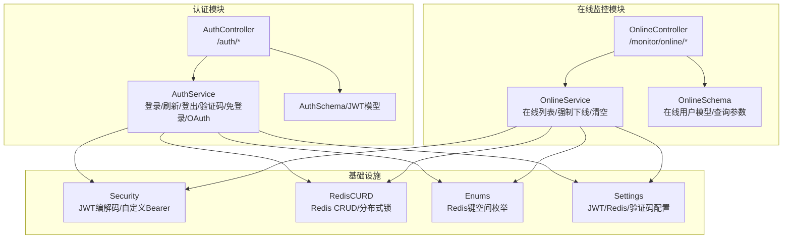
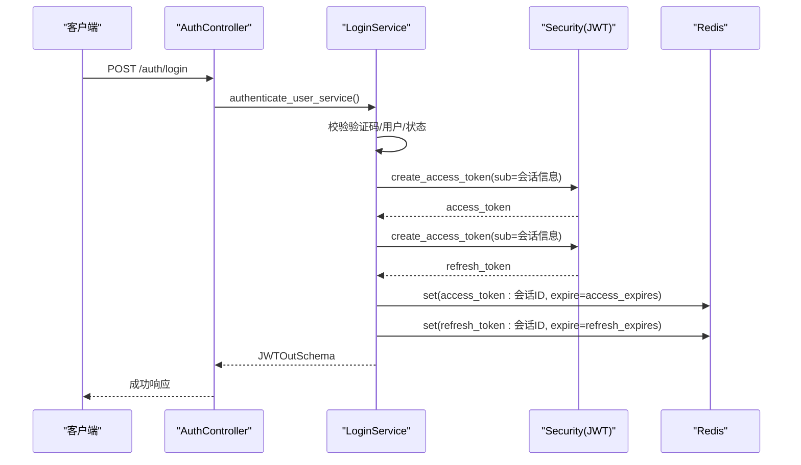
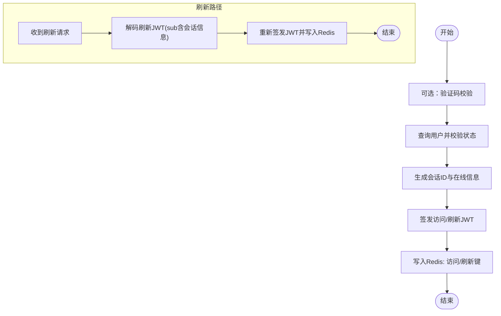
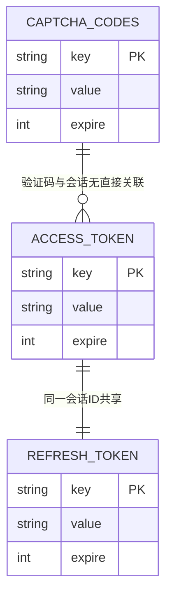
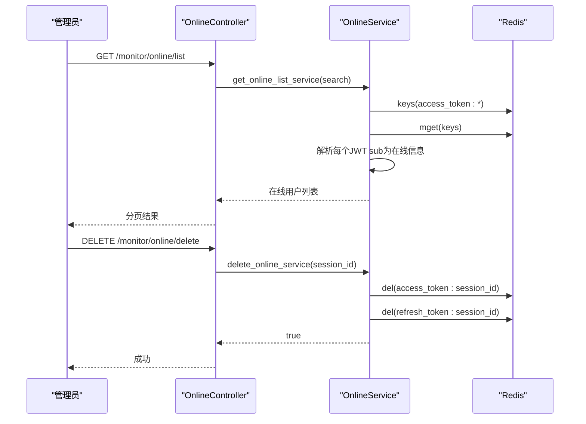
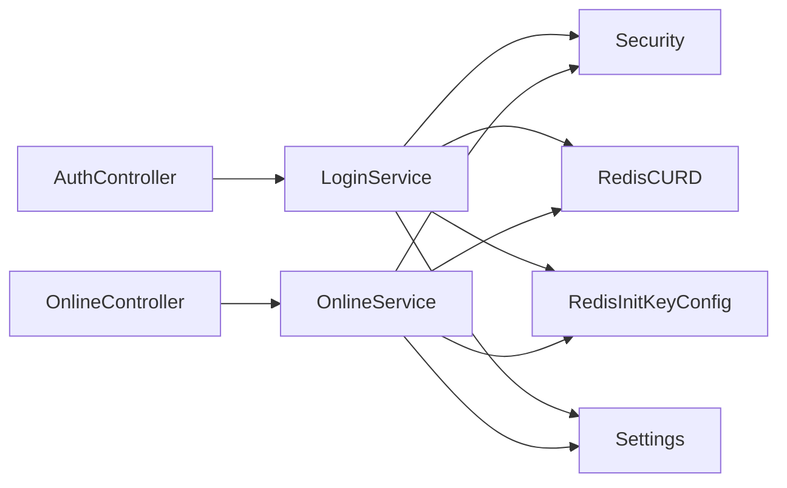

# 会话管理

<cite>
**本文引用的文件**
- [backend/app/api/v1/module_system/auth/controller.py](file://backend/app/api/v1/module_system/auth/controller.py)
- [backend/app/api/v1/module_system/auth/service.py](file://backend/app/api/v1/module_system/auth/service.py)
- [backend/app/api/v1/module_system/auth/schema.py](file://backend/app/api/v1/module_system/auth/schema.py)
- [backend/app/api/v1/module_system/auth/oauth_service.py](file://backend/app/api/v1/module_system/auth/oauth_service.py)
- [backend/app/api/v1/module_monitor/online/controller.py](file://backend/app/api/v1/module_monitor/online/controller.py)
- [backend/app/api/v1/module_monitor/online/service.py](file://backend/app/api/v1/module_monitor/online/service.py)
- [backend/app/api/v1/module_monitor/online/schema.py](file://backend/app/api/v1/module_monitor/online/schema.py)
- [backend/app/common/enums.py](file://backend/app/common/enums.py)
- [backend/app/core/security.py](file://backend/app/core/security.py)
- [backend/app/core/redis_crud.py](file://backend/app/core/redis_crud.py)
- [backend/app/config/setting.py](file://backend/app/config/setting.py)
- [frontend/web/src/api/module_monitor/online.ts](file://frontend/web/src/api/module_monitor/online.ts)
</cite>

## 目录
1. [简介](#简介)
2. [项目结构](#项目结构)
3. [核心组件](#核心组件)
4. [架构总览](#架构总览)
5. [详细组件分析](#详细组件分析)
6. [依赖分析](#依赖分析)
7. [性能考量](#性能考量)
8. [故障排查指南](#故障排查指南)
9. [结论](#结论)
10. [附录](#附录)

## 简介
本文件面向会话管理系统，围绕用户会话的创建、维护与销毁进行系统化说明。重点覆盖以下方面：
- 会话生命周期：登录、刷新、退出
- Redis 会话存储策略与键空间设计
- 会话过期管理与滑动过期
- 并发控制与分布式锁能力
- 在线用户监控、强制下线与全量清退
- 会话劫持防护与安全配置
- 会话清理策略与性能优化
- 会话状态跟踪、用户行为分析与安全审计
- 扩展与自定义实现指南

## 项目结构
会话管理相关代码主要分布在后端认证模块与在线监控模块，并通过统一的安全与配置模块协同工作。

图表来源
- [backend/app/api/v1/module_system/auth/controller.py:38-349](file://backend/app/api/v1/module_system/auth/controller.py#L38-L349)
- [backend/app/api/v1/module_system/auth/service.py:45-576](file://backend/app/api/v1/module_system/auth/service.py#L45-L576)
- [backend/app/api/v1/module_monitor/online/controller.py:17-109](file://backend/app/api/v1/module_monitor/online/controller.py#L17-L109)
- [backend/app/api/v1/module_monitor/online/service.py:13-119](file://backend/app/api/v1/module_monitor/online/service.py#L13-L119)
- [backend/app/core/security.py:11-149](file://backend/app/core/security.py#L11-L149)
- [backend/app/core/redis_crud.py:9-343](file://backend/app/core/redis_crud.py#L9-L343)
- [backend/app/common/enums.py:42-74](file://backend/app/common/enums.py#L42-L74)
- [backend/app/config/setting.py:67-122](file://backend/app/config/setting.py#L67-L122)

章节来源
- [backend/app/api/v1/module_system/auth/controller.py:38-349](file://backend/app/api/v1/module_system/auth/controller.py#L38-L349)
- [backend/app/api/v1/module_system/auth/service.py:45-576](file://backend/app/api/v1/module_system/auth/service.py#L45-L576)
- [backend/app/api/v1/module_monitor/online/controller.py:17-109](file://backend/app/api/v1/module_monitor/online/controller.py#L17-L109)
- [backend/app/api/v1/module_monitor/online/service.py:13-119](file://backend/app/api/v1/module_monitor/online/service.py#L13-L119)
- [backend/app/core/security.py:11-149](file://backend/app/core/security.py#L11-L149)
- [backend/app/core/redis_crud.py:9-343](file://backend/app/core/redis_crud.py#L9-L343)
- [backend/app/common/enums.py:42-74](file://backend/app/common/enums.py#L42-L74)
- [backend/app/config/setting.py:67-122](file://backend/app/config/setting.py#L67-L122)

## 核心组件
- 认证控制器与服务
  - 提供登录、刷新、退出、验证码、免登录、OAuth 登录等能力
  - 会话信息作为 JWT 的 sub 字段，持久化至 Redis，键空间由枚举统一管理
- 在线监控控制器与服务
  - 支持在线用户列表查询、按条件筛选、强制下线、全量清退
  - 基于 Redis 键扫描与批量读取实现
- 安全与配置
  - JWT 编解码、自定义 Bearer 认证、滑动过期策略
  - Redis 连接与 CRUD、分布式锁、续约与安全解锁
  - 系统配置集中管理，包括 JWT 过期间隔、验证码、Redis 连接等

章节来源
- [backend/app/api/v1/module_system/auth/controller.py:41-170](file://backend/app/api/v1/module_system/auth/controller.py#L41-L170)
- [backend/app/api/v1/module_system/auth/service.py:127-337](file://backend/app/api/v1/module_system/auth/service.py#L127-L337)
- [backend/app/api/v1/module_monitor/online/controller.py:20-108](file://backend/app/api/v1/module_monitor/online/controller.py#L20-L108)
- [backend/app/api/v1/module_monitor/online/service.py:16-119](file://backend/app/api/v1/module_monitor/online/service.py#L16-L119)
- [backend/app/core/security.py:98-149](file://backend/app/core/security.py#L98-L149)
- [backend/app/core/redis_crud.py:69-271](file://backend/app/core/redis_crud.py#L69-L271)
- [backend/app/config/setting.py:67-122](file://backend/app/config/setting.py#L67-L122)

## 架构总览
会话管理采用“JWT + Redis”的双轨存储：JWT 负责传输与校验，Redis 负责会话状态与在线管理。登录成功后，服务端生成访问/刷新令牌，并将会话信息以 JWT sub 的形式写入 Redis，键名遵循统一枚举规范。在线监控通过扫描 Redis 键空间获取在线用户列表，支持强制下线与全量清退。

图表来源
- [backend/app/api/v1/module_system/auth/controller.py:47-77](file://backend/app/api/v1/module_system/auth/controller.py#L47-L77)
- [backend/app/api/v1/module_system/auth/service.py:127-220](file://backend/app/api/v1/module_system/auth/service.py#L127-L220)
- [backend/app/core/security.py:98-113](file://backend/app/core/security.py#L98-L113)
- [backend/app/common/enums.py:42-47](file://backend/app/common/enums.py#L42-L47)

## 详细组件分析

### 会话创建与维护（登录/刷新/退出）
- 登录流程
  - 验证码校验（可选）、用户查询与密码校验、状态检查
  - 生成会话 ID，解析 UA 与 IP，构造在线用户信息（包含登录地点、设备、类型等）
  - 生成访问/刷新 JWT，并写入 Redis，键名以枚举前缀 + 会话 ID 组成
- 刷新流程
  - 使用刷新令牌解码，从 sub 中提取会话信息与用户 ID
  - 重新签发新的访问/刷新令牌，并覆盖写入 Redis
- 退出流程
  - 使用访问令牌解码，获取会话 ID
  - 删除对应的访问/刷新令牌键，完成会话注销

图表来源
- [backend/app/api/v1/module_system/auth/service.py:49-124](file://backend/app/api/v1/module_system/auth/service.py#L49-L124)
- [backend/app/api/v1/module_system/auth/service.py:223-307](file://backend/app/api/v1/module_system/auth/service.py#L223-L307)
- [backend/app/api/v1/module_system/auth/service.py:310-337](file://backend/app/api/v1/module_system/auth/service.py#L310-L337)

章节来源
- [backend/app/api/v1/module_system/auth/service.py:49-124](file://backend/app/api/v1/module_system/auth/service.py#L49-L124)
- [backend/app/api/v1/module_system/auth/service.py:127-220](file://backend/app/api/v1/module_system/auth/service.py#L127-L220)
- [backend/app/api/v1/module_system/auth/service.py:223-307](file://backend/app/api/v1/module_system/auth/service.py#L223-L307)
- [backend/app/api/v1/module_system/auth/service.py:310-337](file://backend/app/api/v1/module_system/auth/service.py#L310-L337)

### Redis 会话存储策略与键空间
- 键空间枚举
  - 访问令牌键：access_token:<会话ID>
  - 刷新令牌键：refresh_token:<会话ID>
  - 验证码键：captcha_codes:<随机key>
  - 系统配置/字典/调度锁等
- 写入策略
  - 访问/刷新令牌写入时设置过期时间（与配置一致）
  - sub 中存放完整的在线用户信息 JSON，便于后续在线查询与展示
- 读取策略
  - 在线查询通过扫描访问令牌键，批量读取后解析 JWT sub 得到在线信息
  - 强制下线与清退通过删除访问/刷新令牌键实现

图表来源
- [backend/app/common/enums.py:42-47](file://backend/app/common/enums.py#L42-L47)
- [backend/app/api/v1/module_system/auth/service.py:203-213](file://backend/app/api/v1/module_system/auth/service.py#L203-L213)
- [backend/app/api/v1/module_system/auth/service.py:289-300](file://backend/app/api/v1/module_system/auth/service.py#L289-L300)
- [backend/app/api/v1/module_system/auth/service.py:365-370](file://backend/app/api/v1/module_system/auth/service.py#L365-L370)

章节来源
- [backend/app/common/enums.py:42-47](file://backend/app/common/enums.py#L42-L47)
- [backend/app/api/v1/module_system/auth/service.py:203-213](file://backend/app/api/v1/module_system/auth/service.py#L203-L213)
- [backend/app/api/v1/module_system/auth/service.py:289-300](file://backend/app/api/v1/module_system/auth/service.py#L289-L300)
- [backend/app/api/v1/module_system/auth/service.py:365-370](file://backend/app/api/v1/module_system/auth/service.py#L365-L370)

### 在线用户监控、强制下线与全量清退
- 在线列表
  - 扫描访问令牌键，批量读取令牌，逐个解析 JWT sub，拼装在线用户信息
  - 支持按名称、IP、登录地点模糊查询
  - 按登录时间倒序排序
- 强制下线
  - 根据会话 ID 删除访问/刷新令牌键，立即使该会话失效
- 全量清退
  - 清空访问/刷新令牌键前缀，批量使所有在线会话失效

图表来源
- [backend/app/api/v1/module_monitor/online/controller.py:27-52](file://backend/app/api/v1/module_monitor/online/controller.py#L27-L52)
- [backend/app/api/v1/module_monitor/online/service.py:17-49](file://backend/app/api/v1/module_monitor/online/service.py#L17-L49)
- [backend/app/api/v1/module_monitor/online/service.py:52-68](file://backend/app/api/v1/module_monitor/online/service.py#L52-L68)
- [frontend/web/src/api/module_monitor/online.ts:7-22](file://frontend/web/src/api/module_monitor/online.ts#L7-L22)

章节来源
- [backend/app/api/v1/module_monitor/online/controller.py:20-108](file://backend/app/api/v1/module_monitor/online/controller.py#L20-L108)
- [backend/app/api/v1/module_monitor/online/service.py:16-119](file://backend/app/api/v1/module_monitor/online/service.py#L16-L119)
- [frontend/web/src/api/module_monitor/online.ts:1-52](file://frontend/web/src/api/module_monitor/online.ts#L1-L52)

### 会话过期管理与滑动过期
- 过期策略
  - 访问令牌与刷新令牌均设置固定过期时间（配置项）
  - 退出登录时主动删除对应键，提前终止会话
- 滑动过期
  - 配置项支持滑动过期（用户操作时自动续期），可在网关或中间件层配合实现
- 过期时间读取
  - RedisCURD 提供 TTL 查询能力，可用于审计与运维

章节来源
- [backend/app/config/setting.py:69-73](file://backend/app/config/setting.py#L69-L73)
- [backend/app/core/redis_crud.py:216-229](file://backend/app/core/redis_crud.py#L216-L229)

### 并发控制与分布式锁
- 分布式锁能力
  - RedisCURD 提供 lock/unlock/renew_lock/unlock_simple 等方法
  - 使用 Lua 原子脚本保障解锁与续约的安全性
- 典型场景
  - 会话合并/迁移、强制下线并发保护、定时清理任务互斥执行

章节来源
- [backend/app/core/redis_crud.py:98-165](file://backend/app/core/redis_crud.py#L98-L165)
- [backend/app/core/redis_crud.py:231-255](file://backend/app/core/redis_crud.py#L231-L255)

### 会话劫持防护与安全配置
- 认证与解码
  - 自定义 Bearer 认证，严格校验令牌类型
  - JWT 解码时校验签名、算法、过期时间，异常统一抛出自定义异常
- 会话信息完整性
  - 在线用户信息完整写入 sub，解析时可校验必要字段
- 配置要点
  - SECRET_KEY、ALGORITHM、ACCESS_TOKEN_EXPIRE_MINUTES、REFRESH_TOKEN_EXPIRE_MINUTES
  - CAPTCHA_ENABLE/CAPTCHA_EXPIRE_SECONDS 降低暴力破解风险

章节来源
- [backend/app/core/security.py:11-51](file://backend/app/core/security.py#L11-L51)
- [backend/app/core/security.py:116-149](file://backend/app/core/security.py#L116-L149)
- [backend/app/config/setting.py:67-122](file://backend/app/config/setting.py#L67-L122)

### 会话清理策略与性能优化
- 清理策略
  - 过期自动失效：Redis 过期键自然淘汰
  - 主动清理：退出登录、强制下线、全量清退
  - 定时任务：建议使用调度器定期扫描并清理异常键
- 性能优化
  - 批量读取：在线查询使用 mget 减少 RTT
  - 键扫描：仅扫描访问令牌键，避免全库扫描
  - TTL 审计：结合 TTL 查询定位长尾键
  - 分布式锁：对高危操作加锁，避免竞态

章节来源
- [backend/app/api/v1/module_monitor/online/service.py:31-32](file://backend/app/api/v1/module_monitor/online/service.py#L31-L32)
- [backend/app/core/redis_crud.py:16-31](file://backend/app/core/redis_crud.py#L16-L31)
- [backend/app/core/redis_crud.py:216-229](file://backend/app/core/redis_crud.py#L216-L229)

### 会话状态跟踪、用户行为分析与安全审计
- 在线状态跟踪
  - 在线列表即会话状态快照，包含用户、IP、位置、设备、登录时间等
- 行为分析
  - 可基于在线信息统计活跃度、地域分布、设备偏好
- 安全审计
  - 操作日志记录（含忽略项配置），结合在线列表与 Redis 事件进行审计

章节来源
- [backend/app/api/v1/module_monitor/online/schema.py:8-25](file://backend/app/api/v1/module_monitor/online/schema.py#L8-L25)
- [backend/app/config/setting.py:153-162](file://backend/app/config/setting.py#L153-L162)

### 扩展与自定义实现指南
- 新增登录渠道
  - 参考 OAuth 流程，在回调中完成用户识别与登录令牌发放
- 自定义会话信息
  - 在会话构建阶段扩展 sub 字段，确保在线查询与展示兼容
- 自定义过期策略
  - 结合滑动过期与 Redis 过期策略，按业务需求调整 ACCESS_TOKEN_EXPIRE_MINUTES/REFRESH_TOKEN_EXPIRE_MINUTES
- 自定义清理策略
  - 增加定时任务扫描异常键（如空值、过期但未删除），并执行清理

章节来源
- [backend/app/api/v1/module_system/auth/oauth_service.py:335-359](file://backend/app/api/v1/module_system/auth/oauth_service.py#L335-L359)
- [backend/app/api/v1/module_system/auth/service.py:174-185](file://backend/app/api/v1/module_system/auth/service.py#L174-L185)
- [backend/app/config/setting.py:69-73](file://backend/app/config/setting.py#L69-L73)

## 依赖分析
- 组件耦合
  - AuthController/OnlineController 依赖各自 Service 层
  - Service 层依赖 Security（JWT）、RedisCURD（Redis）、Enums（键空间）、Settings（配置）
- 外部依赖
  - Redis 作为会话状态与在线管理载体
  - 前端通过在线 API 获取在线用户列表并触发强制下线

图表来源
- [backend/app/api/v1/module_system/auth/controller.py:38-349](file://backend/app/api/v1/module_system/auth/controller.py#L38-L349)
- [backend/app/api/v1/module_system/auth/service.py:45-576](file://backend/app/api/v1/module_system/auth/service.py#L45-L576)
- [backend/app/api/v1/module_monitor/online/controller.py:17-109](file://backend/app/api/v1/module_monitor/online/controller.py#L17-L109)
- [backend/app/api/v1/module_monitor/online/service.py:13-119](file://backend/app/api/v1/module_monitor/online/service.py#L13-L119)
- [backend/app/core/security.py:11-149](file://backend/app/core/security.py#L11-L149)
- [backend/app/core/redis_crud.py:9-343](file://backend/app/core/redis_crud.py#L9-L343)
- [backend/app/common/enums.py:42-74](file://backend/app/common/enums.py#L42-L74)
- [backend/app/config/setting.py:67-122](file://backend/app/config/setting.py#L67-L122)

章节来源
- [backend/app/api/v1/module_system/auth/controller.py:38-349](file://backend/app/api/v1/module_system/auth/controller.py#L38-L349)
- [backend/app/api/v1/module_system/auth/service.py:45-576](file://backend/app/api/v1/module_system/auth/service.py#L45-L576)
- [backend/app/api/v1/module_monitor/online/controller.py:17-109](file://backend/app/api/v1/module_monitor/online/controller.py#L17-L109)
- [backend/app/api/v1/module_monitor/online/service.py:13-119](file://backend/app/api/v1/module_monitor/online/service.py#L13-L119)
- [backend/app/core/security.py:11-149](file://backend/app/core/security.py#L11-L149)
- [backend/app/core/redis_crud.py:9-343](file://backend/app/core/redis_crud.py#L9-L343)
- [backend/app/common/enums.py:42-74](file://backend/app/common/enums.py#L42-L74)
- [backend/app/config/setting.py:67-122](file://backend/app/config/setting.py#L67-L122)

## 性能考量
- 批量操作
  - 在线查询使用 mget 与 keys，减少网络往返
- 键空间设计
  - 明确前缀与命名规范，避免键冲突与扫描开销
- 过期策略
  - 合理设置过期时间，平衡安全性与内存占用
- 分布式锁
  - 对高危操作加锁，避免并发导致的数据不一致

## 故障排查指南
- 常见问题
  - 令牌无效/过期：检查 JWT 解码异常与过期时间
  - 在线列表为空：确认 Redis 中访问令牌键是否存在
  - 强制下线无效：确认会话 ID 是否正确、键是否被删除
- 定位手段
  - 查看操作日志与异常栈
  - 使用 RedisCURD 的 info/db_size/commandstats/ttl 辅助诊断
- 处理建议
  - 对异常键进行清理与重建
  - 对并发敏感操作增加分布式锁

章节来源
- [backend/app/core/security.py:116-149](file://backend/app/core/security.py#L116-L149)
- [backend/app/core/redis_crud.py:273-307](file://backend/app/core/redis_crud.py#L273-L307)
- [backend/app/core/redis_crud.py:216-229](file://backend/app/core/redis_crud.py#L216-L229)

## 结论
本会话管理系统以 JWT + Redis 为核心，实现了会话的可靠创建、维护与销毁，并提供了完善的在线监控、强制下线与全量清退能力。通过统一的键空间设计、分布式锁与配置化策略，系统在保证安全性的同时具备良好的可扩展性与可运维性。建议结合业务场景进一步完善滑动过期、行为分析与安全审计能力。

## 附录
- 关键配置项
  - JWT：SECRET_KEY、ALGORITHM、ACCESS_TOKEN_EXPIRE_MINUTES、REFRESH_TOKEN_EXPIRE_MINUTES、TOKEN_TYPE、TOKEN_SLIDING_EXPIRE
  - Redis：REDIS_HOST、REDIS_PORT、REDIS_DB_NAME、REDIS_USER、REDIS_PASSWORD
  - 验证码：CAPTCHA_ENABLE、CAPTCHA_EXPIRE_SECONDS
- 前端交互
  - 在线用户列表与强制下线调用参考在线 API

章节来源
- [backend/app/config/setting.py:67-122](file://backend/app/config/setting.py#L67-L122)
- [frontend/web/src/api/module_monitor/online.ts:1-52](file://frontend/web/src/api/module_monitor/online.ts#L1-L52)