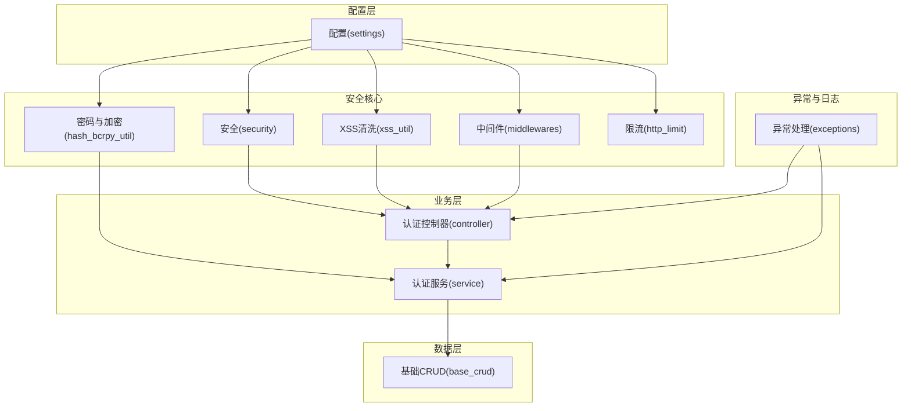
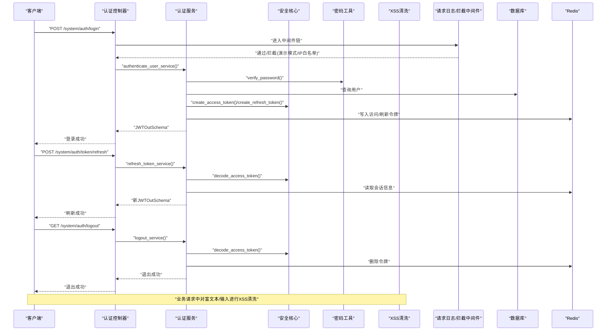
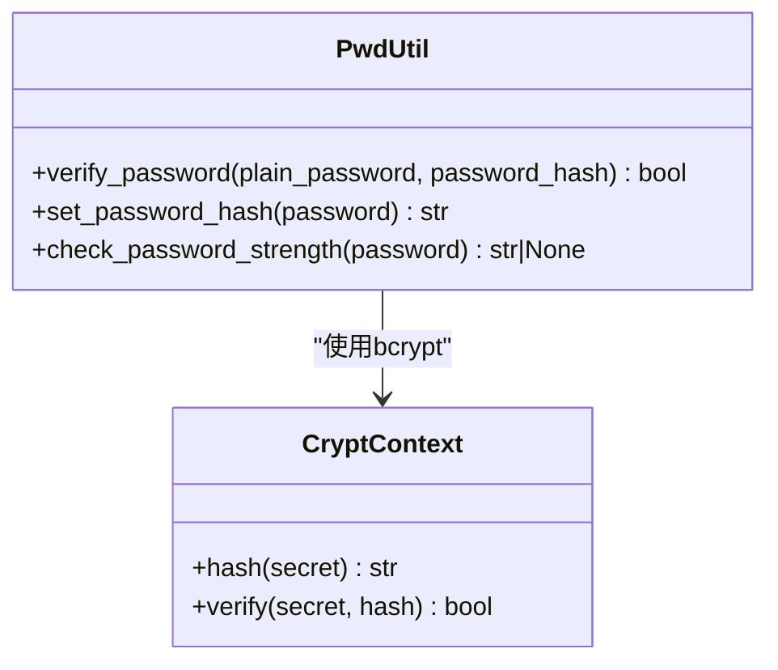
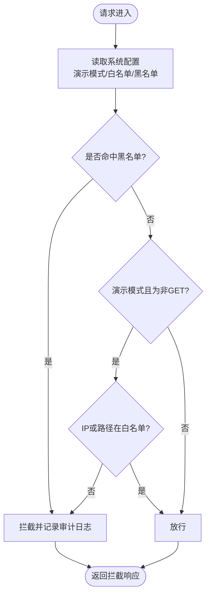
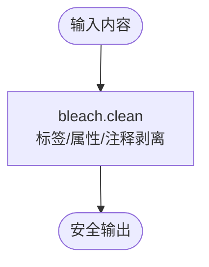
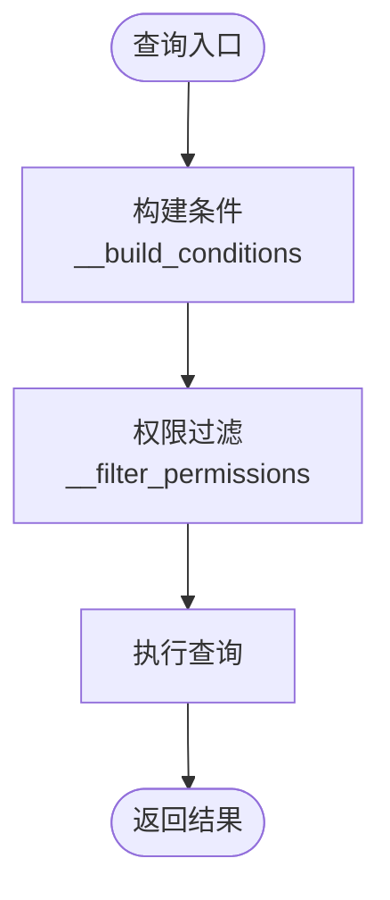
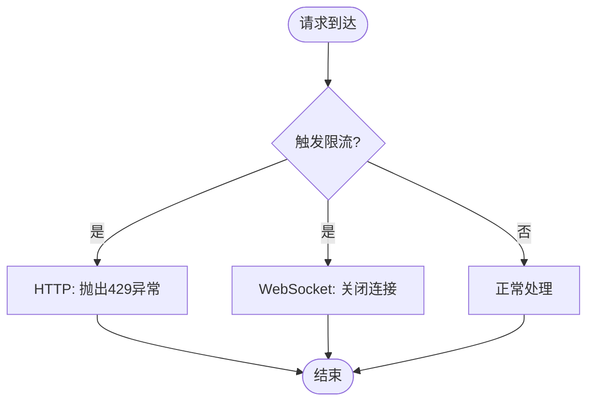
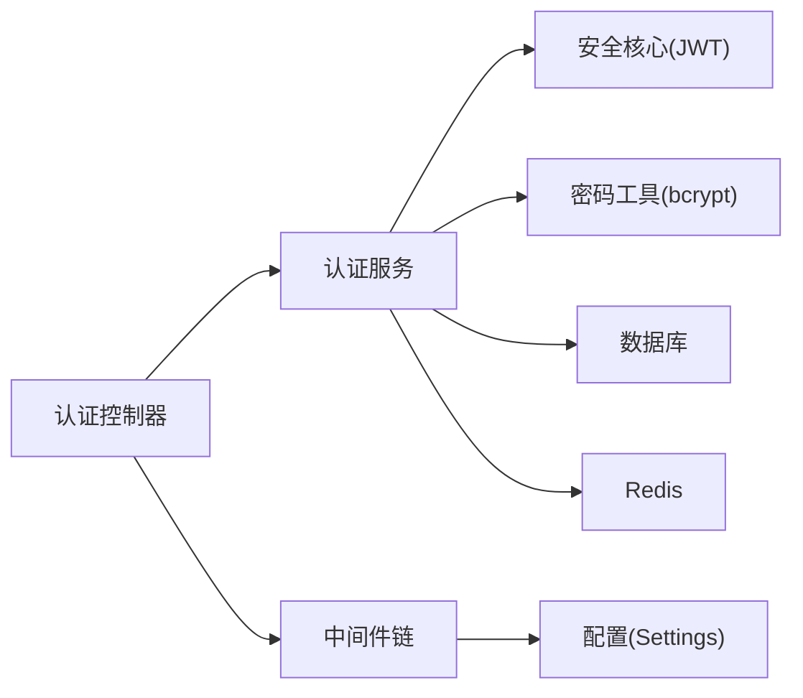

# 安全最佳实践

<cite>
**本文引用的文件**   
- [security.py](file://backend/app/core/security.py)
- [hash_bcrpy_util.py](file://backend/app/utils/hash_bcrpy_util.py)
- [xss_util.py](file://backend/app/utils/xss_util.py)
- [middlewares.py](file://backend/app/core/middlewares.py)
- [http_limit.py](file://backend/app/core/http_limit.py)
- [setting.py](file://backend/app/config/setting.py)
- [captcha_util.py](file://backend/app/utils/captcha_util.py)
- [controller.py](file://backend/app/api/v1/module_system/auth/controller.py)
- [exceptions.py](file://backend/app/core/exceptions.py)
- [base_crud.py](file://backend/app/core/base_crud.py)
- [service.py](file://backend/app/api/v1/module_system/auth/service.py)
</cite>

## 目录
1. [简介](#简介)
2. [项目结构](#项目结构)
3. [核心组件](#核心组件)
4. [架构总览](#架构总览)
5. [详细组件分析](#详细组件分析)
6. [依赖分析](#依赖分析)
7. [性能考虑](#性能考虑)
8. [故障排查指南](#故障排查指南)
9. [结论](#结论)
10. [附录](#附录)

## 简介
本指南围绕密码加密存储、盐值与哈希算法选择、CSRF/XSS/SQL注入防护、请求频率限制、IP黑白名单与异常行为检测、安全配置模板、漏洞扫描与渗透测试建议、安全事件响应与日志审计、合规性要求等方面，结合代码库中的实现进行系统化梳理与落地建议。目标是帮助开发者与运维人员建立一套可执行、可审计、可扩展的安全体系。

## 项目结构
后端采用 FastAPI + SQLAlchemy 异步 ORM 的分层架构，安全相关能力主要分布在以下模块：
- 配置层：集中管理密钥、算法、跨域、日志、GZip、验证码、限流等安全配置
- 安全核心：JWT 认证、密码哈希、验证码、XSS 清洗、请求日志与拦截中间件
- 业务层：认证控制器与服务，封装登录、刷新、登出、免登录、OAuth 等流程
- 异常与日志：统一异常处理与日志输出，便于审计与追踪

**图表来源**
- [setting.py:67-73](file://backend/app/config/setting.py#L67-L73)
- [security.py:98-149](file://backend/app/core/security.py#L98-L149)
- [hash_bcrpy_util.py:14-51](file://backend/app/utils/hash_bcrpy_util.py#L14-L51)
- [xss_util.py:98-159](file://backend/app/utils/xss_util.py#L98-L159)
- [middlewares.py:22-215](file://backend/app/core/middlewares.py#L22-L215)
- [http_limit.py:10-43](file://backend/app/core/http_limit.py#L10-L43)
- [controller.py:41-349](file://backend/app/api/v1/module_system/auth/controller.py#L41-L349)
- [service.py:45-576](file://backend/app/api/v1/module_system/auth/service.py#L45-L576)
- [base_crud.py:26-571](file://backend/app/core/base_crud.py#L26-L571)
- [exceptions.py:57-248](file://backend/app/core/exceptions.py#L57-L248)

**章节来源**
- [setting.py:67-73](file://backend/app/config/setting.py#L67-L73)
- [middlewares.py:22-215](file://backend/app/core/middlewares.py#L22-L215)
- [controller.py:41-349](file://backend/app/api/v1/module_system/auth/controller.py#L41-L349)

## 核心组件
- JWT 认证与令牌管理：自定义 OAuth2 密码流、令牌生成与解码、刷新与登出
- 密码加密与强度校验：bcrypt 哈希、轮数配置、密码强度规则
- XSS 防护：HTML 白名单清洗、样式白名单预留
- CSRF 防护：基于令牌与白名单策略、演示模式拦截
- SQL 注入防护：ORM 查询构建、条件拼接与权限过滤
- 请求频率限制：HTTP/WebSocket 限流回调
- IP 黑白名单与异常行为检测：中间件读取系统配置、拦截非 GET 请求
- 统一异常与日志：结构化错误响应、审计日志输出

**章节来源**
- [security.py:98-149](file://backend/app/core/security.py#L98-L149)
- [hash_bcrpy_util.py:14-73](file://backend/app/utils/hash_bcrpy_util.py#L14-L73)
- [xss_util.py:98-159](file://backend/app/utils/xss_util.py#L98-L159)
- [middlewares.py:133-186](file://backend/app/core/middlewares.py#L133-L186)
- [base_crud.py:446-451](file://backend/app/core/base_crud.py#L446-L451)
- [http_limit.py:10-43](file://backend/app/core/http_limit.py#L10-L43)
- [exceptions.py:57-248](file://backend/app/core/exceptions.py#L57-L248)

## 架构总览
下图展示认证与安全相关的关键交互流程，包括登录、令牌刷新、登出、验证码、XSS 清洗、请求拦截与限流。

**图表来源**
- [controller.py:41-171](file://backend/app/api/v1/module_system/auth/controller.py#L41-L171)
- [service.py:49-338](file://backend/app/api/v1/module_system/auth/service.py#L49-L338)
- [security.py:98-149](file://backend/app/core/security.py#L98-L149)
- [hash_bcrpy_util.py:27-51](file://backend/app/utils/hash_bcrpy_util.py#L27-L51)
- [xss_util.py:98-159](file://backend/app/utils/xss_util.py#L98-L159)
- [middlewares.py:87-199](file://backend/app/core/middlewares.py#L87-L199)

## 详细组件分析

### 密码加密存储与盐值生成
- 算法与轮数：使用 bcrypt，轮数配置在密码上下文中设置，提升抗暴力破解能力
- 存储策略：仅存储哈希值，不存储明文或可逆加密
- 强度校验：长度、大小写、数字要求，防止弱密码
- 生成与验证：统一入口封装，避免散落实现

**图表来源**
- [hash_bcrpy_util.py:14-51](file://backend/app/utils/hash_bcrpy_util.py#L14-L51)

**章节来源**
- [hash_bcrpy_util.py:14-73](file://backend/app/utils/hash_bcrpy_util.py#L14-L73)
- [service.py:95-98](file://backend/app/api/v1/module_system/auth/service.py#L95-L98)

### 哈希算法选择与盐值
- 选择 bcrypt：内置盐值生成与自适应成本因子，适合密码存储
- 避免 MD5/SHA1：不适用于密码存储
- 保持轮数稳定：在性能与安全之间平衡，定期评估

**章节来源**
- [hash_bcrpy_util.py:14-18](file://backend/app/utils/hash_bcrpy_util.py#L14-L18)

### CSRF 防护
- 令牌机制：JWT 作为会话载体，配合白名单与演示模式拦截
- 拦截策略：中间件读取系统配置，黑名单优先，演示模式下非 GET 请求需白名单或 IP 白名单
- 会话关联：从令牌中提取 session_id，增强审计与追踪

**图表来源**
- [middlewares.py:133-186](file://backend/app/core/middlewares.py#L133-L186)

**章节来源**
- [middlewares.py:133-186](file://backend/app/core/middlewares.py#L133-L186)

### XSS 攻击防范
- 白名单策略：限定允许的标签、属性与样式，剥离危险内容
- 两套策略：基础清洗与带样式的清洗，后者预留样式白名单扩展
- 输入净化：对富文本与用户输入进行清洗，输出安全 HTML

**图表来源**
- [xss_util.py:98-142](file://backend/app/utils/xss_util.py#L98-L142)

**章节来源**
- [xss_util.py:98-159](file://backend/app/utils/xss_util.py#L98-L159)

### SQL 注入防护
- ORM 查询：使用 SQLAlchemy 构建查询条件，避免字符串拼接
- 条件构造：统一条件构建器，支持多种比较、区间、模糊匹配、空值判断
- 权限过滤：在查询阶段加入权限过滤，减少越权访问
- 软删除：统一软删除字段，避免误删与越权

**图表来源**
- [base_crud.py:453-512](file://backend/app/core/base_crud.py#L453-L512)
- [base_crud.py:446-451](file://backend/app/core/base_crud.py#L446-L451)

**章节来源**
- [base_crud.py:453-512](file://backend/app/core/base_crud.py#L453-L512)
- [base_crud.py:446-451](file://backend/app/core/base_crud.py#L446-L451)

### 请求频率限制
- HTTP 与 WebSocket：分别提供回调，HTTP 抛出自定义异常，WebSocket 主动关闭
- 重试提示：在响应头或数据中提示 Retry-After，引导客户端退避

**图表来源**
- [http_limit.py:10-43](file://backend/app/core/http_limit.py#L10-L43)

**章节来源**
- [http_limit.py:10-43](file://backend/app/core/http_limit.py#L10-L43)

### IP 白名单与异常行为检测
- 配置来源：中间件从系统参数服务读取演示模式、白名单、黑名单
- 行为检测：非 GET 请求在演示模式下受控，异常来源与 UA、路径、会话 ID 等纳入审计
- 实时生效：通过 Redis 与系统参数服务动态调整

**章节来源**
- [middlewares.py:133-186](file://backend/app/core/middlewares.py#L133-L186)

### 安全配置模板
- 密钥与算法：SECRET_KEY、ALGORITHM、ACCESS_TOKEN_EXPIRE_MINUTES、TOKEN_TYPE
- 跨域与日志：ALLOW_ORIGINS、ALLOW_METHODS、ALLOW_HEADERS、CORS_EXPOSE_HEADERS、LOGGER_LEVEL
- 验证码：CAPTCHA_ENABLE、CAPTCHA_EXPIRE_SECONDS、CAPTCHA_FONT_SIZE、CAPTCHA_FONT_PATH
- GZip：GZIP_ENABLE、GZIP_MIN_SIZE、GZIP_COMPRESS_LEVEL
- 请求限制：REQUEST_LIMITER_REDIS_PREFIX
- 中间件顺序：CORS、请求日志、GZip

**章节来源**
- [setting.py:67-73](file://backend/app/config/setting.py#L67-L73)
- [setting.py:57-62](file://backend/app/config/setting.py#L57-L62)
- [setting.py:118-122](file://backend/app/config/setting.py#L118-L122)
- [setting.py:167-169](file://backend/app/config/setting.py#L167-L169)
- [setting.py:222-223](file://backend/app/config/setting.py#L222-L223)
- [setting.py:228-241](file://backend/app/config/setting.py#L228-L241)

### 漏洞扫描与渗透测试建议
- 工具建议：OWASP ZAP、Burp Suite、Nuclei、SQLMap
- 覆盖范围：认证绕过、敏感信息泄露、参数篡改、越权访问、命令注入、文件上传、CORS 配置不当
- 自动化：结合 CI/CD 流水线集成扫描任务
- 手工测试：重点验证 JWT 令牌生命周期、刷新与登出流程、验证码有效性与过期策略

[本节为通用建议，无需特定文件引用]

### 安全事件响应
- 异常统一处理：自定义异常类与全局异常处理器，标准化错误响应与日志
- 审计日志：中间件记录请求来源、方法、路径、处理时间、拦截原因、会话 ID、UA 等
- 快速处置：根据拦截原因与日志定位，临时调整白名单/黑名单或暂停相关接口

**章节来源**
- [exceptions.py:57-248](file://backend/app/core/exceptions.py#L57-L248)
- [middlewares.py:169-183](file://backend/app/core/middlewares.py#L169-L183)

### 日志审计与合规性
- 结构化日志：统一错误码、消息、状态码、数据体，便于检索与告警
- 操作审计：可配置的操作日志记录与忽略列表，覆盖增删改查等方法
- 合规要求：最小化日志留存、脱敏敏感字段、访问控制与审计追踪

**章节来源**
- [exceptions.py:57-248](file://backend/app/core/exceptions.py#L57-L248)
- [setting.py:153-162](file://backend/app/config/setting.py#L153-L162)

## 依赖分析
- 认证链路：控制器依赖服务，服务依赖安全核心与密码工具，同时访问数据库与 Redis
- 中间件链：CORS → 请求日志 → GZip，顺序影响性能与可观测性
- 配置中心：Settings 提供全局配置，中间件与服务按需读取

**图表来源**
- [controller.py:41-171](file://backend/app/api/v1/module_system/auth/controller.py#L41-L171)
- [service.py:49-338](file://backend/app/api/v1/module_system/auth/service.py#L49-L338)
- [security.py:98-149](file://backend/app/core/security.py#L98-L149)
- [hash_bcrpy_util.py:14-51](file://backend/app/utils/hash_bcrpy_util.py#L14-L51)
- [middlewares.py:22-215](file://backend/app/core/middlewares.py#L22-L215)
- [setting.py:228-241](file://backend/app/config/setting.py#L228-L241)

**章节来源**
- [controller.py:41-171](file://backend/app/api/v1/module_system/auth/controller.py#L41-L171)
- [service.py:49-338](file://backend/app/api/v1/module_system/auth/service.py#L49-L338)
- [middlewares.py:22-215](file://backend/app/core/middlewares.py#L22-L215)

## 性能考虑
- 压缩与传输：GZip 压缩阈值与级别可调，平衡带宽与 CPU 开销
- 令牌与缓存：Redis 存储令牌，注意键命名规范与过期策略
- 查询优化：分页与主键计数优化，避免全表扫描
- 中间件顺序：将轻量中间件前置，减少对热路径的影响

[本节为通用建议，无需特定文件引用]

## 故障排查指南
- 登录失败：检查验证码是否启用、是否过期、是否区分大小写；核对用户状态与密码哈希
- 令牌无效：确认算法与密钥一致、是否过期、是否使用正确的令牌类型
- 请求被拦截：检查演示模式、IP 白名单、路径白名单与黑名单配置
- XSS 失败：确认清洗策略与白名单配置，必要时调整允许标签与属性
- 限流触发：查看回调日志与 Retry-After 提示，调整限流阈值或客户端退避

**章节来源**
- [service.py:76-84](file://backend/app/api/v1/module_system/auth/service.py#L76-L84)
- [service.py:381-416](file://backend/app/api/v1/module_system/auth/service.py#L381-L416)
- [middlewares.py:154-167](file://backend/app/core/middlewares.py#L154-L167)
- [xss_util.py:98-159](file://backend/app/utils/xss_util.py#L98-L159)
- [http_limit.py:10-43](file://backend/app/core/http_limit.py#L10-L43)

## 结论
本项目在安全方面具备较为完善的基础设施：JWT 认证、bcrypt 密码存储、XSS 清洗、中间件拦截、限流与统一异常处理。建议在生产环境中进一步完善密钥轮换、审计日志分级、自动化扫描与渗透测试、以及针对业务场景的细粒度权限控制与数据脱敏策略，确保整体安全体系持续演进与合规。

## 附录
- 配置清单要点
  - 密钥与算法：SECRET_KEY、ALGORITHM、ACCESS_TOKEN_EXPIRE_MINUTES、TOKEN_TYPE
  - 跨域与日志：ALLOW_ORIGINS、ALLOW_METHODS、ALLOW_HEADERS、CORS_EXPOSE_HEADERS、LOGGER_LEVEL
  - 验证码：CAPTCHA_ENABLE、CAPTCHA_EXPIRE_SECONDS、CAPTCHA_FONT_SIZE、CAPTCHA_FONT_PATH
  - GZip：GZIP_ENABLE、GZIP_MIN_SIZE、GZIP_COMPRESS_LEVEL
  - 请求限制：REQUEST_LIMITER_REDIS_PREFIX
  - 中间件顺序：CORS、请求日志、GZip

**章节来源**
- [setting.py:67-73](file://backend/app/config/setting.py#L67-L73)
- [setting.py:57-62](file://backend/app/config/setting.py#L57-L62)
- [setting.py:118-122](file://backend/app/config/setting.py#L118-L122)
- [setting.py:167-169](file://backend/app/config/setting.py#L167-L169)
- [setting.py:222-223](file://backend/app/config/setting.py#L222-L223)
- [setting.py:228-241](file://backend/app/config/setting.py#L228-L241)