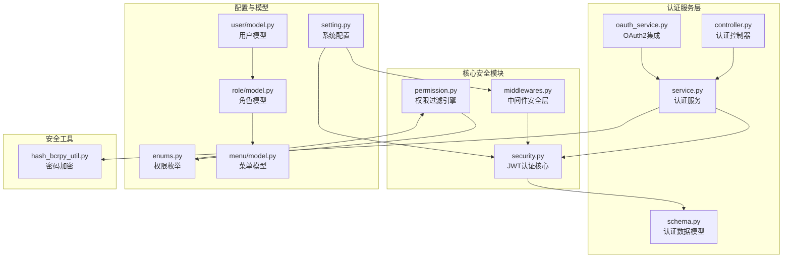
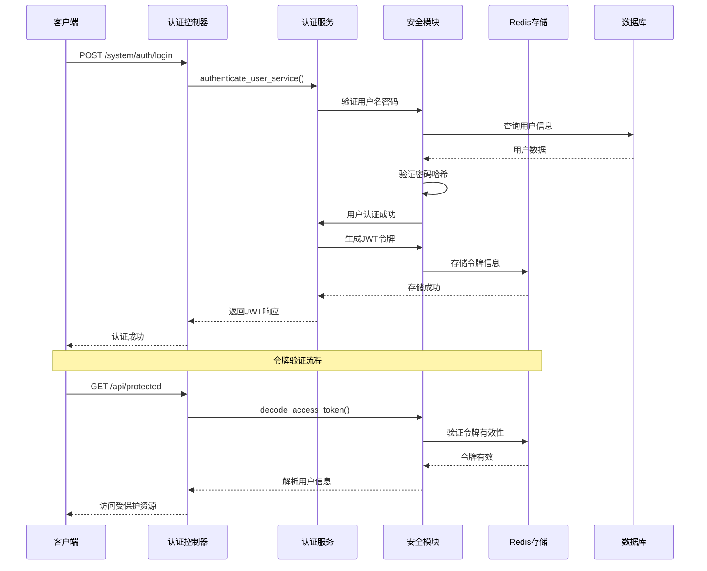
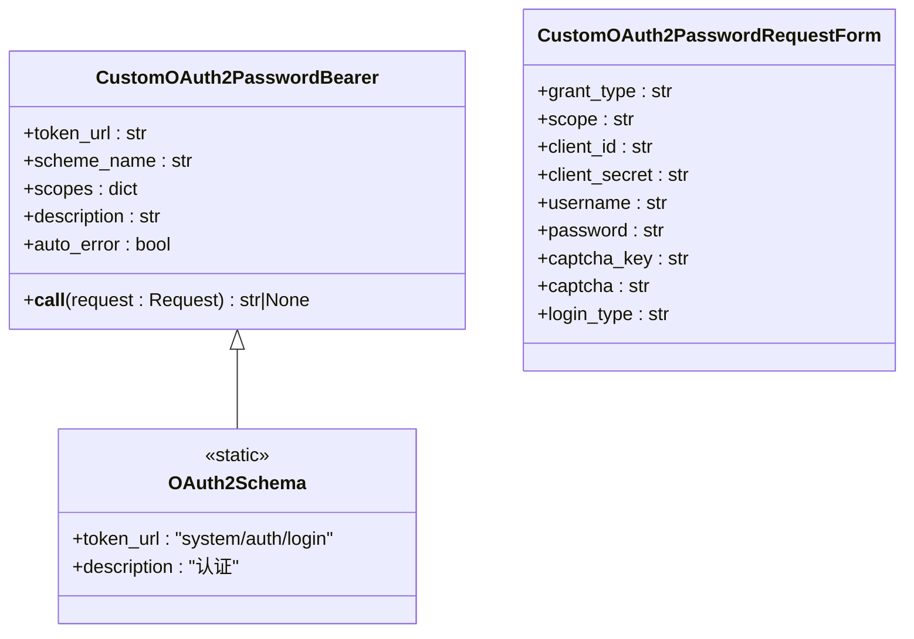
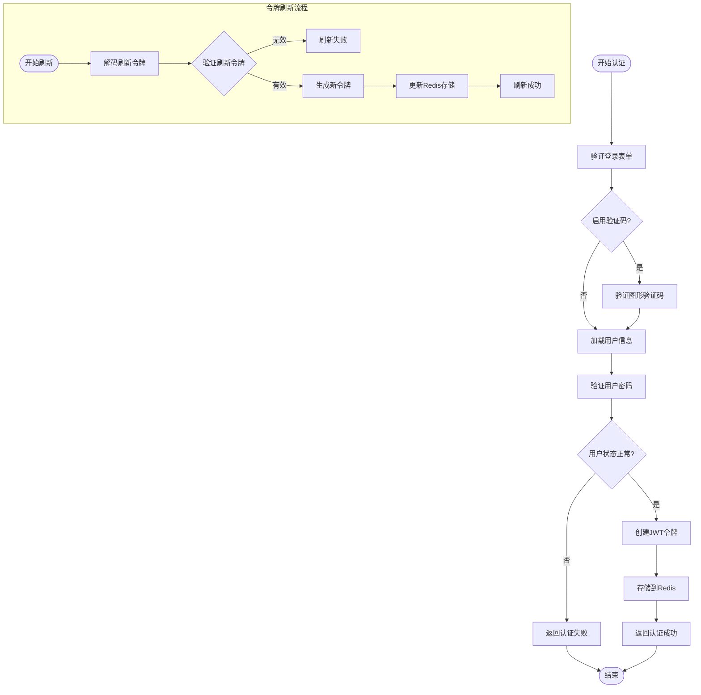
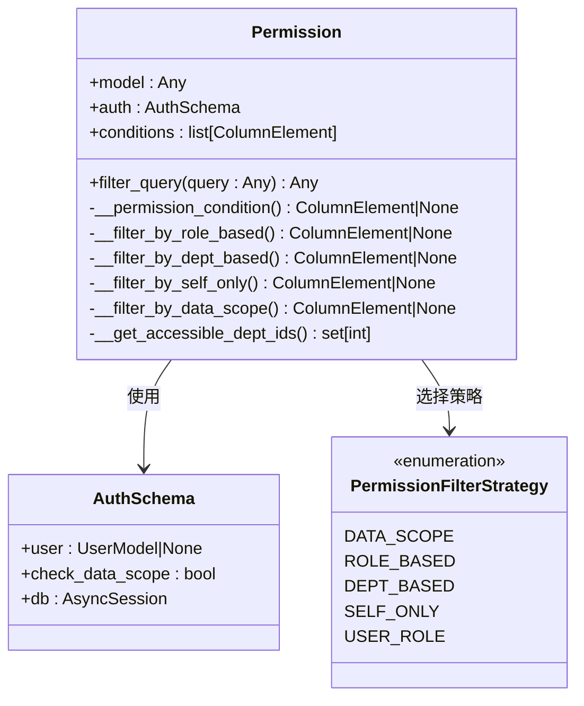
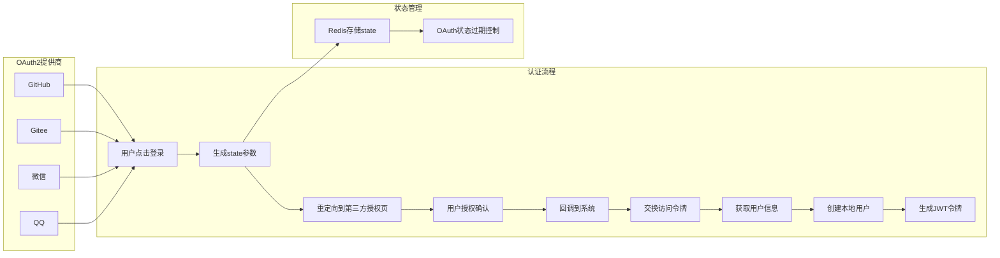
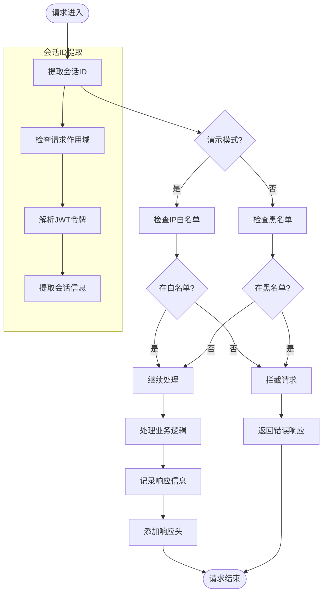
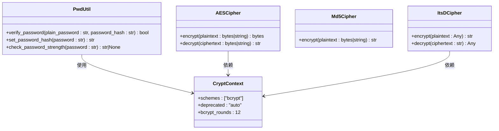
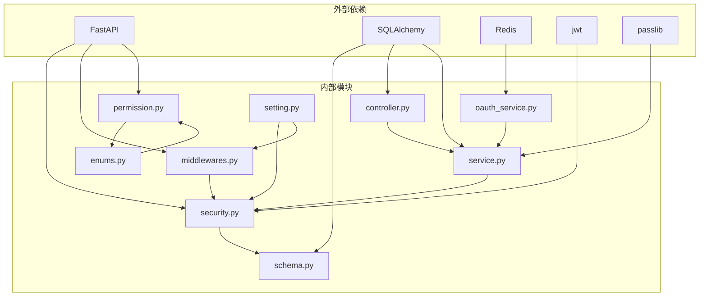
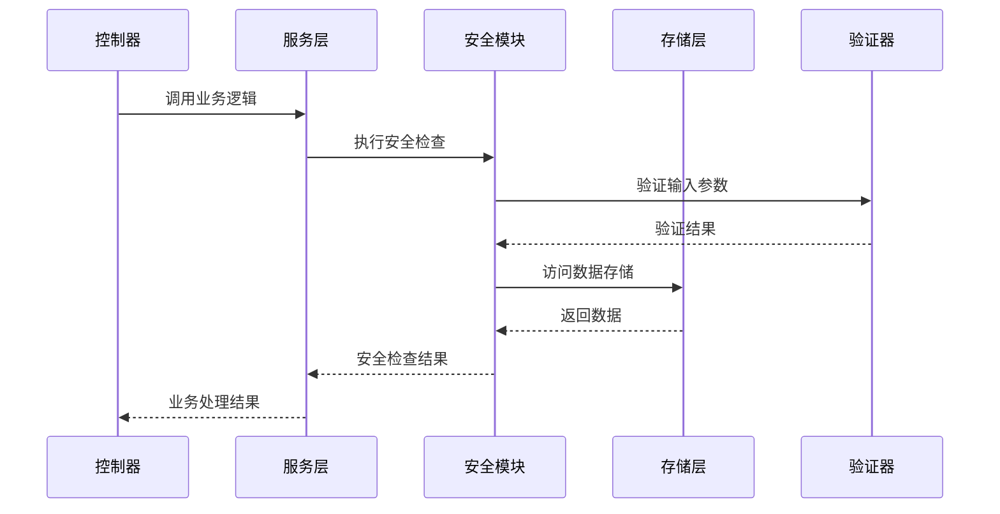

# 认证授权系统

<cite>
**本文档引用的文件**
- [security.py](file://backend/app/core/security.py)
- [middlewares.py](file://backend/app/core/middlewares.py)
- [permission.py](file://backend/app/core/permission.py)
- [schema.py](file://backend/app/api/v1/module_system/auth/schema.py)
- [controller.py](file://backend/app/api/v1/module_system/auth/controller.py)
- [oauth_service.py](file://backend/app/api/v1/module_system/auth/oauth_service.py)
- [service.py](file://backend/app/api/v1/module_system/auth/service.py)
- [enums.py](file://backend/app/common/enums.py)
- [setting.py](file://backend/app/config/setting.py)
- [model.py](file://backend/app/api/v1/module_system/user/model.py)
- [model.py](file://backend/app/api/v1/module_system/role/model.py)
- [model.py](file://backend/app/api/v1/module_system/menu/model.py)
- [hash_bcrpy_util.py](file://backend/app/utils/hash_bcrpy_util.py)
</cite>

## 目录
1. [简介](#简介)
2. [项目结构](#项目结构)
3. [核心组件](#核心组件)
4. [架构概览](#架构概览)
5. [详细组件分析](#详细组件分析)
6. [依赖关系分析](#依赖关系分析)
7. [性能考虑](#性能考虑)
8. [故障排除指南](#故障排除指南)
9. [结论](#结论)

## 简介

FastapiAdmin 是一个基于 FastAPI 和 SQLAlchemy 的现代化 Web 应用框架，其认证授权系统采用 JWT（JSON Web Token）技术实现，结合 RBAC（基于角色的访问控制）模型，提供了完整的用户身份认证、权限管理和安全防护机制。

该系统支持多种认证方式，包括传统的用户名密码认证、第三方 OAuth2 集成、免登录机制等，同时具备完善的数据权限过滤策略和中间件安全防护体系。

## 项目结构

FastapiAdmin 的认证授权系统主要分布在以下目录结构中：

**图表来源**
- [security.py:1-149](file://backend/app/core/security.py#L1-L149)
- [middlewares.py:1-215](file://backend/app/core/middlewares.py#L1-L215)
- [permission.py:1-311](file://backend/app/core/permission.py#L1-L311)

**章节来源**
- [security.py:1-149](file://backend/app/core/security.py#L1-L149)
- [middlewares.py:1-215](file://backend/app/core/middlewares.py#L1-L215)
- [permission.py:1-311](file://backend/app/core/permission.py#L1-L311)

## 核心组件

### JWT 认证机制

系统采用 JWT（JSON Web Token）作为主要的身份认证载体，实现了完整的令牌生命周期管理：

- **令牌生成**：使用 HS256 算法生成访问令牌和刷新令牌
- **令牌验证**：通过自定义 OAuth2 密码流进行令牌验证
- **令牌刷新**：支持基于刷新令牌的安全令牌续期
- **会话管理**：通过 Redis 实现令牌的持久化存储和会话跟踪

### RBAC 权限控制模型

系统实现了完整的 RBAC（基于角色的访问控制）模型，包含以下核心元素：

- **用户（User）**：系统使用者，具备用户名、密码、角色等属性
- **角色（Role）**：权限的集合，包含数据权限范围和菜单权限
- **权限（Permission）**：具体的操作权限标识
- **资源（Resource）**：系统中的业务实体和功能模块

### 数据权限过滤策略

系统提供了五种数据权限过滤策略，确保用户只能访问授权范围内的数据：

- **仅本人数据**：用户只能查看自己的数据
- **本部门数据**：用户可以查看所在部门的数据
- **本部门及以下**：用户可以查看所在部门及其子部门的数据
- **全部数据**：用户可以查看所有数据
- **自定义数据**：用户只能查看特定指定的数据

**章节来源**
- [security.py:98-149](file://backend/app/core/security.py#L98-L149)
- [permission.py:13-86](file://backend/app/core/permission.py#L13-L86)
- [enums.py:111-122](file://backend/app/common/enums.py#L111-L122)

## 架构概览

FastapiAdmin 的认证授权系统采用分层架构设计，各层职责明确，耦合度低：

**图表来源**
- [controller.py:41-78](file://backend/app/api/v1/module_system/auth/controller.py#L41-L78)
- [service.py:49-124](file://backend/app/api/v1/module_system/auth/service.py#L49-L124)
- [security.py:98-149](file://backend/app/core/security.py#L98-L149)

## 详细组件分析

### JWT 认证核心模块

#### 自定义 OAuth2 密码流

系统实现了自定义的 OAuth2 密码流认证类，增强了令牌验证的灵活性：

**图表来源**
- [security.py:11-95](file://backend/app/core/security.py#L11-L95)

#### JWT 令牌管理

系统提供了完整的 JWT 令牌管理功能，包括令牌生成、验证和刷新：

**图表来源**
- [service.py:49-124](file://backend/app/api/v1/module_system/auth/service.py#L49-L124)
- [service.py:223-307](file://backend/app/api/v1/module_system/auth/service.py#L223-L307)

**章节来源**
- [security.py:98-149](file://backend/app/core/security.py#L98-L149)
- [service.py:127-221](file://backend/app/api/v1/module_system/auth/service.py#L127-L221)

### 权限过滤引擎

#### 数据权限策略实现

系统实现了灵活的数据权限过滤机制，支持多种权限策略：

**图表来源**
- [permission.py:13-86](file://backend/app/core/permission.py#L13-L86)
- [enums.py:111-122](file://backend/app/common/enums.py#L111-L122)

#### 权限过滤策略详解

系统提供了五种主要的权限过滤策略：

1. **数据范围权限（DATA_SCOPE）**：基于用户的角色数据权限范围进行过滤
2. **基于角色的菜单权限（ROLE_BASED）**：仅显示用户角色授权的菜单
3. **基于部门的权限（DEPT_BASED）**：基于用户所属部门进行数据权限控制
4. **仅本人数据（SELF_ONLY）**：用户只能查看自己的数据
5. **用户角色权限（USER_ROLE）**：仅显示当前用户绑定的角色

**章节来源**
- [permission.py:87-311](file://backend/app/core/permission.py#L87-L311)
- [enums.py:111-122](file://backend/app/common/enums.py#L111-L122)

### OAuth2 集成方案

#### 第三方认证支持

系统支持四种主流的第三方 OAuth2 认证方式：

**图表来源**
- [oauth_service.py:37-437](file://backend/app/api/v1/module_system/auth/oauth_service.py#L37-L437)

#### OAuth2 配置与集成

系统通过环境变量配置各种 OAuth2 提供商的客户端凭据：

- **GitHub**：`OAUTH_GITHUB_CLIENT_ID` 和 `OAUTH_GITHUB_CLIENT_SECRET`
- **Gitee**：`OAUTH_GITEE_CLIENT_ID` 和 `OAUTH_GITEE_CLIENT_SECRET`
- **微信**：`OAUTH_WECHAT_OPEN_APP_ID` 和 `OAUTH_WECHAT_OPEN_APP_SECRET`
- **QQ**：`OAUTH_QQ_APP_ID` 和 `OAUTH_QQ_APP_SECRET`

**章节来源**
- [oauth_service.py:65-78](file://backend/app/api/v1/module_system/auth/oauth_service.py#L65-L78)
- [setting.py:124-138](file://backend/app/config/setting.py#L124-L138)

### 中间件安全防护

#### 请求日志与安全审计

系统实现了多层次的安全防护机制：

**图表来源**
- [middlewares.py:44-85](file://backend/app/core/middlewares.py#L44-L85)
- [middlewares.py:150-186](file://backend/app/core/middlewares.py#L150-L186)

#### 中间件配置

系统提供了三种主要的中间件：

1. **CORS 中间件**：处理跨域请求
2. **请求日志中间件**：记录请求和响应信息
3. **GZip 压缩中间件**：优化响应传输效率

**章节来源**
- [middlewares.py:22-215](file://backend/app/core/middlewares.py#L22-L215)

### 密码加密与安全

#### 密码安全机制

系统采用了业界标准的密码加密方案：

**图表来源**
- [hash_bcrpy_util.py:21-73](file://backend/app/utils/hash_bcrpy_util.py#L21-L73)

#### 安全配置

系统提供了全面的安全配置选项：

- **密码加密**：使用 bcrypt 算法，12 轮加密强度
- **令牌配置**：HS256 算法，30 分钟有效期
- **验证码**：1 分钟过期时间
- **中间件安全**：CORS、GZip、请求日志等

**章节来源**
- [hash_bcrpy_util.py:14-51](file://backend/app/utils/hash_bcrpy_util.py#L14-L51)
- [setting.py:67-73](file://backend/app/config/setting.py#L67-L73)

## 依赖关系分析

### 核心依赖图

**图表来源**
- [security.py:1-8](file://backend/app/core/security.py#L1-L8)
- [middlewares.py:1-18](file://backend/app/core/middlewares.py#L1-L18)
- [permission.py:1-10](file://backend/app/core/permission.py#L1-L10)

### 模块间交互

系统采用松耦合的设计，各模块通过清晰的接口进行交互：

**图表来源**
- [controller.py:47-77](file://backend/app/api/v1/module_system/auth/controller.py#L47-L77)
- [service.py:49-124](file://backend/app/api/v1/module_system/auth/service.py#L49-L124)

**章节来源**
- [controller.py:1-349](file://backend/app/api/v1/module_system/auth/controller.py#L1-L349)
- [service.py:1-576](file://backend/app/api/v1/module_system/auth/service.py#L1-L576)

## 性能考虑

### 认证性能优化

系统在认证过程中采用了多项性能优化策略：

1. **Redis 缓存**：使用 Redis 存储令牌信息，减少数据库查询
2. **异步处理**：所有认证操作都采用异步方式，提高并发处理能力
3. **连接池管理**：合理配置数据库连接池，避免连接泄漏
4. **中间件优化**：通过中间件减少不必要的处理步骤

### 权限过滤性能

数据权限过滤采用了高效的查询策略：

- **批量查询**：一次性获取用户的所有角色和权限
- **缓存策略**：对常用权限数据进行缓存
- **索引优化**：在关键字段上建立数据库索引
- **查询优化**：使用 SQLAlchemy 的高效查询构建器

## 故障排除指南

### 常见认证问题

#### 令牌验证失败

**问题症状**：用户登录后无法访问受保护资源

**可能原因**：
1. 令牌过期或格式不正确
2. Redis 存储异常
3. 令牌签名验证失败

**解决方案**：
1. 检查 `ACCESS_TOKEN_EXPIRE_MINUTES` 配置
2. 验证 Redis 连接状态
3. 确认 `SECRET_KEY` 配置正确

#### 用户认证失败

**问题症状**：用户无法登录系统

**可能原因**：
1. 用户名或密码错误
2. 用户状态异常（被停用）
3. 验证码验证失败

**解决方案**：
1. 检查用户状态是否正常
2. 验证密码哈希是否正确
3. 确认验证码配置和存储

#### OAuth2 登录异常

**问题症状**：第三方登录失败

**可能原因**：
1. OAuth2 凭据配置错误
2. 回调 URL 配置不正确
3. 网络连接问题

**解决方案**：
1. 验证第三方提供商的客户端凭据
2. 检查回调 URL 的配置
3. 确认网络连接正常

**章节来源**
- [service.py:92-102](file://backend/app/api/v1/module_system/auth/service.py#L92-L102)
- [oauth_service.py:75-78](file://backend/app/api/v1/module_system/auth/oauth_service.py#L75-L78)

### 系统监控与日志

系统提供了完善的监控和日志功能：

- **操作日志**：记录所有重要的系统操作
- **请求日志**：详细记录每个 HTTP 请求的处理过程
- **错误日志**：捕获和记录系统异常
- **性能监控**：监控系统关键指标

**章节来源**
- [middlewares.py:36-200](file://backend/app/core/middlewares.py#L36-L200)

## 结论

FastapiAdmin 的认证授权系统是一个设计精良、功能完备的安全框架。系统采用 JWT 技术实现无状态认证，结合 RBAC 模型提供细粒度的权限控制，并通过多种中间件实现全面的安全防护。

### 主要优势

1. **安全性高**：采用行业标准的加密算法和安全实践
2. **扩展性强**：模块化设计支持功能扩展和定制
3. **性能优异**：异步处理和缓存机制保证高并发性能
4. **易于集成**：完整的 OAuth2 支持第三方认证
5. **监控完善**：全面的日志和监控功能

### 最佳实践建议

1. **定期更新密钥**：定期更换 `SECRET_KEY` 和其他敏感配置
2. **监控系统健康**：建立完善的监控告警机制
3. **最小权限原则**：遵循最小权限原则分配用户权限
4. **定期安全审计**：定期进行安全漏洞扫描和渗透测试
5. **备份策略**：建立完整的数据备份和恢复策略

该系统为现代 Web 应用提供了坚实的安全基础，能够满足大多数企业级应用的认证授权需求。