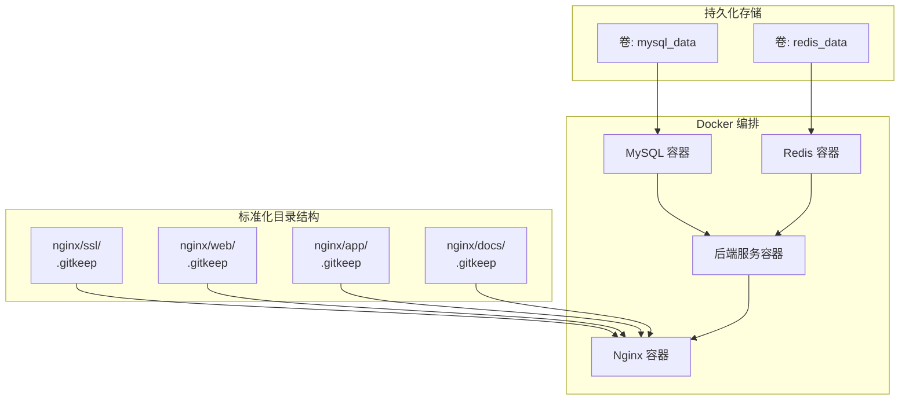
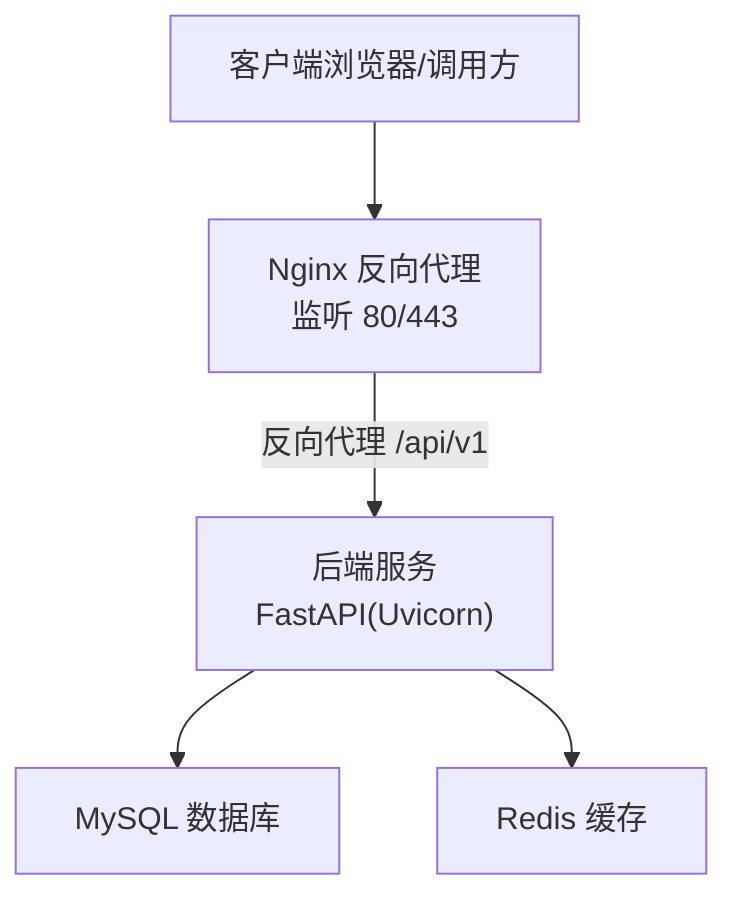
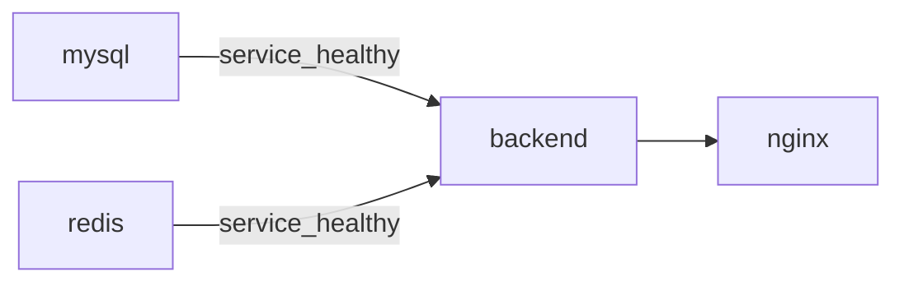
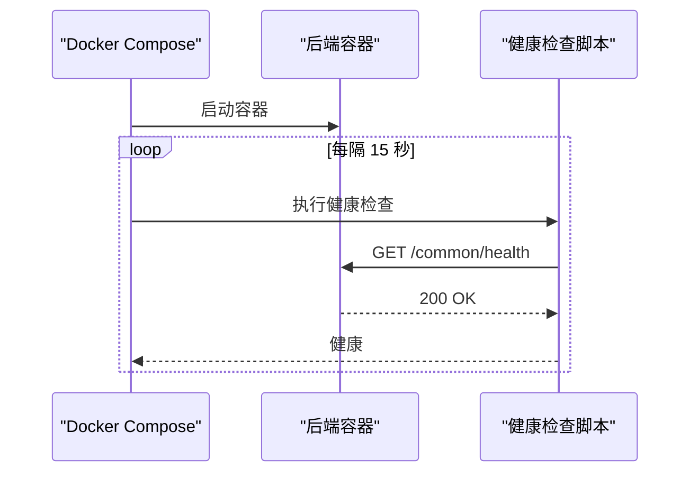

# Docker 容器化部署

<cite>
**本文引用的文件**
- [docker-compose.yaml](file://docker/docker-compose.yaml)
- [Dockerfile（后端）](file://docker/backend/Dockerfile)
- [Nginx 配置](file://docker/nginx/nginx.conf)
- [Docker 部署说明](file://docker/README.md)
- [后端入口 main.py](file://backend/main.py)
- [后端配置 setting.py](file://backend/app/config/setting.py)
- [部署脚本（Linux）](file://deploy.sh)
- [.dockerignore](file://.dockerignore)
</cite>

## 更新摘要
**变更内容**
- 更新了Docker目录结构标准化改进的相关内容
- 新增了.gitkeep文件使用规范的说明
- 补充了nginx目录标准化结构的详细描述
- 完善了容器资源限制和健康检查机制的说明

## 目录
1. [简介](#简介)
2. [项目结构](#项目结构)
3. [核心组件](#核心组件)
4. [架构总览](#架构总览)
5. [详细组件分析](#详细组件分析)
6. [依赖关系分析](#依赖关系分析)
7. [性能考虑](#性能考虑)
8. [故障排查指南](#故障排查指南)
9. [结论](#结论)
10. [附录](#附录)

## 简介
本指南面向希望使用 Docker Compose 在本地或生产环境中部署 FastapiAdmin 的工程师与运维人员。文档覆盖 MySQL 数据库、Redis 缓存、后端服务（FastAPI）、Nginx 反向代理的多容器编排配置，解释环境变量、端口映射、数据卷挂载与健康检查机制，并提供开发与生产两种部署模式的操作步骤、资源限制、日志管理与常见问题排查方法。

**更新** 本版本反映了Docker目录结构的标准化改进，包括.gitkeep文件的使用和nginx目录结构的规范化。

## 项目结构
- 后端服务位于 backend/，通过 Dockerfile 构建镜像并在容器内以生产模式启动。
- docker/ 目录包含 Docker Compose 编排文件与各组件的 Docker 配置（MySQL、Redis、Nginx）。
- nginx目录采用标准化结构，包含ssl/、web/、app/、docs/等子目录，使用.gitkeep文件保留空目录结构。
- 部署脚本 deploy.sh 提供一键拉取代码、构建镜像、启动服务、查看状态与日志的能力。

**图表来源**
- [docker-compose.yaml:11-201](file://docker/docker-compose.yaml#L11-L201)
- [Dockerfile（后端）:1-23](file://docker/backend/Dockerfile#L1-L23)
- [.dockerignore:1-57](file://.dockerignore#L1-L57)

**章节来源**
- [docker-compose.yaml:11-201](file://docker/docker-compose.yaml#L11-L201)
- [Dockerfile（后端）:1-23](file://docker/backend/Dockerfile#L1-L23)
- [.dockerignore:1-57](file://.dockerignore#L1-L57)

## 核心组件
- MySQL 数据库
  - 镜像：mysql:8.0
  - 环境变量：时区、root 密码、数据库名、用户名、密码
  - 端口映射：默认 3306
  - 数据卷：持久化 /var/lib/mysql
  - 健康检查：mysqladmin ping
  - 资源限制：内存上限 1G，预留 256M
- Redis 缓存
  - 镜像：redis:7-alpine
  - 环境变量：时区
  - 端口映射：默认 6379
  - 数据卷：持久化 /data（AOF）
  - 命令：设置密码、开启 AOF、自动重写策略
  - 健康检查：redis-cli ping
  - 资源限制：内存上限 512M，预留 128M
- 后端服务（FastAPI）
  - 构建：基于 Dockerfile，复制 requirements.txt 并安装依赖
  - 端口：容器内 8001，可通过环境变量映射到宿主机
  - 环境变量：数据库与 Redis 连接参数、时区
  - 依赖：MySQL 与 Redis 健康后再启动
  - 健康检查：访问 /common/health
  - 资源限制：内存上限 1G、CPU 1.0，预留 256M
- Nginx 反向代理
  - 镜像：nginx:1.25-alpine
  - 端口：80/443 映射
  - 挂载：nginx.conf、静态资源目录、SSL 证书
  - 依赖：后端启动后才启动
  - 健康检查：nginx -t
  - 资源限制：内存上限 256M、CPU 0.5，预留 64M

**章节来源**
- [docker-compose.yaml:11-201](file://docker/docker-compose.yaml#L11-L201)
- [Dockerfile（后端）:1-23](file://docker/backend/Dockerfile#L1-L23)
- [Nginx 配置:1-139](file://docker/nginx/nginx.conf#L1-L139)

## 架构总览
下图展示容器间的依赖关系与数据流向：

**图表来源**
- [docker-compose.yaml:142-181](file://docker/docker-compose.yaml#L142-L181)
- [Nginx 配置:114-130](file://docker/nginx/nginx.conf#L114-L130)
- [后端入口 main.py:55-107](file://backend/main.py#L55-L107)

## 详细组件分析

### MySQL 数据库容器
- 环境变量
  - 时区：Asia/Shanghai
  - root 密码：必须设置
  - 数据库名：默认 fastapiadmin
  - 用户名：默认 fastapiadmin
  - 用户密码：必须设置
- 端口映射
  - 默认映射宿主机 3306 端口
- 数据卷
  - 本地绑定 ./mysql/data 到 /var/lib/mysql
- 健康检查
  - 使用 mysqladmin ping 检测
- 资源限制
  - 内存上限 1G，预留 256M

**章节来源**
- [docker-compose.yaml:11-47](file://docker/docker-compose.yaml#L11-L47)

### Redis 缓存容器
- 环境变量
  - 时区：Asia/Shanghai
- 端口映射
  - 默认映射宿主机 6379 端口
- 数据卷
  - 本地绑定 ./redis/data 到 /data
- 命令
  - 设置密码、开启 AOF、自动重写策略
- 健康检查
  - 使用 redis-cli ping 检测
- 资源限制
  - 内存上限 512M，预留 128M

**章节来源**
- [docker-compose.yaml:48-87](file://docker/docker-compose.yaml#L48-L87)

### 后端服务容器（FastAPI）
- 构建与运行
  - 基于 Dockerfile，工作目录 /home，暴露 8001 端口
  - CMD 以生产模式启动 uvicorn
- 环境变量
  - 时区：Asia/Shanghai
  - 数据库：主机、端口、用户、密码、库名
  - Redis：主机、端口、密码
- 依赖与启动顺序
  - 依赖 mysql 与 redis 健康后启动
- 健康检查
  - 访问 /common/health
- 资源限制
  - 内存上限 1G、CPU 1.0，预留 256M

**章节来源**
- [docker-compose.yaml:88-141](file://docker/docker-compose.yaml#L88-L141)
- [Dockerfile（后端）:1-23](file://docker/backend/Dockerfile#L1-L23)
- [后端入口 main.py:55-107](file://backend/main.py#L55-L107)

### Nginx 反向代理容器
- 配置要点
  - 监听 80/443，启用 HTTP/2
  - SSL 证书挂载到 /etc/nginx/ssl
  - 静态资源挂载到 /usr/share/nginx/html/web
  - 反向代理 /api/v1 到 backend:8001，支持 WebSocket
  - 速率限制与安全头
- 标准化目录结构
  - ssl/：SSL证书目录，使用.gitkeep保留空目录结构
  - web/：前端静态文件目录，使用.gitkeep保留空目录结构
  - app/：移动端H5静态文件目录，使用.gitkeep保留空目录结构
  - docs/：文档网站静态文件目录，使用.gitkeep保留空目录结构
- 依赖与启动顺序
  - 在后端启动后再启动
- 健康检查
  - nginx -t
- 资源限制
  - 内存上限 256M、CPU 0.5，预留 64M

**章节来源**
- [docker-compose.yaml:142-181](file://docker/docker-compose.yaml#L142-L181)
- [Nginx 配置:1-139](file://docker/nginx/nginx.conf#L1-L139)

### 部署脚本与环境变量
- 部署脚本（Linux）
  - 自动加载 .env 或复制示例 .env
  - 检查依赖（git、docker、docker compose）
  - 拉取代码、构建镜像、启动服务、等待 MySQL 健康、显示状态与日志
  - 提供 start/stop/restart/logs/verify/clean 等命令
- 环境变量
  - 通过 --env-file 指定 .env 文件，其中包含数据库与 Redis 密码、端口等
  - 后端通过 ENVIRONMENT 选择不同 .env.* 配置文件

**章节来源**
- [部署脚本（Linux）:25-128](file://deploy.sh#L25-L128)
- [后端配置 setting.py:16-21](file://backend/app/config/setting.py#L16-L21)

## 依赖关系分析
- 服务间依赖
  - backend 依赖 mysql 与 redis 健康
  - nginx 依赖 backend 启动
- 数据持久化
  - mysql_data 与 redis_data 两个命名卷分别绑定到 ./mysql/data 与 ./redis/data
- 网络
  - 所有服务加入 app_network 桥接网络，容器间通过服务名互访

**图表来源**
- [docker-compose.yaml:112-161](file://docker/docker-compose.yaml#L112-L161)

**章节来源**
- [docker-compose.yaml:182-201](file://docker/docker-compose.yaml#L182-L201)

## 性能考虑
- 资源限制
  - MySQL：内存上限 1G，预留 256M
  - Redis：内存上限 512M，预留 128M
  - 后端：内存上限 1G、CPU 1.0，预留 256M
  - Nginx：内存上限 256M、CPU 0.5，预留 64M
- 端口与网络
  - 合理映射宿主机端口，避免冲突
  - 使用桥接网络减少跨主机通信开销
- 存储
  - 使用本地绑定卷保证数据持久化与性能
- 日志
  - 使用 json-file 驱动并限制单文件大小与数量，便于容器日志收集
- 目录结构优化
  - 使用.gitkeep文件保留空目录结构，确保版本控制的一致性

**章节来源**
- [docker-compose.yaml:41-46](file://docker/docker-compose.yaml#L41-L46)
- [docker-compose.yaml:81-86](file://docker/docker-compose.yaml#L81-L86)
- [docker-compose.yaml:134-140](file://docker/docker-compose.yaml#L134-L140)
- [docker-compose.yaml:174-180](file://docker/docker-compose.yaml#L174-L180)

## 故障排查指南
- 健康检查失败
  - MySQL：检查 root 密码与 ping 命令参数
  - Redis：确认密码正确与 AOF 配置
  - 后端：确认 /common/health 可访问且数据库/缓存连通
  - Nginx：执行 nginx -t 校验配置
- 端口占用
  - 检查宿主机 80/443/3306/6379/8001 是否被占用
- 权限与卷
  - 确认 ./mysql/data 与 ./redis/data 目录存在且权限正确
- 日志查看
  - 使用 docker compose logs --tail=50 查看最近日志
  - 使用 docker compose ps 查看各服务状态
- 配置加载
  - 确认 .env 文件存在且包含必需变量（如 MYSQL_ROOT_PASSWORD、MYSQL_PASSWORD、REDIS_PASSWORD）
- 目录结构问题
  - 确认nginx目录下ssl/、web/、app/、docs/目录均存在.gitkeep文件
  - 检查.gitkeep文件是否正确保留了空目录结构

**章节来源**
- [docker-compose.yaml:29-35](file://docker/docker-compose.yaml#L29-L35)
- [docker-compose.yaml:69-75](file://docker/docker-compose.yaml#L69-L75)
- [docker-compose.yaml:119-128](file://docker/docker-compose.yaml#L119-L128)
- [docker-compose.yaml:164-169](file://docker/docker-compose.yaml#L164-L169)
- [部署脚本（Linux）:110-115](file://deploy.sh#L110-L115)
- [部署脚本（Linux）:117-128](file://deploy.sh#L117-L128)

## 结论
通过 Docker Compose，FastapiAdmin 可以快速在本地或生产环境完成数据库、缓存、后端与反向代理的一键编排部署。最新的Docker目录结构标准化改进包括.gitkeep文件的使用和nginx目录结构的规范化，提升了项目的维护性和一致性。建议在生产环境中：
- 使用独立 .env.prod 并严格管理敏感变量
- 配置 SSL 证书与域名
- 启用资源限制与健康检查
- 使用日志聚合与监控体系
- 遵循标准化的目录结构规范

## 附录

### 开发环境与生产环境差异
- 开发环境
  - 使用 docker compose --env-file .env 启动
  - 后端容器挂载 backend 源码目录以支持热更新
  - Nginx 可按需启用静态资源目录
- 生产环境
  - 使用 docker compose --env-file .env -f docker-compose.yaml 启动
  - 后端镜像构建完成后运行，不挂载源码
  - Nginx 配置 SSL 证书与反向代理

**章节来源**
- [docker-compose.yaml:4-6](file://docker/docker-compose.yaml#L4-L6)
- [docker-compose.yaml:109-111](file://docker/docker-compose.yaml#L109-L111)
- [Nginx 配置:84-86](file://docker/nginx/nginx.conf#L84-L86)

### 镜像构建与容器生命周期
- 镜像构建
  - 后端镜像基于 requirements.txt 安装依赖
  - .dockerignore 优化构建上下文，排除不必要的文件
- 容器启动/停止/重启
  - 使用 deploy.sh 提供 start/stop/restart/logs/verify/clean 等命令
  - 也可直接使用 docker compose 命令

**章节来源**
- [Dockerfile（后端）:14-17](file://docker/backend/Dockerfile#L14-L17)
- [.dockerignore:1-57](file://.dockerignore#L1-L57)
- [部署脚本（Linux）:156-174](file://deploy.sh#L156-L174)

### 关键流程时序图：后端健康检查

**图表来源**
- [docker-compose.yaml:119-128](file://docker/docker-compose.yaml#L119-L128)
- [后端入口 main.py:55-107](file://backend/main.py#L55-L107)

### Docker 目录结构标准化规范
- 目录结构
  - docker/backend/：后端Dockerfile存放目录
  - docker/nginx/：Nginx配置与静态资源目录
  - docker/mysql/：MySQL数据目录占位符
  - docker/redis/：Redis数据目录占位符
- .gitkeep文件使用规范
  - 仅用于保留空目录结构，不包含任何实际内容
  - 在nginx/目录下保留ssl/、web/、app/、docs/等子目录
  - 确保版本控制系统能够正确跟踪空目录

**章节来源**
- [Docker 部署说明:5-32](file://docker/README.md#L5-L32)
- [docker-compose.yaml:182-201](file://docker/docker-compose.yaml#L182-L201)