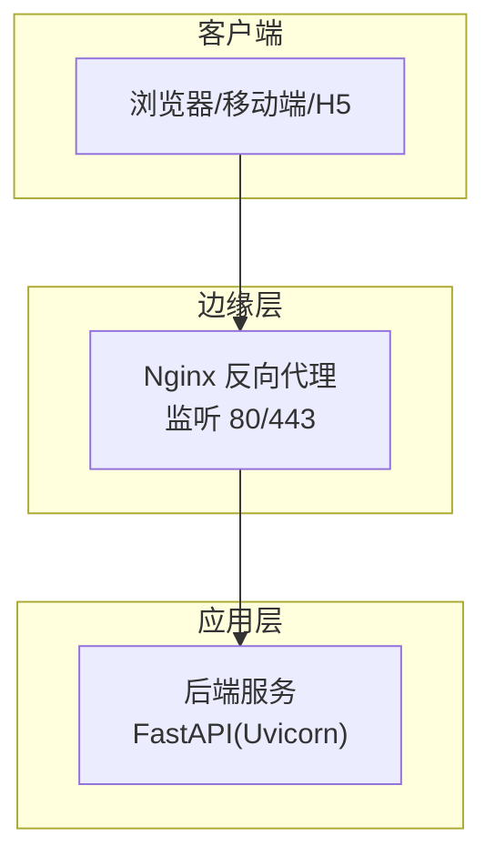
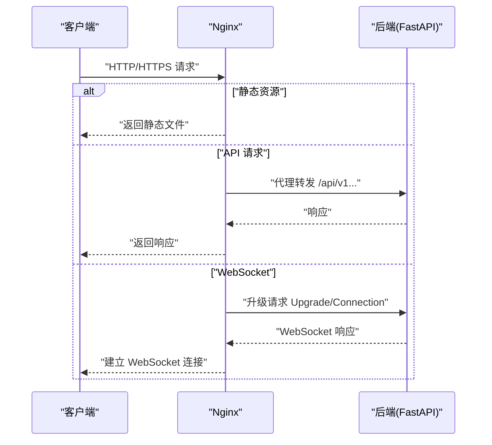
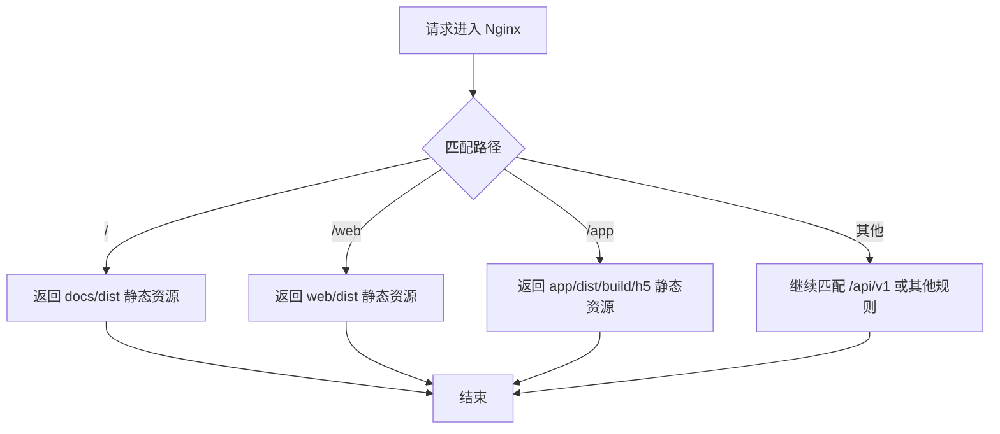
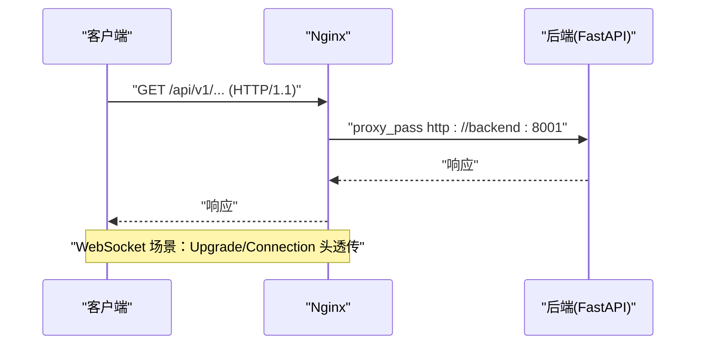
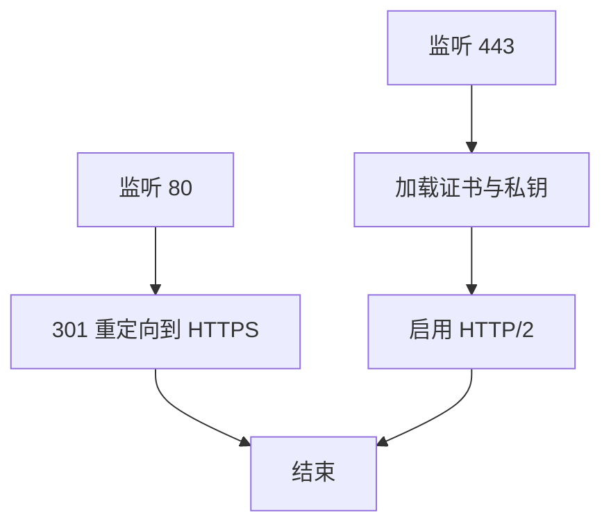
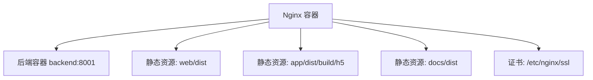

# Nginx 反向代理配置

<cite>
**本文引用的文件**
- [nginx.conf](file://docker/nginx/nginx.conf)
- [docker-compose.yaml](file://docker/docker-compose.yaml)
- [main.py](file://backend/main.py)
- [setting.py](file://backend/app/config/setting.py)
- [path_conf.py](file://backend/app/config/path_conf.py)
- [vite.config.ts](file://frontend/web/vite.config.ts)
- [package.json](file://frontend/web/package.json)
- [README.md](file://README.md)
</cite>

## 目录
1. [简介](#简介)
2. [项目结构](#项目结构)
3. [核心组件](#核心组件)
4. [架构总览](#架构总览)
5. [详细组件分析](#详细组件分析)
6. [依赖关系分析](#依赖关系分析)
7. [性能考虑](#性能考虑)
8. [故障排查指南](#故障排查指南)
9. [结论](#结论)
10. [附录](#附录)

## 简介
本文件面向运维与开发人员，系统性说明 Nginx 在 FastapiAdmin 架构中的作用与配置方法，覆盖静态资源托管、API 反向代理、WebSocket 支持、SSL/TLS 证书配置、HTTP 到 HTTPS 重定向、负载均衡与缓存策略，并给出 SSL 证书申请、安装与自动续期的最佳实践，以及多域名、子路径与移动端资源访问规则的配置要点。本文严格依据仓库现有配置文件进行分析与总结，避免臆测。

## 项目结构
FastapiAdmin 采用前后端分离架构，Nginx 作为反向代理与静态资源服务入口，后端通过 Docker Compose 统一编排，容器间通过桥接网络通信。Nginx 配置文件集中于 docker/nginx/nginx.conf，静态资源分别挂载至 /usr/share/nginx/html/web、/usr/share/nginx/html/app、/usr/share/nginx/html/docs 等目录，SSL 证书挂载至 /etc/nginx/ssl。

图表来源
- [nginx.conf:71-137](file://docker/nginx/nginx.conf#L71-L137)
- [docker-compose.yaml:142-181](file://docker/docker-compose.yaml#L142-L181)

章节来源
- [nginx.conf:1-139](file://docker/nginx/nginx.conf#L1-L139)
- [docker-compose.yaml:1-201](file://docker/docker-compose.yaml#L1-L201)

## 核心组件
- Nginx 反向代理与静态资源服务：负责 HTTP/HTTPS 接入、静态文件分发、API 代理与 WebSocket 升级。
- 后端服务：FastAPI 应用，监听容器内端口并通过 Nginx 暴露给外部。
- Docker Compose 编排：统一管理 Nginx、后端、数据库与缓存等服务，实现服务发现与网络互通。
- 前端构建产物：Web 前端构建产物位于 dist 目录，通过 Nginx 的 alias 挂载提供静态服务。

章节来源
- [nginx.conf:19-137](file://docker/nginx/nginx.conf#L19-L137)
- [docker-compose.yaml:88-181](file://docker/docker-compose.yaml#L88-L181)
- [vite.config.ts:86-173](file://frontend/web/vite.config.ts#L86-L173)

## 架构总览
Nginx 作为统一入口，承担以下职责：
- HTTP 到 HTTPS 重定向，确保全站 HTTPS。
- 静态资源托管：根路径、/web、/app 等路径分别指向不同静态目录。
- API 反向代理：将 /api/v1 前缀请求转发至后端服务。
- WebSocket 支持：在 API 代理中启用 HTTP/1.1 与 Upgrade/Connection 头。
- 安全与性能：设置安全头、Gzip 压缩、连接与请求限制、会话缓存与超时等。

图表来源
- [nginx.conf:114-130](file://docker/nginx/nginx.conf#L114-L130)
- [main.py:94-102](file://backend/main.py#L94-L102)

章节来源
- [nginx.conf:71-137](file://docker/nginx/nginx.conf#L71-L137)
- [main.py:16-51](file://backend/main.py#L16-L51)

## 详细组件分析

### 静态资源托管
- 根路径（/）：指向 docs/dist，适用于官网静态页面。
- /web：指向 web/dist，提供 Web 前端静态资源。
- /app：指向 app/dist/build/h5，提供移动端 H5 资源（当前配置为禁用，如需启用请取消注释相应 location 块）。
- 错误页面：统一 50x 错误页面由 Nginx 提供。

图表来源
- [nginx.conf:93-112](file://docker/nginx/nginx.conf#L93-L112)

章节来源
- [nginx.conf:93-112](file://docker/nginx/nginx.conf#L93-L112)
- [docker-compose.yaml:153-158](file://docker/docker-compose.yaml#L153-L158)

### API 反向代理与 WebSocket 支持
- API 前缀：/api/v1，代理至 backend:8001。
- 关键头部：Host、X-Real-IP、X-Forwarded-For、X-Forwarded-Proto、X-NginX-Proxy。
- 超时配置：connect/send/read 均设置为 300s，适配长连接与大文件。
- WebSocket：启用 HTTP/1.1 并传递 Upgrade 与 Connection 头，实现 WebSocket 升级。

图表来源
- [nginx.conf:114-130](file://docker/nginx/nginx.conf#L114-L130)
- [docker-compose.yaml:159-161](file://docker/docker-compose.yaml#L159-L161)

章节来源
- [nginx.conf:114-130](file://docker/nginx/nginx.conf#L114-L130)
- [docker-compose.yaml:142-181](file://docker/docker-compose.yaml#L142-L181)

### SSL/TLS 证书与 HTTP 到 HTTPS 重定向
- HTTP 重定向：监听 80，server_name 为 service.fastapiadmin.com，返回 301 至 https://$server_name$request_uri。
- HTTPS：监听 443，启用 http2，配置证书与私钥路径，限定 TLS 协议与加密套件，启用会话缓存与超时。
- 证书挂载：/etc/nginx/ssl 目录挂载至容器，需确保 .pem/.key 文件存在。

图表来源
- [nginx.conf:71-92](file://docker/nginx/nginx.conf#L71-L92)
- [docker-compose.yaml:153-158](file://docker/docker-compose.yaml#L153-L158)

章节来源
- [nginx.conf:71-92](file://docker/nginx/nginx.conf#L71-L92)
- [docker-compose.yaml:142-161](file://docker/docker-compose.yaml#L142-L161)

### 负载均衡与上游服务
- 当前配置：Nginx 通过 proxy_pass 指向 backend:8001，属于单点上游。
- 扩展建议：可通过 upstream 块定义多后端节点，结合轮询/权重/健康检查实现负载均衡与高可用。

章节来源
- [nginx.conf:124-124](file://docker/nginx/nginx.conf#L124-L124)
- [docker-compose.yaml:159-161](file://docker/docker-compose.yaml#L159-L161)

### 缓存策略与性能优化
- Gzip 压缩：对常见文本/JS/CSS/JSON/XML/svg 等启用压缩，压缩级别 6，最小长度 256 字节。
- 客户端缓存：通过 add_header 与 expires 等指令可进一步细化静态资源缓存策略（当前配置未显式设置 expires）。
- 连接与请求限制：API 限流（每 IP 每秒 30r/s）与连接数限制（每 IP 最多 100 并发），提升抗攻击能力。
- 会话缓存：SSL 会话缓存共享 10m，会话超时 10m，减少握手开销。

章节来源
- [nginx.conf:41-69](file://docker/nginx/nginx.conf#L41-L69)
- [nginx.conf:84-91](file://docker/nginx/nginx.conf#L84-L91)

### 安全头与合规
- X-Frame-Options、X-Content-Type-Options、X-XSS-Protection、Referrer-Policy 等安全头默认全局生效，增强 XSS、点击劫持等防护。

章节来源
- [nginx.conf:58-63](file://docker/nginx/nginx.conf#L58-L63)

### 多域名、子路径与移动端资源
- 多域名：可在同一 server 块中通过 server_name 指定多个域名，或新增 server 块分别处理不同域名。
- 子路径：/web、/app、/api/v1 等路径已按子路径划分，满足多端与多模块访问。
- 移动端资源：/app 路径指向移动端 H5 构建产物，当前配置为禁用，如需启用请取消注释相应 location 块。

章节来源
- [nginx.conf:80-112](file://docker/nginx/nginx.conf#L80-L112)

## 依赖关系分析
- Nginx 依赖后端服务容器（backend:8001）通过 Docker 网络互通。
- 静态资源依赖前端构建产物（web/dist、app/dist、docs/dist）挂载至 Nginx 容器。
- SSL 证书依赖 /etc/nginx/ssl 目录挂载，需确保证书与私钥文件存在。

图表来源
- [docker-compose.yaml:142-161](file://docker/docker-compose.yaml#L142-L161)
- [nginx.conf:93-112](file://docker/nginx/nginx.conf#L93-L112)

章节来源
- [docker-compose.yaml:142-181](file://docker/docker-compose.yaml#L142-L181)
- [nginx.conf:93-112](file://docker/nginx/nginx.conf#L93-L112)

## 性能考虑
- 连接与请求限制：API 限流与连接数限制可有效缓解突发流量与 DDoS 攻击。
- Gzip 压缩：对文本类资源启用压缩，显著降低带宽占用。
- 会话缓存：SSL 会话缓存与超时减少重复握手成本。
- 静态资源：通过 alias 与 try_files 避免不必要的后端转发，提升命中率。
- 超时配置：proxy_connect/send/read 超时统一设置为 300s，适合长连接与大文件场景。

章节来源
- [nginx.conf:65-69](file://docker/nginx/nginx.conf#L65-L69)
- [nginx.conf:41-56](file://docker/nginx/nginx.conf#L41-L56)
- [nginx.conf:84-91](file://docker/nginx/nginx.conf#L84-L91)
- [nginx.conf:114-130](file://docker/nginx/nginx.conf#L114-L130)

## 故障排查指南
- 证书加载失败：确认 /etc/nginx/ssl 目录挂载正确，证书与私钥文件存在且权限正确。
- API 代理不通：检查 backend 服务健康状态与端口映射，确认 proxy_pass 地址可达。
- 静态资源 404：确认静态目录挂载路径与 location alias 正确，try_files 配置无误。
- WebSocket 失败：确认代理启用了 HTTP/1.1 与 Upgrade/Connection 头透传。
- 重定向循环：检查 server_name 与重定向规则，确保域名解析与证书匹配。

章节来源
- [docker-compose.yaml:153-158](file://docker/docker-compose.yaml#L153-L158)
- [nginx.conf:114-130](file://docker/nginx/nginx.conf#L114-L130)
- [nginx.conf:71-77](file://docker/nginx/nginx.conf#L71-L77)

## 结论
Nginx 在 FastapiAdmin 架构中承担了统一入口、静态资源托管、API 反向代理与 WebSocket 支持、安全与性能优化等多重职责。通过合理的路径划分、限流与压缩策略、以及严格的 SSL 配置，可有效提升系统的安全性与稳定性。建议在生产环境中结合负载均衡与自动证书续期机制，持续优化缓存与超时策略，以满足高并发与多端访问需求。

## 附录

### SSL 证书申请、安装与自动续期最佳实践
- 证书申请：建议使用 Let’s Encrypt 等免费 CA，或企业级 CA。
- 安装：将证书与私钥放置于 /etc/nginx/ssl 目录，并确保 Nginx 可读权限。
- 自动续期：结合 certbot 或 acme.sh，设置定时任务自动续期并触发 Nginx 重载。
- 配置校验：使用 nginx -t 校验配置，避免证书错误导致服务中断。

章节来源
- [nginx.conf:84-91](file://docker/nginx/nginx.conf#L84-L91)
- [docker-compose.yaml:164-168](file://docker/docker-compose.yaml#L164-L168)

### 多域名、子路径与移动端资源访问规则
- 多域名：在同一 server 块中通过 server_name 指定多个域名，或新增 server 块分别处理。
- 子路径：/web、/app、/api/v1 已按子路径划分，满足多端与多模块访问。
- 移动端资源：/app 路径指向移动端 H5 构建产物，当前配置为禁用，如需启用请取消注释相应 location 块。

章节来源
- [nginx.conf:80-112](file://docker/nginx/nginx.conf#L80-L112)

### 前端构建与静态资源路径
- 前端构建产物：dist 目录，通过 Vite 构建，包含 JS/CSS/图片/字体等资源。
- 路径挂载：Nginx 通过 alias 指向 dist 目录，确保静态资源可被正确访问。

章节来源
- [vite.config.ts:86-173](file://frontend/web/vite.config.ts#L86-L173)
- [docker-compose.yaml:153-158](file://docker/docker-compose.yaml#L153-L158)