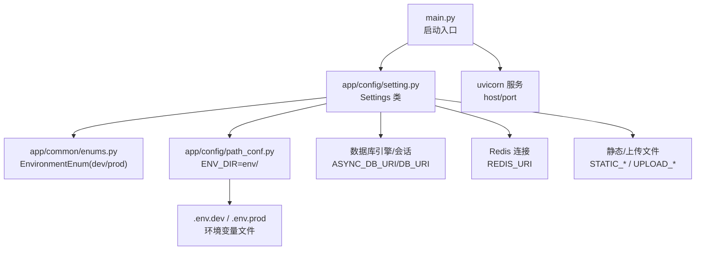
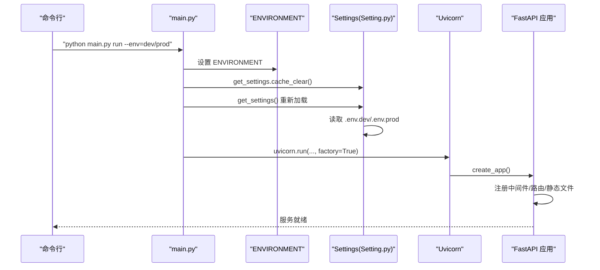
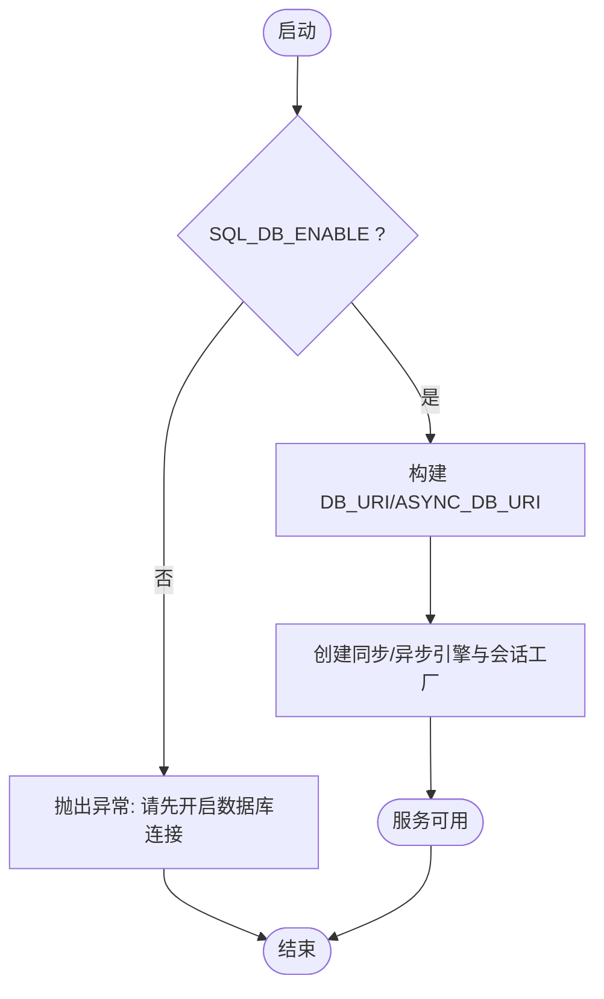
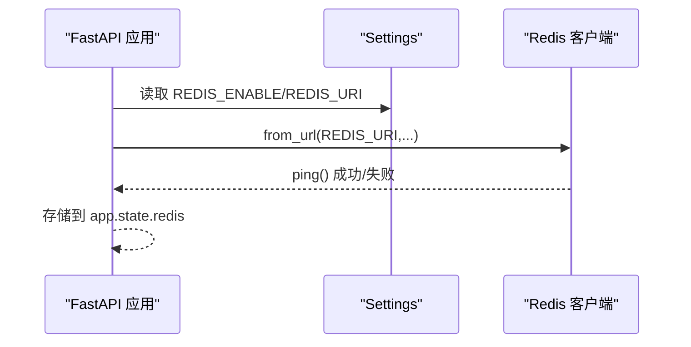
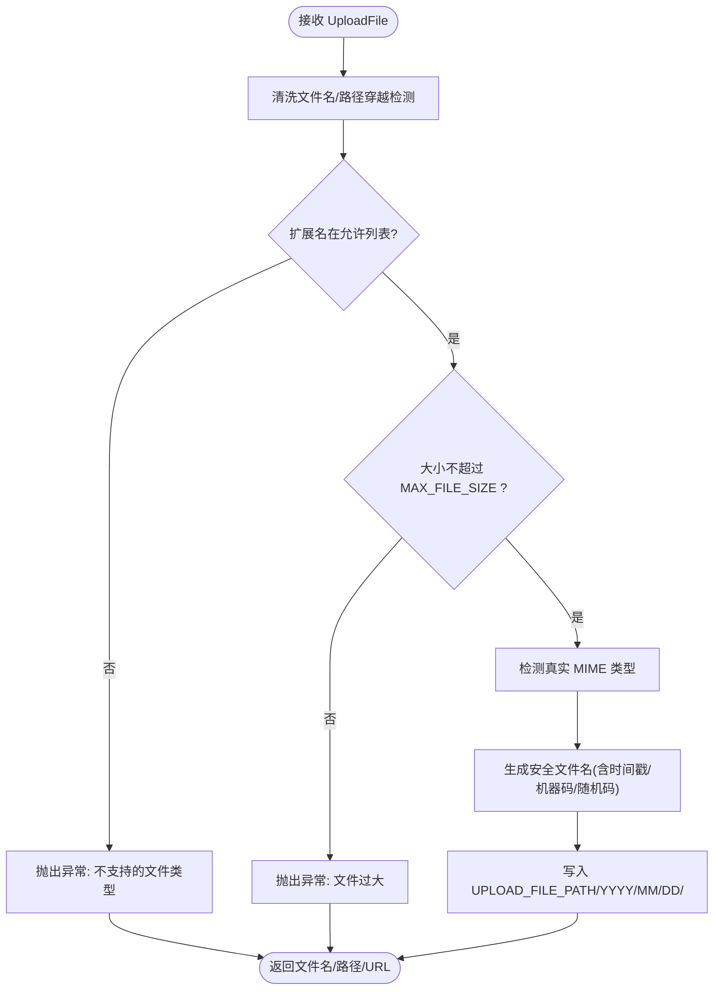
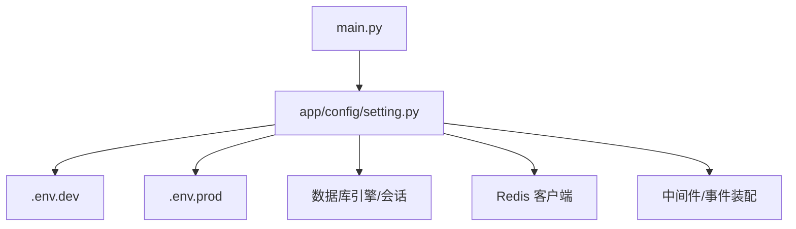

# 环境变量配置

<cite>
**本文引用的文件**
- [backend/app/config/setting.py](file://backend/app/config/setting.py)
- [backend/app/common/enums.py](file://backend/app/common/enums.py)
- [backend/app/config/path_conf.py](file://backend/app/config/path_conf.py)
- [backend/main.py](file://backend/main.py)
- [backend/run_linux.sh](file://backend/run_linux.sh)
- [backend/pyproject.toml](file://backend/pyproject.toml)
- [backend/app/core/database.py](file://backend/app/core/database.py)
- [backend/app/utils/upload_util.py](file://backend/app/utils/upload_util.py)
- [README.en.md](file://README.en.md)
</cite>

## 目录
1. [简介](#简介)
2. [项目结构](#项目结构)
3. [核心组件](#核心组件)
4. [架构总览](#架构总览)
5. [详细组件分析](#详细组件分析)
6. [依赖关系分析](#依赖关系分析)
7. [性能考虑](#性能考虑)
8. [故障排查指南](#故障排查指南)
9. [结论](#结论)
10. [附录](#附录)

## 简介
本指南面向 FastapiAdmin 的运维与开发人员，系统性说明环境变量配置方法与最佳实践，涵盖开发环境(.env.dev)与生产环境(.env.prod)的配置差异、数据库与 Redis 连接、JWT 密钥、文件存储、邮件配置等关键参数，并提供不同部署场景下的配置模板与安全建议，以及环境变量的优先级、覆盖规则与验证方法。

## 项目结构
FastapiAdmin 的配置体系围绕“运行环境枚举 + 环境目录 + .env.<环境> 文件”展开，通过 Pydantic Settings 在启动时加载对应环境的配置文件，形成统一的 Settings 单例供全项目使用。

**图表来源**
- [backend/main.py:59-102](file://backend/main.py#L59-L102)
- [backend/app/config/setting.py:16-21](file://backend/app/config/setting.py#L16-L21)
- [backend/app/common/enums.py:5-9](file://backend/app/common/enums.py#L5-L9)
- [backend/app/config/path_conf.py:21-22](file://backend/app/config/path_conf.py#L21-L22)

**章节来源**
- [backend/main.py:59-102](file://backend/main.py#L59-L102)
- [backend/app/config/setting.py:16-21](file://backend/app/config/setting.py#L16-L21)
- [backend/app/common/enums.py:5-9](file://backend/app/common/enums.py#L5-L9)
- [backend/app/config/path_conf.py:21-22](file://backend/app/config/path_conf.py#L21-L22)

## 核心组件
- 运行环境枚举：dev/prod，决定加载 .env.dev 或 .env.prod。
- 环境目录：ENV_DIR 指向 backend/env，Settings 通过 model_config.env_file 动态拼接 .env.<环境>。
- Settings 单例：lru_cache(maxsize=1) 缓存，避免重复解析；提供 FASTAPI_CONFIG、ASYNC_DB_URI、DB_URI、REDIS_URI 等便捷属性。
- 启动流程：main.py 通过 typer 传参设置 ENVIRONMENT，清空缓存后重新加载配置，再启动 uvicorn。

**章节来源**
- [backend/app/common/enums.py:5-9](file://backend/app/common/enums.py#L5-L9)
- [backend/app/config/setting.py:16-21](file://backend/app/config/setting.py#L16-L21)
- [backend/app/config/setting.py:343-355](file://backend/app/config/setting.py#L343-L355)
- [backend/main.py:59-102](file://backend/main.py#L59-L102)

## 架构总览
下面的序列图展示从命令行到服务启动、配置加载与中间件注册的完整流程。

**图表来源**
- [backend/main.py:59-102](file://backend/main.py#L59-L102)
- [backend/app/config/setting.py:16-21](file://backend/app/config/setting.py#L16-L21)

**章节来源**
- [backend/main.py:59-102](file://backend/main.py#L59-L102)
- [backend/app/config/setting.py:16-21](file://backend/app/config/setting.py#L16-L21)

## 详细组件分析

### 环境变量加载与优先级
- 加载来源
  - 通过 ENVIRONMENT 决定加载 .env.dev 或 .env.prod。
  - Settings.model_config.env_file 动态拼接路径，编码 utf-8，区分大小写，多余字段忽略。
- 优先级与覆盖
  - 环境变量覆盖 .env 文件；命令行参数覆盖环境变量；Settings 默认值作为最终兜底。
  - 启动前 main.py 会设置 ENVIRONMENT 并清空缓存，确保新配置生效。
- 验证方法
  - 启动后可通过 API 文档路径访问配置摘要（Swagger/ReDoc/LangJin）。
  - 关键连接（数据库/Redis）在应用生命周期事件中尝试建立连接，失败会记录错误日志。

**章节来源**
- [backend/app/config/setting.py:16-21](file://backend/app/config/setting.py#L16-L21)
- [backend/app/config/setting.py:343-355](file://backend/app/config/setting.py#L343-L355)
- [backend/main.py:74-83](file://backend/main.py#L74-L83)

### 数据库连接配置
- 支持类型：mysql、postgres、sqlite。
- 关键参数
  - DATABASE_TYPE、DATABASE_HOST、DATABASE_PORT、DATABASE_USER、DATABASE_PASSWORD、DATABASE_NAME。
  - 连接池与日志：POOL_SIZE、MAX_OVERFLOW、POOL_TIMEOUT、POOL_RECYCLE、POOL_PRE_PING、DATABASE_ECHO、ECHO_POOL。
  - 异步/同步 URL：ASYNC_DB_URI、DB_URI。
- 运行时行为
  - create_engine_and_session/create_async_engine_and_session 根据配置创建引擎与会话工厂。
  - 若未启用数据库(SQL_DB_ENABLE=False)，将抛出自定义异常。

**图表来源**
- [backend/app/core/database.py:19-50](file://backend/app/core/database.py#L19-L50)
- [backend/app/core/database.py:53-106](file://backend/app/core/database.py#L53-L106)
- [backend/app/config/setting.py:257-302](file://backend/app/config/setting.py#L257-L302)

**章节来源**
- [backend/app/config/setting.py:83-103](file://backend/app/config/setting.py#L83-L103)
- [backend/app/config/setting.py:257-302](file://backend/app/config/setting.py#L257-L302)
- [backend/app/core/database.py:19-50](file://backend/app/core/database.py#L19-L50)
- [backend/app/core/database.py:53-106](file://backend/app/core/database.py#L53-L106)

### Redis 连接配置
- 关键参数：REDIS_ENABLE、REDIS_HOST、REDIS_PORT、REDIS_DB_NAME、REDIS_USER、REDIS_PASSWORD。
- 连接方式：REDIS_URI 由 Settings 组装，使用 redis:// 协议。
- 生命周期：通过事件钩子在应用启动时建立连接，健康检查间隔与最大连接数受连接池参数影响。

**图表来源**
- [backend/app/config/setting.py:304-312](file://backend/app/config/setting.py#L304-L312)
- [backend/app/core/database.py:135-177](file://backend/app/core/database.py#L135-L177)

**章节来源**
- [backend/app/config/setting.py:108-113](file://backend/app/config/setting.py#L108-L113)
- [backend/app/config/setting.py:304-312](file://backend/app/config/setting.py#L304-L312)
- [backend/app/core/database.py:135-177](file://backend/app/core/database.py#L135-L177)

### JWT 密钥与认证配置
- 关键参数：SECRET_KEY、ALGORITHM、ACCESS_TOKEN_EXPIRE_MINUTES、REFRESH_TOKEN_EXPIRE_MINUTES、TOKEN_TYPE、TOKEN_REQUEST_PATH_EXCLUDE、TOKEN_SLIDING_EXPIRE。
- 安全建议
  - SECRET_KEY 必须足够随机且保密，生产环境务必使用强密钥。
  - 不同环境使用不同密钥，避免跨环境 Token 兼容。
  - 滑动过期(TOKEN_SLIDING_EXPIRE)可提升用户体验，但需结合刷新令牌策略。

**章节来源**
- [backend/app/config/setting.py:67-73](file://backend/app/config/setting.py#L67-L73)

### 文件存储与上传配置
- 上传目录：UPLOAD_FILE_PATH（相对 static/upload）。
- 安全策略：ALLOWED_EXTENSIONS、MAX_FILE_SIZE、路径穿越检测、危险扩展名黑名单、MIME 类型检测。
- 生成规则：文件名包含时间戳、机器码与随机后缀，防止冲突与安全风险。

**图表来源**
- [backend/app/utils/upload_util.py:110-224](file://backend/app/utils/upload_util.py#L110-L224)
- [backend/app/utils/upload_util.py:271-292](file://backend/app/utils/upload_util.py#L271-L292)
- [backend/app/utils/upload_util.py:381-444](file://backend/app/utils/upload_util.py#L381-L444)

**章节来源**
- [backend/app/config/setting.py:182-194](file://backend/app/config/setting.py#L182-L194)
- [backend/app/utils/upload_util.py:110-224](file://backend/app/utils/upload_util.py#L110-L224)
- [backend/app/utils/upload_util.py:271-292](file://backend/app/utils/upload_util.py#L271-L292)
- [backend/app/utils/upload_util.py:381-444](file://backend/app/utils/upload_util.py#L381-L444)

### API 文档与静态资源配置
- 文档路径：DOCS_URL、REDOC_URL、LJDOC_URL。
- 静态资源：STATIC_ENABLE、STATIC_URL、STATIC_DIR、STATIC_ROOT。
- Swagger/Redoc/CSS/JS 资源路径：SWAGGER_CSS_URL、SWAGGER_JS_URL、REDOC_JS_URL、CUSTOM_CSS_URL、CUSTOM_JS_URL、FAVICON_URL。

**章节来源**
- [backend/app/config/setting.py:44-47](file://backend/app/config/setting.py#L44-L47)
- [backend/app/config/setting.py:199-204](file://backend/app/config/setting.py#L199-L204)
- [backend/app/config/setting.py:174-177](file://backend/app/config/setting.py#L174-L177)

### 服务器与调试配置
- 服务器：SERVER_HOST、SERVER_PORT。
- 调试：DEBUG、LOGGER_LEVEL、ROOT_PATH。
- 跨域：CORS_ORIGIN_ENABLE、ALLOW_ORIGINS、ALLOW_METHODS、ALLOW_HEADERS、ALLOW_CREDENTIALS、CORS_EXPOSE_HEADERS。

**章节来源**
- [backend/app/config/setting.py:31-32](file://backend/app/config/setting.py#L31-L32)
- [backend/app/config/setting.py:37-47](file://backend/app/config/setting.py#L37-L47)
- [backend/app/config/setting.py:57-62](file://backend/app/config/setting.py#L57-L62)

### 多租户与 OAuth 配置
- 多租户：TENANT_HOST_ENFORCE、TENANT_HOST_BASE_DOMAIN、TENANT_HOST_IGNORE_PREFIXES。
- OAuth：OAUTH_DEFAULT_ROLE_IDS、OAUTH_FRONTEND_FALLBACK、各平台客户端 ID/Secret。

**章节来源**
- [backend/app/config/setting.py:76-78](file://backend/app/config/setting.py#L76-L78)
- [backend/app/config/setting.py:127-137](file://backend/app/config/setting.py#L127-L137)

### 外部 HTTP 与 IP 地址查询
- HTTPX 默认超时：HTTPX_DEFAULT_TIMEOUT。
- IP 归属地查询：IP_LOCATION_ENABLE。

**章节来源**
- [backend/app/config/setting.py:142-143](file://backend/app/config/setting.py#L142-L143)

### 日志与操作日志
- 日志级别：LOGGER_LEVEL。
- JSON Lines 输出：LOG_JSON_FILE_ENABLE、LOG_JSON_FILE_NAME、LOG_JSON_RETENTION_DAYS。
- 操作日志：OPERATION_LOG_RECORD、IGNORE_OPERATION_FUNCTION、OPERATION_RECORD_METHOD。

**章节来源**
- [backend/app/config/setting.py](file://backend/app/config/setting.py#L52)
- [backend/app/config/setting.py:149-151](file://backend/app/config/setting.py#L149-L151)
- [backend/app/config/setting.py:153-162](file://backend/app/config/setting.py#L153-L162)

### Gzip 压缩与 Swagger 资源
- Gzip：GZIP_ENABLE、GZIP_MIN_SIZE、GZIP_COMPRESS_LEVEL。
- Swagger/Redoc 资源：SWAGGER_*、REDOC_JS_URL、FAVICON_URL。

**章节来源**
- [backend/app/config/setting.py:167-169](file://backend/app/config/setting.py#L167-L169)
- [backend/app/config/setting.py:199-204](file://backend/app/config/setting.py#L199-L204)

### AI 与 ChromaDB 配置
- OpenAI：OPENAI_BASE_URL、OPENAI_API_KEY、OPENAI_MODEL。
- ChromaDB：CHROMA_PERSIST_DIR、CHROMA_COLLECTION_NAME。

**章节来源**
- [backend/app/config/setting.py:209-217](file://backend/app/config/setting.py#L209-L217)

### 请求限制与中间件/事件装配
- 请求限制前缀：REQUEST_LIMITER_REDIS_PREFIX。
- 中间件列表：MIDDLEWARE_LIST（根据开关动态装配）。
- 事件列表：EVENT_LIST（根据开关动态装配）。

**章节来源**
- [backend/app/config/setting.py](file://backend/app/config/setting.py#L222)
- [backend/app/config/setting.py:227-254](file://backend/app/config/setting.py#L227-L254)

## 依赖关系分析
- 启动依赖链
  - main.py -> Settings -> ENV_DIR/.env.<环境> -> 各子系统(数据库/Redis/中间件/路由)。
- 外部依赖
  - pydantic-settings 提供配置加载与校验。
  - uvicorn 提供 ASGI 服务器。
  - SQLAlchemy/asyncpg/asyncmy 等提供数据库能力。
  - redis 提供缓存能力。

**图表来源**
- [backend/main.py:59-102](file://backend/main.py#L59-L102)
- [backend/app/config/setting.py:16-21](file://backend/app/config/setting.py#L16-L21)

**章节来源**
- [backend/pyproject.toml](file://backend/pyproject.toml#L37)
- [backend/pyproject.toml](file://backend/pyproject.toml#L49)
- [backend/pyproject.toml](file://backend/pyproject.toml#L42)
- [backend/pyproject.toml](file://backend/pyproject.toml#L13)
- [backend/pyproject.toml](file://backend/pyproject.toml#L35)

## 性能考虑
- 连接池参数
  - 合理设置 POOL_SIZE、MAX_OVERFLOW、POOL_TIMEOUT、POOL_RECYCLE，避免连接争用与泄漏。
  - SQLite 与非 SQLite 的连接池参数不同，注意区分。
- 异步与同步
  - 优先使用异步数据库驱动(asyncpg/asyncmy)，减少阻塞。
- Redis
  - 控制最大连接数与超时，开启健康检查，避免连接抖动。
- 压缩与静态资源
  - GZIP_ENABLE 与最小压缩阈值需结合流量特征调整。
  - 静态资源路径与缓存策略应与 CDN/反向代理协同。

[本节为通用指导，无需特定文件引用]

## 故障排查指南
- 环境变量未生效
  - 确认 ENVIRONMENT 已设置为 dev 或 prod。
  - 确认 .env.dev/.env.prod 文件存在且路径正确。
  - 启动前执行缓存清理后再启动。
- 数据库连接失败
  - 检查 DATABASE_TYPE、HOST、PORT、USER、PASSWORD、NAME。
  - 查看连接池参数是否合理。
  - 确认 SQL_DB_ENABLE 已启用。
- Redis 连接失败
  - 检查 REDIS_ENABLE、HOST、PORT、USER、PASSWORD、DB_NAME。
  - 查看健康检查与最大连接数配置。
- 文件上传失败
  - 检查 ALLOWED_EXTENSIONS、MAX_FILE_SIZE、上传目录权限。
  - 关注路径穿越与 MIME 类型检测日志。
- API 文档资源 404
  - 检查 STATIC_ENABLE、STATIC_URL、STATIC_ROOT 与资源路径映射。

**章节来源**
- [backend/main.py:74-83](file://backend/main.py#L74-L83)
- [backend/app/config/setting.py:16-21](file://backend/app/config/setting.py#L16-L21)
- [backend/app/core/database.py:31-46](file://backend/app/core/database.py#L31-L46)
- [backend/app/core/database.py:146-150](file://backend/app/core/database.py#L146-L150)
- [backend/app/utils/upload_util.py:264-268](file://backend/app/utils/upload_util.py#L264-L268)

## 结论
通过统一的 Settings 单例与环境目录机制，FastapiAdmin 实现了灵活而安全的多环境配置管理。遵循本文的安全建议与验证方法，可在不同部署场景下稳定运行。

[本节为总结，无需特定文件引用]

## 附录

### 开发环境(.env.dev)与生产环境(.env.prod)配置差异
- 环境选择
  - dev：默认开发调试，DEBUG=true，日志级别较低，Swagger/ReDoc 可用。
  - prod：生产环境，建议关闭 DEBUG，严格限制 CORS，强化安全参数。
- 关键差异点
  - 数据库：dev 可使用本地 MySQL/PostgreSQL；prod 使用远端数据库，连接池参数更保守。
  - Redis：dev 可使用本地 Redis；prod 使用独立 Redis 集群并启用鉴权。
  - JWT：dev 与 prod 使用不同密钥，避免跨环境 Token 兼容。
  - 静态资源：prod 通常由 Nginx/CDN 提供，APP 内静态服务可关闭或简化。
  - 跨域：dev 允许 *；prod 限定可信域名。
  - 日志：prod 更严格，JSON Lines 便于日志平台采集。

**章节来源**
- [backend/app/common/enums.py:5-9](file://backend/app/common/enums.py#L5-L9)
- [backend/app/config/setting.py:37-47](file://backend/app/config/setting.py#L37-L47)
- [backend/app/config/setting.py:57-62](file://backend/app/config/setting.py#L57-L62)

### 配置模板与安全建议
- 配置模板
  - .env.dev 示例字段：DATABASE_TYPE/HOST/PORT/USER/PASSWORD/NAME、REDIS_*、SECRET_KEY、DEBUG、CORS_*、STATIC_*、UPLOAD_*。
  - .env.prod 示例字段：与 dev 类似，但强调安全性与性能参数。
- 安全建议
  - SECRET_KEY 必须随机且保密，定期轮换。
  - 生产环境启用严格的 CORS 白名单。
  - 上传目录仅授予必要权限，定期扫描与审计。
  - Redis 启用鉴权与网络隔离。
  - 数据库连接使用专用账号与最小权限原则。

**章节来源**
- [README.en.md:144-155](file://README.en.md#L144-L155)

### 环境变量优先级与覆盖规则
- 优先级顺序（从高到低）
  1) 环境变量
  2) .env.<环境> 文件
  3) Settings 默认值
- 覆盖规则
  - main.py 启动时设置 ENVIRONMENT 并清空 Settings 缓存，确保新配置立即生效。
  - Settings.model_config.case_sensitive=True，区分大小写，避免误配。

**章节来源**
- [backend/app/config/setting.py:16-21](file://backend/app/config/setting.py#L16-L21)
- [backend/main.py:74-83](file://backend/main.py#L74-L83)

### 验证方法
- 启动后访问文档路径：Swagger/ReDoc/LangJin，核对配置项。
- 数据库/Redis 连接：观察应用生命周期日志，确认连接成功。
- 上传功能：上传测试文件，检查扩展名、大小与路径穿越防护。

**章节来源**
- [backend/app/config/setting.py:44-47](file://backend/app/config/setting.py#L44-L47)
- [backend/app/core/database.py:152-164](file://backend/app/core/database.py#L152-L164)
- [backend/app/utils/upload_util.py:381-444](file://backend/app/utils/upload_util.py#L381-L444)