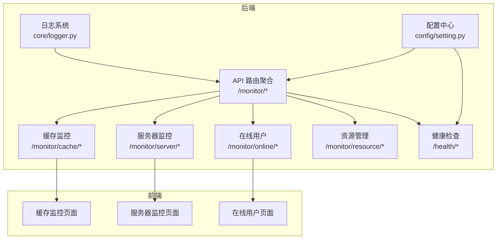
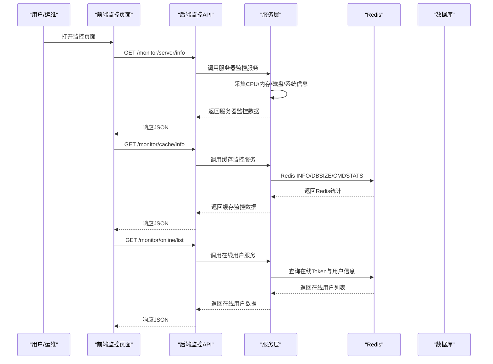
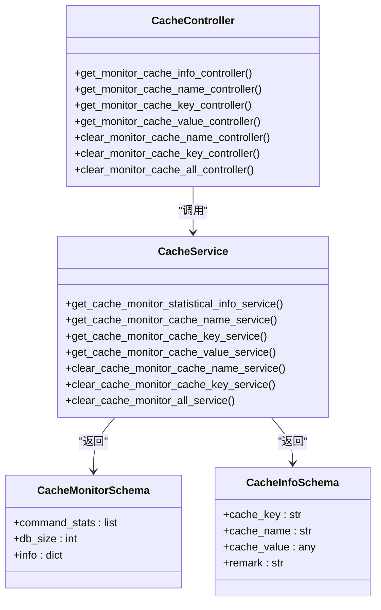
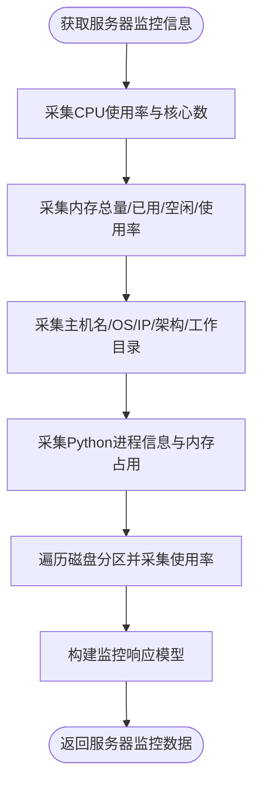
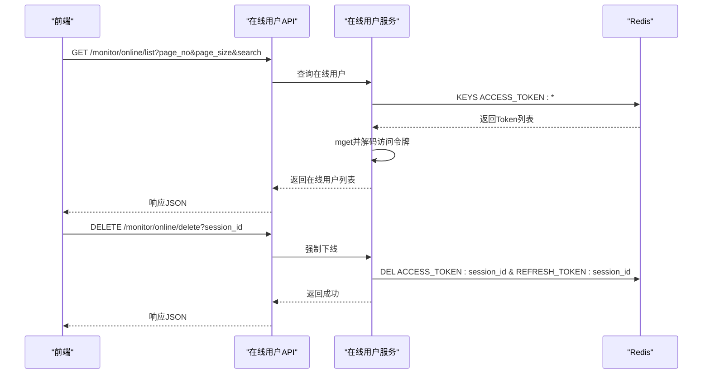
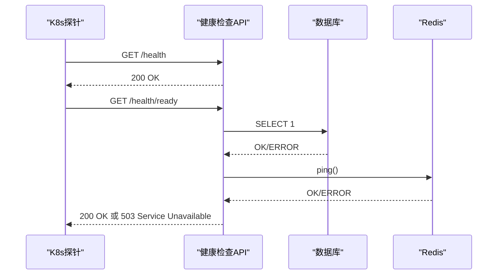
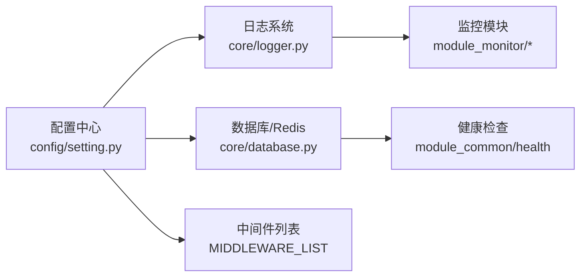

# 监控告警配置

<cite>
**本文档引用的文件**
- [backend/app/api/v1/module_monitor/__init__.py](file://backend/app/api/v1/module_monitor/__init__.py)
- [backend/app/api/v1/module_monitor/cache/controller.py](file://backend/app/api/v1/module_monitor/cache/controller.py)
- [backend/app/api/v1/module_monitor/cache/service.py](file://backend/app/api/v1/module_monitor/cache/service.py)
- [backend/app/api/v1/module_monitor/cache/schema.py](file://backend/app/api/v1/module_monitor/cache/schema.py)
- [backend/app/api/v1/module_monitor/server/controller.py](file://backend/app/api/v1/module_monitor/server/controller.py)
- [backend/app/api/v1/module_monitor/server/service.py](file://backend/app/api/v1/module_monitor/server/service.py)
- [backend/app/api/v1/module_monitor/online/controller.py](file://backend/app/api/v1/module_monitor/online/controller.py)
- [backend/app/api/v1/module_monitor/online/service.py](file://backend/app/api/v1/module_monitor/online/service.py)
- [backend/app/api/v1/module_monitor/resource/controller.py](file://backend/app/api/v1/module_monitor/resource/controller.py)
- [backend/app/api/v1/module_monitor/resource/service.py](file://backend/app/api/v1/module_monitor/resource/service.py)
- [backend/app/api/v1/module_common/health/controller.py](file://backend/app/api/v1/module_common/health/controller.py)
- [backend/app/core/database.py](file://backend/app/core/database.py)
- [backend/app/core/logger.py](file://backend/app/core/logger.py)
- [backend/app/config/setting.py](file://backend/app/config/setting.py)
- [frontend/web/src/views/module_monitor/cache/index.vue](file://frontend/web/src/views/module_monitor/cache/index.vue)
- [frontend/web/src/views/module_monitor/server/index.vue](file://frontend/web/src/views/module_monitor/server/index.vue)
- [frontend/web/src/views/module_monitor/online/index.vue](file://frontend/web/src/views/module_monitor/online/index.vue)
- [frontend/web/src/api/module_monitor/cache.ts](file://frontend/web/src/api/module_monitor/cache.ts)
- [frontend/web/src/api/module_monitor/server.ts](file://frontend/web/src/api/module_monitor/server.ts)
</cite>

## 目录
1. [简介](#简介)
2. [项目结构](#项目结构)
3. [核心组件](#核心组件)
4. [架构概览](#架构概览)
5. [详细组件分析](#详细组件分析)
6. [依赖分析](#依赖分析)
7. [性能考虑](#性能考虑)
8. [故障排查指南](#故障排查指南)
9. [结论](#结论)
10. [附录](#附录)

## 简介
本指南面向运维与开发团队，系统性阐述 FastapiAdmin 的监控告警配置方案，涵盖服务器资源监控、数据库性能监控、Redis 缓存监控、应用健康检查、日志记录与聚合、异常告警、性能阈值设置以及通知渠道配置。同时提供监控仪表板搭建思路、关键指标定义与故障预警策略，帮助您建立完善的可观测性体系。

## 项目结构
后端采用 FastAPI + SQLAlchemy 异步架构，监控模块位于 `backend/app/api/v1/module_monitor`，包含缓存、服务器、在线用户、资源管理四个子模块，并通过统一的 `/monitor` 前缀路由聚合。前端监控页面位于 `frontend/web/src/views/module_monitor`，分别对应各监控维度的可视化界面。

**图表来源**
- [backend/app/api/v1/module_monitor/__init__.py:1-13](file://backend/app/api/v1/module_monitor/__init__.py#L1-L13)
- [backend/app/api/v1/module_common/health/controller.py:1-88](file://backend/app/api/v1/module_common/health/controller.py#L1-L88)
- [backend/app/core/logger.py:1-147](file://backend/app/core/logger.py#L1-L147)
- [backend/app/config/setting.py:1-355](file://backend/app/config/setting.py#L1-L355)

**章节来源**
- [backend/app/api/v1/module_monitor/__init__.py:1-13](file://backend/app/api/v1/module_monitor/__init__.py#L1-L13)
- [backend/app/config/setting.py:1-355](file://backend/app/config/setting.py#L1-L355)

## 核心组件
- 监控路由聚合：统一挂载缓存、服务器、在线用户、资源管理子路由，形成 `/monitor` 前缀。
- 缓存监控：提供 Redis 基础信息、命令统计、Key 数量、键值查询与清理能力。
- 服务器监控：采集 CPU、内存、磁盘、系统与 Python 运行时信息。
- 在线用户：基于 Redis 的在线会话查询、筛选、强制下线与批量清退。
- 资源管理：受控的静态文件目录浏览、上传、下载、移动、复制、重命名、导出与删除。
- 健康检查：存活探针与就绪探针，检查数据库与 Redis 连接状态。
- 日志系统：基于 Loguru 的结构化日志、文件轮转、错误日志分离与第三方库拦截。

**章节来源**
- [backend/app/api/v1/module_monitor/cache/controller.py:1-197](file://backend/app/api/v1/module_monitor/cache/controller.py#L1-L197)
- [backend/app/api/v1/module_monitor/server/controller.py:1-33](file://backend/app/api/v1/module_monitor/server/controller.py#L1-L33)
- [backend/app/api/v1/module_monitor/online/controller.py:1-109](file://backend/app/api/v1/module_monitor/online/controller.py#L1-L109)
- [backend/app/api/v1/module_monitor/resource/controller.py:1-276](file://backend/app/api/v1/module_monitor/resource/controller.py#L1-L276)
- [backend/app/api/v1/module_common/health/controller.py:1-88](file://backend/app/api/v1/module_common/health/controller.py#L1-L88)
- [backend/app/core/logger.py:1-147](file://backend/app/core/logger.py#L1-L147)

## 架构概览
监控体系由“采集-存储-展示-告警”闭环构成。后端通过各模块控制器与服务层采集指标，前端通过 API 获取数据并渲染图表；健康检查为容器编排提供就绪/存活探针；日志系统负责结构化记录与聚合。

**图表来源**
- [frontend/web/src/views/module_monitor/server/index.vue:1-262](file://frontend/web/src/views/module_monitor/server/index.vue#L1-L262)
- [frontend/web/src/views/module_monitor/cache/index.vue:1-610](file://frontend/web/src/views/module_monitor/cache/index.vue#L1-L610)
- [frontend/web/src/views/module_monitor/online/index.vue:1-287](file://frontend/web/src/views/module_monitor/online/index.vue#L1-L287)
- [backend/app/api/v1/module_monitor/server/service.py:1-164](file://backend/app/api/v1/module_monitor/server/service.py#L1-L164)
- [backend/app/api/v1/module_monitor/cache/service.py:1-155](file://backend/app/api/v1/module_monitor/cache/service.py#L1-L155)
- [backend/app/api/v1/module_monitor/online/service.py:1-119](file://backend/app/api/v1/module_monitor/online/service.py#L1-L119)

## 详细组件分析

### 缓存监控模块
- 控制器职责：提供缓存信息、缓存名称列表、键名列表、键值读取与清理（按名称、按键、全部）。
- 服务层职责：封装 RedisCURD，执行 INFO、DBSIZE、KEYS、GET、DEL 等操作，构造监控统计与数据模型。
- 数据模型：缓存监控信息、缓存对象信息，包含命令统计、数据库Key总数、服务器信息等。
- 前端职责：展示 Redis 基本信息、命令统计饼图、内存使用仪表盘，支持缓存管理操作。

**图表来源**
- [backend/app/api/v1/module_monitor/cache/controller.py:1-197](file://backend/app/api/v1/module_monitor/cache/controller.py#L1-L197)
- [backend/app/api/v1/module_monitor/cache/service.py:1-155](file://backend/app/api/v1/module_monitor/cache/service.py#L1-L155)
- [backend/app/api/v1/module_monitor/cache/schema.py:1-25](file://backend/app/api/v1/module_monitor/cache/schema.py#L1-L25)

**章节来源**
- [backend/app/api/v1/module_monitor/cache/controller.py:1-197](file://backend/app/api/v1/module_monitor/cache/controller.py#L1-L197)
- [backend/app/api/v1/module_monitor/cache/service.py:1-155](file://backend/app/api/v1/module_monitor/cache/service.py#L1-L155)
- [backend/app/api/v1/module_monitor/cache/schema.py:1-25](file://backend/app/api/v1/module_monitor/cache/schema.py#L1-L25)
- [frontend/web/src/views/module_monitor/cache/index.vue:1-610](file://frontend/web/src/views/module_monitor/cache/index.vue#L1-L610)
- [frontend/web/src/api/module_monitor/cache.ts:1-96](file://frontend/web/src/api/module_monitor/cache.ts#L1-L96)

### 服务器监控模块
- 控制器职责：提供服务器监控信息查询接口。
- 服务层职责：使用 psutil 采集 CPU、内存、磁盘、系统与 Python 运行时信息，进行单位换算与格式化。
- 前端职责：展示 CPU 使用率、内存使用率、磁盘使用明细、服务器与 Python 环境信息。

**图表来源**
- [backend/app/api/v1/module_monitor/server/service.py:1-164](file://backend/app/api/v1/module_monitor/server/service.py#L1-L164)
- [frontend/web/src/views/module_monitor/server/index.vue:1-262](file://frontend/web/src/views/module_monitor/server/index.vue#L1-L262)

**章节来源**
- [backend/app/api/v1/module_monitor/server/controller.py:1-33](file://backend/app/api/v1/module_monitor/server/controller.py#L1-L33)
- [backend/app/api/v1/module_monitor/server/service.py:1-164](file://backend/app/api/v1/module_monitor/server/service.py#L1-L164)
- [frontend/web/src/views/module_monitor/server/index.vue:1-262](file://frontend/web/src/views/module_monitor/server/index.vue#L1-L262)
- [frontend/web/src/api/module_monitor/server.ts:1-68](file://frontend/web/src/api/module_monitor/server.ts#L1-L68)

### 在线用户模块
- 控制器职责：提供在线用户列表查询、按条件分页、强制下线与批量清退。
- 服务层职责：基于 Redis 的 Token Key 前缀扫描，解码访问令牌获取会话信息，支持按名称/IP/登录位置筛选。
- 前端职责：提供搜索栏、表格列配置、批量强退与逐项强退操作。

**图表来源**
- [backend/app/api/v1/module_monitor/online/controller.py:1-109](file://backend/app/api/v1/module_monitor/online/controller.py#L1-L109)
- [backend/app/api/v1/module_monitor/online/service.py:1-119](file://backend/app/api/v1/module_monitor/online/service.py#L1-L119)

**章节来源**
- [backend/app/api/v1/module_monitor/online/controller.py:1-109](file://backend/app/api/v1/module_monitor/online/controller.py#L1-L109)
- [backend/app/api/v1/module_monitor/online/service.py:1-119](file://backend/app/api/v1/module_monitor/online/service.py#L1-L119)
- [frontend/web/src/views/module_monitor/online/index.vue:1-287](file://frontend/web/src/views/module_monitor/online/index.vue#L1-L287)

### 资源管理模块
- 功能范围：受控的静态文件目录管理（upload 目录），包括目录浏览、文件上传/下载、移动/复制/重命名、删除、导出列表。
- 安全设计：严格的路径遍历防护、文件名清洗、MIME 类型检测、大小限制与扩展名白名单。
- 前端职责：提供搜索、分页、表格列配置、批量操作与导出。

**章节来源**
- [backend/app/api/v1/module_monitor/resource/controller.py:1-276](file://backend/app/api/v1/module_monitor/resource/controller.py#L1-L276)
- [backend/app/api/v1/module_monitor/resource/service.py:1-800](file://backend/app/api/v1/module_monitor/resource/service.py#L1-L800)

### 健康检查模块
- 存活探针：返回系统健康状态，供容器编排 livenessProbe 使用。
- 就绪探针：检查数据库与 Redis 连接，任一失败返回 503，供 readinessProbe 使用。
- 依赖：数据库使用 SELECT 1 轻量检查，Redis 使用 ping。

**图表来源**
- [backend/app/api/v1/module_common/health/controller.py:1-88](file://backend/app/api/v1/module_common/health/controller.py#L1-L88)
- [backend/app/core/database.py:152-176](file://backend/app/core/database.py#L152-L176)

**章节来源**
- [backend/app/api/v1/module_common/health/controller.py:1-88](file://backend/app/api/v1/module_common/health/controller.py#L1-L88)
- [backend/app/core/database.py:152-176](file://backend/app/core/database.py#L152-L176)

### 日志系统
- 结构化日志：基于 Loguru，统一拦截 Python 标准日志，支持控制台彩色输出与文件轮转。
- 文件策略：INFO/ERROR 分离文件，每日午夜轮转，保留30天；可选 JSON Lines 文件用于日志平台采集。
- 上下文：全局附加应用名，退出时自动清理处理器。

**章节来源**
- [backend/app/core/logger.py:1-147](file://backend/app/core/logger.py#L1-L147)
- [backend/app/config/setting.py:145-163](file://backend/app/config/setting.py#L145-L163)

## 依赖分析
- 配置中心：Settings 提供日志级别、Redis/数据库开关、连接参数、中间件与事件列表等。
- 数据库连接：Redis 连接在 lifespan 中建立，健康检查复用现有连接。
- 中间件：根据配置动态启用跨域、请求日志与压缩中间件。

**图表来源**
- [backend/app/config/setting.py:227-254](file://backend/app/config/setting.py#L227-L254)
- [backend/app/core/database.py:152-176](file://backend/app/core/database.py#L152-L176)
- [backend/app/core/logger.py:1-147](file://backend/app/core/logger.py#L1-L147)

**章节来源**
- [backend/app/config/setting.py:227-254](file://backend/app/config/setting.py#L227-L254)
- [backend/app/core/database.py:152-176](file://backend/app/core/database.py#L152-L176)

## 性能考虑
- Redis 命令统计与 Keys 扫描：建议在高负载场景下降低扫描频率或使用更细粒度的采样策略，避免阻塞。
- 在线用户列表：Redis Keys 扫描与多键 mget 会带来一定开销，建议结合分页与筛选条件减少数据量。
- 服务器监控：CPU/内存/磁盘采集为本地系统调用，开销较低；磁盘遍历可能产生 IO 压力，建议定期而非高频采集。
- 日志轮转：INFO/ERROR 分离与压缩可降低磁盘压力，注意 JSON Lines 文件保留天数与磁盘配额。

[本节为通用指导，无需特定文件引用]

## 故障排查指南
- Redis 连接失败：检查 REDIS_ENABLE、REDIS_HOST/PORT/DB/PASSWORD 与健康检查 Redis ping 结果。
- 数据库连接失败：检查 SQL_DB_ENABLE、数据库类型与连接串，健康检查使用 SELECT 1 验证。
- 缓存监控异常：确认 Redis 服务状态与权限，核对命令统计与 DBSIZE 返回值。
- 在线用户查询为空：确认 ACCESS_TOKEN/REFRESH_TOKEN 前缀配置与 Token 解码逻辑。
- 日志缺失：检查 LOGGER_LEVEL、日志目录权限与轮转策略，确认第三方库日志拦截已生效。

**章节来源**
- [backend/app/api/v1/module_common/health/controller.py:40-88](file://backend/app/api/v1/module_common/health/controller.py#L40-L88)
- [backend/app/core/database.py:152-176](file://backend/app/core/database.py#L152-L176)
- [backend/app/core/logger.py:101-130](file://backend/app/core/logger.py#L101-L130)

## 结论
通过统一的监控路由与清晰的服务层职责划分，FastapiAdmin 实现了对服务器资源、Redis 缓存、在线用户与静态资源的全面可观测。配合健康检查与结构化日志，可快速定位问题并建立自动化告警与恢复流程。建议结合业务场景设定合理的阈值与告警规则，并持续优化采集频率与日志策略。

[本节为总结性内容，无需特定文件引用]

## 附录

### 监控仪表板搭建建议
- 服务器监控：CPU 使用率、内存使用率、磁盘使用率趋势图；Python 进程内存占比；系统与网络 IO。
- 缓存监控：Key 数量变化、常用命令占比、内存使用仪表盘；热点键名与过期策略。
- 在线用户：活跃用户趋势、地域分布、设备类型；异常登录行为检测。
- 资源管理：上传/下载量趋势、文件类型分布、目录空间占用。

[本节为概念性内容，无需特定文件引用]

### 关键指标定义
- 服务器：CPU 使用率、内存使用率、磁盘使用率、磁盘 IOPS、网络吞吐。
- 缓存：Key 数量、内存使用、命中率（需结合应用侧统计）、命令耗时。
- 在线用户：并发会话数、新增会话速率、平均会话时长。
- 资源：上传/下载成功率、文件大小分布、目录容量。

[本节为概念性内容，无需特定文件引用]

### 故障预警策略
- 阈值告警：CPU > 80%、内存 > 80%、磁盘 > 80%、Key 数量异常增长、Redis 内存接近上限。
- 健康探针：就绪探针失败触发自动摘除与重启；存活探针失败触发重启。
- 日志告警：ERROR/CRITICAL 级别日志阈值、异常堆栈关键字匹配。
- 通知渠道：邮件、IM、短信、Webhook，分级分类通知。

[本节为概念性内容，无需特定文件引用]