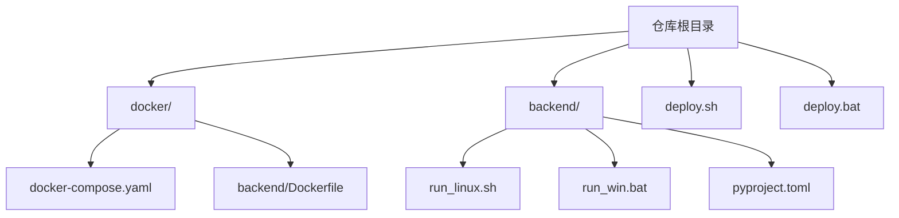
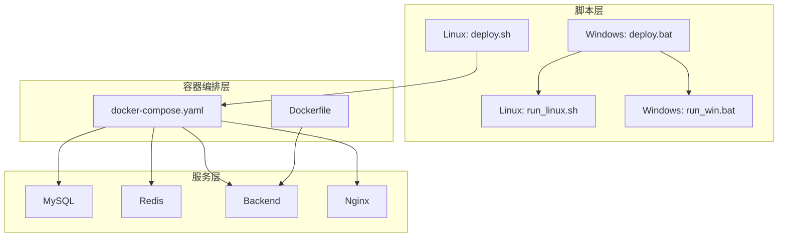
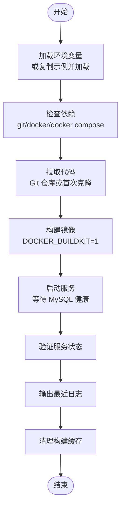
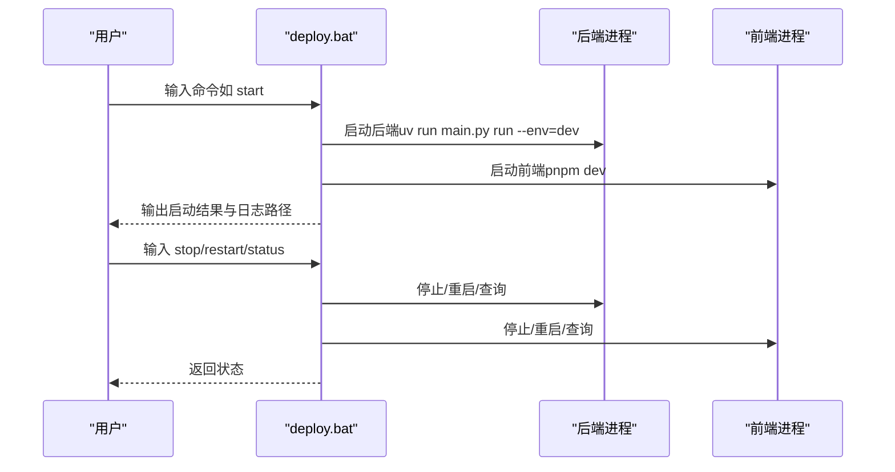
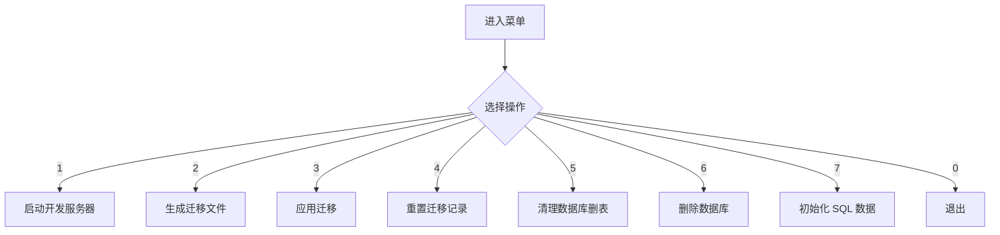
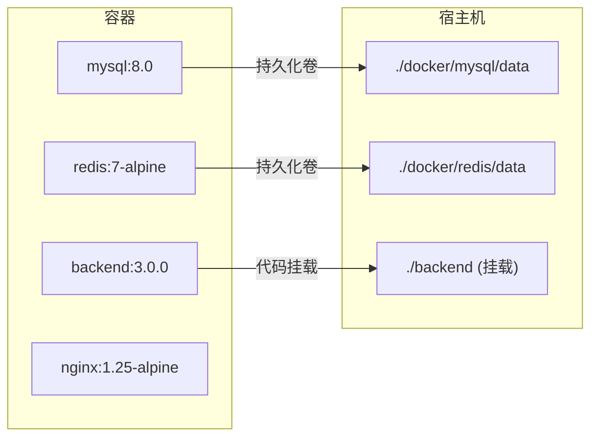
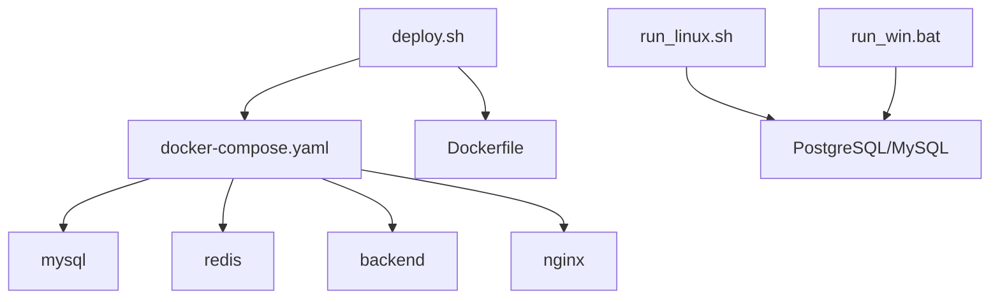

# 自动化部署脚本

<cite>
**本文引用的文件**
- [deploy.sh](file://deploy.sh)
- [deploy.bat](file://deploy.bat)
- [run_linux.sh](file://backend/run_linux.sh)
- [run_win.bat](file://backend/run_win.bat)
- [docker-compose.yaml](file://docker/docker-compose.yaml)
- [Dockerfile](file://docker/backend/Dockerfile)
- [pyproject.toml](file://backend/pyproject.toml)
</cite>

## 目录
1. [简介](#简介)
2. [项目结构](#项目结构)
3. [核心组件](#核心组件)
4. [架构总览](#架构总览)
5. [详细组件分析](#详细组件分析)
6. [依赖关系分析](#依赖关系分析)
7. [性能考虑](#性能考虑)
8. [故障排查指南](#故障排查指南)
9. [结论](#结论)
10. [附录](#附录)

## 简介
本指南面向需要在 Linux 与 Windows 平台上一键部署 FastapiAdmin 的用户与运维人员。文档覆盖以下内容：
- 一键部署脚本的功能与使用方法
- 部署脚本的工作流程、参数配置与执行步骤
- 不同部署场景的脚本定制方法（增量更新、回滚、配置变更）
- 部署前的环境检查、部署后的验证步骤
- 常见问题的自动处理机制与故障排查建议

## 项目结构
本项目采用前后端分离与容器化部署策略，主要部署相关文件如下：
- Linux 一键部署脚本：deploy.sh
- Windows 一键部署脚本：deploy.bat
- 后端开发辅助脚本（Linux）：backend/run_linux.sh
- 后端开发辅助脚本（Windows）：backend/run_win.bat
- 容器编排配置：docker/docker-compose.yaml
- 后端镜像构建文件：docker/backend/Dockerfile
- 后端依赖与工具配置：backend/pyproject.toml

**图表来源**
- [docker-compose.yaml](file://docker/docker-compose.yaml)
- [Dockerfile](file://docker/backend/Dockerfile)
- [run_linux.sh](file://backend/run_linux.sh)
- [run_win.bat](file://backend/run_win.bat)
- [pyproject.toml](file://backend/pyproject.toml)

**章节来源**
- [deploy.sh](file://deploy.sh)
- [deploy.bat](file://deploy.bat)
- [docker-compose.yaml](file://docker/docker-compose.yaml)
- [Dockerfile](file://docker/backend/Dockerfile)
- [run_linux.sh](file://backend/run_linux.sh)
- [run_win.bat](file://backend/run_win.bat)
- [pyproject.toml](file://backend/pyproject.toml)

## 核心组件
- Linux 一键部署脚本（deploy.sh）
  - 功能：加载环境变量、检查依赖、停止旧服务、拉取代码、构建镜像、启动服务、健康检查、显示日志、清理缓存
  - 支持子命令：start、stop、restart、logs、verify、clean
- Windows 一键部署脚本（deploy.bat）
  - 功能：帮助、启动、停止、重启、状态检查
  - 日志与进程管理：统一写入 logs/ 目录，PID 文件便于进程控制
- 后端开发辅助脚本（Linux/Windows）
  - 功能：开发服务器启动、迁移文件生成与应用、数据库重置/清理/删除、SQL 初始化
- 容器编排与镜像
  - docker-compose.yaml：定义 mysql、redis、backend、nginx 四个服务及其健康检查
  - Dockerfile：后端镜像构建与默认运行命令

**章节来源**
- [deploy.sh](file://deploy.sh)
- [deploy.bat](file://deploy.bat)
- [run_linux.sh](file://backend/run_linux.sh)
- [run_win.bat](file://backend/run_win.bat)
- [docker-compose.yaml](file://docker/docker-compose.yaml)
- [Dockerfile](file://docker/backend/Dockerfile)

## 架构总览
整体部署架构由“脚本层—容器编排层—服务层”组成，Linux/Windows 脚本分别驱动 Docker Compose 或本地进程管理。

**图表来源**
- [deploy.sh](file://deploy.sh)
- [deploy.bat](file://deploy.bat)
- [run_linux.sh](file://backend/run_linux.sh)
- [run_win.bat](file://backend/run_win.bat)
- [docker-compose.yaml](file://docker/docker-compose.yaml)
- [Dockerfile](file://docker/backend/Dockerfile)

## 详细组件分析

### Linux 一键部署脚本（deploy.sh）
- 环境变量加载
  - 优先加载 docker/.env；若不存在则复制 docker/.env.example 并加载
- 依赖检查
  - 确保 git、docker 存在；检测 docker compose 或 docker-compose
  - 创建 mysql/redis 数据目录
- 代码拉取
  - 若为 Git 仓库：执行 git fetch/pull；若自身脚本被更新则自动重载
  - 若非 Git 仓库：初始化并拉取主分支
- 镜像构建与服务启动
  - 设置 DOCKER_BUILDKIT=1，执行构建
  - 使用 docker compose 启动并等待 MySQL 健康
- 验证与日志
  - 校验 mysql、redis、backend、nginx 状态
  - 输出最近 50 行日志
- 清理
  - 清理未使用的构建缓存与镜像

**图表来源**
- [deploy.sh](file://deploy.sh)

**章节来源**
- [deploy.sh](file://deploy.sh)

### Windows 一键部署脚本（deploy.bat）
- 帮助与命令
  - start、stop、restart、status、help/--help/-h
- 启动流程
  - 后端：uv run main.py run --env=dev
  - 前端 Web：pnpm dev
  - 记录 PID 与日志，避免重复启动
- 停止与重启
  - 通过 PID 文件定位进程并终止
- 状态检查
  - 查询 PID 是否仍存活

**图表来源**
- [deploy.bat](file://deploy.bat)

**章节来源**
- [deploy.bat](file://deploy.bat)

### 后端开发辅助脚本（Linux/Windows）
- Linux（run_linux.sh）
  - 交互式菜单：启动开发服务器、生成迁移、应用迁移、重置迁移记录、清理数据库、删除数据库、初始化 SQL 数据
  - 数据库配置读取自 backend/env/.env.dev
  - 提供非交互入口：--start-dev
- Windows（run_win.bat）
  - 类似功能的批处理实现，读取 backend\env\.env.dev

**图表来源**
- [run_linux.sh](file://backend/run_linux.sh)
- [run_win.bat](file://backend/run_win.bat)

**章节来源**
- [run_linux.sh](file://backend/run_linux.sh)
- [run_win.bat](file://backend/run_win.bat)

### 容器编排与镜像（docker-compose.yaml / Dockerfile）
- docker-compose.yaml
  - 服务：mysql、redis、backend、nginx
  - 健康检查：mysql ping、redis-cli ping、backend HTTP 健康接口、nginx 配置测试
  - 端口映射：MYSQL_PORT、REDIS_PORT、BACKEND_PORT、HTTP_PORT、HTTPS_PORT
  - 挂载：持久化卷 mysql_data、redis_data；后端代码挂载以支持热更新
- Dockerfile
  - 基于 python:3.10-slim
  - 安装依赖后暴露 8001 端口，默认 CMD 运行 prod 环境

**图表来源**
- [docker-compose.yaml](file://docker/docker-compose.yaml)
- [Dockerfile](file://docker/backend/Dockerfile)

**章节来源**
- [docker-compose.yaml](file://docker/docker-compose.yaml)
- [Dockerfile](file://docker/backend/Dockerfile)

## 依赖关系分析
- 脚本与容器编排
  - deploy.sh 通过 docker compose 控制服务生命周期
  - run_linux.sh/run_win.bat 仅用于本地开发与数据库操作，不参与生产容器编排
- 依赖工具
  - Linux：git、docker、docker compose、md5sum/md5
  - Windows：uv、psql（通过 PATH）、pnpm（前端）

**图表来源**
- [deploy.sh](file://deploy.sh)
- [docker-compose.yaml](file://docker/docker-compose.yaml)
- [Dockerfile](file://docker/backend/Dockerfile)
- [run_linux.sh](file://backend/run_linux.sh)
- [run_win.bat](file://backend/run_win.bat)

**章节来源**
- [deploy.sh](file://deploy.sh)
- [docker-compose.yaml](file://docker/docker-compose.yaml)
- [Dockerfile](file://docker/backend/Dockerfile)
- [run_linux.sh](file://backend/run_linux.sh)
- [run_win.bat](file://backend/run_win.bat)

## 性能考虑
- 构建优化
  - Linux 部署脚本启用 DOCKER_BUILDKIT=1，提升构建效率
- 资源限制
  - docker-compose.yaml 中为各服务设置了内存与 CPU 资源限制与保留，避免资源争用
- 健康检查
  - 通过健康检查确保服务稳定后再进行后续步骤，减少无效等待

**章节来源**
- [deploy.sh](file://deploy.sh)
- [docker-compose.yaml](file://docker/docker-compose.yaml)

## 故障排查指南
- Linux 环境变量缺失
  - 现象：脚本报错提示未设置环境变量
  - 处理：复制 .env.example 为 .env 并按需填写
- 依赖缺失
  - 现象：提示缺少 git、docker、docker compose
  - 处理：安装对应工具并确保在 PATH 中
- MySQL 未就绪
  - 现象：启动后等待超时
  - 处理：查看 logs、确认 .env 中密码正确、检查卷挂载权限
- 镜像构建失败
  - 现象：pip 安装依赖报错
  - 处理：检查网络与镜像源、确认 requirements.txt 与 pyproject.toml 一致性
- Windows 后端/前端无法启动
  - 现象：uv/pnpm 命令找不到
  - 处理：安装 uv 与 pnpm，并确保 PATH 包含它们
- 进程冲突（Windows）
  - 现象：提示服务已在运行
  - 处理：检查 logs\*.pid 文件对应的进程是否仍存活，手动终止或删除 PID 文件后重试

**章节来源**
- [deploy.sh](file://deploy.sh)
- [deploy.bat](file://deploy.bat)
- [docker-compose.yaml](file://docker/docker-compose.yaml)

## 结论
本项目提供了跨平台的一键部署方案：Linux 通过 deploy.sh 驱动 Docker Compose 完成完整部署，Windows 通过 deploy.bat 管理本地进程并提供开发辅助脚本。结合健康检查与日志输出，能够快速定位问题并完成部署验证。对于生产环境，建议使用 Linux 脚本并配合 .env 配置与持久化卷管理。

## 附录

### 参数与配置清单
- Linux
  - 环境变量文件：docker/.env（或 docker/.env.example）
  - 关键变量：MYSQL_ROOT_PASSWORD、MYSQL_DATABASE、MYSQL_USER、MYSQL_PASSWORD、REDIS_PASSWORD、BACKEND_PORT、HTTP_PORT、HTTPS_PORT
- Windows
  - 环境变量文件：docker/.env
  - 关键变量：同上
- 后端开发脚本
  - 数据库配置：backend/env/.env.dev（Linux 与 Windows 各自独立）

**章节来源**
- [deploy.sh](file://deploy.sh)
- [deploy.bat](file://deploy.bat)
- [docker-compose.yaml](file://docker/docker-compose.yaml)
- [run_linux.sh](file://backend/run_linux.sh)
- [run_win.bat](file://backend/run_win.bat)

### 常见部署场景定制方法
- 增量更新
  - Linux：直接执行 deploy.sh（会先停止服务、拉取代码、重建镜像并启动），或使用子命令 start/stop/restart
  - Windows：使用 deploy.bat 的 start/stop/restart
- 回滚操作
  - Linux：可通过 docker commit/rollback 镜像或切换镜像标签的方式实现；若使用 Git 仓库，可利用 git reset/checkout
  - Windows：建议通过版本化镜像或 Git 回退
- 配置变更
  - 修改 docker/.env 中的端口与密码等参数后，重新执行 deploy.sh 或 deploy.bat 的相应命令
- 部署前检查
  - Linux：确认 .env 存在且变量齐全、依赖工具可用、必要目录存在
  - Windows：确认 uv、psql、pnpm 在 PATH 中，logs 目录可写
- 部署后验证
  - Linux：使用 verify 子命令检查服务状态，查看 logs 子命令输出
  - Windows：使用 status 子命令检查服务状态

**章节来源**
- [deploy.sh](file://deploy.sh)
- [deploy.bat](file://deploy.bat)
- [docker-compose.yaml](file://docker/docker-compose.yaml)