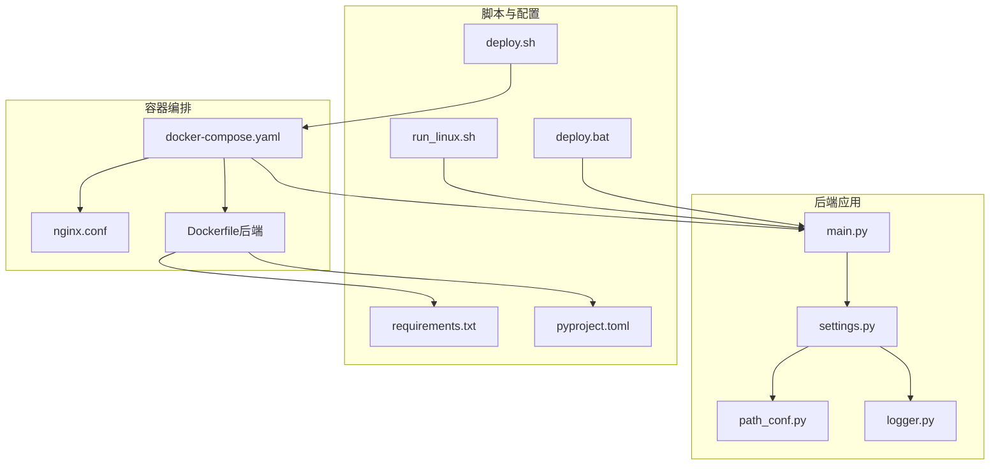
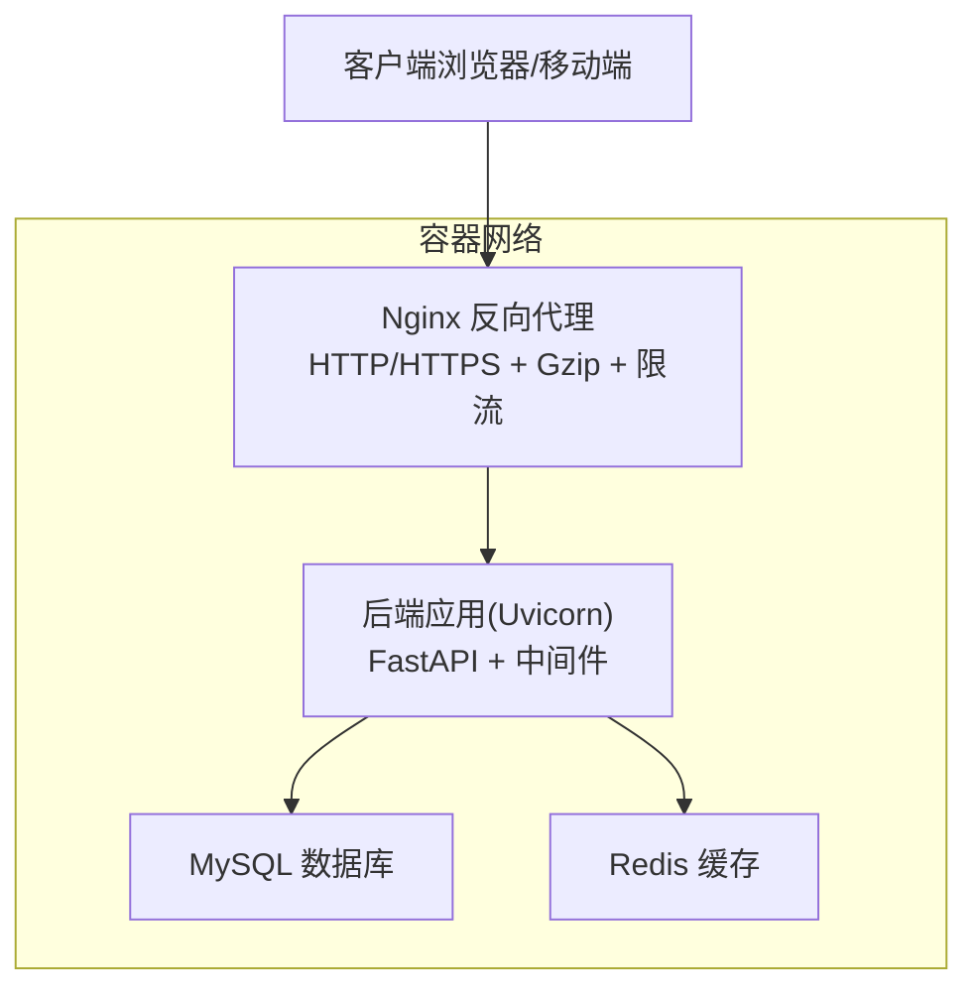
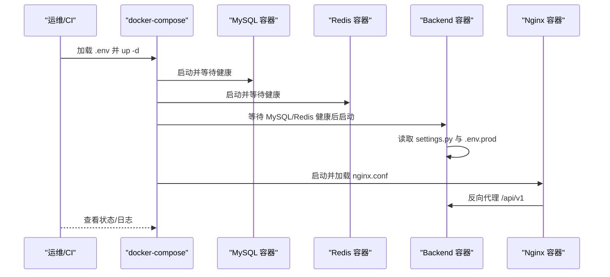
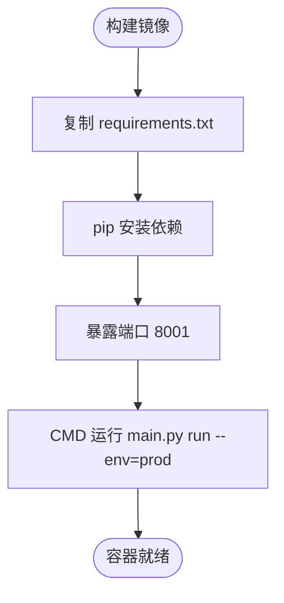
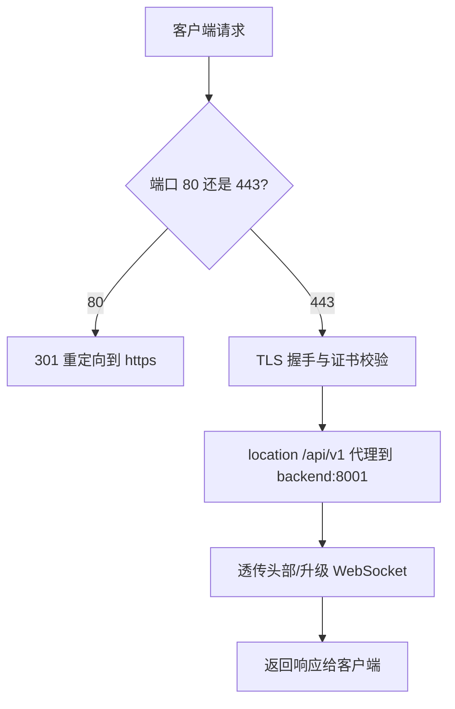
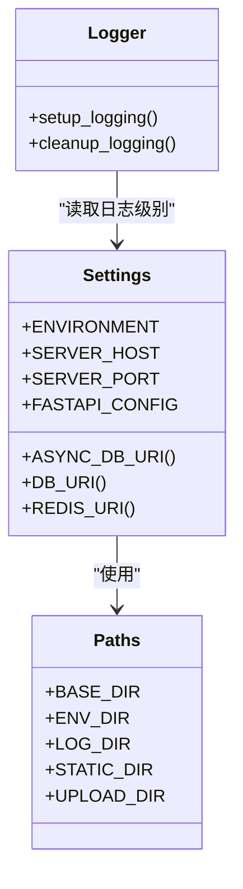
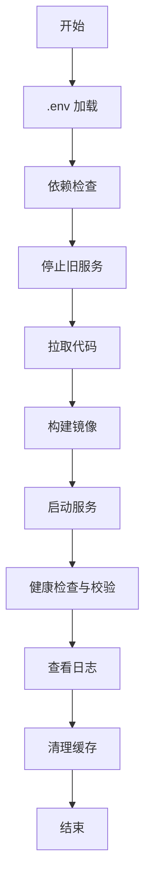
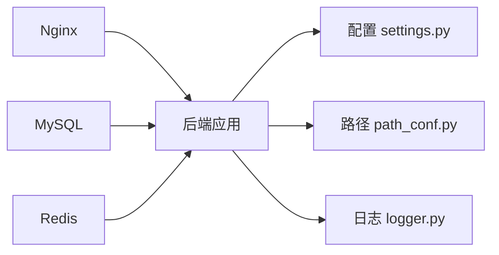

# 部署运维

<cite>
**本文引用的文件**
- [docker-compose.yaml](file://docker/docker-compose.yaml)
- [Dockerfile（后端）](file://docker/backend/Dockerfile)
- [Nginx 配置](file://docker/nginx/nginx.conf)
- [后端入口 main.py](file://backend/main.py)
- [后端配置 settings.py](file://backend/app/config/setting.py)
- [路径与环境配置 path_conf.py](file://backend/app/config/path_conf.py)
- [日志配置 logger.py](file://backend/app/core/logger.py)
- [部署脚本 deploy.sh](file://deploy.sh)
- [Windows 部署脚本 deploy.bat](file://deploy.bat)
- [Linux 初始化脚本 run_linux.sh](file://backend/run_linux.sh)
- [后端依赖 requirements.txt](file://backend/requirements.txt)
- [后端项目配置 pyproject.toml](file://backend/pyproject.toml)
</cite>

## 目录
1. [简介](#简介)
2. [项目结构](#项目结构)
3. [核心组件](#核心组件)
4. [架构总览](#架构总览)
5. [详细组件分析](#详细组件分析)
6. [依赖分析](#依赖分析)
7. [性能考虑](#性能考虑)
8. [故障排除指南](#故障排除指南)
9. [结论](#结论)
10. [附录](#附录)

## 简介
本指南面向运维工程师与开发者，提供 FastapiAdmin 在生产与开发环境下的完整部署运维方案。内容覆盖：
- Docker 容器化与编排（Compose）
- 镜像构建与容器网络配置
- Nginx 反向代理与 SSL 证书管理
- 生产环境环境变量、数据库与缓存配置
- 监控告警、日志收集与性能优化
- 自动化部署脚本使用与自定义
- 不同部署场景的实施步骤与故障排除

## 项目结构
FastapiAdmin 采用前后端分离与容器化部署架构，核心目录与职责如下：
- docker：容器化与编排相关文件（Compose、Nginx、MySQL、Redis）
- backend：后端 FastAPI 应用（配置、核心模块、API、脚本等）
- frontend：前端应用（Web/旧版 Web/App/Docs）
- deploy.sh / deploy.bat：自动化部署脚本（Linux/Windows）

图表来源
- [docker-compose.yaml:1-201](file://docker/docker-compose.yaml#L1-L201)
- [Nginx 配置:1-139](file://docker/nginx/nginx.conf#L1-L139)
- [Dockerfile（后端）:1-23](file://docker/backend/Dockerfile#L1-L23)
- [后端入口 main.py:1-163](file://backend/main.py#L1-L163)
- [后端配置 settings.py:1-355](file://backend/app/config/setting.py#L1-L355)
- [路径与环境配置 path_conf.py:1-32](file://backend/app/config/path_conf.py#L1-L32)
- [日志配置 logger.py:1-147](file://backend/app/core/logger.py#L1-L147)
- [部署脚本 deploy.sh:1-175](file://deploy.sh#L1-L175)
- [Windows 部署脚本 deploy.bat:1-165](file://deploy.bat#L1-L165)
- [Linux 初始化脚本 run_linux.sh:1-379](file://backend/run_linux.sh#L1-L379)
- [后端依赖 requirements.txt:1-45](file://backend/requirements.txt#L1-L45)
- [后端项目配置 pyproject.toml:1-138](file://backend/pyproject.toml#L1-L138)

章节来源
- [docker-compose.yaml:1-201](file://docker/docker-compose.yaml#L1-L201)
- [Nginx 配置:1-139](file://docker/nginx/nginx.conf#L1-L139)
- [Dockerfile（后端）:1-23](file://docker/backend/Dockerfile#L1-L23)
- [后端入口 main.py:1-163](file://backend/main.py#L1-L163)
- [后端配置 settings.py:1-355](file://backend/app/config/setting.py#L1-L355)
- [路径与环境配置 path_conf.py:1-32](file://backend/app/config/path_conf.py#L1-L32)
- [日志配置 logger.py:1-147](file://backend/app/core/logger.py#L1-L147)
- [部署脚本 deploy.sh:1-175](file://deploy.sh#L1-L175)
- [Windows 部署脚本 deploy.bat:1-165](file://deploy.bat#L1-L165)
- [Linux 初始化脚本 run_linux.sh:1-379](file://backend/run_linux.sh#L1-L379)
- [后端依赖 requirements.txt:1-45](file://backend/requirements.txt#L1-L45)
- [后端项目配置 pyproject.toml:1-138](file://backend/pyproject.toml#L1-L138)

## 核心组件
- 容器编排与服务
  - MySQL：数据库服务，健康检查、资源限制、持久化卷
  - Redis：缓存与会话存储，健康检查、资源限制、AOF 配置
  - Backend：后端应用，Uvicorn 运行、健康检查、挂载代码目录
  - Nginx：反向代理与静态资源，HTTP/HTTPS、Gzip、安全头、限流
- 配置与运行
  - settings.py：统一配置中心，支持 .env.dev/.env.prod 加载
  - path_conf.py：路径与环境目录
  - logger.py：日志系统（Loguru + 标准库拦截）
  - main.py：Typer CLI 启动、迁移命令、Uvicorn 运行
- 自动化脚本
  - deploy.sh：Linux 完整部署流水线（拉取→构建→启动→校验→清理）
  - deploy.bat：Windows 启停与状态检查
  - run_linux.sh：PostgreSQL 开发环境初始化与迁移

章节来源
- [docker-compose.yaml:9-201](file://docker/docker-compose.yaml#L9-L201)
- [后端配置 settings.py:1-355](file://backend/app/config/setting.py#L1-L355)
- [路径与环境配置 path_conf.py:1-32](file://backend/app/config/path_conf.py#L1-L32)
- [日志配置 logger.py:1-147](file://backend/app/core/logger.py#L1-L147)
- [后端入口 main.py:1-163](file://backend/main.py#L1-L163)
- [部署脚本 deploy.sh:1-175](file://deploy.sh#L1-L175)
- [Windows 部署脚本 deploy.bat:1-165](file://deploy.bat#L1-L165)
- [Linux 初始化脚本 run_linux.sh:1-379](file://backend/run_linux.sh#L1-L379)

## 架构总览
整体架构采用“Nginx → Backend → MySQL/Redis”的三层部署模式，容器间通过自定义桥接网络通信。

图表来源
- [docker-compose.yaml:9-201](file://docker/docker-compose.yaml#L9-L201)
- [Nginx 配置:72-130](file://docker/nginx/nginx.conf#L72-L130)
- [后端入口 main.py:95-102](file://backend/main.py#L95-L102)

## 详细组件分析

### Docker 容器化与编排
- 服务定义
  - MySQL：设置时区、凭据、端口映射、健康检查、资源限制、持久化卷
  - Redis：密码认证、AOF、健康检查、资源限制、持久化卷
  - Backend：构建上下文、环境变量（数据库/Redis）、端口映射、健康检查、挂载代码目录
  - Nginx：监听 80/443、挂载配置与证书、静态资源、反向代理到 backend:8001
- 网络与卷
  - app_network 桥接网络供服务互联
  - mysql_data/redis_data 绑定宿主机目录实现持久化

图表来源
- [docker-compose.yaml:9-201](file://docker/docker-compose.yaml#L9-L201)
- [后端配置 settings.py:16-21](file://backend/app/config/setting.py#L16-L21)

章节来源
- [docker-compose.yaml:9-201](file://docker/docker-compose.yaml#L9-L201)

### 镜像构建与运行
- 后端镜像
  - 基于 python:3.10-slim，安装 requirements.txt，暴露 8001，CMD 运行 prod 环境
- 运行参数
  - main.py run --env=prod，读取 .env.prod，Uvicorn 绑定 0.0.0.0:8001

图表来源
- [Dockerfile（后端）:1-23](file://docker/backend/Dockerfile#L1-L23)
- [后端入口 main.py:59-102](file://backend/main.py#L59-L102)
- [后端依赖 requirements.txt:1-45](file://backend/requirements.txt#L1-L45)
- [后端项目配置 pyproject.toml:1-138](file://backend/pyproject.toml#L1-L138)

章节来源
- [Dockerfile（后端）:1-23](file://docker/backend/Dockerfile#L1-L23)
- [后端入口 main.py:59-102](file://backend/main.py#L59-L102)
- [后端依赖 requirements.txt:1-45](file://backend/requirements.txt#L1-L45)
- [后端项目配置 pyproject.toml:1-138](file://backend/pyproject.toml#L1-L138)

### Nginx 反向代理与 SSL
- 监听与重定向
  - 80 端口监听并 301 重定向至 https
  - 443 端口监听，加载 /etc/nginx/ssl/server.pem/server.key
- 代理与 WebSocket
  - /api/v1 代理至 http://backend:8001，并透传 X-Forwarded-* 与升级头
- 性能与安全
  - Gzip 压缩、keepalive、安全头、限速与连接数限制、日志格式化

图表来源
- [Nginx 配置:72-130](file://docker/nginx/nginx.conf#L72-L130)

章节来源
- [Nginx 配置:1-139](file://docker/nginx/nginx.conf#L1-L139)

### 生产环境配置（环境变量、数据库、缓存）
- 环境变量加载
  - settings.py 通过 model_config.env_file 从 ENV_DIR 下的 .env.{ENVIRONMENT} 加载
  - ENVIRONMENT=prod 时加载 .env.prod
- 数据库连接
  - settings.py 提供 ASYNC_DB_URI/DB_URI，支持 mysql、postgres、sqlite
  - 默认使用 asyncmy/asyncpg，连接池参数可调
- 缓存与会话
  - REDIS_URI 生成 redis://...，用于会话、限流、任务队列等
- 日志与静态资源
  - logger.py 输出到控制台与文件，支持 JSON Lines 可选
  - STATIC_* 与 UPLOAD_* 路径由 path_conf.py 定义

图表来源
- [后端配置 settings.py:13-355](file://backend/app/config/setting.py#L13-L355)
- [日志配置 logger.py:71-147](file://backend/app/core/logger.py#L71-L147)
- [路径与环境配置 path_conf.py:1-32](file://backend/app/config/path_conf.py#L1-L32)

章节来源
- [后端配置 settings.py:1-355](file://backend/app/config/setting.py#L1-L355)
- [日志配置 logger.py:1-147](file://backend/app/core/logger.py#L1-L147)
- [路径与环境配置 path_conf.py:1-32](file://backend/app/config/path_conf.py#L1-L32)

### 自动化部署脚本
- Linux（deploy.sh）
  - 加载 .env → 检查依赖 → 停止服务 → 拉取代码 → 构建镜像 → 启动服务 → 校验 → 查看日志 → 清理缓存
- Windows（deploy.bat）
  - start/stop/restart/status 基本启停与状态检查（后端/前端）
- Linux 初始化（run_linux.sh）
  - 开发环境 PostgreSQL 初始化、迁移、清理与数据导入

图表来源
- [部署脚本 deploy.sh:25-102](file://deploy.sh#L25-L102)

章节来源
- [部署脚本 deploy.sh:1-175](file://deploy.sh#L1-L175)
- [Windows 部署脚本 deploy.bat:1-165](file://deploy.bat#L1-L165)
- [Linux 初始化脚本 run_linux.sh:1-379](file://backend/run_linux.sh#L1-L379)

## 依赖分析
- 组件耦合
  - Backend 依赖 settings.py 与 path_conf.py，日志由 logger.py 统一接管
  - Nginx 依赖 backend 服务启动后才启动
  - MySQL/Redis 通过健康检查保证可用性
- 外部依赖
  - Python 依赖集中在 requirements.txt 与 pyproject.toml，生产使用 pip 安装
  - Docker Compose 控制容器生命周期与网络

图表来源
- [后端配置 settings.py:1-355](file://backend/app/config/setting.py#L1-L355)
- [路径与环境配置 path_conf.py:1-32](file://backend/app/config/path_conf.py#L1-L32)
- [日志配置 logger.py:1-147](file://backend/app/core/logger.py#L1-L147)
- [docker-compose.yaml:9-201](file://docker/docker-compose.yaml#L9-L201)

章节来源
- [后端配置 settings.py:1-355](file://backend/app/config/setting.py#L1-L355)
- [路径与环境配置 path_conf.py:1-32](file://backend/app/config/path_conf.py#L1-L32)
- [日志配置 logger.py:1-147](file://backend/app/core/logger.py#L1-L147)
- [docker-compose.yaml:9-201](file://docker/docker-compose.yaml#L9-L201)

## 性能考虑
- Nginx 层
  - 启用 Gzip、keepalive、安全头、限速与连接数限制，减少后端压力
  - HTTP/2 与合理的 worker 数量提升并发能力
- 后端层
  - 连接池参数（POOL_SIZE/MAX_OVERFLOW/POOL_TIMEOUT）按业务峰值调整
  - 使用异步数据库驱动（asyncpg/asyncmy）提升 IO 吞吐
- 缓存层
  - Redis 作为热点数据与会话缓存，结合 AOF 保障持久化
- 容器资源
  - 为各服务设置 memory/cpus 上限与预留，避免资源争抢

## 故障排除指南
- 健康检查失败
  - MySQL/Redis/Backend 的 healthcheck 未通过时，先查看对应容器日志与依赖服务状态
  - 确认 .env 中数据库/Redis 密码与主机名正确
- Nginx 无法代理
  - 检查 nginx.conf 中 proxy_pass 地址与 backend 服务名是否一致
  - 确认 backend 已启动且端口 8001 可达
- SSL 证书问题
  - 确认 /etc/nginx/ssl 下存在 server.pem/server.key
  - 检查证书链完整性与权限
- 日志定位
  - 后端日志输出到控制台与文件（info/error），Nginx access/error 日志按配置落盘
  - 使用 docker compose logs 查看最近日志
- 数据库迁移
  - 使用 main.py revision/upgrade 或 run_linux.sh 的迁移功能
- 常用命令
  - Linux：./deploy.sh（完整部署）、./deploy.sh verify/logs/start/stop/clean
  - Windows：deploy.bat start/stop/restart/status

章节来源
- [docker-compose.yaml:29-128](file://docker/docker-compose.yaml#L29-L128)
- [Nginx 配置:114-130](file://docker/nginx/nginx.conf#L114-L130)
- [后端入口 main.py:109-158](file://backend/main.py#L109-L158)
- [Linux 初始化脚本 run_linux.sh:140-164](file://backend/run_linux.sh#L140-L164)
- [部署脚本 deploy.sh:117-128](file://deploy.sh#L117-L128)

## 结论
通过 Docker 容器化与 Nginx 反向代理，FastapiAdmin 可实现高可用、易扩展的生产级部署。建议在上线前完成环境变量与证书准备、数据库初始化与迁移、缓存与连接池参数调优，并建立完善的日志与监控体系以支撑持续运维。

## 附录

### 环境变量清单（示例）
- MYSQL_ROOT_PASSWORD：MySQL root 密码
- MYSQL_DATABASE / MYSQL_USER / MYSQL_PASSWORD：数据库名/用户/密码
- MYSQL_PORT：MySQL 端口映射
- REDIS_PASSWORD：Redis 认证密码
- REDIS_PORT：Redis 端口映射
- BACKEND_PORT：后端服务端口映射
- HTTP_PORT / HTTPS_PORT：Nginx 端口映射
- ENVIRONMENT：运行环境（dev/prod）
- 其他：DATABASE_*、REDIS_*、日志与静态资源路径等由 settings.py 决定

章节来源
- [docker-compose.yaml:16-106](file://docker/docker-compose.yaml#L16-L106)
- [后端配置 settings.py:26-114](file://backend/app/config/setting.py#L26-L114)