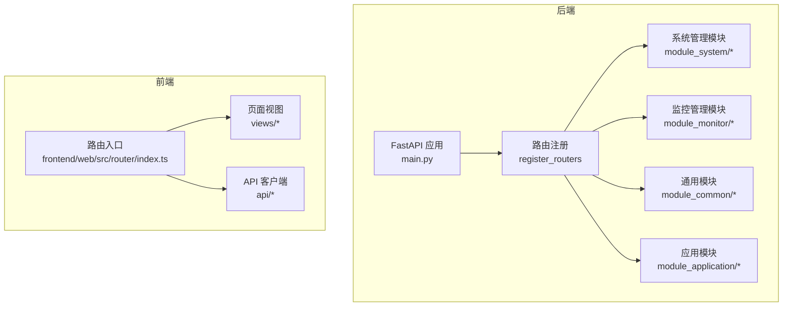
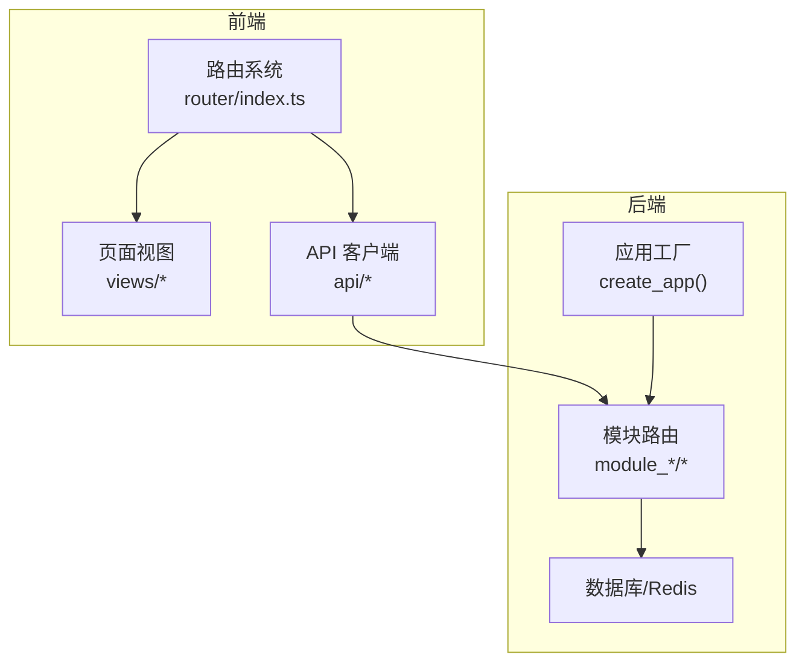
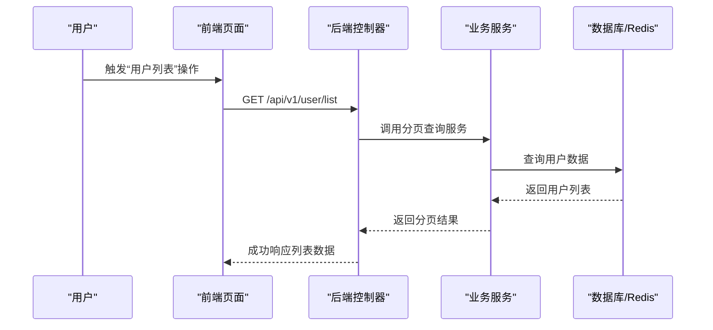
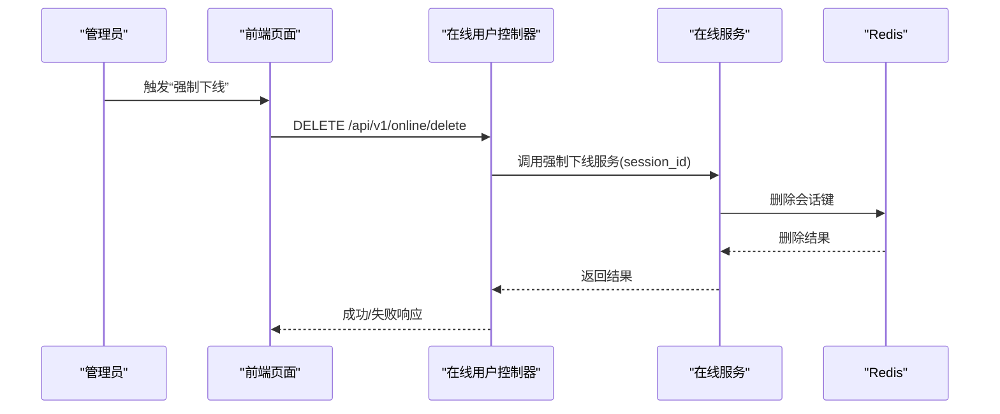
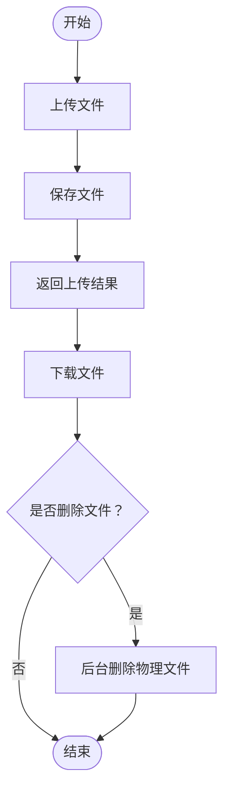
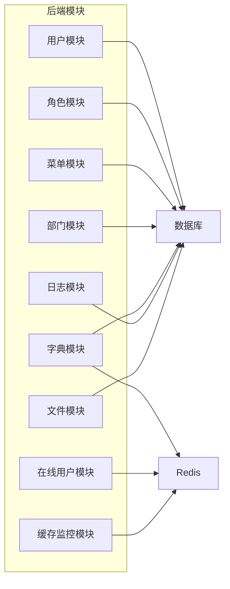

# 功能模块概览

<cite>
**本文引用的文件**
- [README.md](file://README.md)
- [main.py](file://backend/main.py)
- [index.ts](file://frontend/web/src/router/index.ts)
- [user/controller.py](file://backend/app/api/v1/module_system/user/controller.py)
- [role/controller.py](file://backend/app/api/v1/module_system/role/controller.py)
- [menu/controller.py](file://backend/app/api/v1/module_system/menu/controller.py)
- [dept/controller.py](file://backend/app/api/v1/module_system/dept/controller.py)
- [dict/controller.py](file://backend/app/api/v1/module_system/dict/controller.py)
- [log/controller.py](file://backend/app/api/v1/module_system/log/controller.py)
- [online/controller.py](file://backend/app/api/v1/module_monitor/online/controller.py)
- [cache/controller.py](file://backend/app/api/v1/module_monitor/cache/controller.py)
- [file/controller.py](file://backend/app/api/v1/module_common/file/controller.py)
</cite>

## 目录
1. [简介](#简介)
2. [项目结构](#项目结构)
3. [核心组件](#核心组件)
4. [架构总览](#架构总览)
5. [详细组件分析](#详细组件分析)
6. [依赖关系分析](#依赖关系分析)
7. [性能考量](#性能考量)
8. [故障排查指南](#故障排查指南)
9. [结论](#结论)
10. [附录](#附录)

## 简介
本项目是一套“完全开源、高度模块化、技术先进”的现代化快速开发平台，采用前后端分离架构，后端基于 FastAPI + Python，前端基于 Vue3 + TypeScript，提供一站式开箱即用的中后台解决方案。项目内置仪表盘、系统管理、监控管理、任务管理、日志管理、开发工具、文件管理等核心模块，并通过插件化架构支持二次开发与扩展。

## 项目结构
后端采用“按业务特性分包（竖切）”的组织方式，将同一业务域内的控制器、服务、CRUD、模型、Schema 等文件集中在一个模块目录下，便于团队协作与模块化维护。前端按功能域组织页面与组件，路由与菜单动态注册，支持多端（Web/H5/文档）一体化。

图表来源
- [main.py:16-51](file://backend/main.py#L16-L51)
- [index.ts:16-27](file://frontend/web/src/router/index.ts#L16-L27)

章节来源
- [README.md:39-56](file://README.md#L39-L56)
- [README.md:96-115](file://README.md#L96-L115)
- [main.py:16-51](file://backend/main.py#L16-L51)
- [index.ts:16-27](file://frontend/web/src/router/index.ts#L16-L27)

## 核心组件
- 仪表盘：工作台、分析页，提供系统概览与数据分析。
- 系统管理：用户、角色、菜单、部门、岗位、字典、参数、公告、租户等核心管理能力。
- 监控管理：在线用户、服务器监控、缓存监控、资源监控，保障系统运行稳定。
- 任务管理：定时任务与工作流，支撑异步与编排场景。
- 日志管理：操作日志审计，支持查询、导出与清理。
- 开发工具：代码生成、表单构建、接口文档，提升研发效率。
- 文件管理：统一文件上传、下载与删除，支持后台清理。

章节来源
- [README.md:178-189](file://README.md#L178-L189)

## 架构总览
系统采用“后端模块化 + 前端动态路由 + 插件化扩展”的整体架构。后端通过 Typer CLI 提供运行、迁移等命令；前端通过路由守卫与动态注册实现菜单到页面的映射。模块间通过统一的响应模型与权限控制进行协作。

图表来源
- [index.ts:16-27](file://frontend/web/src/router/index.ts#L16-L27)
- [main.py:16-51](file://backend/main.py#L16-L51)

章节来源
- [README.md:117-156](file://README.md#L117-L156)
- [index.ts:16-27](file://frontend/web/src/router/index.ts#L16-L27)
- [main.py:16-51](file://backend/main.py#L16-L51)

## 详细组件分析

### 仪表盘模块
- 功能定位：提供系统概览与数据分析，包含工作台、分析页与主页模块。
- 主要特性：卡片化布局、图表组件、实时数据展示。
- 使用场景：运营监控、KPI 展示、业务趋势分析。
- 价值：提升决策效率与可视化水平。

章节来源
- [README.md:192-206](file://README.md#L192-L206)
- [frontend/web/src/views/dashboard/analysis/index.vue](file://frontend/web/src/views/dashboard/analysis/index.vue)
- [frontend/web/src/views/dashboard/home/index.vue](file://frontend/web/src/views/dashboard/home/index.vue)
- [frontend/web/src/views/dashboard/workplace/index.vue](file://frontend/web/src/views/dashboard/workplace/index.vue)

### 系统管理模块
- 用户管理（用户、角色、菜单、部门、岗位、字典、参数、公告、租户）
  - 功能定位：围绕 RBAC 的用户与权限体系，提供完整的组织与身份管理。
  - 主要特性：分页查询、导入导出、批量操作、权限校验、操作日志。
  - 使用场景：账号管理、角色授权、菜单配置、组织架构维护。
  - 价值：统一身份与权限治理，降低管理成本。
- 典型接口与流程
  - 用户管理：列表/详情/创建/更新/删除/批量启停/导入模板/导出/导入。
  - 角色管理：列表/详情/创建/更新/删除/批量启停/授权/导出。
  - 菜单管理：树形菜单查询/详情/创建/更新/删除/批量启停。
  - 部门管理：树形部门查询/详情/创建/更新/删除/批量启停。
  - 字典管理：字典类型与数据的增删改查、可用性设置、导出、按类型获取数据。
  - 日志管理：操作日志的分页查询、详情、删除、导出。

图表来源
- [user/controller.py:205-236](file://backend/app/api/v1/module_system/user/controller.py#L205-L236)

章节来源
- [user/controller.py:33-456](file://backend/app/api/v1/module_system/user/controller.py#L33-L456)
- [role/controller.py:27-244](file://backend/app/api/v1/module_system/role/controller.py#L27-L244)
- [menu/controller.py:19-166](file://backend/app/api/v1/module_system/menu/controller.py#L19-L166)
- [dept/controller.py:19-190](file://backend/app/api/v1/module_system/dept/controller.py#L19-L190)
- [dict/controller.py:31-529](file://backend/app/api/v1/module_system/dict/controller.py#L31-L529)
- [log/controller.py:20-137](file://backend/app/api/v1/module_system/log/controller.py#L20-L137)

### 监控管理模块
- 在线用户
  - 功能定位：基于 Redis 实时统计在线用户，支持强制下线与清空。
  - 主要特性：Redis 会话检索、分页、权限控制。
  - 使用场景：安全审计、异常用户处置。
- 缓存监控
  - 功能定位：查看缓存统计、缓存名称/键列表，读取与清理缓存。
  - 主要特性：按名称/键清理、异常处理。
  - 使用场景：性能诊断、缓存运维。
- 服务器与资源监控（预留）
  - 功能定位：系统资源与服务器状态监控（页面与模块存在，具体实现按插件扩展）。

图表来源
- [online/controller.py:55-81](file://backend/app/api/v1/module_monitor/online/controller.py#L55-L81)

章节来源
- [online/controller.py:20-109](file://backend/app/api/v1/module_monitor/online/controller.py#L20-L109)
- [cache/controller.py:19-197](file://backend/app/api/v1/module_monitor/cache/controller.py#L19-L197)

### 任务管理模块
- 功能定位：定时任务与工作流编排，支持节点类型与定义管理。
- 主要特性：任务节点、工作流定义、节点类型扩展。
- 使用场景：周期性报表、异步批处理、业务流程编排。
- 价值：提升自动化与可运维性。

章节来源
- [frontend/web/src/views/module_task/cronjob/job/index.vue](file://frontend/web/src/views/module_task/cronjob/job/index.vue)
- [frontend/web/src/views/module_task/workflow/definition/index.vue](file://frontend/web/src/views/module_task/workflow/definition/index.vue)

### 日志管理模块
- 功能定位：操作日志的查询、详情、删除与导出。
- 主要特性：分页排序、权限控制、导出 Excel。
- 使用场景：审计合规、问题追踪、行为分析。
- 价值：保障系统可追溯与可审计。

章节来源
- [log/controller.py:20-137](file://backend/app/api/v1/module_system/log/controller.py#L20-L137)

### 开发工具模块
- 代码生成：根据数据库表结构自动生成前后端代码，支持模块化写入。
- 表单构建：可视化表单生成与预览。
- 接口文档：Swagger/Redoc 自动生成与展示。
- 价值：显著提升研发效率，降低重复劳动。

章节来源
- [README.md:464-537](file://README.md#L464-L537)
- [frontend/web/src/views/module_generator/gencode/index.vue](file://frontend/web/src/views/module_generator/gencode/index.vue)

### 文件管理模块
- 功能定位：统一文件上传、下载与删除，支持后台清理。
- 主要特性：权限控制、流式下载、后台删除。
- 使用场景：附件上传、批量导出、临时文件清理。
- 价值：简化文件处理流程，统一存储策略。

图表来源
- [file/controller.py:25-78](file://backend/app/api/v1/module_common/file/controller.py#L25-L78)

章节来源
- [file/controller.py:25-78](file://backend/app/api/v1/module_common/file/controller.py#L25-L78)

## 依赖关系分析
- 后端模块依赖
  - 控制器依赖服务层，服务层依赖 CRUD/模型与权限校验。
  - 在线用户与缓存监控依赖 Redis。
  - 字典管理同时依赖数据库与 Redis。
- 前端模块依赖
  - 页面组件依赖 API 客户端与路由守卫。
  - 动态路由注册将菜单与页面关联。
- 插件化扩展
  - 后端通过插件目录自动发现与注册路由，支持二次开发。

图表来源
- [user/controller.py:30-30](file://backend/app/api/v1/module_system/user/controller.py#L30-L30)
- [role/controller.py:24-24](file://backend/app/api/v1/module_system/role/controller.py#L24-L24)
- [menu/controller.py:16-16](file://backend/app/api/v1/module_system/menu/controller.py#L16-L16)
- [dept/controller.py:16-16](file://backend/app/api/v1/module_system/dept/controller.py#L16-L16)
- [dict/controller.py:28-28](file://backend/app/api/v1/module_system/dict/controller.py#L28-L28)
- [log/controller.py:17-17](file://backend/app/api/v1/module_system/log/controller.py#L17-L17)
- [online/controller.py:17-17](file://backend/app/api/v1/module_monitor/online/controller.py#L17-L17)
- [cache/controller.py:16-16](file://backend/app/api/v1/module_monitor/cache/controller.py#L16-L16)
- [file/controller.py:22-22](file://backend/app/api/v1/module_common/file/controller.py#L22-L22)

章节来源
- [README.md:358-457](file://README.md#L358-L457)

## 性能考量
- 异步与缓存：后端使用 FastAPI 异步与 Redis 缓存，前端使用组件懒加载与按需路由，降低延迟。
- 分页与导出：列表查询采用分页与排序，导出采用流式响应，避免内存峰值。
- 在线用户分页：由于在线用户来自 Redis，采用服务端分页策略，避免数据库 OFFSET/LIMIT。
- 建议：对高频接口增加缓存命中率，对大文件下载使用 CDN 或分片策略。

## 故障排查指南
- 启动与迁移
  - 首次启动会自动初始化库表与基础数据；仅在模型变更时使用迁移命令。
- 权限与日志
  - 所有接口均带有权限装饰器与操作日志记录，便于定位问题。
- Redis 连接
  - 在线用户与缓存监控依赖 Redis，需检查连接配置与网络连通性。
- 文件下载
  - 下载完成后可选择后台删除物理文件，避免磁盘占用。

章节来源
- [README.md:209-271](file://README.md#L209-L271)
- [README.md:569-586](file://README.md#L569-L586)
- [online/controller.py:27-52](file://backend/app/api/v1/module_monitor/online/controller.py#L27-L52)
- [cache/controller.py:26-40](file://backend/app/api/v1/module_monitor/cache/controller.py#L26-L40)
- [file/controller.py:57-77](file://backend/app/api/v1/module_common/file/controller.py#L57-L77)

## 结论
FastapiAdmin 通过模块化设计与插件化扩展，提供了覆盖企业中后台所需的完整能力集。系统在安全性（JWT/OAuth2 + RBAC）、可观测性（在线用户、缓存监控、操作日志）、开发效率（代码生成、表单构建、接口文档）等方面形成闭环，适合快速搭建高质量的管理系统与业务平台。

## 附录
- 快速开始与部署：参考文档中的“快速开始”“Docker 部署”“二开教程”等章节，按步骤完成本地运行与生产部署。
- 典型应用场景
  - 仪表盘：用于运营看板与 KPI 展示。
  - 系统管理：统一用户与权限治理，支撑组织架构与角色授权。
  - 监控管理：保障系统稳定性，支持安全处置与性能优化。
  - 日志管理：满足审计与合规要求。
  - 文件管理：统一附件与报表导出流程。
  - 任务管理：支撑周期性任务与工作流编排。

章节来源
- [README.md:207-347](file://README.md#L207-L347)