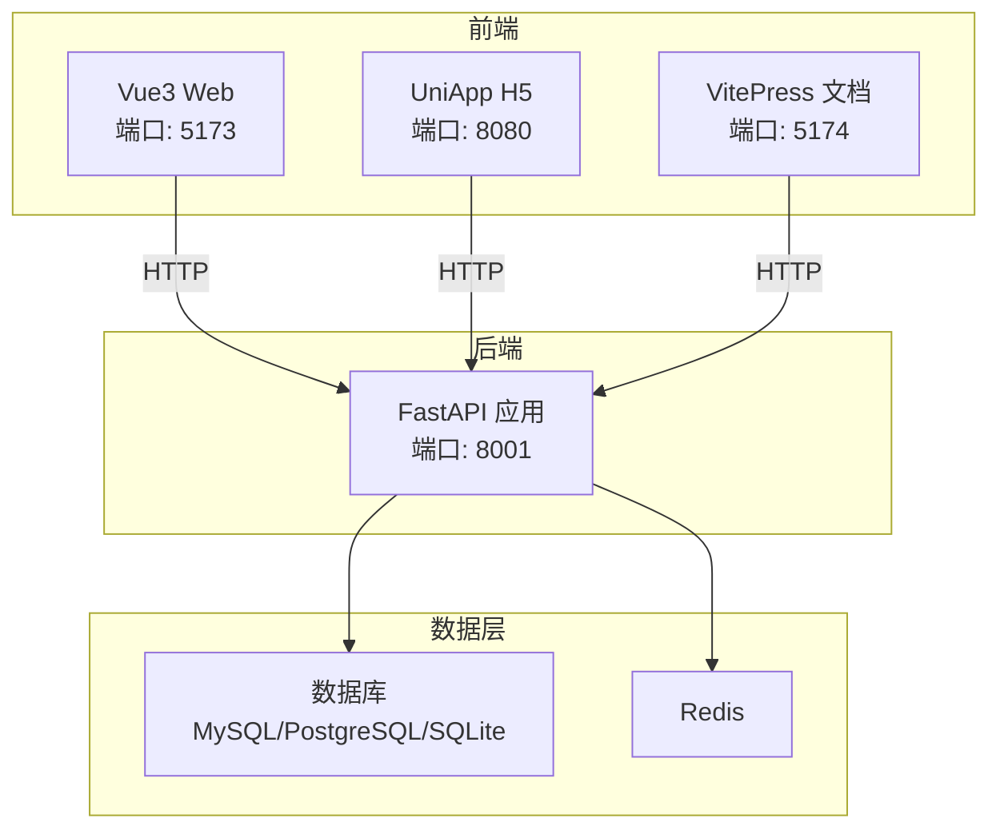
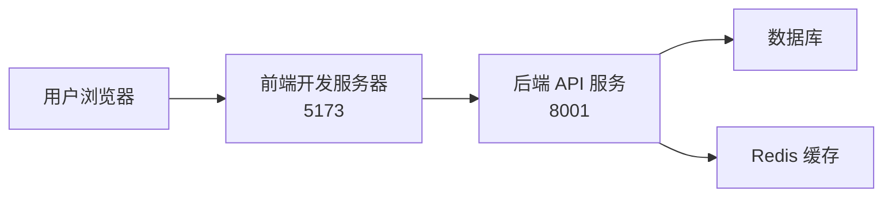
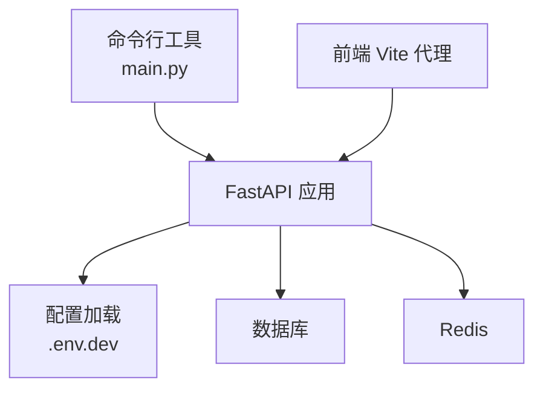

# 快速开始指南

<cite>
**本文引用的文件**
- [README.md](file://README.md)
- [backend/pyproject.toml](file://backend/pyproject.toml)
- [backend/main.py](file://backend/main.py)
- [backend/run_linux.sh](file://backend/run_linux.sh)
- [backend/run_win.bat](file://backend/run_win.bat)
- [backend/env/.env.dev.example](file://backend/env/.env.dev.example)
- [frontend/web/package.json](file://frontend/web/package.json)
- [frontend/web/vite.config.ts](file://frontend/web/vite.config.ts)
- [deploy.sh](file://deploy.sh)
- [deploy.bat](file://deploy.bat)
</cite>

## 目录
1. [简介](#简介)
2. [项目结构](#项目结构)
3. [核心组件](#核心组件)
4. [架构总览](#架构总览)
5. [详细组件分析](#详细组件分析)
6. [依赖关系分析](#依赖关系分析)
7. [性能考虑](#性能考虑)
8. [故障排除指南](#故障排除指南)
9. [结论](#结论)
10. [附录](#附录)

## 简介
本指南面向首次接触 FastapiAdmin 的开发者，提供从零开始搭建开发环境、安装依赖、配置环境变量、初始化数据库与首次运行的完整流程。内容覆盖后端（FastAPI + Python）、前端（Vue3 + Vite）以及 Docker 部署方式，并针对 Linux 与 Windows 提供启动脚本使用方法与注意事项。同时给出默认端口、访问地址与基本使用方法，帮助新手在最短时间内成功运行项目并体验核心功能。

## 项目结构
FastapiAdmin 采用前后端分离架构，包含后端工程、前端工程与 Docker 配置：
- 后端：FastAPI + Python，提供 REST API、定时任务、权限控制与数据库迁移能力
- 前端：Vue3 + Vite + TypeScript，包含 Web 端、移动端（H5）与文档站点
- Docker：一键部署后端、Nginx、MySQL、Redis

图表来源
- [README.md:117-156](file://README.md#L117-L156)
- [frontend/web/vite.config.ts:64-71](file://frontend/web/vite.config.ts#L64-L71)
- [backend/env/.env.dev.example:9-41](file://backend/env/.env.dev.example#L9-L41)

章节来源
- [README.md:96-115](file://README.md#L96-L115)
- [README.md:117-156](file://README.md#L117-L156)

## 核心组件
- 后端应用入口与命令行工具
  - 后端通过命令行工具提供启动、迁移生成与应用等能力
  - 启动时按环境加载配置并创建应用实例，开发模式自动热更新
- 环境变量配置
  - 后端开发环境模板文件包含服务器、数据库、Redis、文档与日志等关键配置项
- 前端开发服务器
  - 基于 Vite 的开发服务器，默认端口 5173，支持代理转发到后端 API
- 启动脚本
  - Linux 提供交互式脚本，支持数据库检查/创建、迁移生成与应用、初始化数据等
  - Windows 提供批处理脚本，支持一键启动后端与前端服务

章节来源
- [backend/main.py:54-107](file://backend/main.py#L54-L107)
- [backend/env/.env.dev.example:6-52](file://backend/env/.env.dev.example#L6-L52)
- [frontend/web/vite.config.ts:60-72](file://frontend/web/vite.config.ts#L60-L72)
- [backend/run_linux.sh:105-138](file://backend/run_linux.sh#L105-L138)
- [backend/run_win.bat:84-99](file://backend/run_win.bat#L84-L99)

## 架构总览
下图展示了本地开发时的典型交互：浏览器访问前端，前端通过代理转发到后端 API，后端访问数据库与 Redis。

图表来源
- [README.md:117-156](file://README.md#L117-L156)
- [frontend/web/vite.config.ts:64-71](file://frontend/web/vite.config.ts#L64-L71)
- [backend/env/.env.dev.example:9-41](file://backend/env/.env.dev.example#L9-L41)

## 详细组件分析

### 环境要求与依赖安装
- 后端运行时
  - Python ≥ 3.10（推荐 3.12），FastAPI、SQLAlchemy、Alembic、Redis、uvicorn 等
  - 推荐使用 uv 进行依赖同步与运行，简化依赖管理
- 前端运行时
  - Node.js ≥ 20，pnpm（前端包管理器），Vue3 + Vite + TypeScript
- 数据库与缓存
  - MySQL 或 PostgreSQL（或 SQLite），Redis（与 .env.dev 一致）

章节来源
- [backend/pyproject.toml:1-52](file://backend/pyproject.toml#L1-L52)
- [README.md:221-231](file://README.md#L221-L231)
- [frontend/web/package.json:189-193](file://frontend/web/package.json#L189-L193)

### 环境变量配置
- 后端
  - 复制模板文件为 .env.dev，填写数据库连接、Redis、JWT 密钥等
  - 关键项：SERVER_HOST/SERVER_PORT、DATABASE_*、REDIS_*、ROOT_PATH、DOCS_URL/REDOC_URL
- 前端
  - 复制模板文件为 .env.development，配置 VITE_PORT、VITE_API_BASE_URL 等
  - 代理目标地址需指向后端 API（默认 8001）

章节来源
- [backend/env/.env.dev.example:6-52](file://backend/env/.env.dev.example#L6-L52)
- [frontend/web/vite.config.ts:59-71](file://frontend/web/vite.config.ts#L59-L71)

### 数据库初始化与迁移
- 首次启动后端会自动初始化库表与基础数据，无需手动执行迁移
- 如修改模型需使用 Alembic 生成迁移并应用
- Linux/Windows 启动脚本提供数据库检查/创建、迁移生成与应用、初始化数据等功能

章节来源
- [README.md:215-216](file://README.md#L215-L216)
- [backend/run_linux.sh:105-138](file://backend/run_linux.sh#L105-L138)
- [backend/run_win.bat:84-99](file://backend/run_win.bat#L84-L99)

### 后端启动流程
- 使用 uv（推荐）
  - 进入 backend 目录，执行 uv sync 同步依赖
  - 执行 uv run main.py run --env=dev 启动开发服务器
- 使用传统方式
  - pip install -r requirements.txt 安装依赖
  - python main.py run --env=dev 启动

章节来源
- [README.md:245-271](file://README.md#L245-L271)
- [backend/main.py:54-107](file://backend/main.py#L54-L107)

### 前端启动流程
- Web 前端（Vue3）
  - 进入 frontend/web，执行 pnpm install 与 pnpm run dev
  - 默认访问地址：http://127.0.0.1:5173
- 移动端 H5（UniApp）
  - 进入 frontend/app，执行 pnpm install 与 pnpm run dev:h5
  - 默认访问地址：http://127.0.0.1:8080
- 文档站点（VitePress）
  - 进入 frontend/docs，执行 pnpm install 与 pnpm run dev
  - 默认访问地址：http://127.0.0.1:5174

章节来源
- [README.md:272-302](file://README.md#L272-L302)
- [frontend/web/package.json:7-35](file://frontend/web/package.json#L7-L35)
- [frontend/web/vite.config.ts:60-72](file://frontend/web/vite.config.ts#L60-L72)

### 默认端口与访问地址
- Web 前端：http://127.0.0.1:5173
- 移动端 H5：http://127.0.0.1:8080
- 文档站点：http://127.0.0.1:5174
- 后端 API：http://127.0.0.1:8001
- Swagger 文档：http://127.0.0.1:8001/docs
- API 前缀：/api/v1

章节来源
- [README.md:304-316](file://README.md#L304-L316)
- [backend/env/.env.dev.example:17-19](file://backend/env/.env.dev.example#L17-L19)

### Docker 部署（可选）
- 使用 deploy.sh（Linux）或 deploy.bat（Windows）一键部署
- 自动拉取代码、构建镜像、启动容器并等待数据库健康检查
- 支持查看日志、停止服务、重启服务与清理缓存

章节来源
- [deploy.sh:137-150](file://deploy.sh#L137-L150)
- [deploy.bat:47-65](file://deploy.bat#L47-L65)

## 依赖关系分析
后端通过命令行工具提供统一入口，启动时加载配置并创建应用实例；前端通过 Vite 代理转发到后端 API；数据库与 Redis 由后端统一管理。

图表来源
- [backend/main.py:54-107](file://backend/main.py#L54-L107)
- [backend/env/.env.dev.example:6-52](file://backend/env/.env.dev.example#L6-L52)
- [frontend/web/vite.config.ts:64-71](file://frontend/web/vite.config.ts#L64-L71)

章节来源
- [backend/main.py:16-51](file://backend/main.py#L16-L51)
- [frontend/web/vite.config.ts:49-72](file://frontend/web/vite.config.ts#L49-L72)

## 性能考虑
- 后端使用异步数据库驱动（asyncpg/asyncmy）与 Redis，提升 I/O 性能
- 前端开发服务器启用代理与按需打包，减少开发阶段的网络与构建开销
- Docker 部署时建议合理配置资源限制与持久化卷，确保数据库与缓存稳定运行

## 故障排除指南
- 后端启动失败
  - 检查 .env.dev 中数据库与 Redis 配置是否正确
  - 确认数据库已创建且端口可达
  - 首次启动无需手动执行迁移，如需迁移请使用命令行工具生成并应用
- 前端无法访问后端 API
  - 检查 .env.development 中 VITE_API_BASE_URL 与 VITE_APP_BASE_API 代理配置
  - 确认后端监听地址与端口与模板一致
- 数据库初始化异常
  - 使用启动脚本提供的数据库检查/创建与初始化数据功能
  - 如需重置迁移记录或清理数据库，请谨慎使用相应脚本功能
- Docker 部署失败
  - 确认已安装 Docker 与 Docker Compose
  - 查看日志定位问题并根据提示修复

章节来源
- [backend/run_linux.sh:76-101](file://backend/run_linux.sh#L76-L101)
- [backend/run_win.bat:58-83](file://backend/run_win.bat#L58-L83)
- [deploy.sh:37-52](file://deploy.sh#L37-L52)
- [README.md:558-586](file://README.md#L558-L586)

## 结论
通过本指南，您可以快速完成 FastapiAdmin 的本地开发环境搭建与首次运行。建议优先使用 uv 与启动脚本，以获得更顺畅的开发体验。遇到问题时，可参考故障排除章节或查阅项目文档与示例配置文件。

## 附录

### 第一次本地运行（按顺序）
1. 安装运行时：Python ≥ 3.10、Node.js ≥ 20、pnpm、MySQL/PostgreSQL/SQLite、Redis
2. 获取代码：克隆仓库并切换到项目根目录
3. 配置环境变量：复制后端与前端的 .env.* 模板文件并填写数据库、Redis、JWT 等配置
4. 安装后端依赖：进入 backend，推荐使用 uv sync；或使用 pip install -r requirements.txt
5. 启动后端：uv run main.py run --env=dev；首次启动会自动初始化数据库与基础数据
6. 安装前端依赖并启动：进入 frontend/web，执行 pnpm install 与 pnpm run dev
7. 打开浏览器：访问 http://127.0.0.1:5173，使用管理员账号登录（与演示环境一致）

章节来源
- [README.md:209-220](file://README.md#L209-L220)
- [README.md:213-217](file://README.md#L213-L217)

### Linux 启动脚本使用方法
- 进入 backend 目录，执行 ./run_linux.sh
- 选择“启动（uv run dev）”以自动检查数据库并启动后端
- 可选功能：生成迁移、应用迁移、重置迁移记录、清理数据库、删除数据库、初始化数据

章节来源
- [backend/run_linux.sh:341-379](file://backend/run_linux.sh#L341-L379)

### Windows 启动脚本使用方法
- 进入 backend 目录，双击 run_win.bat 或在 PowerShell 中运行
- 选择“Start dev server (uv run dev)”启动后端
- 前端启动：在 frontend/web 目录执行 pnpm install 与 pnpm run dev
- 一键启动脚本：deploy.bat 提供 start/stop/restart/status/logs 等命令

章节来源
- [backend/run_win.bat:236-263](file://backend/run_win.bat#L236-L263)
- [deploy.bat:17-44](file://deploy.bat#L17-L44)