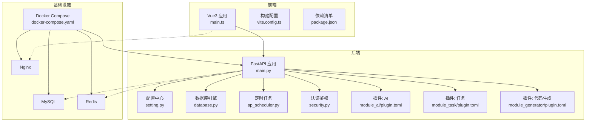
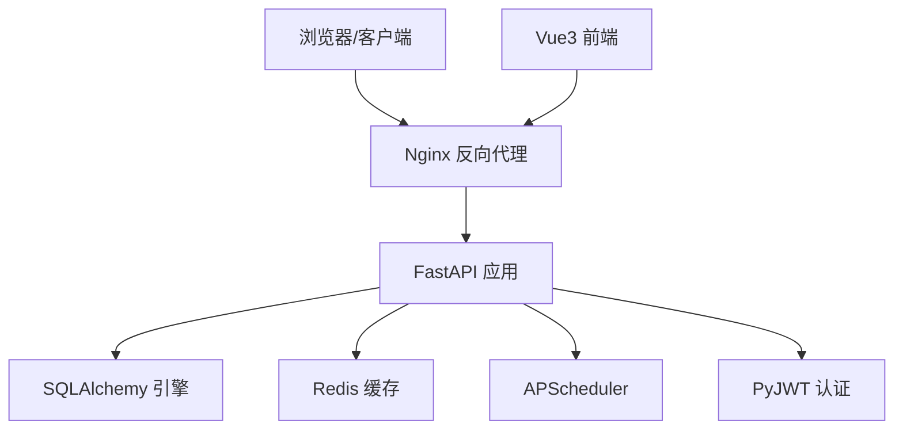
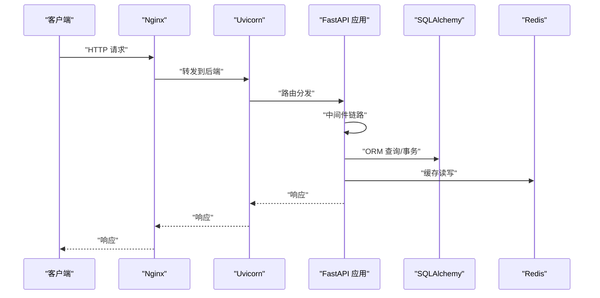
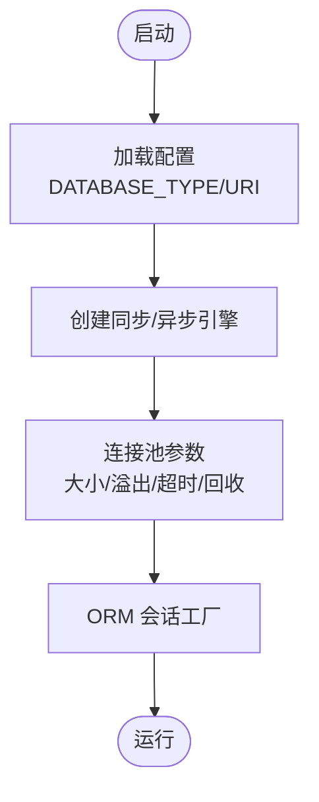
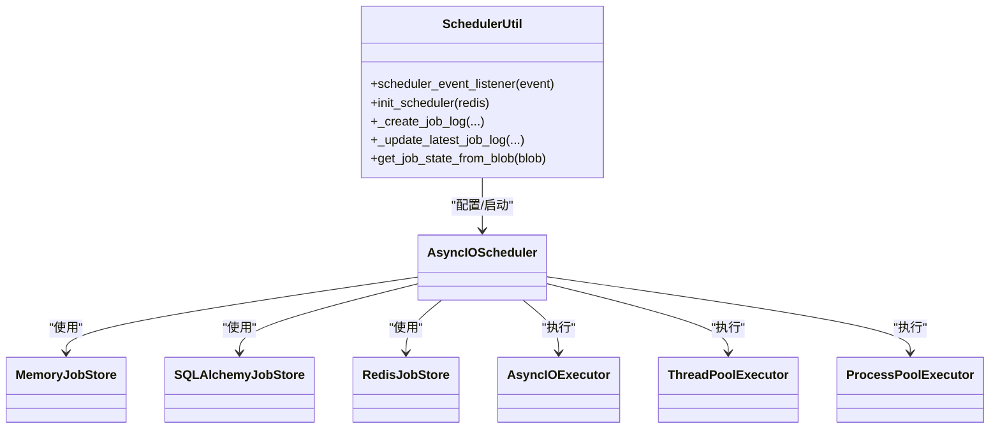
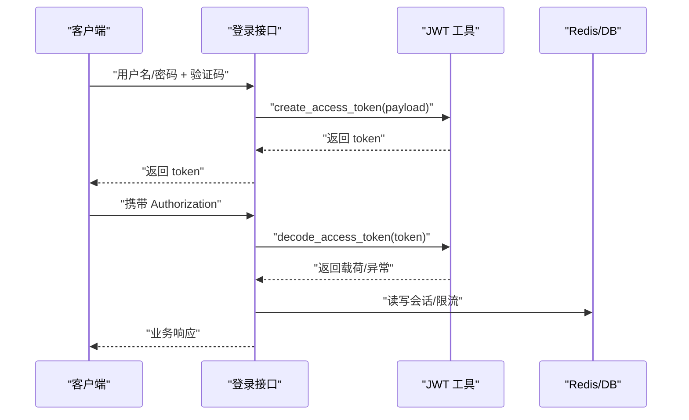
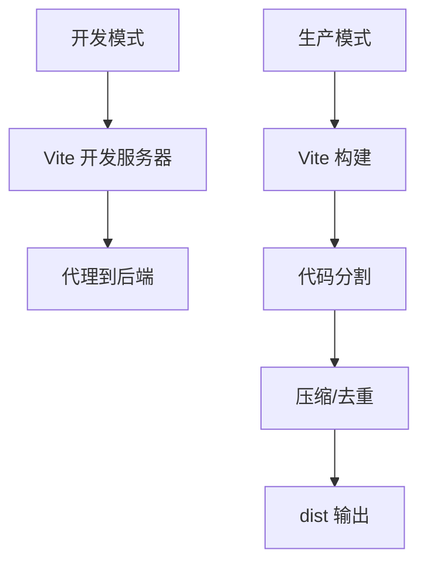
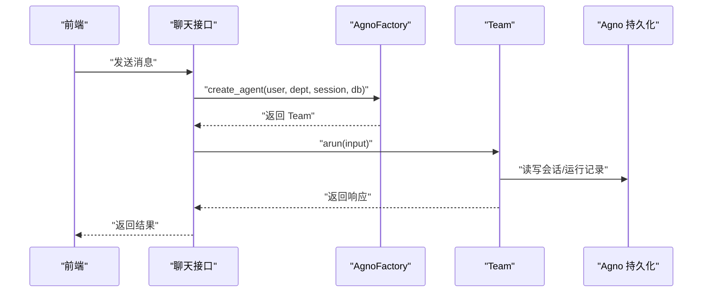
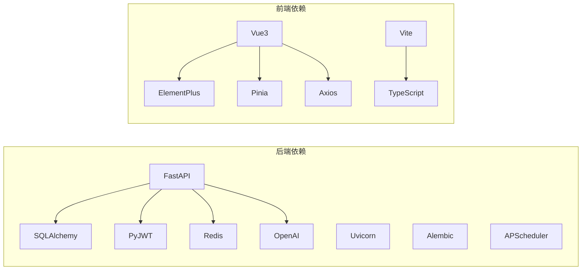

# 技术栈概览

<cite>
**本文引用的文件**
- [backend/pyproject.toml](file://backend/pyproject.toml)
- [backend/requirements.txt](file://backend/requirements.txt)
- [backend/main.py](file://backend/main.py)
- [backend/app/config/setting.py](file://backend/app/config/setting.py)
- [backend/app/core/database.py](file://backend/app/core/database.py)
- [backend/app/core/ap_scheduler.py](file://backend/app/core/ap_scheduler.py)
- [backend/app/core/security.py](file://backend/app/core/security.py)
- [backend/app/plugin/module_ai/plugin.toml](file://backend/app/plugin/module_ai/plugin.toml)
- [backend/app/plugin/module_task/plugin.toml](file://backend/app/plugin/module_task/plugin.toml)
- [backend/app/plugin/module_generator/plugin.toml](file://backend/app/plugin/module_generator/plugin.toml)
- [backend/uv.lock](file://backend/uv.lock)
- [frontend/web/package.json](file://frontend/web/package.json)
- [frontend/web/vite.config.ts](file://frontend/web/vite.config.ts)
- [frontend/web/src/main.ts](file://frontend/web/src/main.ts)
- [docker/docker-compose.yaml](file://docker/docker-compose.yaml)
</cite>

## 目录
1. [引言](#引言)
2. [项目结构](#项目结构)
3. [核心组件](#核心组件)
4. [架构总览](#架构总览)
5. [详细组件分析](#详细组件分析)
6. [依赖分析](#依赖分析)
7. [性能考虑](#性能考虑)
8. [故障排查指南](#故障排查指南)
9. [结论](#结论)
10. [附录](#附录)

## 引言
本文件面向技术决策者与开发者，系统梳理 FastapiAdmin 的技术栈与架构设计，覆盖后端（FastAPI、Uvicorn、Pydantic、Alembic、SQLAlchemy、APScheduler、PyJWT、Redis、Swagger/Redoc）、前端（Vue3、Vite5、Pinia、TypeScript、ElementPlus）、数据库（MySQL、PostgreSQL、SQLite）、缓存（Redis）、文档（Swagger/Redoc）、部署（Docker、Nginx、Docker Compose）以及智能体框架（Agno）等关键组件。文档提供技术选型原因、集成方式、版本兼容性、性能特征与最佳实践，帮助快速理解与落地。

## 项目结构
项目采用前后端分离与多模块插件化架构：
- 后端工程位于 backend，包含 FastAPI 应用、配置、核心模块、插件子系统（AI、任务与工作流、代码生成）与数据库迁移脚本。
- 前端工程位于 frontend/web，采用 Vue3 + Vite + TypeScript + ElementPlus + Pinia 构建。
- 部署通过 Docker Compose 编排 MySQL、Redis、后端与 Nginx。

图表来源
- [backend/main.py:16-51](file://backend/main.py#L16-L51)
- [backend/app/config/setting.py:315-340](file://backend/app/config/setting.py#L315-L340)
- [backend/app/core/database.py:19-106](file://backend/app/core/database.py#L19-L106)
- [backend/app/core/ap_scheduler.py:50-73](file://backend/app/core/ap_scheduler.py#L50-L73)
- [backend/app/core/security.py:94-149](file://backend/app/core/security.py#L94-L149)
- [frontend/web/src/main.ts:29-34](file://frontend/web/src/main.ts#L29-L34)
- [frontend/web/vite.config.ts:49-287](file://frontend/web/vite.config.ts#L49-L287)
- [docker/docker-compose.yaml:9-201](file://docker/docker-compose.yaml#L9-L201)

章节来源
- [backend/main.py:16-51](file://backend/main.py#L16-L51)
- [docker/docker-compose.yaml:9-201](file://docker/docker-compose.yaml#L9-L201)

## 核心组件
- 后端框架与运行时
  - FastAPI：高性能异步 Web 框架，提供自动生成 OpenAPI 文档与类型安全的接口。
  - Uvicorn：ASGI 服务器，支持异步请求处理与热重载。
  - Pydantic/Pydantic Settings：数据验证与配置管理。
  - Alembic：数据库迁移工具，支持多数据库方言。
- ORM 与数据库
  - SQLAlchemy 2.x：异步/同步双栈，支持 MySQL、PostgreSQL、SQLite。
  - 连接池与预检：池化、超时、回收策略，提升稳定性。
- 定时任务
  - APScheduler：支持 Memory/SQLAlchemy/Redis 多存储，线程/进程池执行器。
- 权限与认证
  - PyJWT：JWT 令牌生成与解析，支持滑动过期与白名单。
- 缓存与中间件
  - Redis：会话、限流、消息队列等。
  - GZip/CORS/日志：内置中间件链路。
- 文档与调试
  - Swagger UI、ReDoc、自定义 UI 资源。
- 前端框架
  - Vue3 + Vite5 + TypeScript + ElementPlus + Pinia，按需引入与代码分割优化。
- 智能体框架
  - Agno：用于 AI Agent 与 Team 场景，支持会话持久化与多模型接入。
- 部署与编排
  - Docker Compose：MySQL、Redis、后端、Nginx 四方编排，健康检查与资源限制。

章节来源
- [backend/pyproject.toml:7-49](file://backend/pyproject.toml#L7-L49)
- [backend/requirements.txt:1-45](file://backend/requirements.txt#L1-L45)
- [backend/app/config/setting.py:13-355](file://backend/app/config/setting.py#L13-L355)
- [backend/app/core/database.py:19-106](file://backend/app/core/database.py#L19-L106)
- [backend/app/core/ap_scheduler.py:50-73](file://backend/app/core/ap_scheduler.py#L50-L73)
- [backend/app/core/security.py:94-149](file://backend/app/core/security.py#L94-L149)
- [frontend/web/package.json:68-120](file://frontend/web/package.json#L68-L120)
- [frontend/web/vite.config.ts:49-287](file://frontend/web/vite.config.ts#L49-L287)
- [docker/docker-compose.yaml:9-201](file://docker/docker-compose.yaml#L9-L201)

## 架构总览
后端通过 FastAPI 暴露 REST 接口，结合 SQLAlchemy 进行数据库访问，APScheduler 管理定时任务，Redis 提供缓存与会话存储。前端以 Vue3 为核心，通过 Vite 构建并代理后端 API。Docker Compose 将各组件编排为统一的服务网格，Nginx 作为反向代理与静态资源服务。

图表来源
- [backend/app/config/setting.py:257-302](file://backend/app/config/setting.py#L257-L302)
- [backend/app/core/database.py:19-106](file://backend/app/core/database.py#L19-L106)
- [backend/app/core/ap_scheduler.py:50-73](file://backend/app/core/ap_scheduler.py#L50-L73)
- [backend/app/core/security.py:94-149](file://backend/app/core/security.py#L94-L149)
- [docker/docker-compose.yaml:142-181](file://docker/docker-compose.yaml#L142-L181)

## 详细组件分析

### 后端框架与运行时
- FastAPI/Uvicorn
  - 通过 main.py 的工厂函数创建应用，注册中间件、路由、静态文件与文档，并支持按环境启动（开发/生产）。
  - 配置项来自 settings，包含调试、文档路径、根路径等。
- 配置中心
  - settings 提供数据库、Redis、JWT、GZip、静态文件、Swagger 等集中配置，支持 LRU 缓存与动态属性拼装中间件列表。
- 数据库引擎
  - 同步/异步双引擎创建，支持 MySQL、PostgreSQL、SQLite；连接池参数可调，预检与回收策略保障稳定性。
- 定时任务
  - APScheduler 配置多 JobStore（Memory/SQLAlchemy/Redis）与执行器（AsyncIO/ThreadPool/ProcessPool），事件监听记录任务执行日志。
- 认证鉴权
  - 自定义 OAuth2 密码流与 JWT 解析，支持白名单、滑动过期与多种异常分支。
- 插件化子系统
  - AI、任务与工作流、代码生成等子系统以 plugin.toml 声明，动态注册路由与功能。

图表来源
- [backend/main.py:16-51](file://backend/main.py#L16-L51)
- [backend/app/config/setting.py:227-254](file://backend/app/config/setting.py#L227-L254)
- [backend/app/core/database.py:19-106](file://backend/app/core/database.py#L19-L106)
- [docker/docker-compose.yaml:142-181](file://docker/docker-compose.yaml#L142-L181)

章节来源
- [backend/main.py:16-51](file://backend/main.py#L16-L51)
- [backend/app/config/setting.py:13-355](file://backend/app/config/setting.py#L13-L355)
- [backend/app/core/database.py:19-106](file://backend/app/core/database.py#L19-L106)
- [backend/app/core/ap_scheduler.py:50-73](file://backend/app/core/ap_scheduler.py#L50-L73)
- [backend/app/core/security.py:94-149](file://backend/app/core/security.py#L94-L149)
- [backend/app/plugin/module_ai/plugin.toml:1-9](file://backend/app/plugin/module_ai/plugin.toml#L1-L9)
- [backend/app/plugin/module_task/plugin.toml:1-9](file://backend/app/plugin/module_task/plugin.toml#L1-L9)
- [backend/app/plugin/module_generator/plugin.toml:1-9](file://backend/app/plugin/module_generator/plugin.toml#L1-L9)

### 数据库与 ORM
- 技术选型
  - SQLAlchemy 2.x 提供异步/同步双栈，适配 MySQL、PostgreSQL、SQLite；异步驱动分别使用 asyncmy/asyncpg，同步驱动使用 pymysql/psycopg。
  - 连接池参数（大小、溢出、超时、回收、预检）可配置，满足高并发与长连接场景。
- 集成方式
  - 通过 settings 动态拼装异步/同步连接串；database 模块封装引擎与会话工厂；提供表级创建/删除工具。
- 性能与最佳实践
  - 启用 pool_pre_ping 与合理回收时间，避免僵尸连接；生产环境建议固定数据库类型与驱动版本。

图表来源
- [backend/app/config/setting.py:257-302](file://backend/app/config/setting.py#L257-L302)
- [backend/app/core/database.py:19-106](file://backend/app/core/database.py#L19-L106)

章节来源
- [backend/app/config/setting.py:257-302](file://backend/app/config/setting.py#L257-L302)
- [backend/app/core/database.py:19-106](file://backend/app/core/database.py#L19-L106)

### 定时任务（APScheduler）
- 技术选型
  - AsyncIOScheduler + 多 JobStore（Memory/SQLAlchemy/Redis）+ 多执行器（AsyncIO/ThreadPool/ProcessPool）。
- 集成方式
  - 在应用启动时初始化调度器，注册事件监听器，记录任务状态与日志；支持 cron/interval/date/manual 触发类型。
- 性能与最佳实践
  - 合理设置 max_instances 与执行器并发；周期性任务建议持久化到数据库或 Redis，避免重启丢失。

图表来源
- [backend/app/core/ap_scheduler.py:50-73](file://backend/app/core/ap_scheduler.py#L50-L73)
- [backend/app/core/ap_scheduler.py:634-649](file://backend/app/core/ap_scheduler.py#L634-L649)

章节来源
- [backend/app/core/ap_scheduler.py:50-73](file://backend/app/core/ap_scheduler.py#L50-L73)
- [backend/app/core/ap_scheduler.py:634-649](file://backend/app/core/ap_scheduler.py#L634-L649)

### 权限与认证（PyJWT）
- 技术选型
  - 自定义 OAuth2 密码流与 JWT 解析，支持白名单、滑动过期与多种异常处理。
- 集成方式
  - 通过 settings 配置密钥、算法、过期时间与白名单路径；在登录流程中生成令牌并在后续请求中校验。
- 性能与最佳实践
  - 令牌签名算法与密钥长度需匹配安全策略；白名单避免对静态资源与登录接口重复校验。

图表来源
- [backend/app/core/security.py:94-149](file://backend/app/core/security.py#L94-L149)
- [backend/app/config/setting.py:67-73](file://backend/app/config/setting.py#L67-L73)

章节来源
- [backend/app/core/security.py:94-149](file://backend/app/core/security.py#L94-L149)
- [backend/app/config/setting.py:67-73](file://backend/app/config/setting.py#L67-L73)

### 缓存（Redis）
- 技术选型
  - 使用 redis-py 异步客户端，支持健康检查、连接池上限与超时。
- 集成方式
  - 在应用生命周期中建立/关闭连接，提供 ping 校验；用于会话、限流、任务状态等。
- 性能与最佳实践
  - 合理设置 max_connections 与 socket 超时；生产环境开启密码与持久化。

章节来源
- [backend/app/core/database.py:135-177](file://backend/app/core/database.py#L135-L177)
- [backend/app/config/setting.py:108-114](file://backend/app/config/setting.py#L108-L114)

### 文档（Swagger/Redoc）
- 技术选型
  - FastAPI 内置 OpenAPI；项目提供自定义 Swagger/Redoc 静态资源与图标。
- 集成方式
  - 通过 settings 指定文档路径与静态资源 URL；在应用启动时重设文档。
- 性能与最佳实践
  - 生产环境可关闭调试模式与冗余日志，减少文档体积。

章节来源
- [backend/app/config/setting.py:37-47](file://backend/app/config/setting.py#L37-L47)
- [backend/app/config/setting.py:199-204](file://backend/app/config/setting.py#L199-L204)
- [backend/main.py:49](file://backend/main.py#L49)

### 前端技术栈
- 技术选型
  - Vue3 + Vite5 + TypeScript + ElementPlus + Pinia；按需组件与自动导入。
- 构建与优化
  - 代码分割、按需打包、Gzip 压缩、TailwindCSS 与 SCSS；代理后端 API。
- 性能与最佳实践
  - 合理拆分 vendor chunk，避免单文件过大；生产环境开启 Terser 去除 console。

图表来源
- [frontend/web/vite.config.ts:49-287](file://frontend/web/vite.config.ts#L49-L287)
- [frontend/web/package.json:68-120](file://frontend/web/package.json#L68-L120)
- [frontend/web/src/main.ts:29-34](file://frontend/web/src/main.ts#L29-L34)

章节来源
- [frontend/web/vite.config.ts:49-287](file://frontend/web/vite.config.ts#L49-L287)
- [frontend/web/package.json:68-120](file://frontend/web/package.json#L68-L120)
- [frontend/web/src/main.ts:29-34](file://frontend/web/src/main.ts#L29-L34)

### 智能体框架（Agno）
- 技术选型
  - Agno 2.5.8，支持 Agent/Team 会话与多模型接入；会话持久化至数据库。
- 集成方式
  - 通过 plugin.toml 声明 AI 子系统；在聊天服务中创建 AgnoFactory 并生成 Team 执行 arun。
- 性能与最佳实践
  - 合理控制历史运行次数与会话持久化策略；注意外部模型调用的超时与重试。

图表来源
- [backend/app/plugin/module_ai/plugin.toml:1-9](file://backend/app/plugin/module_ai/plugin.toml#L1-L9)
- [backend/app/plugin/module_ai/chat/service.py:210-225](file://backend/app/plugin/module_ai/chat/service.py#L210-L225)
- [backend/uv.lock:11-33](file://backend/uv.lock#L11-L33)

章节来源
- [backend/app/plugin/module_ai/plugin.toml:1-9](file://backend/app/plugin/module_ai/plugin.toml#L1-L9)
- [backend/app/plugin/module_ai/chat/service.py:210-225](file://backend/app/plugin/module_ai/chat/service.py#L210-L225)
- [backend/uv.lock:11-33](file://backend/uv.lock#L11-L33)

### 部署与编排（Docker/Nginx）
- 技术选型
  - Docker Compose 编排 MySQL、Redis、后端、Nginx；Nginx 提供反向代理与静态资源。
- 集成方式
  - 通过环境变量注入数据库与 Redis 凭据；健康检查与资源限制；后端挂载代码实现热更新。
- 性能与最佳实践
  - 为各服务设置合理的内存/CPU 限额；开启日志轮转；生产环境启用 HTTPS 证书。

章节来源
- [docker/docker-compose.yaml:9-201](file://docker/docker-compose.yaml#L9-L201)

## 依赖分析
- 后端依赖
  - 关键依赖：FastAPI、Uvicorn、Pydantic/Settings、SQLAlchemy、Alembic、APScheduler、PyJWT、Redis、OpenAI、Pandas、Excel、Image 等。
  - 版本锁定：uv.lock 与 requirements.txt 保持一致，确保生产一致性。
- 前端依赖
  - 关键依赖：Vue3、ElementPlus、Pinia、Axios、ECharts、WangEditor、Markdown、TailwindCSS 等。
  - 构建工具：Vite、TypeScript、ESLint/Stylelint/Prettier、Husky/Lint-Staged。

图表来源
- [backend/pyproject.toml:7-49](file://backend/pyproject.toml#L7-L49)
- [backend/requirements.txt:1-45](file://backend/requirements.txt#L1-L45)
- [frontend/web/package.json:68-120](file://frontend/web/package.json#L68-L120)
- [frontend/web/package.json:121-178](file://frontend/web/package.json#L121-L178)

章节来源
- [backend/pyproject.toml:7-49](file://backend/pyproject.toml#L7-L49)
- [backend/requirements.txt:1-45](file://backend/requirements.txt#L1-L45)
- [frontend/web/package.json:68-120](file://frontend/web/package.json#L68-L120)
- [frontend/web/package.json:121-178](file://frontend/web/package.json#L121-L178)

## 性能考虑
- 后端
  - 异步 I/O 优先：FastAPI + Uvicorn + SQLAlchemy 异步驱动组合，降低阻塞。
  - 连接池优化：合理设置 pool_size/max_overflow/pool_timeout，避免连接争用。
  - 任务并发：APScheduler 执行器并发与 max_instances 需平衡 CPU 与 I/O。
  - 文档与静态资源：生产关闭调试模式，合并与压缩静态资源。
- 前端
  - 代码分割与懒加载：按路由拆分 chunk，减少首屏体积。
  - 构建优化：生产开启 Terser 与 Gzip，合理配置缓存策略。
- 基础设施
  - Docker 资源限制：为 MySQL/Redis/后端/Nginx 设置内存/CPU 限额。
  - 健康检查：确保服务可用性与自动重启。

## 故障排查指南
- 启动与运行
  - 使用 main.py 的 run 命令按环境启动，开发模式开启 reload；若启动失败，检查环境变量与配置缓存清理。
- 数据库连接
  - 若连接失败，检查 DATABASE_TYPE/URI、连接池参数与网络连通性；确认数据库已初始化。
- 定时任务
  - 若任务未执行，检查调度器状态、JobStore 与事件监听器；查看任务日志与状态变更。
- 认证与权限
  - 若 401/403，检查白名单、令牌签名与过期时间；核对用户角色与权限。
- 前端代理
  - 若接口 404，检查 Vite 代理配置与后端根路径；确认跨域与静态资源路径。
- 缓存与限流
  - 若缓存异常，检查 Redis 连接与健康检查；核对限流前缀与键空间。

章节来源
- [backend/main.py:59-106](file://backend/main.py#L59-L106)
- [backend/app/core/database.py:31-46](file://backend/app/core/database.py#L31-L46)
- [backend/app/core/ap_scheduler.py:634-649](file://backend/app/core/ap_scheduler.py#L634-L649)
- [backend/app/core/security.py:129-149](file://backend/app/core/security.py#L129-L149)
- [frontend/web/vite.config.ts:64-71](file://frontend/web/vite.config.ts#L64-L71)

## 结论
FastapiAdmin 采用“后端 FastAPI + 前端 Vue3 + 智能体 Agno”的现代化技术栈，结合 Docker Compose 实现快速部署与可扩展的微服务化架构。通过 SQLAlchemy 异步驱动、APScheduler 多存储与执行器、Redis 缓存与 JWT 认证，项目在性能、安全性与可维护性之间取得良好平衡。建议在生产环境中严格控制依赖版本、启用资源限制与健康检查，并持续优化构建与数据库连接池参数。

## 附录
- 版本与兼容性
  - Python：>=3.10（推荐 3.10~3.12）
  - Node：>=20.19.0（前端）
  - FastAPI：0.115.2
  - SQLAlchemy：2.0.45
  - APScheduler：3.11.0
  - PyJWT：2.9.0
  - Redis：7.1.0
  - Vue3：3.5.34
  - Vite：7.1.5
  - ElementPlus：2.13.7
  - Pinia：3.0.4
  - Agno：2.5.8
- 最佳实践清单
  - 后端：启用连接池预检与回收；生产关闭调试模式；统一异常处理；限流与熔断。
  - 前端：开启代码分割与 Gzip；规范 ESLint/Stylelint/Prettier；CI 自动化检查。
  - 部署：Docker 资源限制与健康检查；Nginx 反代与静态资源缓存；SSL 证书配置。