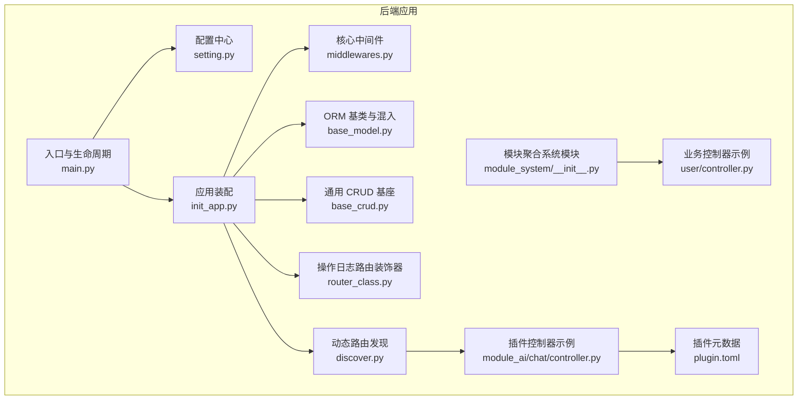
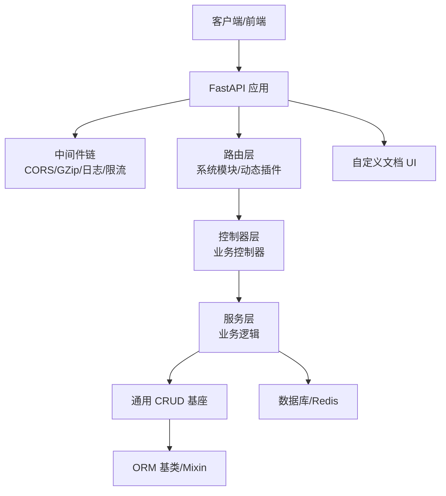
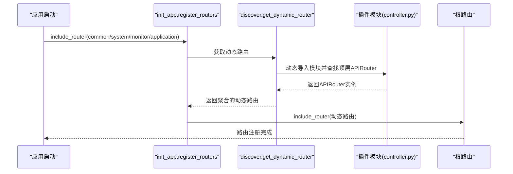
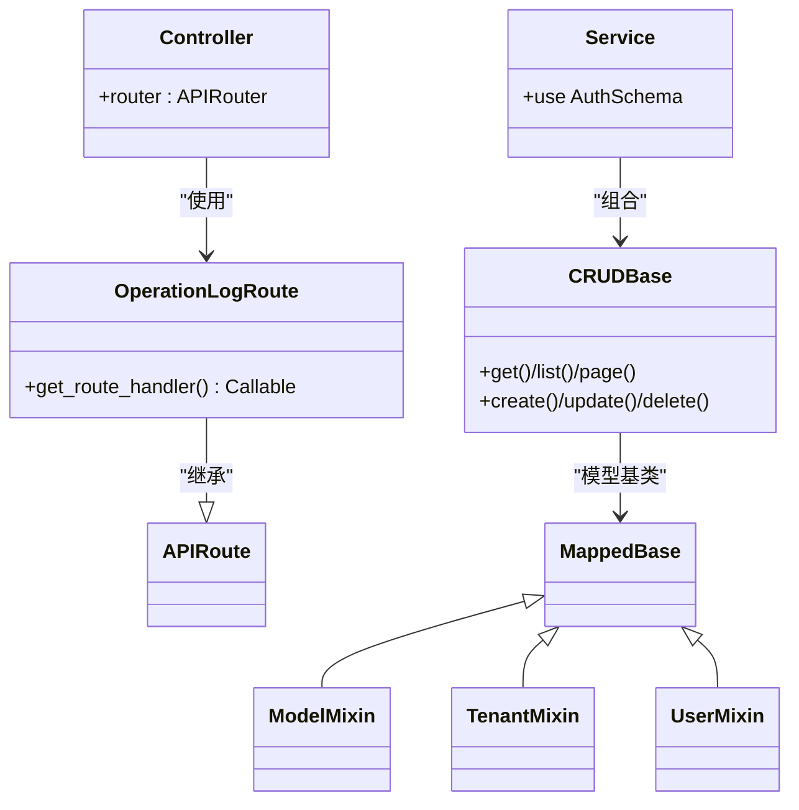
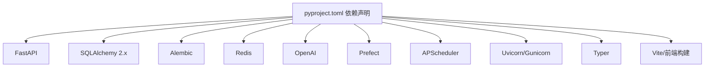

# 架构设计理念

<cite>
**本文引用的文件**
- [backend/main.py](file://backend/main.py)
- [backend/app/config/setting.py](file://backend/app/config/setting.py)
- [backend/app/scripts/init_app.py](file://backend/app/scripts/init_app.py)
- [backend/app/core/middlewares.py](file://backend/app/core/middlewares.py)
- [backend/app/core/base_model.py](file://backend/app/core/base_model.py)
- [backend/app/core/base_crud.py](file://backend/app/core/base_crud.py)
- [backend/app/core/router_class.py](file://backend/app/core/router_class.py)
- [backend/app/core/discover.py](file://backend/app/core/discover.py)
- [backend/app/api/v1/module_system/__init__.py](file://backend/app/api/v1/module_system/__init__.py)
- [backend/app/api/v1/module_system/user/controller.py](file://backend/app/api/v1/module_system/user/controller.py)
- [backend/app/plugin/module_ai/chat/controller.py](file://backend/app/plugin/module_ai/chat/controller.py)
- [backend/app/plugin/module_ai/plugin.toml](file://backend/app/plugin/module_ai/plugin.toml)
- [backend/app/plugin/module_example/plugin.toml](file://backend/app/plugin/module_example/plugin.toml)
- [backend/app/plugin/module_generator/plugin.toml](file://backend/app/plugin/module_generator/plugin.toml)
- [backend/app/plugin/module_task/plugin.toml](file://backend/app/plugin/module_task/plugin.toml)
- [backend/app/common/enums.py](file://backend/app/common/enums.py)
- [backend/app/utils/import_util.py](file://backend/app/utils/import_util.py)
- [backend/pyproject.toml](file://backend/pyproject.toml)
</cite>

## 目录
1. [引言](#引言)
2. [项目结构](#项目结构)
3. [核心组件](#核心组件)
4. [架构总览](#架构总览)
5. [详细组件分析](#详细组件分析)
6. [依赖分析](#依赖分析)
7. [性能考量](#性能考量)
8. [故障排查指南](#故障排查指南)
9. [结论](#结论)
10. [附录](#附录)

## 引言
本项目采用前后端分离架构，后端基于 FastAPI + SQLAlchemy 2.x，前端提供 Vue3 Web 与旧版 Web 两套实现。整体设计遵循“按业务特性分包”的模块化理念，围绕“模块化 + 插件化”的扩展机制构建，强调高内聚、低耦合、可演进与可维护性。本文档系统阐述架构设计思想、模块边界划分、插件动态加载机制、关键设计模式（MVC、中间件、依赖注入）以及性能与可扩展性权衡。

## 项目结构
后端采用“按业务特性分包”组织代码，将系统拆分为多个领域模块（如系统管理、监控、应用门户、AI、任务与工作流、代码生成等），每个模块内部包含控制器、服务、数据访问、模型、Schema、工具等完整层次，形成高内聚的业务单元。插件模块统一放置在 app/plugin 下，遵循 module_ 前缀与 controller.py 约定，实现动态发现与注册。

图表来源
- [backend/main.py:16-51](file://backend/main.py#L16-L51)
- [backend/app/config/setting.py:13-355](file://backend/app/config/setting.py#L13-L355)
- [backend/app/scripts/init_app.py:27-226](file://backend/app/scripts/init_app.py#L27-L226)
- [backend/app/core/middlewares.py:22-215](file://backend/app/core/middlewares.py#L22-L215)
- [backend/app/core/base_model.py:21-228](file://backend/app/core/base_model.py#L21-L228)
- [backend/app/core/base_crud.py:26-571](file://backend/app/core/base_crud.py#L26-L571)
- [backend/app/core/router_class.py:24-165](file://backend/app/core/router_class.py#L24-L165)
- [backend/app/core/discover.py:62-172](file://backend/app/core/discover.py#L62-L172)
- [backend/app/api/v1/module_system/__init__.py:1-30](file://backend/app/api/v1/module_system/__init__.py#L1-L30)
- [backend/app/api/v1/module_system/user/controller.py:30-200](file://backend/app/api/v1/module_system/user/controller.py#L30-L200)
- [backend/app/plugin/module_ai/chat/controller.py:22-196](file://backend/app/plugin/module_ai/chat/controller.py#L22-L196)
- [backend/app/plugin/module_ai/plugin.toml:1-9](file://backend/app/plugin/module_ai/plugin.toml#L1-L9)

章节来源
- [backend/main.py:16-51](file://backend/main.py#L16-L51)
- [backend/app/scripts/init_app.py:27-226](file://backend/app/scripts/init_app.py#L27-L226)
- [backend/app/core/discover.py:62-172](file://backend/app/core/discover.py#L62-L172)

## 核心组件
- 应用入口与生命周期：集中创建 FastAPI 实例、注册中间件、路由、静态资源与文档，并通过 lifespan 管理启动/关闭流程。
- 配置中心：集中管理运行环境、服务器、认证、数据库、Redis、日志、Gzip、静态文件、Swagger/UI、AI/向量库等配置，并提供运行时动态组装中间件与事件列表的能力。
- 应用装配：统一注册异常处理、中间件、路由、静态文件与 API 文档替换。
- 中间件体系：跨域、请求日志、Gzip 压缩、演示模式拦截、限流等，均通过配置开关与统一入口按需启用。
- ORM 基座：声明式基类与多组 Mixin（基础字段、用户审计、租户隔离、权限策略）统一模型设计。
- 通用 CRUD：提供 get/list/tree/page/create/update/delete/set/restore 等通用能力，内置权限过滤与预加载策略。
- 操作日志路由装饰器：基于 APIRoute 自定义处理链，在路由前后统一记录操作日志。
- 动态路由发现：扫描 app/plugin 下 module_* 目录，按约定自动发现并注册插件路由，支持插件化扩展。
- 模块聚合：系统模块通过 include_router 聚合，形成稳定的模块边界。
- 插件元数据：plugin.toml 提供插件名称、标题、版本、描述、标签等元信息，便于文档与运维展示。

章节来源
- [backend/app/config/setting.py:13-355](file://backend/app/config/setting.py#L13-L355)
- [backend/app/scripts/init_app.py:95-226](file://backend/app/scripts/init_app.py#L95-L226)
- [backend/app/core/middlewares.py:22-215](file://backend/app/core/middlewares.py#L22-L215)
- [backend/app/core/base_model.py:21-228](file://backend/app/core/base_model.py#L21-L228)
- [backend/app/core/base_crud.py:26-571](file://backend/app/core/base_crud.py#L26-L571)
- [backend/app/core/router_class.py:24-165](file://backend/app/core/router_class.py#L24-L165)
- [backend/app/core/discover.py:62-172](file://backend/app/core/discover.py#L62-L172)
- [backend/app/api/v1/module_system/__init__.py:1-30](file://backend/app/api/v1/module_system/__init__.py#L1-L30)

## 架构总览
系统采用 MVC 分层与中间件模式，结合依赖注入与插件化扩展，形成清晰的职责边界与可演进的模块生态。

图表来源
- [backend/app/scripts/init_app.py:95-226](file://backend/app/scripts/init_app.py#L95-L226)
- [backend/app/core/discover.py:62-172](file://backend/app/core/discover.py#L62-L172)
- [backend/app/core/router_class.py:24-165](file://backend/app/core/router_class.py#L24-L165)
- [backend/app/core/base_crud.py:26-571](file://backend/app/core/base_crud.py#L26-L571)
- [backend/app/core/base_model.py:21-228](file://backend/app/core/base_model.py#L21-L228)

## 详细组件分析

### 分包理念：按业务特性分包 vs 按技术层次分包
- 按技术层次分包（package by layer）：将 Controller、Service、DAO、Model 按层拆分，优点是复用性强、便于统一治理；缺点是模块边界模糊、跨层依赖复杂、变更牵一发而动全身。
- 按业务特性分包（package by feature）：以业务域为单位组织代码，每个模块内含完整的控制器、服务、数据访问、模型与工具，优点是高内聚、低耦合、边界清晰、易于演进与团队自治；缺点是跨模块重复代码需要通过通用基座收敛。
- 本项目选择按业务特性分包：系统模块（系统管理、监控、应用门户、AI、任务与工作流、代码生成等）均采用该模式，控制器统一使用 OperationLogRoute 装饰器，服务层通过 AuthSchema 注入数据库会话，CRUD 基座统一处理权限与预加载，形成“模块内高内聚、模块间低耦合”的架构。

章节来源
- [backend/app/api/v1/module_system/user/controller.py:30-200](file://backend/app/api/v1/module_system/user/controller.py#L30-L200)
- [backend/app/plugin/module_ai/chat/controller.py:22-196](file://backend/app/plugin/module_ai/chat/controller.py#L22-L196)
- [backend/app/core/router_class.py:24-165](file://backend/app/core/router_class.py#L24-L165)
- [backend/app/core/base_crud.py:26-571](file://backend/app/core/base_crud.py#L26-L571)

### 模块化设计与模块边界
- 模块边界：以业务域为边界，如 module_system、module_monitor、module_application、module_ai、module_task、module_generator 等，每个模块内部包含 controller、service、crud、model/schema、utils 等，形成闭环。
- 依赖关系管理：模块间通过统一的依赖注入（如 AuthSchema、数据库会话）与通用基座（CRUD、ORM、中间件）协作，避免直接耦合。
- 模块聚合：系统模块通过 include_router 聚合，形成稳定的根路由前缀与标签体系。

章节来源
- [backend/app/api/v1/module_system/__init__.py:1-30](file://backend/app/api/v1/module_system/__init__.py#L1-L30)
- [backend/app/plugin/module_ai/chat/controller.py:22-196](file://backend/app/plugin/module_ai/chat/controller.py#L22-L196)

### 插件化扩展机制与动态加载
- 插件目录规范：app/plugin/module_*/**/controller.py，顶层目录必须以 module_ 开头，controller.py 必须在模块顶层定义 APIRouter 实例。
- 动态发现：扫描 app.plugin 包，按路径解析前缀（module_xxx → /xxx），动态导入模块并注册顶层 APIRouter 实例。
- 插件元数据：plugin.toml 提供插件名称、标题、版本、描述、标签等，便于文档与运维展示。
- 示例插件：module_ai、module_example、module_generator、module_task 均遵循上述规范，可独立启用/停用。

图表来源
- [backend/app/scripts/init_app.py:125-158](file://backend/app/scripts/init_app.py#L125-L158)
- [backend/app/core/discover.py:62-172](file://backend/app/core/discover.py#L62-L172)

章节来源
- [backend/app/core/discover.py:62-172](file://backend/app/core/discover.py#L62-L172)
- [backend/app/plugin/module_ai/plugin.toml:1-9](file://backend/app/plugin/module_ai/plugin.toml#L1-L9)
- [backend/app/plugin/module_example/plugin.toml:1-10](file://backend/app/plugin/module_example/plugin.toml#L1-L10)
- [backend/app/plugin/module_generator/plugin.toml:1-9](file://backend/app/plugin/module_generator/plugin.toml#L1-L9)
- [backend/app/plugin/module_task/plugin.toml:1-9](file://backend/app/plugin/module_task/plugin.toml#L1-L9)

### 设计模式与关键实现
- MVC 分层架构：控制器负责请求处理与参数校验，服务层封装业务规则，数据访问层通过通用 CRUD 基座与 ORM 基类实现。
- 中间件模式：跨域、请求日志、Gzip、演示模式拦截、限流等均以中间件形式接入，通过配置开关按需启用。
- 依赖注入：AuthSchema、数据库会话、Redis 连接等通过依赖注入传递，减少硬编码与全局状态。
- 路由装饰器：OperationLogRoute 在路由前后统一记录操作日志，支持忽略特定函数与方法类型。

图表来源
- [backend/app/core/router_class.py:24-165](file://backend/app/core/router_class.py#L24-L165)
- [backend/app/api/v1/module_system/user/controller.py:30-200](file://backend/app/api/v1/module_system/user/controller.py#L30-L200)
- [backend/app/core/base_crud.py:26-571](file://backend/app/core/base_crud.py#L26-L571)
- [backend/app/core/base_model.py:21-228](file://backend/app/core/base_model.py#L21-L228)

章节来源
- [backend/app/core/router_class.py:24-165](file://backend/app/core/router_class.py#L24-L165)
- [backend/app/core/base_crud.py:26-571](file://backend/app/core/base_crud.py#L26-L571)
- [backend/app/core/base_model.py:21-228](file://backend/app/core/base_model.py#L21-L228)

### 权限与数据隔离
- 权限过滤策略：通过 PermissionFilterStrategy 定义多种策略（数据范围、角色授权、部门关联、仅本人、用户角色），在 CRUD 基座中统一应用。
- 租户隔离：TenantMixin 提供 tenant_id 字段与外键约束，平台超级管理员在数据层不按租户过滤。
- 用户审计：UserMixin 提供 created_id/updated_id/deleted_id 与关联关系，支持“仅本人数据权限”。

章节来源
- [backend/app/common/enums.py:111-122](file://backend/app/common/enums.py#L111-L122)
- [backend/app/core/base_model.py:128-228](file://backend/app/core/base_model.py#L128-L228)
- [backend/app/core/base_crud.py:446-452](file://backend/app/core/base_crud.py#L446-L452)

### 中间件与限流
- 中间件装配：通过 settings.MIDDLEWARE_LIST 逆序叠加，确保外层优先生效；支持 CORS、请求日志、Gzip。
- 限流：集成 FastAPILimiter，支持 HTTP 与 WebSocket 限流回调，前缀可配置。
- 演示模式拦截：基于 Redis 系统配置动态启用/禁用非 GET 请求，支持 IP 白名单与路径白名单。

章节来源
- [backend/app/config/setting.py:228-241](file://backend/app/config/setting.py#L228-L241)
- [backend/app/scripts/init_app.py:95-110](file://backend/app/scripts/init_app.py#L95-L110)
- [backend/app/core/middlewares.py:22-215](file://backend/app/core/middlewares.py#L22-L215)

### ORM 与通用 CRUD
- ORM 基类：MappedBase 支持 SQLite/MySQL/PostgreSQL，ModelMixin/UserMixin/TenantMixin 提供通用字段与关系。
- CRUD 基座：提供分页、树形列表、权限过滤、预加载、软删除/恢复、批量更新/删除等能力，内置主键计数优化与并发一致性保障。

章节来源
- [backend/app/core/base_model.py:21-228](file://backend/app/core/base_model.py#L21-L228)
- [backend/app/core/base_crud.py:26-571](file://backend/app/core/base_crud.py#L26-L571)

### 文档与静态资源
- 自定义文档：Swagger UI、ReDoc、LangJin UI 均可替换为本地静态资源，提升离线可用性与一致性。
- 静态资源：可配置挂载路径与目录，支持上传目录与文件类型限制。

章节来源
- [backend/app/scripts/init_app.py:182-226](file://backend/app/scripts/init_app.py#L182-L226)
- [backend/app/config/setting.py:172-204](file://backend/app/config/setting.py#L172-L204)

## 依赖分析
- 运行时依赖：FastAPI、SQLAlchemy 2.x、Alembic、Pydantic Settings、Redis、OpenAI、Prefect、APScheduler、Uvicorn、Gunicorn 等。
- 插件生态：module_ai、module_example、module_generator、module_task 等插件通过 plugin.toml 描述元信息，动态注册路由。
- 代码质量：Ruff 作为 lint/format 工具，统一风格与修复建议。

图表来源
- [backend/pyproject.toml:7-52](file://backend/pyproject.toml#L7-L52)

章节来源
- [backend/pyproject.toml:7-52](file://backend/pyproject.toml#L7-L52)

## 性能考量
- 数据库连接与池化：支持连接池大小、超时、回收、预检等参数，适配高并发场景。
- ORM 查询优化：分页查询使用主键计数，避免全表扫描；预加载策略统一使用 selectinload，降低 N+1 查询风险。
- 压缩与限流：Gzip 压缩最小阈值与压缩等级可配置；HTTP/WS 限流器可按需启用，保护后端资源。
- 演示模式：在演示环境下拦截非 GET 请求，降低误操作风险与资源消耗。

章节来源
- [backend/app/config/setting.py:80-114](file://backend/app/config/setting.py#L80-L114)
- [backend/app/core/base_crud.py:186-204](file://backend/app/core/base_crud.py#L186-L204)
- [backend/app/core/middlewares.py:206-215](file://backend/app/core/middlewares.py#L206-L215)

## 故障排查指南
- 路由未注册：检查插件目录是否以 module_ 开头、controller.py 是否在模块顶层定义 APIRouter 实例、包路径是否可导入。
- 中间件未生效：确认 settings.MIDDLEWARE_LIST 中对应中间件开关是否启用，注册顺序是否正确。
- 演示模式拦截：检查 Redis 系统配置中的演示开关、IP 白名单与路径白名单，确认请求来源与方法类型。
- ORM 模型扫描：使用 ImportUtil.find_models 校验模型有效性与表名唯一性，排除抽象类与无列模型。

章节来源
- [backend/app/core/discover.py:33-59](file://backend/app/core/discover.py#L33-L59)
- [backend/app/core/middlewares.py:128-186](file://backend/app/core/middlewares.py#L128-L186)
- [backend/app/utils/import_util.py:14-213](file://backend/app/utils/import_util.py#L14-L213)

## 结论
本项目通过“按业务特性分包 + 插件化扩展 + 中间件治理 + 通用 CRUD 基座”的架构设计，实现了高内聚、低耦合、可演进与可维护的系统。配置中心统一管理运行参数与中间件装配，动态路由发现支持灵活扩展，权限与数据隔离保障企业级安全需求。在性能方面，连接池、ORM 优化、压缩与限流等策略共同支撑高并发与稳定运行。整体架构兼顾可扩展性、可维护性与高性能需求，适合长期演进与团队协作。

## 附录
- 架构决策的技术依据与权衡
  - 分包选择：优先保证模块内高内聚与边界清晰，降低跨模块耦合带来的变更成本。
  - 中间件模式：通过配置开关与统一入口，实现横切关注点的解耦与可插拔。
  - 依赖注入：减少全局状态与硬编码，提升测试性与可替换性。
  - 插件化：通过约定式目录与动态发现，实现功能的按需启用与快速迭代。
- 实践建议
  - 严格遵守插件目录命名与 controller.py 约定，避免动态注册失败。
  - 在新增模块时统一使用 OperationLogRoute 与 AuthSchema，确保日志与权限一致。
  - 对热点查询使用分页与预加载策略，避免 N+1 与全表扫描。
  - 在演示环境谨慎开放非 GET 请求，必要时配置白名单与限流。