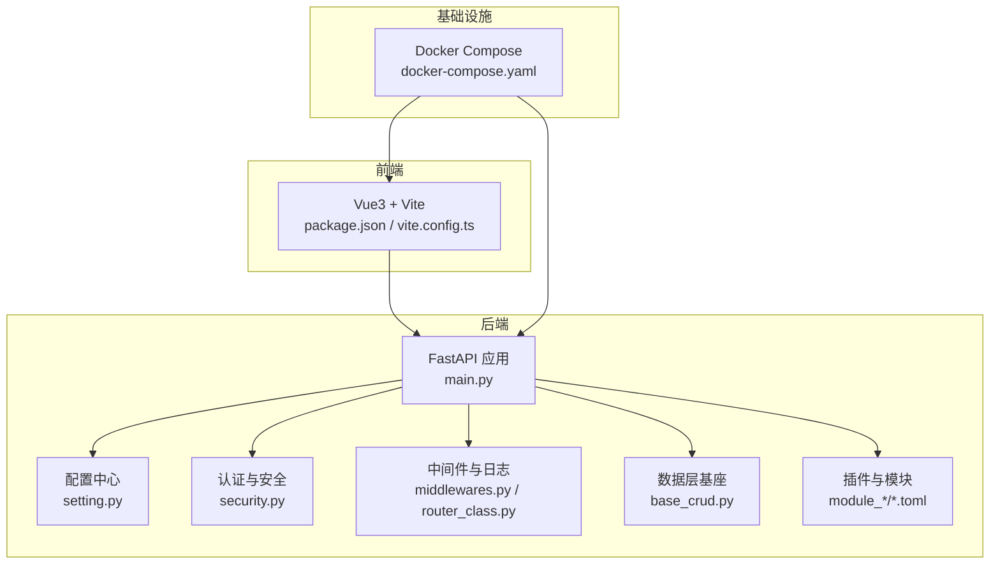
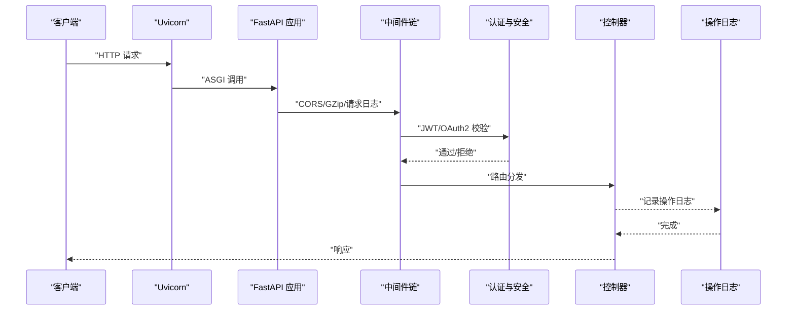
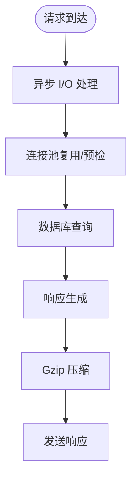
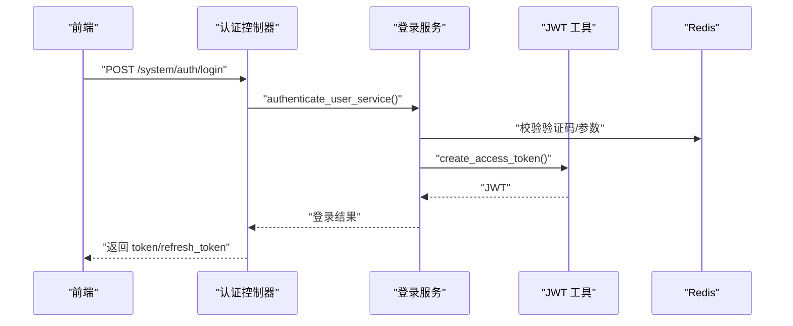
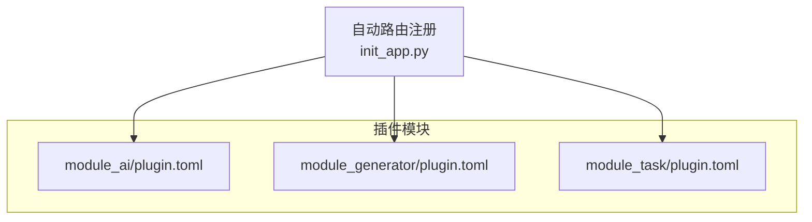
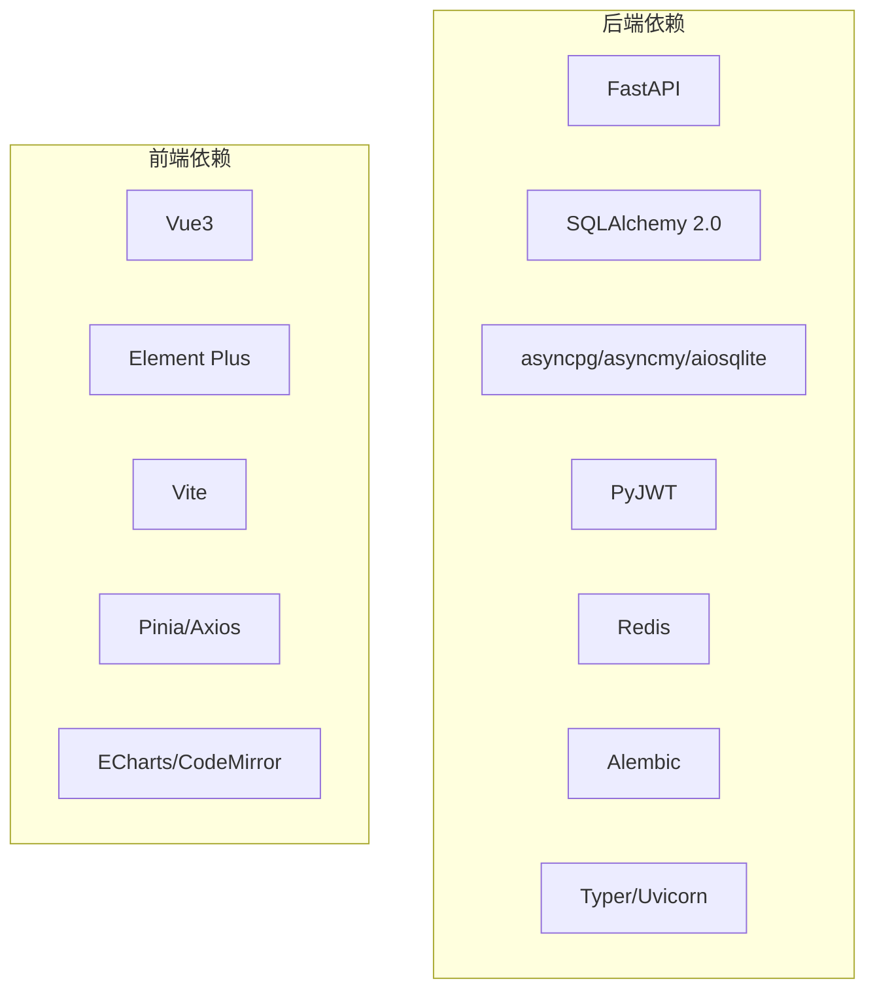

# 核心优势

<cite>
**本文引用的文件**
- [backend/main.py](file://backend/main.py)
- [backend/pyproject.toml](file://backend/pyproject.toml)
- [backend/app/config/setting.py](file://backend/app/config/setting.py)
- [backend/app/core/security.py](file://backend/app/core/security.py)
- [backend/app/core/middlewares.py](file://backend/app/core/middlewares.py)
- [backend/app/core/router_class.py](file://backend/app/core/router_class.py)
- [backend/app/core/base_crud.py](file://backend/app/core/base_crud.py)
- [backend/app/plugin/module_ai/plugin.toml](file://backend/app/plugin/module_ai/plugin.toml)
- [backend/app/plugin/module_generator/plugin.toml](file://backend/app/plugin/module_generator/plugin.toml)
- [backend/app/plugin/module_task/plugin.toml](file://backend/app/plugin/module_task/plugin.toml)
- [backend/app/api/v1/module_system/auth/controller.py](file://backend/app/api/v1/module_system/auth/controller.py)
- [frontend/web/package.json](file://frontend/web/package.json)
- [frontend/web/vite.config.ts](file://frontend/web/vite.config.ts)
- [docker/docker-compose.yaml](file://docker/docker-compose.yaml)
- [README.md](file://README.md)
</cite>

## 目录
1. [引言](#引言)
2. [项目结构](#项目结构)
3. [核心组件](#核心组件)
4. [架构总览](#架构总览)
5. [详细组件分析](#详细组件分析)
6. [依赖分析](#依赖分析)
7. [性能考量](#性能考量)
8. [故障排查指南](#故障排查指南)
9. [结论](#结论)
10. [附录](#附录)

## 引言
本文件聚焦 FastapiAdmin 的核心优势，围绕现代化技术栈、高性能异步处理、安全可靠的认证授权体系、模块化设计架构、全栈支持能力、快速部署方案、完善文档体系与智能体框架等维度展开。我们将结合代码级实现与配置说明，解释技术原理、业务价值与实际应用效果，并提供与同类产品的差异化对比，帮助读者在理解的基础上高效落地。

## 项目结构
FastapiAdmin 采用前后端分离架构，后端基于 FastAPI + SQLAlchemy 2.0 + 异步数据库驱动，前端采用 Vue3 + Vite + TypeScript + Element Plus，覆盖 Web/H5/文档三端。后端采用“按业务特性分包”的竖切组织方式，配合插件化路由自动注册机制，形成高内聚、低耦合的模块化体系。

图表来源
- [backend/main.py:16-51](file://backend/main.py#L16-L51)
- [backend/app/config/setting.py:13-355](file://backend/app/config/setting.py#L13-L355)
- [backend/app/core/security.py:11-149](file://backend/app/core/security.py#L11-L149)
- [backend/app/core/middlewares.py:22-215](file://backend/app/core/middlewares.py#L22-L215)
- [backend/app/core/router_class.py:24-165](file://backend/app/core/router_class.py#L24-L165)
- [backend/app/core/base_crud.py:26-571](file://backend/app/core/base_crud.py#L26-L571)
- [backend/app/plugin/module_ai/plugin.toml:1-9](file://backend/app/plugin/module_ai/plugin.toml#L1-L9)
- [frontend/web/package.json:1-205](file://frontend/web/package.json#L1-L205)
- [frontend/web/vite.config.ts:49-292](file://frontend/web/vite.config.ts#L49-L292)
- [docker/docker-compose.yaml:9-201](file://docker/docker-compose.yaml#L9-L201)

章节来源
- [README.md:31-115](file://README.md#L31-L115)
- [backend/main.py:16-51](file://backend/main.py#L16-L51)
- [backend/app/config/setting.py:13-355](file://backend/app/config/setting.py#L13-L355)

## 核心组件
- 现代化技术栈：后端使用 FastAPI、SQLAlchemy 2.0、Pydantic v2、异步数据库驱动（asyncpg/asyncmy/aiosqlite），前端采用 Vue3、Vite5、TypeScript、Element Plus，覆盖多端开发。
- 高性能异步：后端基于 Uvicorn 异步运行，数据库采用异步驱动，中间件与路由均支持异步处理；前端构建与按需加载优化打包体积。
- 安全可靠的认证授权：JWT + OAuth2 认证、RBAC 权限控制、滑动过期、验证码、操作日志与请求拦截等安全机制。
- 模块化设计：按业务域分包，插件化自动路由注册，模块内 Controller → Service → CRUD → Model 的分层清晰。
- 全栈支持：Web/H5/文档三端一体化，统一接口前缀与文档体系。
- 快速部署：Docker Compose 一键部署，支持生产环境快速上线。
- 完善文档：README 与插件开发文档齐全，接口文档自动生成。
- 智能体框架：内置基于 Agno 的 AI 子系统插件，支持对话与 Agent 能力。

章节来源
- [README.md:70-82](file://README.md#L70-L82)
- [backend/pyproject.toml:7-51](file://backend/pyproject.toml#L7-L51)
- [frontend/web/package.json:68-178](file://frontend/web/package.json#L68-L178)
- [backend/app/config/setting.py:67-74](file://backend/app/config/setting.py#L67-L74)
- [backend/app/core/security.py:98-149](file://backend/app/core/security.py#L98-L149)
- [backend/app/core/middlewares.py:36-215](file://backend/app/core/middlewares.py#L36-L215)
- [backend/app/core/router_class.py:24-165](file://backend/app/core/router_class.py#L24-L165)
- [backend/app/core/base_crud.py:26-571](file://backend/app/core/base_crud.py#L26-L571)
- [backend/app/plugin/module_ai/plugin.toml:1-9](file://backend/app/plugin/module_ai/plugin.toml#L1-L9)
- [docker/docker-compose.yaml:9-201](file://docker/docker-compose.yaml#L9-L201)

## 架构总览
下图展示了后端应用启动、中间件链路、认证流程与日志记录的整体交互：

图表来源
- [backend/main.py:34-51](file://backend/main.py#L34-L51)
- [backend/app/core/middlewares.py:36-215](file://backend/app/core/middlewares.py#L36-L215)
- [backend/app/core/security.py:11-149](file://backend/app/core/security.py#L11-L149)
- [backend/app/core/router_class.py:24-165](file://backend/app/core/router_class.py#L24-L165)

## 详细组件分析

### 现代化技术栈
- 后端技术栈：FastAPI、SQLAlchemy 2.0、Pydantic v2、异步数据库驱动（asyncpg/asyncmy/aiosqlite）、JWT、Redis、APScheduler、Alembic、Typer、Uvicorn 等。
- 前端技术栈：Vue3、Vite5、TypeScript、Element Plus、Pinia、Axios、ECharts、Markdown/CodeMirror 等。
- 优势体现：类型安全、自动生成接口文档、异步高并发、组件化与模块化开发体验佳。

章节来源
- [backend/pyproject.toml:7-51](file://backend/pyproject.toml#L7-L51)
- [frontend/web/package.json:68-178](file://frontend/web/package.json#L68-L178)
- [README.md:157-172](file://README.md#L157-L172)

### 高性能异步处理
- 后端异步：Uvicorn 异步运行，数据库使用 asyncpg/asyncmy/aiosqlite，连接池参数可配置，支持预检与 LIFO。
- 前端优化：Vite 构建、按需组件与第三方库拆分、Gzip 压缩插件、动态导入与分块策略。
- 性能要点：异步 I/O + 连接池 + 压缩 + 懒加载，显著降低延迟与带宽占用。

图表来源
- [backend/app/config/setting.py:86-95](file://backend/app/config/setting.py#L86-L95)
- [frontend/web/vite.config.ts:174-207](file://frontend/web/vite.config.ts#L174-L207)

章节来源
- [backend/app/config/setting.py:257-302](file://backend/app/config/setting.py#L257-L302)
- [frontend/web/vite.config.ts:86-173](file://frontend/web/vite.config.ts#L86-L173)

### 安全可靠的认证授权体系
- 认证机制：JWT + OAuth2，支持滑动过期、验证码、第三方 OAuth 回调。
- 授权控制：RBAC 权限模型，路由级权限装饰器，操作日志记录。
- 安全增强：CORS、GZip、请求拦截（演示模式）、IP 黑白名单、登录位置解析。

图表来源
- [backend/app/api/v1/module_system/auth/controller.py:41-78](file://backend/app/api/v1/module_system/auth/controller.py#L41-L78)
- [backend/app/core/security.py:98-149](file://backend/app/core/security.py#L98-L149)
- [backend/app/config/setting.py:67-74](file://backend/app/config/setting.py#L67-L74)

章节来源
- [backend/app/core/security.py:11-149](file://backend/app/core/security.py#L11-L149)
- [backend/app/core/middlewares.py:36-215](file://backend/app/core/middlewares.py#L36-L215)
- [backend/app/config/setting.py:124-138](file://backend/app/config/setting.py#L124-L138)

### 模块化设计架构
- 分包理念：按业务域分包（按特性竖切），模块内按 Controller/Service/CRUD/Model/Schemas 分层。
- 插件化：通过 plugin.toml 声明模块元信息，系统自动发现并注册路由，支持多层级嵌套。
- 优势：降低耦合、提升可维护性、便于团队并行开发与模块独立演进。

图表来源
- [backend/app/plugin/module_ai/plugin.toml:1-9](file://backend/app/plugin/module_ai/plugin.toml#L1-L9)
- [backend/app/plugin/module_generator/plugin.toml:1-9](file://backend/app/plugin/module_generator/plugin.toml#L1-L9)
- [backend/app/plugin/module_task/plugin.toml:1-9](file://backend/app/plugin/module_task/plugin.toml#L1-L9)

章节来源
- [README.md:39-57](file://README.md#L39-L57)
- [README.md:354-457](file://README.md#L354-L457)

### 全栈支持能力
- 前端三端：Web(Vue3 + Element Plus)、H5(UniApp)、文档(VitePress)，统一接口前缀与代理配置。
- 后端接口：Swagger/ReDoc/LangJin 文档，统一响应封装，操作日志与性能指标。
- 配置：前端通过 .env.* 配置 API 基础地址与端口，后端通过 settings 控制根路径与文档。

章节来源
- [frontend/web/vite.config.ts:64-72](file://frontend/web/vite.config.ts#L64-L72)
- [backend/app/config/setting.py:44-47](file://backend/app/config/setting.py#L44-L47)
- [backend/app/config/setting.py:196-204](file://backend/app/config/setting.py#L196-L204)

### 快速部署方案
- Docker Compose：一键拉起 MySQL、Redis、Nginx 与后端服务，健康检查与资源限制配置。
- 部署脚本：提供 deploy.sh，支持构建前端、更新代码、查看日志、停止/重启等。
- 环境隔离：.env.dev/.env.prod 分离，数据库与缓存连接参数可灵活切换。

章节来源
- [docker/docker-compose.yaml:9-201](file://docker/docker-compose.yaml#L9-L201)
- [README.md:317-347](file://README.md#L317-L347)

### 完善文档体系
- 后端：README.md 提供架构、分包理念、二次开发、部署与常见问题详解。
- 前端：Vite/Vue/TS 生态文档与组件库文档，接口前缀与代理说明清晰。
- 智能体：AI 子系统插件说明与标签，便于扩展智能体能力。

章节来源
- [README.md:31-623](file://README.md#L31-L623)
- [backend/app/plugin/module_ai/plugin.toml:1-9](file://backend/app/plugin/module_ai/plugin.toml#L1-L9)

### 智能体框架
- 基于 Agno 的 AI 子系统插件，支持对话、Agent 等能力，路由由 module_ai/**/controller 动态注册。
- 适合在业务中快速接入智能客服、知识问答、自动化辅助等场景。

章节来源
- [backend/app/plugin/module_ai/plugin.toml:1-9](file://backend/app/plugin/module_ai/plugin.toml#L1-L9)

## 依赖分析
后端依赖以现代异步生态为主，涵盖数据库、缓存、认证、文档、调度与工具库；前端依赖以 Vue3 生态与 UI 组件库为核心，辅以图表、编辑器、国际化等常用库。

图表来源
- [backend/pyproject.toml:7-51](file://backend/pyproject.toml#L7-L51)
- [frontend/web/package.json:68-178](file://frontend/web/package.json#L68-L178)

章节来源
- [backend/pyproject.toml:7-51](file://backend/pyproject.toml#L7-L51)
- [frontend/web/package.json:68-178](file://frontend/web/package.json#L68-L178)

## 性能考量
- 异步 I/O 与连接池：合理配置连接池大小、超时与回收策略，避免阻塞与资源枯竭。
- 压缩与缓存：启用 Gzip 压缩与静态资源缓存，减少网络传输。
- 前端分包：按需加载与手动分块，避免首屏过大；CDN 与缓存头优化。
- 安全拦截：演示模式下的请求拦截与白名单机制，降低误操作风险。
- 日志与监控：统一操作日志与响应头指标，便于定位性能瓶颈。

章节来源
- [backend/app/config/setting.py:167-170](file://backend/app/config/setting.py#L167-L170)
- [backend/app/core/middlewares.py:150-186](file://backend/app/core/middlewares.py#L150-L186)
- [backend/app/core/router_class.py:52-162](file://backend/app/core/router_class.py#L52-L162)

## 故障排查指南
- 启动失败：检查环境变量（数据库、Redis、JWT 密钥）与端口占用；首次启动会自动初始化库表与基础数据。
- 认证失败：核对 JWT 密钥、算法与过期时间；检查验证码与 OAuth 回调配置。
- 数据库连接：确认 asyncpg/asyncmy/aiosqlite 驱动与连接串；检查连接池参数与预检。
- 前端跨域：确认 Vite 代理与后端 CORS 配置；检查 API 基础地址与接口前缀。
- 部署问题：使用 deploy.sh 脚本与 docker-compose，查看容器日志与健康检查状态。

章节来源
- [README.md:207-271](file://README.md#L207-L271)
- [backend/app/config/setting.py:227-241](file://backend/app/config/setting.py#L227-L241)
- [frontend/web/vite.config.ts:64-72](file://frontend/web/vite.config.ts#L64-L72)
- [docker/docker-compose.yaml:119-128](file://docker/docker-compose.yaml#L119-L128)

## 结论
FastapiAdmin 以现代化技术栈为基础，结合高性能异步处理、安全可靠的认证授权、模块化设计与插件化路由、全栈一体化支持、快速部署方案与完善文档体系，形成了面向企业级中后台系统的高生产力平台。其智能体框架进一步拓展了业务智能化能力，适合在需要快速迭代与规模化交付的场景中应用。

## 附录
- 与同类产品的差异化优势
  - 技术栈：FastAPI + SQLAlchemy 2.0 + 异步生态，类型安全与自动生成文档体验更佳。
  - 安全：JWT + OAuth2 + RBAC + 演示模式拦截 + 操作日志，安全基线更高。
  - 模块化：按业务域分包 + 插件化自动注册，二次开发与维护成本更低。
  - 全栈：Web/H5/文档三端统一，接口前缀与文档体系一致，降低联调成本。
  - 部署：Docker Compose 一键部署，脚本化运维，适合 CI/CD 与生产环境。

章节来源
- [README.md:70-82](file://README.md#L70-L82)
- [backend/pyproject.toml:7-51](file://backend/pyproject.toml#L7-L51)
- [frontend/web/package.json:68-178](file://frontend/web/package.json#L68-L178)
- [docker/docker-compose.yaml:9-201](file://docker/docker-compose.yaml#L9-L201)