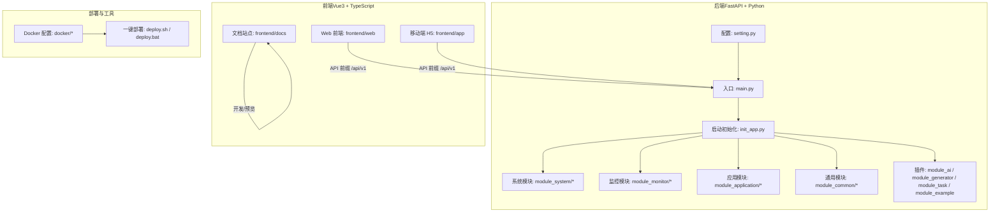
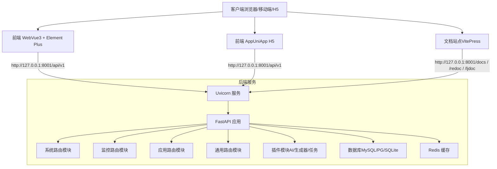
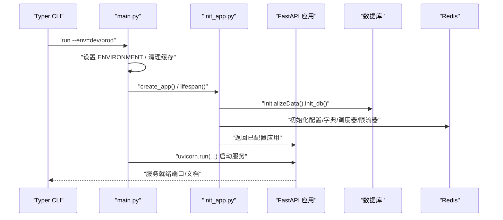
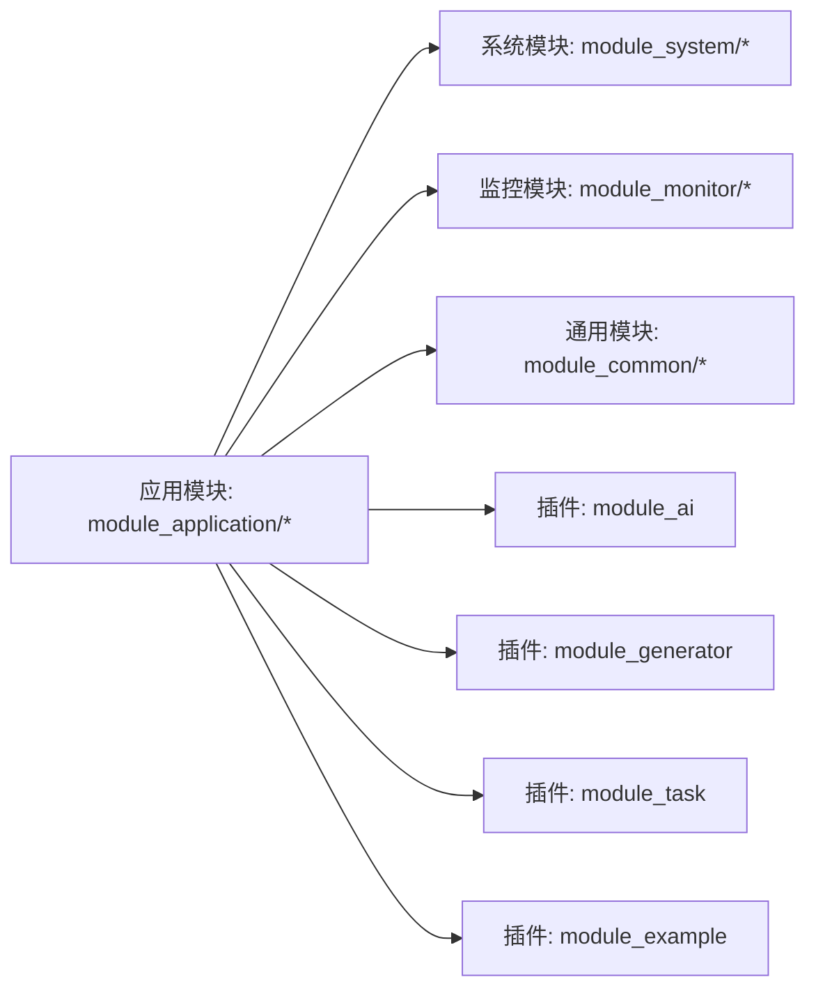
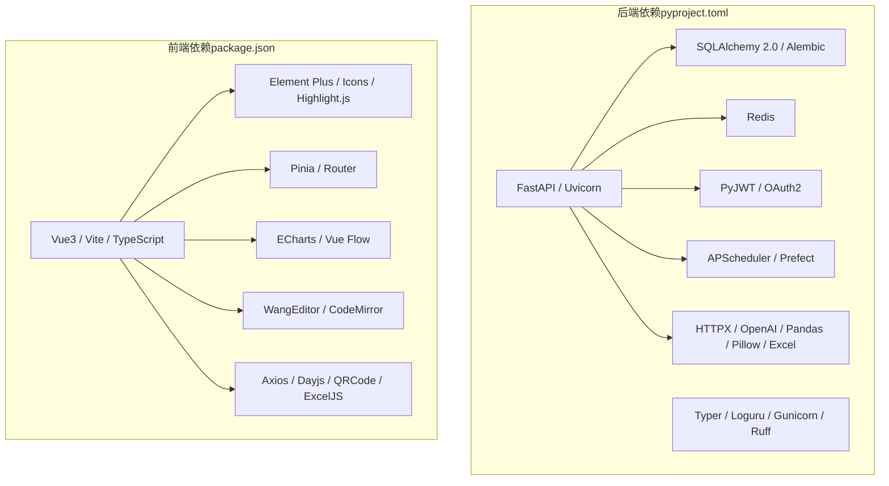

# 项目介绍

<cite>
**本文引用的文件**
- [README.md](file://README.md)
- [main.py](file://backend/main.py)
- [pyproject.toml](file://backend/pyproject.toml)
- [package.json](file://frontend/web/package.json)
- [setting.py](file://backend/app/config/setting.py)
- [init_app.py](file://backend/app/scripts/init_app.py)
- [module_system/__init__.py](file://backend/app/api/v1/module_system/__init__.py)
- [module_monitor/__init__.py](file://backend/app/api/v1/module_monitor/__init__.py)
- [module_application/__init__.py](file://backend/app/api/v1/module_application/__init__.py)
- [module_common/__init__.py](file://backend/app/api/v1/module_common/__init__.py)
- [plugin.toml（AI）](file://backend/app/plugin/module_ai/plugin.toml)
- [plugin.toml（代码生成）](file://backend/app/plugin/module_generator/plugin.toml)
- [plugin.toml（任务与工作流）](file://backend/app/plugin/module_task/plugin.toml)
- [plugin.toml（示例）](file://backend/app/plugin/module_example/plugin.toml)
</cite>

## 目录
1. [引言](#引言)
2. [项目结构](#项目结构)
3. [核心组件](#核心组件)
4. [架构总览](#架构总览)
5. [详细组件分析](#详细组件分析)
6. [依赖关系分析](#依赖关系分析)
7. [性能考量](#性能考量)
8. [故障排查指南](#故障排查指南)
9. [结论](#结论)
10. [附录](#附录)

## 引言
FastapiAdmin 是一套完全开源、高度模块化、技术先进的现代化快速开发平台，定位为“现代化全栈快速开发平台”。项目以“模块化、松耦合、高扩展性”为核心设计思想，采用前后端分离架构，后端基于 FastAPI + Python，前端采用 Vue3 + TypeScript，覆盖 Web、移动端（H5）与文档站点，提供一站式开箱即用的开发体验。

项目致力于：
- 降低技术选型成本与学习成本
- 提供清晰的开发规范与设计模式
- 构建强大的代码分层模型与统一框架
- 支持企业级中后台系统的高效交付

项目在企业级中后台系统开发中的独特优势包括：
- 现代化技术栈：FastAPI 异步高性能、Vue3 生态完善、TypeScript 类型安全
- 安全可靠：JWT + OAuth2 认证、RBAC 权限控制、滑动过期与请求限流
- 模块化设计：按业务域分包（竖切），天然支持插件化与独立模块演进
- 全栈支持：Web + H5 + 文档一体化
- 快速部署：Docker 一键部署，支持生产环境快速上线
- 智能体框架：内置基于 Agno 的智能体能力
- 开发工具链：代码生成器、API 文档、数据库迁移、日志与监控

## 项目结构
项目采用“前后端分离 + 多工程”的组织方式，后端工程位于 backend，前端工程位于 frontend，包含 web（Vue3 + Element Plus）、app（UniApp H5）、docs（VitePress 文档）三部分；docker 目录提供容器化部署配置。

图表来源
- [main.py:16-51](file://backend/main.py#L16-L51)
- [init_app.py:125-158](file://backend/app/scripts/init_app.py#L125-L158)
- [module_system/__init__.py:17](file://backend/app/api/v1/module_system/__init__.py#L17)
- [module_monitor/__init__.py:8](file://backend/app/api/v1/module_monitor/__init__.py#L8)
- [module_application/__init__.py:5](file://backend/app/api/v1/module_application/__init__.py#L5)
- [module_common/__init__.py:6](file://backend/app/api/v1/module_common/__init__.py#L6)

章节来源
- [README.md:96-115](file://README.md#L96-L115)
- [README.md:117-156](file://README.md#L117-L156)

## 核心组件
- 应用入口与生命周期：通过 main.py 的 create_app 与 Typer CLI 启动 Uvicorn 服务，并在 init_app.py 中完成日志、中间件、路由、静态资源与 API 文档的注册。
- 配置体系：setting.py 提供统一的 Settings 类，集中管理服务器、认证、数据库、Redis、静态文件、Swagger、Gzip、上传、限流等配置，并支持按环境加载。
- 模块化路由：按业务域组织的模块（系统、监控、应用、通用）通过 APIRouter 聚合，插件模块通过动态发现与自动注册机制接入。
- 插件化架构：module_ai、module_generator、module_task、module_example 等插件通过 plugin.toml 元数据声明，系统自动发现并注册其路由。
- 前后端约定：前端通过 VITE_API_BASE_URL 指向后端 /api/v1 前缀，开发端口与文档地址在 README 中明确。

章节来源
- [main.py:16-51](file://backend/main.py#L16-L51)
- [init_app.py:27-93](file://backend/app/scripts/init_app.py#L27-L93)
- [setting.py:13-355](file://backend/app/config/setting.py#L13-L355)
- [module_system/__init__.py:17](file://backend/app/api/v1/module_system/__init__.py#L17)
- [module_monitor/__init__.py:8](file://backend/app/api/v1/module_monitor/__init__.py#L8)
- [module_application/__init__.py:5](file://backend/app/api/v1/module_application/__init__.py#L5)
- [module_common/__init__.py:6](file://backend/app/api/v1/module_common/__init__.py#L6)
- [plugin.toml（AI）:1-9](file://backend/app/plugin/module_ai/plugin.toml#L1-L9)
- [plugin.toml（代码生成）:1-9](file://backend/app/plugin/module_generator/plugin.toml#L1-L9)
- [plugin.toml（任务与工作流）:1-9](file://backend/app/plugin/module_task/plugin.toml#L1-L9)
- [plugin.toml（示例）:1-10](file://backend/app/plugin/module_example/plugin.toml#L1-L10)

## 架构总览
项目采用“模块化业务域 + 插件化扩展 + 统一配置与文档”的整体架构。后端通过 FastAPI 提供异步 API，结合 SQLAlchemy 2.0、Redis、APScheduler 等组件；前端通过 Vue3 + Element Plus 提供统一的管理界面与交互体验；Docker 与 Nginx 提供生产级部署能力。

图表来源
- [README.md:117-156](file://README.md#L117-L156)
- [init_app.py:125-158](file://backend/app/scripts/init_app.py#L125-L158)
- [module_system/__init__.py:17](file://backend/app/api/v1/module_system/__init__.py#L17)
- [module_monitor/__init__.py:8](file://backend/app/api/v1/module_monitor/__init__.py#L8)
- [module_application/__init__.py:5](file://backend/app/api/v1/module_application/__init__.py#L5)
- [module_common/__init__.py:6](file://backend/app/api/v1/module_common/__init__.py#L6)

## 详细组件分析

### 后端启动与生命周期（main.py 与 init_app.py）
- 启动流程：main.py 通过 Typer CLI 提供 run/revision/upgrade 命令；run 命令加载配置、创建应用、注册组件并启动 Uvicorn。
- 生命周期：init_app.py 的 lifespan 管理应用启动与关闭过程，负责数据库初始化、全局事件加载、Redis 配置与字典、定时任务调度器、请求限流器初始化与清理。
- 组件注册：register_middlewares、register_exceptions、register_routers、register_files、reset_api_docs 分别完成中间件、异常、路由、静态资源与自定义 API 文档的注册。

图表来源
- [main.py:59-106](file://backend/main.py#L59-L106)
- [init_app.py:27-93](file://backend/app/scripts/init_app.py#L27-L93)

章节来源
- [main.py:16-51](file://backend/main.py#L16-L51)
- [main.py:59-106](file://backend/main.py#L59-L106)
- [init_app.py:27-93](file://backend/app/scripts/init_app.py#L27-L93)

### 配置体系（setting.py）
- 环境与服务器：支持 DEV/PROD 环境切换，配置服务器主机、端口、调试模式、API 文档路径与前缀。
- 认证与权限：JWT 密钥、算法、过期策略、滑动过期、白名单路径、OAuth 默认角色与回调地址。
- 数据库与连接池：支持 MySQL、PostgreSQL、SQLite，连接池参数、预检、回收策略等。
- 缓存与静态资源：Redis 连接、静态文件挂载、上传目录与类型限制、Gzip 压缩策略。
- Swagger/Redoc/LangJin 文档：自定义文档样式与资源路径。
- AI 与知识库：OpenAI 基础地址与模型、ChromaDB 持久化目录与集合名。
- 请求限流：Redis 前缀与回调。

章节来源
- [setting.py:13-355](file://backend/app/config/setting.py#L13-L355)

### 模块化路由与插件化扩展
- 模块聚合：系统、监控、应用、通用四大模块通过 APIRouter 聚合，形成稳定的业务域边界。
- 插件发现：插件目录下通过 plugin.toml 元数据声明插件信息，系统自动扫描并注册其路由，支持动态扩展。
- 路由注册：init_app.py 中 include_router 将模块与插件路由统一注册到应用，并为部分路由设置速率限制。

图表来源
- [module_system/__init__.py:17](file://backend/app/api/v1/module_system/__init__.py#L17)
- [module_monitor/__init__.py:8](file://backend/app/api/v1/module_monitor/__init__.py#L8)
- [module_application/__init__.py:5](file://backend/app/api/v1/module_application/__init__.py#L5)
- [module_common/__init__.py:6](file://backend/app/api/v1/module_common/__init__.py#L6)
- [plugin.toml（AI）:1-9](file://backend/app/plugin/module_ai/plugin.toml#L1-L9)
- [plugin.toml（代码生成）:1-9](file://backend/app/plugin/module_generator/plugin.toml#L1-L9)
- [plugin.toml（任务与工作流）:1-9](file://backend/app/plugin/module_task/plugin.toml#L1-L9)
- [plugin.toml（示例）:1-10](file://backend/app/plugin/module_example/plugin.toml#L1-L10)

章节来源
- [module_system/__init__.py:17](file://backend/app/api/v1/module_system/__init__.py#L17)
- [module_monitor/__init__.py:8](file://backend/app/api/v1/module_monitor/__init__.py#L8)
- [module_application/__init__.py:5](file://backend/app/api/v1/module_application/__init__.py#L5)
- [module_common/__init__.py:6](file://backend/app/api/v1/module_common/__init__.py#L6)
- [init_app.py:125-158](file://backend/app/scripts/init_app.py#L125-L158)

### 前端工程与开发约定
- 前端工程：web（Vue3 + Element Plus）、app（UniApp H5）、docs（VitePress）三部分，分别对应不同的开发与构建脚本。
- 端口与代理：README 明确了各服务的默认端口与 API 前缀，前端通过 VITE_API_BASE_URL 指向后端 /api/v1。
- 依赖与工具链：package.json 提供完整的开发与构建脚本，包含 ESLint、Prettier、Stylelint、husky、lint-staged 等质量保障工具。

章节来源
- [README.md:117-156](file://README.md#L117-L156)
- [package.json:1-205](file://frontend/web/package.json#L1-L205)

## 依赖关系分析
后端依赖通过 pyproject.toml 管理，涵盖 FastAPI、SQLAlchemy、Alembic、APScheduler、Redis、PyJWT、Typer、Uvicorn、HTTPX、OpenAI、Pandas、Excel 处理、图片处理、日志、定时任务、工作流编排等；前端通过 package.json 管理 Vue3、Element Plus、Axios、Pinia、Vue Router、ECharts、WangEditor、Markdown 渲染、国际化、拖拽、终端等生态组件。

图表来源
- [pyproject.toml:7-52](file://backend/pyproject.toml#L7-L52)
- [package.json:68-178](file://frontend/web/package.json#L68-L178)

章节来源
- [pyproject.toml:1-138](file://backend/pyproject.toml#L1-L138)
- [package.json:1-205](file://frontend/web/package.json#L1-L205)

## 性能考量
- 异步与连接池：后端使用 FastAPI 异步特性与 SQLAlchemy 2.0，数据库连接池参数可调，支持预检与回收，降低长连接开销。
- 缓存与限流：Redis 作为缓存与分布式锁、限流器（FastAPILimiter）前置保护，结合速率限制中间件，有效缓解突发流量。
- 压缩与静态资源：Gzip 压缩与静态文件挂载，减少传输体积与 IO 压力。
- 前端构建优化：Vite 构建、按需引入与 Tree Shaking，结合 ESLint/Prettier/Stylelint 提升代码质量与可维护性。
- 定时任务与工作流：APScheduler 与 Prefect 提供可靠的异步任务与工作流编排能力，适合企业级后台的周期性任务与复杂流程。

## 故障排查指南
- 启动失败：检查环境变量（ENVIRONMENT）、数据库与 Redis 连接、端口占用；首次启动会自动初始化数据库与基础数据，若模型变更需使用 Alembic 生成并应用迁移。
- 路由未生效：确认插件目录结构与 plugin.toml 元数据正确，系统会自动扫描并注册路由；检查 init_app.py 中动态路由注册逻辑。
- 文档无法访问：确认 API 前缀（ROOT_PATH）与文档路径（/docs / /redoc / /ljdoc）一致，静态资源路径与配置匹配。
- 上传与静态资源：检查 UPLOAD_FILE_PATH 与静态挂载路径，确保目录存在且权限正确。
- 限流与跨域：根据配置调整限流阈值与跨域策略，必要时临时关闭以定位问题。

章节来源
- [main.py:109-158](file://backend/main.py#L109-L158)
- [init_app.py:125-158](file://backend/app/scripts/init_app.py#L125-L158)
- [setting.py:227-355](file://backend/app/config/setting.py#L227-L355)

## 结论
FastapiAdmin 以“模块化、松耦合、高扩展性”为核心理念，结合现代化技术栈与完善的工程化工具链，为企业级中后台系统开发提供了标准化、可复用、可演进的全栈解决方案。通过插件化架构与统一配置体系，项目既满足快速交付的需求，又兼顾长期维护与扩展的成本控制。对于希望提升开发效率、降低维护成本、构建稳定可靠中后台系统的团队，FastapiAdmin 是一个值得信赖的选择。

## 附录
- 快速开始与本地运行：参考 README 的“快速开始”章节，按顺序完成环境准备、依赖安装、后端启动与前端运行。
- 演示环境与账号：提供在线演示地址与默认管理员账号，便于快速体验。
- 一键部署：提供 Linux 与 Windows 的部署脚本，支持 Docker Compose 一键部署。

章节来源
- [README.md:207-347](file://README.md#L207-L347)
- [README.md:83-87](file://README.md#L83-L87)