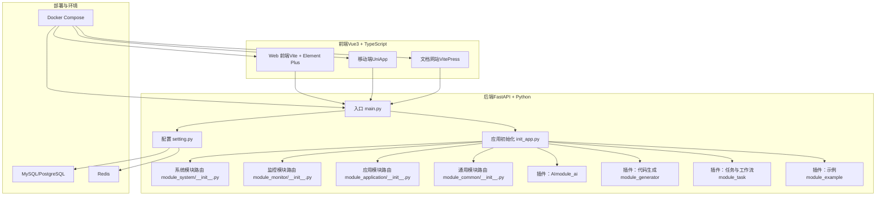
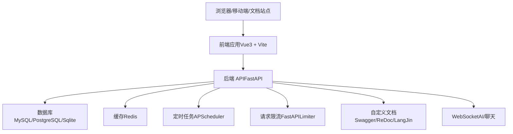
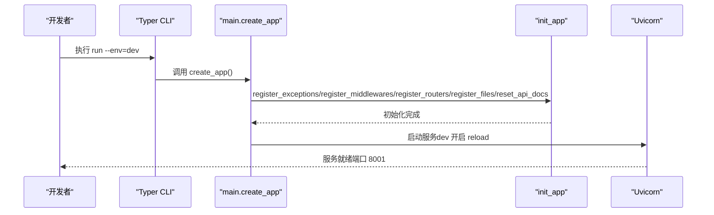
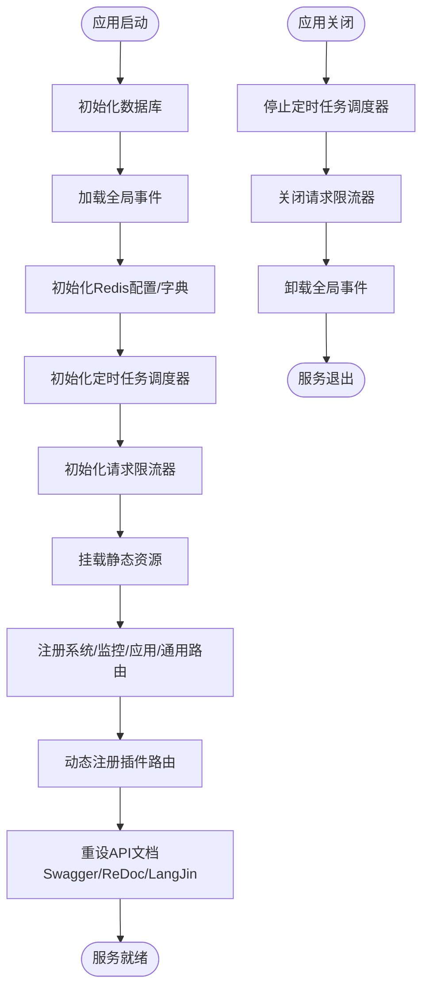
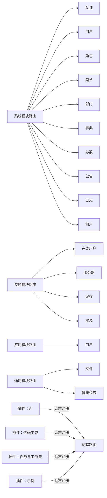
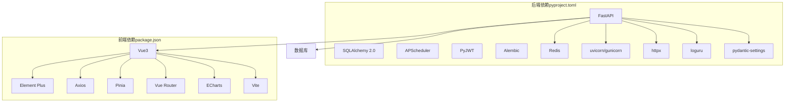

# 项目概述

<cite>
**本文引用的文件**
- [README.md](file://README.md)
- [main.py](file://backend/main.py)
- [pyproject.toml](file://backend/pyproject.toml)
- [package.json](file://frontend/web/package.json)
- [setting.py](file://backend/app/config/setting.py)
- [init_app.py](file://backend/app/scripts/init_app.py)
- [module_system/__init__.py](file://backend/app/api/v1/module_system/__init__.py)
- [module_monitor/__init__.py](file://backend/app/api/v1/module_monitor/__init__.py)
- [module_application/__init__.py](file://backend/app/api/v1/module_application/__init__.py)
- [module_common/__init__.py](file://backend/app/api/v1/module_common/__init__.py)
- [plugin.toml（AI）](file://backend/app/plugin/module_ai/plugin.toml)
- [plugin.toml（代码生成）](file://backend/app/plugin/module_generator/plugin.toml)
- [plugin.toml（任务与工作流）](file://backend/app/plugin/module_task/plugin.toml)
- [plugin.toml（示例）](file://backend/app/plugin/module_example/plugin.toml)
</cite>

## 目录
1. [引言](#引言)
2. [项目结构](#项目结构)
3. [核心组件](#核心组件)
4. [架构总览](#架构总览)
5. [详细组件分析](#详细组件分析)
6. [依赖关系分析](#依赖关系分析)
7. [性能考量](#性能考量)
8. [故障排查指南](#故障排查指南)
9. [结论](#结论)
10. [附录](#附录)

## 引言
FastapiAdmin 是一套完全开源、高度模块化、技术先进的现代化快速开发平台，专注于企业级中后台系统的高效搭建。项目采用前后端分离架构，后端基于 FastAPI + Python，前端采用 Vue3 + TypeScript，提供 Web/H5/文档多端统一开发体验。项目以“模块化、松耦合”为核心设计思想，结合插件化扩展机制与统一的开发规范，降低技术选型成本，提升团队协作效率与系统可维护性。

## 项目结构
项目采用“双端工程 + Docker 部署”的组织方式，后端工程位于 backend，前端工程位于 frontend（包含 web、app、docs 三部分），并通过 docker 目录提供容器化部署方案。后端采用“按业务特性分包（竖切）”的组织方式，将同一业务域内的 controller/service/crud/model/schema 等文件集中在一个模块目录下，并通过插件化机制实现自动路由发现与注册。

**图表来源**
- [main.py:16-51](file://backend/main.py#L16-L51)
- [init_app.py:125-159](file://backend/app/scripts/init_app.py#L125-L159)
- [module_system/__init__.py:1-30](file://backend/app/api/v1/module_system/__init__.py#L1-L30)
- [module_monitor/__init__.py:1-14](file://backend/app/api/v1/module_monitor/__init__.py#L1-L14)
- [module_application/__init__.py:1-8](file://backend/app/api/v1/module_application/__init__.py#L1-L8)
- [module_common/__init__.py:1-10](file://backend/app/api/v1/module_common/__init__.py#L1-L10)
- [plugin.toml（AI）:1-9](file://backend/app/plugin/module_ai/plugin.toml#L1-L9)
- [plugin.toml（代码生成）:1-9](file://backend/app/plugin/module_generator/plugin.toml#L1-L9)
- [plugin.toml（任务与工作流）:1-9](file://backend/app/plugin/module_task/plugin.toml#L1-L9)
- [plugin.toml（示例）:1-10](file://backend/app/plugin/module_example/plugin.toml#L1-L10)

**章节来源**
- [README.md:96-115](file://README.md#L96-L115)
- [README.md:39-56](file://README.md#L39-L56)
- [main.py:16-51](file://backend/main.py#L16-L51)
- [init_app.py:125-159](file://backend/app/scripts/init_app.py#L125-L159)

## 核心组件
- 应用入口与生命周期：通过 main.py 的 create_app 与 Typer CLI 提供 run/revision/upgrade 等命令，统一启动与迁移流程。
- 配置中心：setting.py 提供环境、服务器、认证、数据库、Redis、静态文件、Swagger、AI/知识库、请求限制等集中配置。
- 应用初始化：init_app.py 负责数据库初始化、全局事件加载、Redis配置/字典、定时任务调度器、请求限流器、静态资源挂载与自定义 API 文档。
- 模块化路由：系统模块、监控模块、应用模块、通用模块通过 APIRouter 聚合，插件模块通过动态发现机制自动注册。
- 插件化扩展：module_ai、module_generator、module_task、module_example 等插件目录，每个插件包含 controller/service/crud/model/schema 等文件，并通过 plugin.toml 描述元信息。

**章节来源**
- [main.py:16-51](file://backend/main.py#L16-L51)
- [main.py:55-106](file://backend/main.py#L55-L106)
- [setting.py:13-355](file://backend/app/config/setting.py#L13-L355)
- [init_app.py:27-93](file://backend/app/scripts/init_app.py#L27-L93)
- [init_app.py:125-159](file://backend/app/scripts/init_app.py#L125-L159)
- [module_system/__init__.py:1-30](file://backend/app/api/v1/module_system/__init__.py#L1-L30)
- [module_monitor/__init__.py:1-14](file://backend/app/api/v1/module_monitor/__init__.py#L1-L14)
- [module_application/__init__.py:1-8](file://backend/app/api/v1/module_application/__init__.py#L1-L8)
- [module_common/__init__.py:1-10](file://backend/app/api/v1/module_common/__init__.py#L1-L10)
- [plugin.toml（AI）:1-9](file://backend/app/plugin/module_ai/plugin.toml#L1-L9)
- [plugin.toml（代码生成）:1-9](file://backend/app/plugin/module_generator/plugin.toml#L1-L9)
- [plugin.toml（任务与工作流）:1-9](file://backend/app/plugin/module_task/plugin.toml#L1-L9)
- [plugin.toml（示例）:1-10](file://backend/app/plugin/module_example/plugin.toml#L1-L10)

## 架构总览
FastapiAdmin 采用前后端分离架构，后端提供 RESTful API 与 WebSocket（如 AI 聊天），前端通过 Axios 调用接口并渲染视图。系统通过统一的配置中心与初始化流程，确保数据库、Redis、定时任务、限流器等基础设施在应用启动时正确装配。插件化机制使得新增模块无需改动核心路由，只需在 plugin 目录下按约定组织文件即可自动注册。

**图表来源**
- [setting.py:257-302](file://backend/app/config/setting.py#L257-L302)
- [setting.py:305-312](file://backend/app/config/setting.py#L305-L312)
- [init_app.py:42-61](file://backend/app/scripts/init_app.py#L42-L61)
- [init_app.py:145-150](file://backend/app/scripts/init_app.py#L145-L150)
- [init_app.py:182-225](file://backend/app/scripts/init_app.py#L182-L225)

**章节来源**
- [README.md:117-156](file://README.md#L117-L156)
- [setting.py:257-312](file://backend/app/config/setting.py#L257-L312)
- [init_app.py:42-61](file://backend/app/scripts/init_app.py#L42-L61)

## 详细组件分析

### 后端应用入口与命令行
- create_app：创建 FastAPI 应用，注册异常、中间件、路由、静态文件与 API 文档。
- CLI 命令：run（启动服务）、revision（生成迁移脚本）、upgrade（应用迁移）。
- 环境切换：通过 ENVIRONMENT 控制 dev/prod，影响配置加载与热重载。

**图表来源**
- [main.py:16-51](file://backend/main.py#L16-L51)
- [main.py:55-106](file://backend/main.py#L55-L106)
- [init_app.py:112-159](file://backend/app/scripts/init_app.py#L112-L159)

**章节来源**
- [main.py:16-51](file://backend/main.py#L16-L51)
- [main.py:55-106](file://backend/main.py#L55-L106)

### 配置中心（Settings）
- 环境与服务器：ENVIRONMENT、SERVER_HOST、SERVER_PORT。
- 认证与权限：SECRET_KEY、ALGORITHM、ACCESS_TOKEN_EXPIRE_MINUTES、TOKEN_REQUEST_PATH_EXCLUDE、RBAC 白名单。
- 数据库与连接池：DATABASE_TYPE、ASYNC_DB_URI/DB_URI、POOL_SIZE、MAX_OVERFLOW、POOL_PRE_PING 等。
- Redis：REDIS_ENABLE、REDIS_URI、DB_NAME、USER/PASSWORD。
- 静态文件与上传：STATIC_ENABLE、STATIC_URL、UPLOAD_FILE_PATH、ALLOWED_EXTENSIONS、MAX_FILE_SIZE。
- 文档与图标：SWAGGER/REDOC/LangJin UI 路径与资源。
- AI/知识库：OPENAI_*、CHROMA_*。
- 请求限制：REQUEST_LIMITER_REDIS_PREFIX。
- 中间件与事件：MIDDLEWARE_LIST、EVENT_LIST。

**章节来源**
- [setting.py:13-355](file://backend/app/config/setting.py#L13-L355)

### 应用初始化与生命周期
- 生命周期：lifespan 中完成数据库初始化、全局事件加载、Redis配置/字典、定时任务调度器、请求限流器初始化；应用退出时优雅关闭。
- 中间件注册：按配置逆序叠加，支持跨域、请求日志、Gzip 压缩。
- 路由注册：include_router 注册通用、应用、系统、监控模块路由，并动态注册插件路由；WebSocket 路由单独注册。
- 静态资源：按配置挂载静态目录。
- API 文档：自定义 Swagger/ReDoc/LangJin UI，替换默认文档。

**图表来源**
- [init_app.py:27-93](file://backend/app/scripts/init_app.py#L27-L93)
- [init_app.py:95-159](file://backend/app/scripts/init_app.py#L95-L159)
- [init_app.py:161-225](file://backend/app/scripts/init_app.py#L161-L225)

**章节来源**
- [init_app.py:27-93](file://backend/app/scripts/init_app.py#L27-L93)
- [init_app.py:95-159](file://backend/app/scripts/init_app.py#L95-L159)
- [init_app.py:161-225](file://backend/app/scripts/init_app.py#L161-L225)

### 模块化路由与插件化扩展
- 系统模块：用户、角色、菜单、部门、岗位、字典、参数、公告、日志、租户等，统一通过 system_router 聚合。
- 监控模块：在线用户、服务器、缓存、资源监控。
- 应用模块：门户（Portal）。
- 通用模块：文件、健康检查。
- 插件化：module_ai、module_generator、module_task、module_example 等，每个插件包含 controller/service/crud/model/schema，并通过 plugin.toml 描述元信息（名称、标题、版本、描述、标签等）。

**图表来源**
- [module_system/__init__.py:1-30](file://backend/app/api/v1/module_system/__init__.py#L1-L30)
- [module_monitor/__init__.py:1-14](file://backend/app/api/v1/module_monitor/__init__.py#L1-L14)
- [module_application/__init__.py:1-8](file://backend/app/api/v1/module_application/__init__.py#L1-L8)
- [module_common/__init__.py:1-10](file://backend/app/api/v1/module_common/__init__.py#L1-L10)
- [plugin.toml（AI）:1-9](file://backend/app/plugin/module_ai/plugin.toml#L1-L9)
- [plugin.toml（代码生成）:1-9](file://backend/app/plugin/module_generator/plugin.toml#L1-L9)
- [plugin.toml（任务与工作流）:1-9](file://backend/app/plugin/module_task/plugin.toml#L1-L9)
- [plugin.toml（示例）:1-10](file://backend/app/plugin/module_example/plugin.toml#L1-L10)

**章节来源**
- [module_system/__init__.py:1-30](file://backend/app/api/v1/module_system/__init__.py#L1-L30)
- [module_monitor/__init__.py:1-14](file://backend/app/api/v1/module_monitor/__init__.py#L1-L14)
- [module_application/__init__.py:1-8](file://backend/app/api/v1/module_application/__init__.py#L1-L8)
- [module_common/__init__.py:1-10](file://backend/app/api/v1/module_common/__init__.py#L1-L10)
- [plugin.toml（AI）:1-9](file://backend/app/plugin/module_ai/plugin.toml#L1-L9)
- [plugin.toml（代码生成）:1-9](file://backend/app/plugin/module_generator/plugin.toml#L1-L9)
- [plugin.toml（任务与工作流）:1-9](file://backend/app/plugin/module_task/plugin.toml#L1-L9)
- [plugin.toml（示例）:1-10](file://backend/app/plugin/module_example/plugin.toml#L1-L10)

### 技术栈概览
- 后端：FastAPI、SQLAlchemy 2.0、APScheduler、PyJWT、Alembic、Redis、uvicorn、gunicorn、httpx、loguru、pydantic-settings 等。
- 前端：Vue3、Vite5、Pinia、TypeScript、Element Plus、UniApp、Wot Design Uni、ECharts、Axios 等。
- 数据库：MySQL、PostgreSQL、Sqlite（异步/同步驱动）。
- 缓存：Redis（高性能缓存与限流、会话、消息队列等）。
- 文档：Swagger、ReDoc、自定义 LangJin UI。
- 部署：Docker、Nginx、Docker Compose。

**章节来源**
- [README.md:157-172](file://README.md#L157-L172)
- [pyproject.toml:7-49](file://backend/pyproject.toml#L7-L49)
- [package.json:68-178](file://frontend/web/package.json#L68-L178)

### 典型应用场景
- 企业中后台管理系统：用户/角色/菜单/字典/参数/公告/日志/租户等核心能力。
- 系统监控与运维：在线用户、服务器、缓存、资源监控。
- 任务调度与工作流：定时任务、Prefect 工作流。
- 开发效率工具：代码生成器、API 文档、数据库迁移。
- 智能体与对话：基于 Agno 的 AI 子系统与 WebSocket 聊天。

**章节来源**
- [README.md:178-206](file://README.md#L178-L206)
- [plugin.toml（AI）:1-9](file://backend/app/plugin/module_ai/plugin.toml#L1-L9)
- [plugin.toml（代码生成）:1-9](file://backend/app/plugin/module_generator/plugin.toml#L1-L9)
- [plugin.toml（任务与工作流）:1-9](file://backend/app/plugin/module_task/plugin.toml#L1-L9)

## 依赖关系分析
后端依赖通过 pyproject.toml 管理，前端依赖通过 package.json 管理。后端核心依赖包括 FastAPI、SQLAlchemy、APScheduler、PyJWT、Alembic、Redis、uvicorn、httpx、loguru、pydantic-settings 等；前端核心依赖包括 Vue3、Element Plus、Axios、Pinia、Vue Router、ECharts、Vite 等。两者通过 API（REST + WebSocket）进行通信，数据通过数据库与缓存进行持久化与加速。

**图表来源**
- [pyproject.toml:7-49](file://backend/pyproject.toml#L7-L49)
- [package.json:68-178](file://frontend/web/package.json#L68-L178)

**章节来源**
- [pyproject.toml:7-49](file://backend/pyproject.toml#L7-L49)
- [package.json:68-178](file://frontend/web/package.json#L68-L178)

## 性能考量
- 异步与高性能：后端采用 FastAPI 异步特性与 SQLAlchemy 2.0，数据库连接池参数可调（POOL_SIZE、MAX_OVERFLOW、POOL_TIMEOUT、POOL_RECYCLE、POOL_PRE_PING），支持 MySQL/PostgreSQL/Sqlite 异步驱动。
- 缓存与限流：Redis 用于缓存、会话、限流（FastAPILimiter），请求限流器可按模块/路由粒度配置。
- 压缩与静态资源：Gzip 压缩与静态资源挂载，减少网络传输与 IO 压力。
- 文档与可观测性：自定义 Swagger/ReDoc/LangJin UI，便于调试与监控；操作日志记录与 IP 归属地查询可辅助审计与诊断。
- 定时任务：APScheduler 与 Prefect 结合，支持复杂任务编排与调度。

**章节来源**
- [setting.py:86-95](file://backend/app/config/setting.py#L86-L95)
- [setting.py:167-170](file://backend/app/config/setting.py#L167-L170)
- [init_app.py:53-61](file://backend/app/scripts/init_app.py#L53-L61)

## 故障排查指南
- 启动失败：检查 ENVIRONMENT、数据库连接、Redis 连接、端口占用；查看日志输出与初始化错误信息。
- 数据库迁移：首次启动一般无需手动迁移，若修改模型需使用 revision/upgrade；确认 Alembic 配置与数据库类型匹配。
- 路由未生效：确认插件目录命名规范（module_xxx）、controller.py 存在、动态路由注册流程正常。
- 权限与认证：核对 TOKEN_REQUEST_PATH_EXCLUDE 白名单、JWT 密钥与算法、ACCESS_TOKEN_EXPIRE_MINUTES。
- 文档无法访问：确认 ROOT_PATH（/api/v1）、Swagger/ReDoc/LangJin 路径与静态资源挂载。

**章节来源**
- [main.py:109-158](file://backend/main.py#L109-L158)
- [init_app.py:27-93](file://backend/app/scripts/init_app.py#L27-L93)
- [setting.py:67-73](file://backend/app/config/setting.py#L67-L73)
- [README.md:558-586](file://README.md#L558-L586)

## 结论
FastapiAdmin 以模块化、插件化为核心，结合统一的配置中心与初始化流程，为企业级中后台系统提供了高内聚、低耦合、易扩展的开发基座。前后端分离与多端统一开发体验，配合完善的开发工具链（代码生成、API 文档、数据库迁移、监控与日志），显著降低了开发与维护成本。通过合理的性能设计（异步、缓存、限流、压缩）与可观测性（日志、文档、监控），项目在可扩展性与稳定性方面具备良好表现。

## 附录
- 快速开始：本地运行、环境配置、依赖安装、启动与访问。
- 二次开发：插件化架构、自动路由发现与注册、开发规范与注意事项。
- 部署：Docker 一键部署脚本与生产环境注意事项。

**章节来源**
- [README.md:207-356](file://README.md#L207-L356)
- [README.md:354-557](file://README.md#L354-L557)